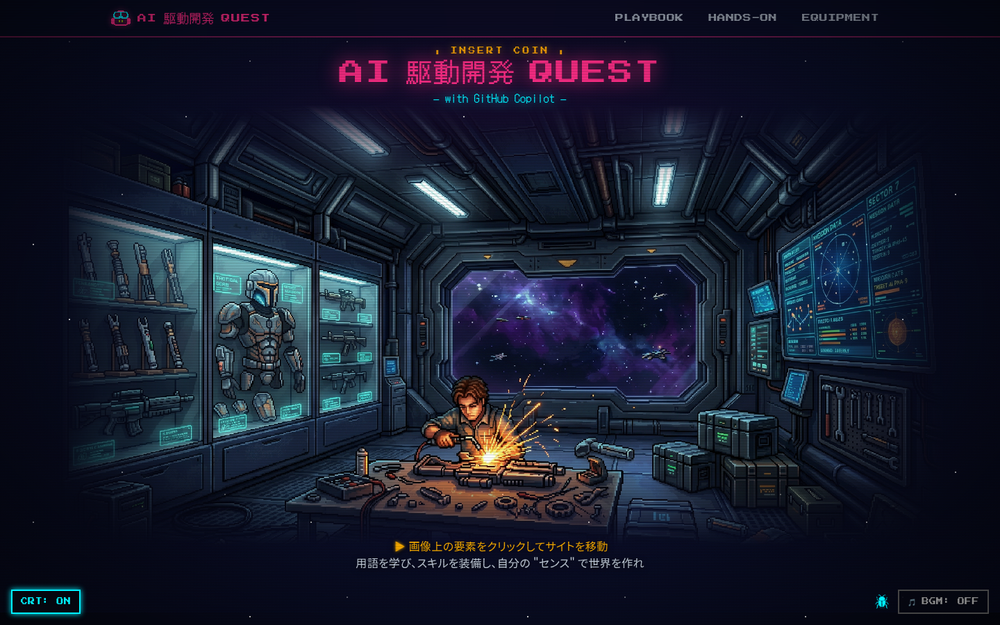
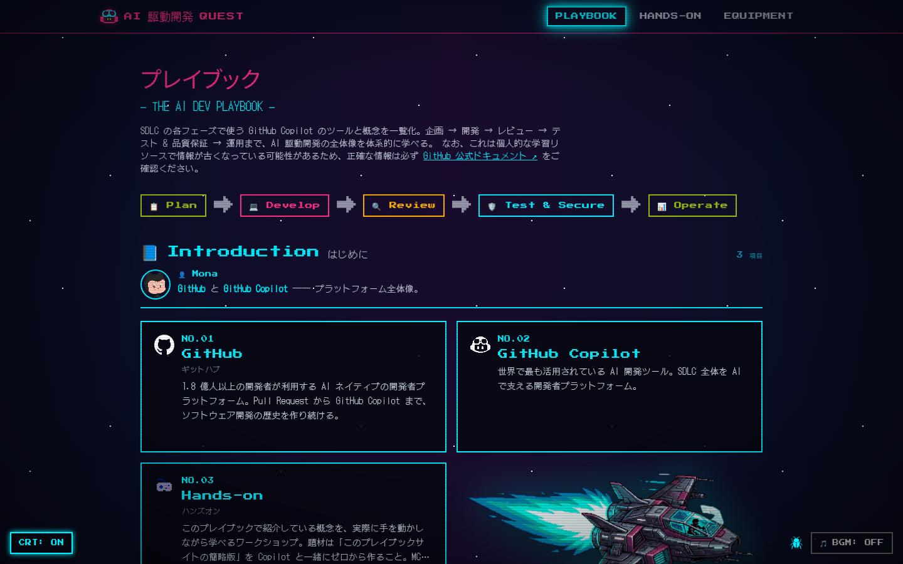
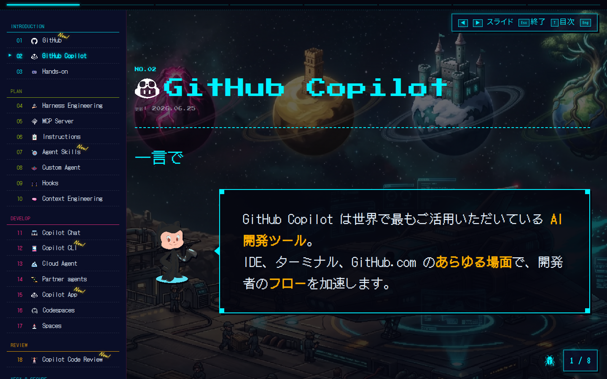
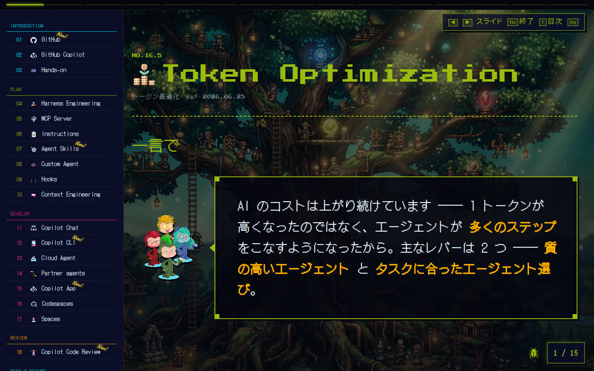
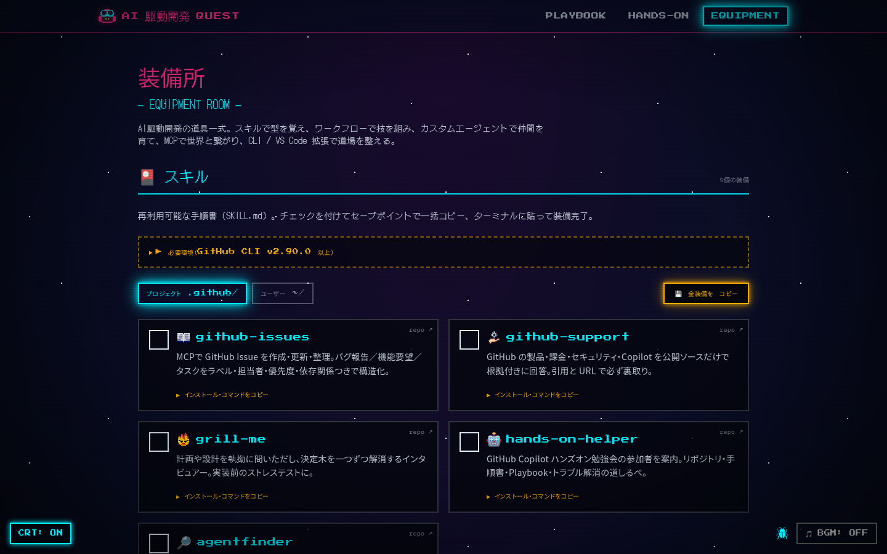

# Result Screenshots (Demo)

Screenshots of the built site captured with Playwright (Chromium) at a
**1440×900** viewport (optimized for 15-inch laptop display readability).

| # | Page / State | Source URL |
|---|--------------|------------|
| 1 | Website landing page | `/theomonfort/` |
| 2 | Playbook landing page | `/theomonfort/playbook/` |
| 3 | Playbook presentation mode | `/theomonfort/playbook/github-copilot/?present=1` |
| 4 | Token Optimization section — slide 1 | `/theomonfort/playbook/token-optimization/?present=1&slide=1` |
| 5 | Equipment tab landing page | `/theomonfort/skills/` |

## Screenshots

### 1. Website landing page


### 2. Playbook landing page


### 3. Playbook presentation mode


### 4. Token Optimization — slide 1


### 5. Equipment tab landing page


## How to reproduce

```bash
pnpm build
pnpm preview --port 4321
# then drive Chromium at viewport 1440x900 against the URLs above
```
