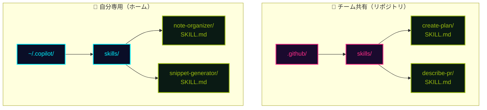
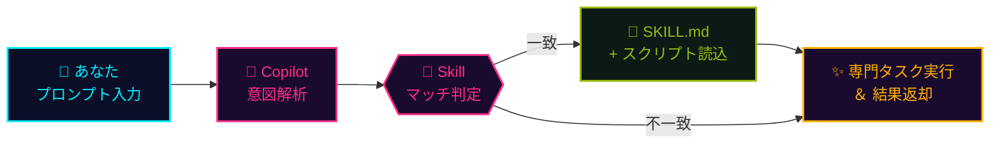

## 一言で

**Agent Skills** は、Copilot に **専門タスクのこなし方を教える "巻物"**。プロンプトがスキルに一致すると Copilot が自動で **検出・読み込み・適用** ── プロジェクト固有のノウハウを毎回口頭で伝える必要がなくなる。

> 💡 **アナロジー**：Skill は **"AIに渡す秘伝の型（カタ）"**。一度書けば、君もチームも一生使える。プロンプトという呪文を唱えると、対応する型が自動発動する。

## どこに置く

スキルは `SKILL.md` を中心に、補助スクリプト・テンプレートを束ねた **1 フォルダ = 1 スキル** の構成。配置場所で **共有範囲** が変わる。



- `.github/skills/<name>/SKILL.md` ── **リポジトリに含まれる** → チーム全員が同じスキルを使える
- `.copilot/skills/<name>/SKILL.md` ── **ホーム配下のみ** → 自分の全セッションで使える個人装備

## 2 つのスコープ

<div class="setup-cards">
  <div class="setup-card">
    <div class="setup-card-head">
      <code>.github/skills/</code>
      <span class="setup-card-tag tag-magenta">👥 チーム共有</span>
    </div>
    <p><strong>適用範囲</strong>：そのリポジトリのみ<br /><strong>共有性</strong>：Git に含まれるためチーム全員が利用可<br /><strong>用途</strong>：プロジェクト固有のワークフロー（デプロイ手順・テスト生成・PR 説明文 …）</p>
  </div>
  <div class="setup-card">
    <div class="setup-card-head">
      <code>~/.copilot/skills/</code>
      <span class="setup-card-tag tag-cyan">👤 個人用</span>
    </div>
    <p><strong>適用範囲</strong>：そのユーザーの全セッション<br /><strong>共有性</strong>：ローカル環境のみ・共有されない<br /><strong>用途</strong>：個人の作業効率化（メモ整理・スニペット生成・自分用テンプレ …）</p>
  </div>
</div>

> 📁 **使い分けの目安**：「チームで揃えたい型」はリポジトリへ。「自分のクセ・自分の作業フロー」はホームへ。

## エコシステム

Skills は単独機能ではなく、**配布・発見・管理** を担う仲間と一緒に動く。Copilot 周辺で覚えておきたい 4 兄弟。

<div class="setup-cards">
  <div class="setup-card">
    <div class="setup-card-head">
      <code>🧠 Agent Skills</code>
      <span class="setup-card-tag tag-magenta">▸ 標準仕様</span>
    </div>
    <p><strong>SKILL.md + scripts + resources</strong> をまとめたオープン仕様。全エージェント間でポータブル、必要な時だけオンデマンドで読み込まれる。AI のための<strong>手順記憶</strong>。</p>
  </div>
  <div class="setup-card">
    <div class="setup-card-head">
      <code>📦 APM</code>
      <span class="setup-card-tag tag-amber">▸ パッケージ管理</span>
    </div>
    <p>Microsoft 製 <strong>Agent Package Manager</strong>。<code>apm.yml</code> マニフェスト（package.json 風）→ <code>apm install</code> で誰の環境でも同じセットアップ。バージョン固定・CI/CD 連携・Copilot/Claude/Cursor 横断。</p>
  </div>
  <div class="setup-card">
    <div class="setup-card-head">
      <code>🌐 MCP Registry</code>
      <span class="setup-card-tag tag-cyan">▸ サーバー検索</span>
    </div>
    <p><strong>registry.modelcontextprotocol.io</strong>。20,000+ MCP サーバーをインデックス化、namespace 認証、REST API、Enterprise 向けプライベートレジストリにも対応。</p>
  </div>
  <div class="setup-card">
    <div class="setup-card-head">
      <code>🔌 Plugins & CLI</code>
      <span class="setup-card-tag tag-green">▸ 配信チャネル</span>
    </div>
    <p>IDE / ターミナルから 1-click インストール。VS Code <strong>MCP Skills Manager</strong>、<code>gh skill</code>、Copilot CLI <code>/skills</code>。Enterprise の allowlist 制御も可能。</p>
  </div>
</div>

## インストール方法（3 つ）

スキルを手に入れる経路は **CLI / GUI / Agent-native** の 3 ルート。好みと環境で選ぶ。

<div class="setup-cards">
  <div class="setup-card">
    <div class="setup-card-head">
      <code>⌨️ GitHub CLI</code>
      <span class="setup-card-tag tag-cyan">▸ gh v2.90.0+</span>
    </div>
    <p>検索・インストール・更新・公開すべてターミナルから。バージョン or commit SHA に固定可。</p>

```bash
gh skill search copilot
gh skill install github/awesome-copilot documentation-writer --pin v1.2
gh skill update --all
gh skill publish --dry-run
```

  </div>
  <div class="setup-card">
    <div class="setup-card-head">
      <code>🖥️ VS Code 拡張</code>
      <span class="setup-card-tag tag-magenta">▸ GUI 派</span>
    </div>
    <p><strong>Copilot MCP + Agent Skills Manager</strong>。Activity Bar → MCP Servers → Skills タブ → ワンクリックで導入。Cloud MCP は OAuth でローカルサーバー不要。</p>

```text
Activity Bar
  └─ MCP Servers アイコン
       └─ Skills タブ
            └─ Search & Install ✨
```

  </div>
  <div class="setup-card">
    <div class="setup-card-head">
      <code>🤖 Copilot CLI</code>
      <span class="setup-card-tag tag-green">▸ Agent-native</span>
    </div>
    <p>エージェント体験そのもの。スラッシュコマンドで Skill / MCP / Plugin をまるごと管理。</p>

```bash
$ copilot
> /skills    # 一覧 & 管理
> /mcp       # MCP server 設定
> /plugin    # プラグイン管理
```

  </div>
</div>

## 使う流れ



1. **君がプロンプトを唱える** ── 「この PR の説明文書いて」「実装計画立てて」
2. **Copilot がスキルを検出** ── `.github/skills/` と `~/.copilot/skills/` を走査し、`SKILL.md` の説明文と意図を照合
3. **対応スキルを召喚** ── 補助スクリプト・テンプレ・手順をまとめてコンテキストに装填
4. **専門知識で応答** ── プロジェクト固有の作法に従った成果物が返ってくる

> 🎮 **覚えておくこと**：Skill は **"書いた数だけチームの戦闘力が上がる"** 装備。`describe-pr` / `create-plan` / `research-codebase` あたりから真似て、自分の型を増やしていこう。
