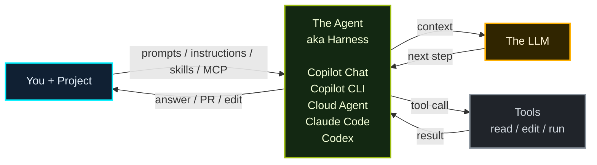

## The good old days

昔の LLM chat はシンプルだった。You が prompt を投げ、LLM が answer を返す。


> この世界では、context はほぼ **prompt の中に人間が手で詰めるもの** だった。

## Current

現在は、project context と tools を持つ **agent / harness** が LLM の前に立つ。



> No magic. Agent は、LLM を直接呼ぶ代わりに、**何を読ませるか・どの tool を使わせるか・結果をどう戻すか** を管理する layer。

## Agent / Harness の裏側（Simplified）

- **Execution Loop**：LLM が次の一手を決め、tool 実行 → 結果を context に戻す、を `done` まで繰り返す。
- **Context Management**：system prompt、available tools、user task、tool results を整理し、毎回の LLM call に必要な context として渡す。

```python
# --- Setup ---
system_prompt = "You are a helpful coding assistant..."
available_tools = [search_web, read_file, edit_file, run_terminal]

# --- Agent Loop ---
user_task = input("How can I help you?")
context = [system_prompt, available_tools, user_task]

while True:
    next_step = await llm.determine_next_step(context)
    context.append(next_step)

    if next_step.intent == "done":
        return next_step.final_answer

    result = await execute_tool(next_step.tool, next_step.args)
    context.append(result)
```
