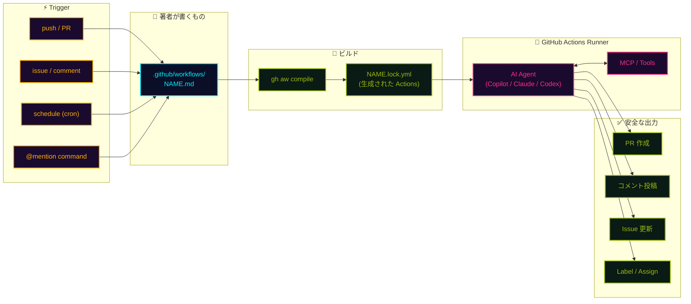

## 一言で

**Agentic Workflow** は、GitHub Actions の中で **AI エージェント** を走らせる仕組み。YAML スクリプトを書く代わりに、Markdown に「**何をしてほしいか**」を自然言語で書くと、エージェントが判断しながら実行してくれる。

> 💡 **アナロジー**：従来の Actions が **cron + シェル芸** だとしたら、Agentic Workflow は **"AI cron"**。`if-then` ではなく **"よしなに"** が書けるようになった Actions。

2026 年 2 月 13 日に **Technical Preview** で発表。CLI 拡張 `gh aw` 経由で誰でも試せる。

## なぜ重要?

従来の GitHub Actions は **決定的なスクリプトの集まり**だった。`if A then B` を全部前もって書く必要があり、想定外の入力が来た瞬間に詰む。

Agentic Workflow は逆。**"意図"** だけを書けば、エージェントが文脈を読んで適切な手を選ぶ。

- 🤖 **コードではなく文章** ── トリアージのルール表ではなく「issue を読んで適切なラベルを付けよ」と書く
- 🧠 **判断するワークフロー** ── ログを読み解く、PR の意図を要約する、ドキュメントの古い箇所を直す
- 🔌 **MCP / ツールと統合** ── エージェントが GitHub API・外部サービスを呼び出して実際に作業
- 🛡️ **セキュリティ・バイ・デフォルト** ── 読み取り専用が初期、書き込みは `safe-outputs` 経由のみ

つまり、**"AI が裏方として GitHub に常駐するチームメイト"** になる第一歩。

## できることの例

<div class="setup-cards">
  <div class="setup-card">
    <div class="setup-card-head">
      <code>Issue Triage</code>
      <span class="setup-card-tag tag-cyan">🏷️ 自動分類</span>
    </div>
    <p>新しい issue を読み、内容に応じて <strong>ラベル付け・優先度判定・担当者提案</strong> を自動化。曖昧なら追加情報をリクエスト。</p>
  </div>
  <div class="setup-card">
    <div class="setup-card-head">
      <code>Wiki Generator</code>
      <span class="setup-card-tag tag-magenta">📚 自動ドキュメント</span>
    </div>
    <p>コードベースを定期的にスキャンし、<strong>Wiki / README を自動生成・更新</strong>。実装と説明のズレを埋め続ける。</p>
  </div>
  <div class="setup-card">
    <div class="setup-card-head">
      <code>CI Failure Analyst</code>
      <span class="setup-card-tag tag-amber">🔍 ログ解析</span>
    </div>
    <p>失敗した CI を読み解き、<strong>原因を特定して PR にコメント</strong>。スタックトレースから関連コードまで辿る。</p>
  </div>
  <div class="setup-card">
    <div class="setup-card-head">
      <code>Docs Maintainer</code>
      <span class="setup-card-tag tag-green">📝 整備</span>
    </div>
    <p>古くなったリンク・例・API 説明を検出し、<strong>最新の実装に合わせて修正 PR</strong> を起こす。</p>
  </div>
</div>

> 🧪 サンプル集 **`githubnext/agentics`** に動くテンプレートが揃っている。コピペで動かせる。

## 仕組み

`.github/workflows/` 配下の **Markdown ファイル** が起点。`gh aw compile` で堅牢な `.lock.yml`（通常の Actions ワークフロー）に変換され、それが GitHub Actions ランナー上で AI エージェントを起動する。



肝は **「人間が書く Markdown」と「実行される lock ファイル」の分離**。Markdown は意図、lock は監査可能な実体。AI に直接 write 権限を渡さず、`safe-outputs` という検証済みの境界を通して GitHub を操作する。

## 始め方（4 ステップ）

`.github/workflows/issue-clarifier.md` を作るだけ。フロントマターでトリガー・権限・出力を、本文で **やってほしいこと** を書く。

```yaml
---
on:
  issues:
    types: [opened]
permissions: read-all
safe-outputs:
  add-comment:
---

# Issue Clarifier

新しく開かれた issue を読み、要件が曖昧なら
- 何が起きているのか
- 再現手順
- 期待される挙動

の 3 点を確認するコメントを投稿せよ。明確なら何もしない。
```

1. **CLI 拡張をインストール** ── `gh extension install github/gh-aw`
2. **Markdown を書く** ── `.github/workflows/NAME.md` にトリガーと指示を記述
3. **コンパイル** ── `gh aw compile` で `NAME.lock.yml` を生成
4. **コミット & push** ── lock ファイルを含めて push、以降は Actions が自動起動

> ⚠️ **lock ファイルは Git にコミット**。これが実際に動く Actions ワークフローで、監査・レビューの対象。

## サンプルとリソース

- 📦 **[github/gh-aw](https://github.com/github/gh-aw)** ── CLI 拡張本体。インストールはここから
- 📖 **[公式ドキュメント](https://github.github.io/gh-aw/introduction/overview/)** ── コンセプト・YAML リファレンス・`safe-outputs` の全種類
- 🧪 **[githubnext/agentics](https://github.com/githubnext/agentics)** ── 動くサンプルワークフロー集（triage / docs / CI 解析…）
- 📝 **[Peli's Agent Factory](https://github.github.com/gh-aw/blog/2026-01-12-welcome-to-pelis-agent-factory/)** ── 開発者 Pelle Wessman による実例ブログ。最初に読むと雰囲気が掴める

> 🎮 **MCP × Instructions × Agentic Workflow** ── この 3 つが揃うと、**"GitHub に住む AI チームメイト"** が完成する。Markdown を書けば書くほど、リポジトリが自分で動き出す。
