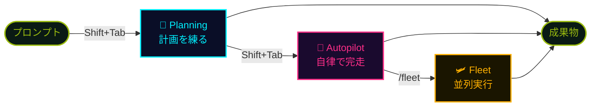
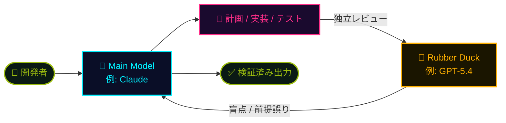

## 一言で

**Copilot CLI** は、ターミナルに直接降りてくる Copilot。IDE を開かなくても、シェルの中で計画・編集・実行・検証が完結する。

> 💡 **アナロジー**：常時待機のターミナル相棒。`copilot` と打てば、君の隣に **24時間勤務のシニアエンジニア** が座る。
>
> 🗓️ **GA: 2026年2月25日**

エージェント、スキル、MCP server、リモート操作 ── IDE 版でできることはほぼ全部、しかも **キーボードから手を離さずに**。

## 主要機能

ターミナル一枚に、フルスタックの AI 環境が乗る。

<div class="setup-cards">
  <div class="setup-card">
    <div class="setup-card-head">
      <code>📂 Multi-file context</code>
      <span class="setup-card-tag tag-cyan">▸ 文脈把握</span>
    </div>
    <p>複数ファイルを横断して文脈を把握。リポジトリ全体を <strong>一つのワークスペース</strong> として扱う。</p>
  </div>
  <div class="setup-card">
    <div class="setup-card-head">
      <code>✏️ Code gen / edit</code>
      <span class="setup-card-tag tag-magenta">▸ 生成・修正</span>
    </div>
    <p>コードの生成も、既存コードへのパッチ当てもターミナルから。<strong>差分プレビュー</strong>付きで承認。</p>
  </div>
  <div class="setup-card">
    <div class="setup-card-head">
      <code>⚡ Realtime assist</code>
      <span class="setup-card-tag tag-amber">▸ リアルタイム</span>
    </div>
    <p>対話しながら作業。質問・修正・再実行のループが <strong>ストリーミング</strong> で返る。</p>
  </div>
  <div class="setup-card">
    <div class="setup-card-head">
      <code>🛠️ Tools & shell</code>
      <span class="setup-card-tag tag-green">▸ 実行</span>
    </div>
    <p>シェルコマンド・ビルド・テストを <strong>自分で実行</strong>。結果を読んで次の手を決める。</p>
  </div>
  <div class="setup-card">
    <div class="setup-card-head">
      <code>🪟 IDE-agnostic</code>
      <span class="setup-card-tag tag-cyan">▸ どこでも</span>
    </div>
    <p>VS Code でも、Vim でも、SSH 越しのサーバーでも。<strong>ターミナルさえあれば動く</strong>。</p>
  </div>
  <div class="setup-card">
    <div class="setup-card-head">
      <code>🧩 Skills & MCP</code>
      <span class="setup-card-tag tag-magenta">▸ 拡張</span>
    </div>
    <p><strong>Agent Skills</strong> と <strong>MCP server</strong> をネイティブ統合。能力を自由にプラグイン。</p>
  </div>
  <div class="setup-card">
    <div class="setup-card-head">
      <code>🔀 Mode switching</code>
      <span class="setup-card-tag tag-amber">▸ モード</span>
    </div>
    <p>Planning / Autopilot / Fleet を <strong>必要に応じて切替</strong>。タスクの粒度に合わせて使い分け。</p>
  </div>
  <div class="setup-card">
    <div class="setup-card-head">
      <code>🤖 Headless</code>
      <span class="setup-card-tag tag-green">▸ 自動化</span>
    </div>
    <p>CI / cron / スクリプトから <strong>非対話実行</strong>。`copilot -p "..."` でワンショット。</p>
  </div>
</div>

## モードの切り替え

`Shift + Tab` をタップするだけで脳のギアが切り替わる。`/fleet` で並列宇宙へ。

<div class="setup-cards">
  <div class="setup-card">
    <div class="setup-card-head">
      <code>🧠 Planning</code>
      <span class="setup-card-tag tag-cyan">Shift + Tab</span>
    </div>
    <p>Copilot と <strong>計画を立てる</strong> モード。実装する前に、設計・手順・トレードオフを言語化。</p>
  </div>
  <div class="setup-card">
    <div class="setup-card-head">
      <code>🚀 Autopilot</code>
      <span class="setup-card-tag tag-magenta">Shift + Tab</span>
    </div>
    <p>Copilot が <strong>複雑なタスクを自律完了</strong>。承認の頻度を下げ、長距離飛行に専念させる。</p>
  </div>
  <div class="setup-card">
    <div class="setup-card-head">
      <code>🛩️ Fleet</code>
      <span class="setup-card-tag tag-amber">/fleet</span>
    </div>
    <p>フリートをデプロイして <strong>多数のタスクを並列</strong>。一度に複数の戦線をオーケストレーション。</p>
  </div>
</div>



## カスタムエージェント

`.github/agents/` または `~/.github/agents/` に **`.agent.md`** を置くだけ。Copilot CLI は起動時にスキャンし、必要に応じて呼び出す。

```yaml
---
name: Display Name
description: What the agent does (required)
tools: ["*"]  # Optional — 制限したい時に列挙
mcp-servers:
  server-name:
    command: npx
    args: ["@some/mcp-server"]
---
# Agent Instructions

このエージェントの役割・口調・制約をここに書く。
通常の Markdown でOK。
```

**Frontmatter フィールド：**

| フィールド | 必須 | 詳細 |
| --- | --- | --- |
| `name` | No | 表示名（デフォルトはファイル名） |
| `description` | **Yes** | エージェントを呼び出すタイミングの説明 |
| `tools` | No | 使用可能なツールの配列（デフォルト：全て） |
| `mcp-servers` | No | このエージェント専用の MCP server 設定 |
| `infer` | No | 自動呼び出しの可否（デフォルト：`true`） |

> 💡 `description` が **呼び出しの引き金**。「いつ」使うエージェントなのかを具体的に書くと、Copilot が正しく選んでくれる。

## ビルトインエージェント（4 つ）

何もしなくても、最初から 4 体が常駐している。

<div class="setup-cards">
  <div class="setup-card">
    <div class="setup-card-head">
      <code>🔍 Explore</code>
      <span class="setup-card-tag tag-cyan">▸ 探索</span>
    </div>
    <p><code>grep / glob / view</code> でコードベースを <strong>高速探索</strong>。並列実行に対応し、未知の大規模リポジトリも一気に俯瞰。</p>
  </div>
  <div class="setup-card">
    <div class="setup-card-head">
      <code>🔨 Task</code>
      <span class="setup-card-tag tag-amber">▸ 実行</span>
    </div>
    <p>テスト・ビルド・リント・フォーマッタなどの <strong>コマンド実行係</strong>。出力を要約し、簡潔な完了サマリーを返す。</p>
  </div>
  <div class="setup-card">
    <div class="setup-card-head">
      <code>🤖 General</code>
      <span class="setup-card-tag tag-magenta">▸ 万能</span>
    </div>
    <p>CLI ツールをフル装備した <strong>万能エージェント</strong>。複雑なマルチステップタスクをひと飲みで完了。</p>
  </div>
  <div class="setup-card">
    <div class="setup-card-head">
      <code>🧐 Review</code>
      <span class="setup-card-tag tag-green">▸ 査読</span>
    </div>
    <p>コード変更を査読。<strong>バグ・セキュリティ脆弱性・ロジックエラー</strong> のみを指摘し、些末な指摘は避ける。</p>
  </div>
</div>

## Rubber Duck — クロスモデルレビュー

> 🦆 **Experimental**：メインモデルとは **異なるモデルファミリー** が「セカンドオピニオン」として、計画・実装・テストの各段階で独立レビュー。



**なぜ効く？** ── 同じモデルが自分の出力をチェックすると、**同じ前提・同じ盲点** に引っかかる。別ファミリーのモデルなら、訓練データも価値観も違うので **見えていなかったロジックエラー** を拾える。

## Remote control — Web/モバイルから操作

> 🛰️ **Public Preview（2026-04-13）**：`copilot --remote` で、CLI セッションを GitHub Web・モバイルから **リアルタイム監視・操作**。

<div class="setup-cards">
  <div class="setup-card">
    <div class="setup-card-head">
      <code>📱 QR / リンク接続</code>
      <span class="setup-card-tag tag-cyan">▸ 別デバイス</span>
    </div>
    <p>QR コードまたはリンクで、別デバイスから <strong>同じセッションに接続</strong>。机を離れても作業継続。</p>
  </div>
  <div class="setup-card">
    <div class="setup-card-head">
      <code>🎛️ Full control</code>
      <span class="setup-card-tag tag-magenta">▸ 操作</span>
    </div>
    <p>プランの確認・修正、モード切替、<strong>権限承認</strong> までリモートで操作可能。</p>
  </div>
  <div class="setup-card">
    <div class="setup-card-head">
      <code>🔒 Private</code>
      <span class="setup-card-tag tag-green">▸ 本人のみ</span>
    </div>
    <p>セッションは <strong>本人にのみ表示</strong>。Business / Enterprise は管理者ポリシーで有効化が必要。</p>
  </div>
</div>

```bash
copilot --remote          # リモート接続を有効化してセッション開始
# → QR コード / リンクが表示される
# → スマホから接続し、満員電車から Autopilot を眺める
```

## BYOK & ローカルモデル

> 🔌 **Changelog（2026-04-07）**：任意のモデルプロバイダーに接続可能に。エアギャップ環境でも動かせる。

<div class="setup-cards">
  <div class="setup-card">
    <div class="setup-card-head">
      <code>🔑 BYOK</code>
      <span class="setup-card-tag tag-cyan">▸ 持ち込み</span>
    </div>
    <p><strong>Azure OpenAI / Anthropic / Ollama / vLLM</strong> など、OpenAI 互換エンドポイントを <strong>環境変数</strong> で設定。GitHub 認証は任意（自前プロバイダー利用時は不要、認証すれば <code>/delegate</code> や Code Search も併用可）。</p>
  </div>
  <div class="setup-card">
    <div class="setup-card-head">
      <code>✈️ Offline</code>
      <span class="setup-card-tag tag-magenta">▸ エアギャップ</span>
    </div>
    <p><code>COPILOT_OFFLINE=true</code> で GitHub サーバーとの通信を <strong>完全遮断</strong>。エアギャップ環境・規制業界での開発に。</p>
  </div>
</div>

```bash
# 例：Ollama でローカルモデル＋オフライン
export COPILOT_OFFLINE=true
export OPENAI_BASE_URL="http://localhost:11434/v1"
export OPENAI_API_KEY="ollama"
copilot
```

> ⚙️ **要件**：モデルは **ツールコール & ストリーミング対応必須**、**128k トークン以上** のコンテキストウィンドウ推奨。
