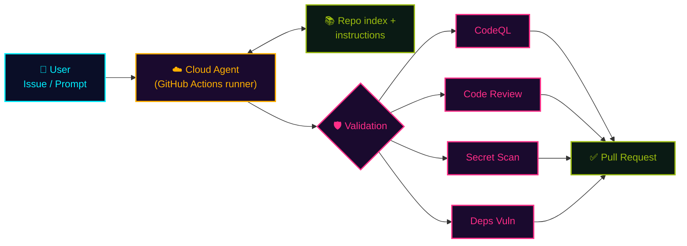

## 一言で

**Cloud Agent** は IDE を閉じても **クラウドで動き続ける Copilot の分身**。Issue やプロンプトを渡すと、GitHub Actions ランナー上で **リポジトリ全体を読み・実装し・検証し・PR を出す** ところまでを非同期でやってくれる。

> 💡 **アナロジー**：**退社前に Issue を渡して帰る → 翌朝、レビュー待ちの PR が並んでいる**。ローカル agent が "伴走者" なら、cloud agent は **"夜勤シフトに入った同僚"**。

## できること

<div class="setup-cards">
  <div class="setup-card">
    <div class="setup-card-head">
      <code>Background 実行</code>
      <span class="setup-card-tag tag-cyan">▸ 非同期</span>
    </div>
    <p>IDE を閉じても処理は <strong>クラウドで継続</strong>。大規模なコード生成やリサーチをマシンを占有せず流せる。</p>
  </div>
  <div class="setup-card">
    <div class="setup-card-head">
      <code>Repo 全域コンテキスト</code>
      <span class="setup-card-tag tag-magenta">▸ 構造把握</span>
    </div>
    <p>リモートインデックスを参照し、<strong>依存関係・モジュール構造</strong>を踏まえて編集。狭い視野の局所修正で終わらない。</p>
  </div>
  <div class="setup-card">
    <div class="setup-card-head">
      <code>Claude / Codex 対応</code>
      <span class="setup-card-tag tag-amber">▸ Public preview</span>
    </div>
    <p>Anthropic Claude と OpenAI Codex のコーディングエージェントを <strong>切り替えて</strong> 使える。</p>
  </div>
</div>

## 起動方法

入口は **3 つ**。普段の動線にあわせて選ぶ。

<div class="setup-cards">
  <div class="setup-card">
    <div class="setup-card-head">
      <code>VS Code から</code>
      <span class="setup-card-tag tag-cyan">▸ 3 steps</span>
    </div>
    <p>Chat の <strong>agent picker</strong> で Cloud Agent を選び、タスクを書いて送信。セッションは Web 側に引き継がれる。</p>
  </div>
  <div class="setup-card">
    <div class="setup-card-head">
      <code>GitHub.com から</code>
      <span class="setup-card-tag tag-magenta">▸ 3 steps</span>
    </div>
    <p>リポジトリ画面の <strong>Agents パネル</strong> から起動。プロンプトとブランチ起点を指定するだけ。</p>
  </div>
  <div class="setup-card">
    <div class="setup-card-head">
      <code>Issue から</code>
      <span class="setup-card-tag tag-amber">▸ assign</span>
    </div>
    <p>Issue を <strong>Copilot に assign</strong> するだけ。タイトルと本文がそのままタスク仕様になる。</p>
  </div>
</div>

## 内部の仕組み



User がタスクを投げる → Cloud Agent が **Actions ランナー** 上で起動 → リポジトリインデックス + instructions を読み → 実装 → **検証ツールを通過** → PR を開く、までが 1 セッション。

## 環境カスタマイズ（`copilot-setup-steps.yml`）

リポジトリに **任意で** `.github/workflows/copilot-setup-steps.yml` を置くと、Cloud Agent の **GitHub Actions 環境を完全に制御** できる。未設定なら Ubuntu のデフォルト環境で依存を自動推測。

```yaml
name: "Copilot Setup Steps"

on: workflow_dispatch

jobs:
  copilot-setup-steps:
    runs-on: ubuntu-latest  # ← より大きなランナー / self-hosted / windows-latest にも切替可
    steps:
      - uses: actions/checkout@v4
        with:
          lfs: true                    # Git LFS 有効化
      - uses: actions/setup-node@v4
        with:
          node-version: "20"
      - run: npm ci                    # 依存を事前インストール
      - run: pip install -r requirements.txt
    env:
      MY_API_BASE: https://api.example.com
```

**カスタマイズできること：**

- 🛠️ ツール・依存関係の **事前インストール**（npm / pip / apt …）
- 💪 GitHub-hosted ランナーの **サイズ拡張**
- 🏠 **self-hosted ランナー** で実行
- 🪟 **Windows** 開発環境への切替（デフォルトは Ubuntu Linux）
- 📦 **Git LFS** の有効化
- 🔑 **環境変数** の設定
- 🔥 エージェント **ファイアウォール** の無効化・カスタマイズ

## 検証ツール（デフォルト ON）

Cloud Agent は生成コードに対し、PR 作成前に **4 つの検証** を自動実行。**問題を検出したら自前で修正を試みてから** PR を出す。

<div class="setup-cards">
  <div class="setup-card">
    <div class="setup-card-head">
      <code>CodeQL</code>
      <span class="setup-card-tag tag-cyan">🛡️ Security</span>
    </div>
    <p><strong>セキュリティ脆弱性</strong> をコードスキャンで検出。SQLi / XSS / 危険な API 使用などを止める。</p>
  </div>
  <div class="setup-card">
    <div class="setup-card-head">
      <code>Copilot Code Review</code>
      <span class="setup-card-tag tag-magenta">🔍 Quality</span>
    </div>
    <p><strong>コード品質の問題</strong> を AI レビューで指摘。ロジックバグ・命名・無駄な複雑度。</p>
  </div>
  <div class="setup-card">
    <div class="setup-card-head">
      <code>Secret Scan</code>
      <span class="setup-card-tag tag-amber">🔑 Secrets</span>
    </div>
    <p><strong>API キー・認証情報</strong> の誤コミットを防止。生成コード経由の漏洩リスクを潰す。</p>
  </div>
  <div class="setup-card">
    <div class="setup-card-head">
      <code>Dependency Vuln</code>
      <span class="setup-card-tag tag-green">📦 Deps</span>
    </div>
    <p><strong>GitHub Advisory Database</strong> と照合し、脆弱なパッケージ追加をブロック。</p>
  </div>
</div>

> 💰 **無料で使える** ── GitHub Advanced Security ライセンスは **不要**。設定は `Settings → Copilot → Cloud agent → Validation tools` から ON/OFF 可能。

## チームでの活用イメージ

**退社前** ── 残った Issue を 3 件、Cloud Agent に assign して帰る。

**夜間** ── ランナー上で Cloud Agent が黙々と実装・自己検証。CodeQL も Code Review もパスしたものだけが PR になる。

**翌朝** ── レビュー待ちの PR が並んでいる。あなたの仕事は "書く" ではなく **"判断する"**。人間は意思決定に集中、機械は反復に集中 ── これが AI 駆動開発のチーム運用の最小単位。
