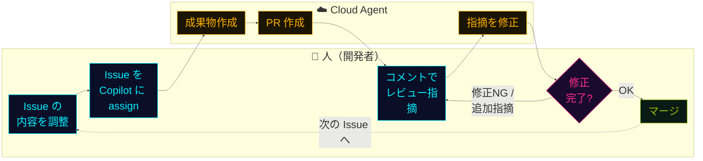

## 一言で

<div class="hero-quote hero-quote-chat">
  <p>
    <strong>Cloud Agent</strong> は、GitHub 上で非同期に動く Copilot。
  </p>
  <p>
    Issue やタスクを渡すと、クラウドでコードを読み、実装し、検証し、PR として返してくれる。
  </p>
</div>

## できること

- **Background 実行**：IDE を閉じても、処理はクラウドで継続する。
- **Actions 上で実行**：セッションは GitHub Actions runner 上で動くため、実行ログを追えて透明性が高い。
- **チームで確認**：Cloud Agent のセッションはチーム全員が参照でき、作業内容を共有しやすい。
- **Repo 全域コンテキスト**：依存関係やモジュール構造を踏まえて編集できる。
- **検証まで実行**：テスト・ビルド・静的解析などを実行し、結果を PR に反映する。
- **複数ハーネス対応**：Anthropic Claude SDK や OpenAI Codex SDKも選択できる。(Third Party Agent)

## 起動方法

- **VS Code から**：Chat の `Local` と書いてあるところから `Cloud` に切り替える。
- **GitHub.com から**：リポジトリ画面の **Agents パネル** から起動する。プロンプトとブランチ起点を指定するだけ。
- **Issue から**：Issue を **Copilot に assign** するだけ。タイトルと本文がそのままタスク仕様になる。
- **CLI から**：`/delegate` を使って Copilot Cloud Agent に作業を渡す。他の SDK / Harness には delegate できない。

## 環境カスタマイズ（`copilot-setup-steps.yml`）

リポジトリに **任意で** `.github/workflows/copilot-setup-steps.yml` を置くと、Cloud Agent の **GitHub Actions 環境を完全に制御** できる。未設定なら Ubuntu のデフォルト環境で依存を自動推測。

```yaml
name: "Copilot Setup Steps"

on: workflow_dispatch

jobs:
  copilot-setup-steps:
    runs-on: ubuntu-latest  # ← より大きなランナー / self-hosted / windows-latest にも切替可
    steps:
      - uses: actions/checkout@v4
        with:
          lfs: true                    # Git LFS 有効化
      - uses: actions/setup-node@v4
        with:
          node-version: "20"
      - run: npm ci                    # 依存を事前インストール
      - run: pip install -r requirements.txt
    env:
      MY_API_BASE: https://api.example.com
```

**カスタマイズできること：**

- 🛠️ ツール・依存関係の **事前インストール**（npm / pip / apt …）
- 💪 GitHub-hosted ランナーの **サイズ拡張**
- 🏠 **self-hosted ランナー** で実行
- 🪟 **Windows** 開発環境への切替（デフォルトは Ubuntu Linux）
- 📦 **Git LFS** の有効化
- 🔑 **環境変数** の設定
- 🔥 エージェント **ファイアウォール** の無効化・カスタマイズ

## 検証ツール（デフォルト ON）

Cloud Agent は生成コードに対し、PR 作成前に **4 つの検証** を自動実行。**問題を検出したら自前で修正を試みてから** PR を出す。

| 検証ツール | 見るもの | 目的 |
|---|---|---|
| **CodeQL Code scanning** | セキュリティ脆弱性 | SQLi、XSS、危険な API 使用などを検出する。 |
| **Copilot Code Review** | コード品質 | ロジックバグ、不要な複雑さ、実装上の問題を指摘する。 |
| **Secret Scanning** | API キー・認証情報 | 生成コード経由の secret 漏洩を防ぐ。 |
| **Dependency Vulnerability checks** | 依存パッケージ | GitHub Advisory Database と照合し、脆弱な依存追加を検出する。 |

> 💰 **無料で使える** ── GitHub Advanced Security ライセンスは **不要**。設定は `Settings → Copilot → Cloud agent → Validation tools` から ON/OFF 可能。

## チームでの活用イメージ

**退社前** ── 残った Issue を 3 件、Cloud Agent に assign して帰る。

**夜間** ── ランナー上で Cloud Agent が黙々と実装・自己検証。CodeQL も Code Review もパスしたものだけが PR になる。

**翌朝** ── レビュー待ちの PR が並んでいる。あなたの仕事は "書く" ではなく **"判断する"**。人間は意思決定に集中、機械は反復に集中 ── これが AI 駆動開発のチーム運用の最小単位。

## ワークフロー全体図

人は **Issue を整える・レビューする・マージする** だけ。実装と修正のループは Cloud Agent が回す。



> 人間のタスクは **判断と意思決定**、Copilot のタスクは **実装と反復**。境界を分けることで、レビュー待ちの PR がパイプラインのように流れる。
