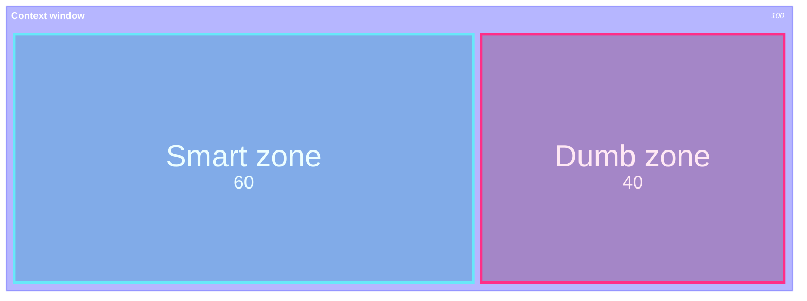
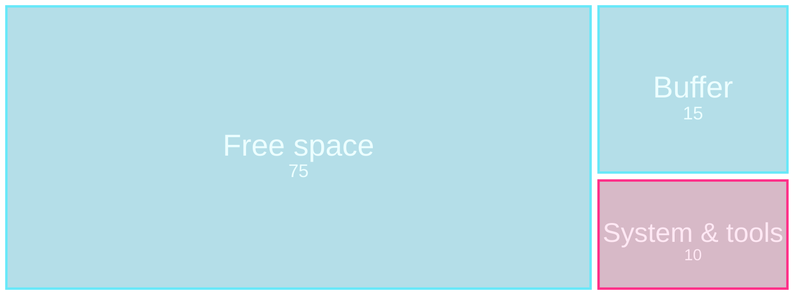
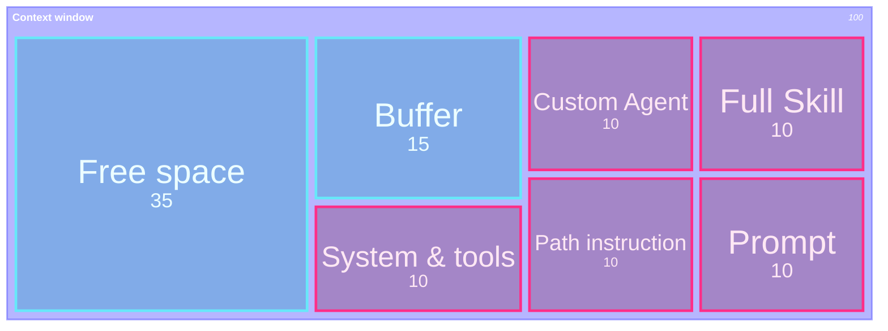
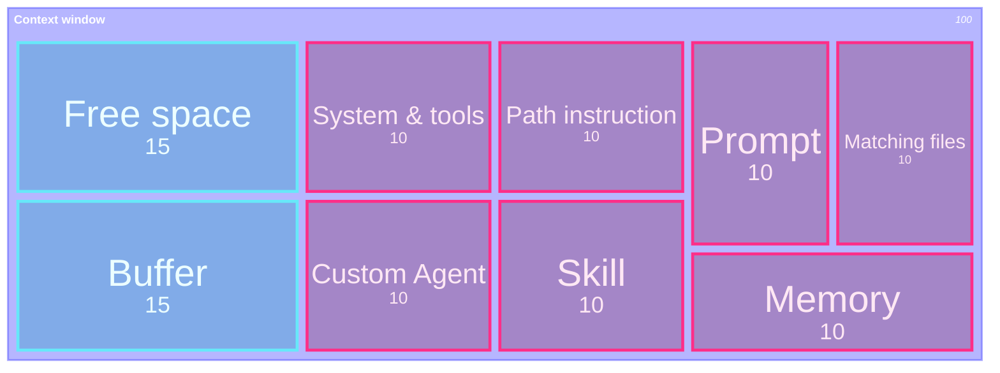
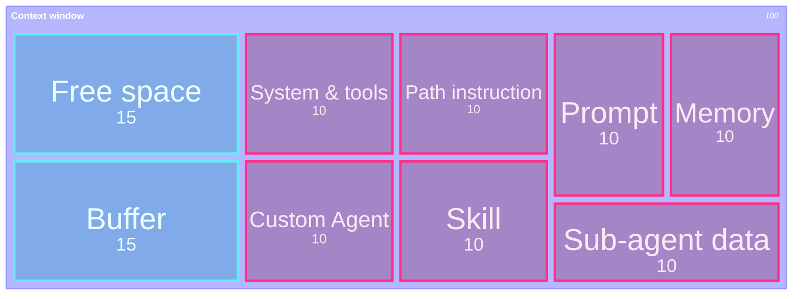

## 一言で

  

    <strong>Context Engineering</strong> は、AI に渡す文脈を「できるだけ少なく、でも必要なだけ多く」設計する技術。
  

  

    何でも全部読ませるのではなく、目的・制約・関連ファイル・検証方法を絞って、AI が迷わず次の一手を選べる状態を作る。
  

> 良い context は量ではなく **選び方**。不要な情報を減らし、必要な情報を欠かさない。

## Context rot

LLM は context window が大きいほど賢くなるわけではない。情報を詰め込みすぎると、**Lost in the middle** で重要情報が中央に埋もれたり、**Recency bias** で直近の情報を過大評価したりして、判断が鈍る。

これを **context rot** と呼ぶ。

> Context Engineering の目的は、context window を埋めることではなく、**必要な情報が目立つ状態を保つこと**。

## Context window：start

最初は、system prompt、Copilot instructions、skill descriptions、available MCP/tools などの **常時必要なメタ情報** だけが入る。

## Context window：agent switch

`Test coder` agent に切り替えると、custom agent instruction が追加される。  
さらに「この test coverage を改善して」と頼むと、path instruction と skill description が match する。

## Context window：load relevant context

Skill description が match すると **full skill** が読み込まれる。  
同時に、対象 file、test file、smartly selected memory、prompt が context に入る。

## Context window：summarize with sub-agent

大きな workspace を直接 main context に入れず、Explore sub-agent に調査させる。  
main agent には **workspace summary** だけが戻るので、context window を overload しにくい。

