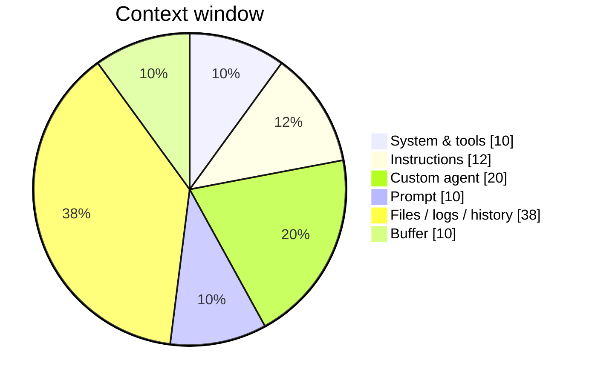
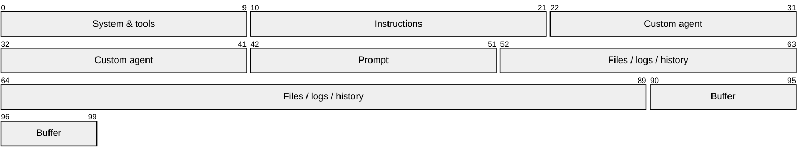
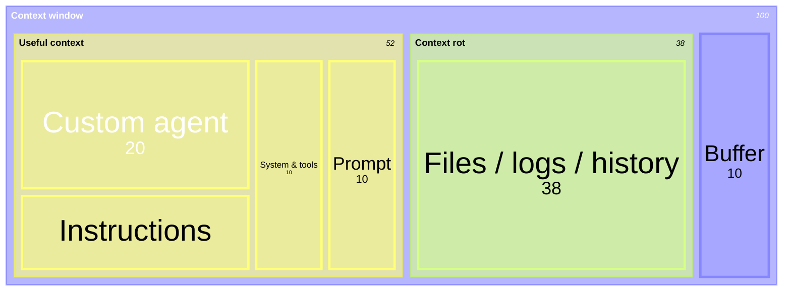

## 一言で

  

    <strong>Context Engineering</strong> は、AI に渡す文脈を「できるだけ少なく、でも必要なだけ多く」設計する技術。
  

  

    何でも全部読ませるのではなく、目的・制約・関連ファイル・検証方法を絞って、AI が迷わず次の一手を選べる状態を作る。
  

> 良い context は量ではなく **選び方**。不要な情報を減らし、必要な情報を欠かさない。

## Context rot：Pie chart

LLM は context window が大きいほど賢くなるわけではない。情報を詰め込みすぎると、重要な情報を見落とし、判断が鈍る。  
これを **context rot** と呼ぶ。

> Window が埋まるほど、**Lost in the middle** や **Recency bias** が起きやすくなる。

## Context rot：Packet diagram

Context window を横長のメモリ領域として見ると、必要な context とノイズが同じ場所を奪い合う。

## Context rot：Treemap

何が window を占有しているかを見るなら、treemap の方が比率を読みやすい。

| 現象 | 何が起きる？ |
| --- | --- |
| Lost in the middle | 長い context の中央にある重要情報が埋もれる |
| Recency bias | 直近に出てきた情報を過大評価する |
| Context rot | ノイズが増え、LLM の判断精度が落ちる |

> Context Engineering の目的は、context window を埋めることではなく、**必要な情報が目立つ状態を保つこと**。
