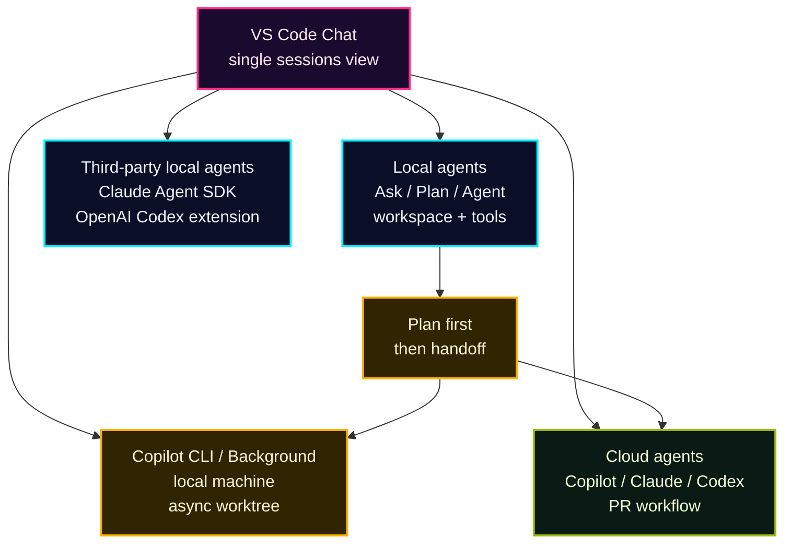

## 一言で

  

    <strong>Copilot Chat</strong> は、コードと会話するための入口。
  

  

    VS Code では、ただのチャットではなく、Local agent harness として Ask / Plan / Agent、tools、models、permissions、customizations を束ねる。
  

> GitHub.com / Mobile でも Chat や agent 起動はできる。ただし、VS Code のようにローカル workspace、extension tools、terminal、selection、Agent Customizations を全部持つわけではない。

## VS Code の harness：3 つの built-in agents

VS Code docs では **Ask / Plan / Agent** は “custom agent” ではなく **built-in agents**。  
同じ Chat UI でも、選ぶ agent によって「何をしてよいか」が変わる。

  

    

      <code>Ask</code>
      ▸ 質問
    

    
コードベース、VS Code、技術概念について回答する。ファイル変更はしない前提で、理解・探索・相談に使う。

  

  

    

      <code>Plan</code>
      ▸ 設計
    

    
実装前に multi-step plan を作る。必要なら質問し、納得できたら implementation agent や Cloud agent に handoff する。

  

  

    

      <code>Agent</code>
      ▸ 実装
    

    
高レベル要求から自律的に計画し、ファイル編集、terminal command、tool call、検証を進める。

  

> さらに session type、permission level、language model を選ぶことで、どこで動くか・どこまで自律させるかも harness できる。

## Agent Customizations

Agent Customizations は、Chat の裏側にある “部品棚”。  
Local / Cloud / CLI / Claude など、agent type ごとに見える部品は変わる。

| 部品 | 何を固定する？ | 例 |
| --- | --- | --- |
| Agents | persona、tools、model、handoff | Ask / Plan / Agent、Explore、チーム独自 agent |
| Skills | 専門タスクの手順・resources | create-skill、PR description、frontend design |
| Instructions | 常時効くルール | repo conventions、file-based rules |
| Prompts | くり返し使う依頼テンプレート | scaffold、review、migration |
| Hooks | lifecycle で実行する処理 | format after edit、policy check |
| MCP Servers | 外部 tool / data 接続 | GitHub、Playwright、Jira、Figma |
| Plugins | 上記を bundle として配布 | slash commands、skills、agents、MCP |

> VS Code docs では `/create-prompt`、`/create-instruction`、`/create-skill`、`/create-agent`、`/create-hook` で customizations を生成できる。

## Chat はどこまで同じ？

同じ Copilot でも、surface によって harness の深さが違う。

| Surface | 得意なこと | 注意点 |
| --- | --- | --- |
| VS Code Chat | Local agents、Ask / Plan / Agent、tools、models、permissions、customizations | 一番フル機能。ローカル context と extension tools を使える |
| GitHub.com | repo / issue / PR context、Agents tab、Cloud agent 起動 | ローカル terminal や VS Code selection は持たない |
| GitHub Mobile | 外出先で質問、issue / PR から agent session 起動 | quick control 向け。VS Code の local harness ではない |
| Copilot CLI | terminal-native agent、local files、GitHub.com 操作 | Chat UI ではなく CLI harness。VS Code から handoff できる |
| Cloud agent | GitHub Actions-powered 環境で branch / commits / PR | 非同期。remote なので VS Code runtime context には直接触れない |

> つまり、GitHub.com / Mobile の Chat は便利な入口。ただし **Plan mode を含む full local agent harness は VS Code 側** と考える。

## VS Code は agent console になる

VS Code からできること：

- **Claude**：Claude Agent SDK の harness を VS Code から使う。local / cloud の選択肢がある
- **Codex**：OpenAI Codex extension / Codex coding agent を Copilot subscription で使える範囲がある
- **CLI**：local session を Copilot CLI / background agent に handoff できる
- **Cloud**：Plan や local chat の文脈を Cloud agent に渡し、PR workflow へ進められる

> Chat は「質問箱」ではなく、**どの agent harness で実行するかを選ぶ control plane** になっている。
