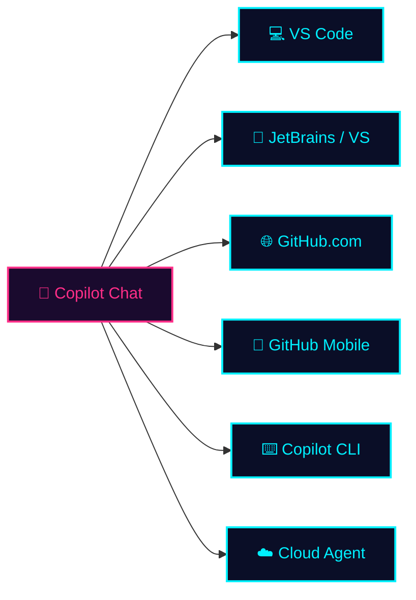
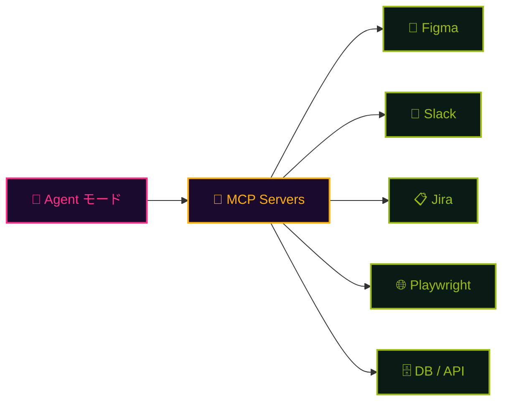

## 一言で

**Copilot Chat はコードと話すための窓口。** ファイル・リポジトリ・issue・PR・エラーログ ── すべてを文脈にして、自然言語で質問・依頼できる。

> 💡 **アナロジー**：常に隣にいるペアプロ相手。違うのは、その相手は **リポジトリ全体を一瞬で読める** こと。そして VS Code でも、ターミナルでも、GitHub.com でも、同じ顔で待っていてくれる。

## 3 つのモード

VS Code の Copilot Chat には **Ask / Plan / Agent** の 3 モード。場面に応じて切り替える。

  

    

      <code>🔍 Ask</code>
      ▸ 質問
    

    
Copilot 最初のモード。<strong>質問に回答する</strong>。新しくジョインしたメンバーが <strong>コードベースを理解する</strong> 時に最適。

  

  

    

      <code>📋 Plan</code>
      ▸ 設計
    

    
Copilot と対話しながら <strong>実装可能なレベルのドキュメント</strong> を作成。Agent / Cloud Agent がそのまま実装に使える設計書になる。

  

  

    

      <code>🤖 Agent</code>
      ▸ 実装
    

    
半自律ペアプロ。要求 → 内部分析 → 実装 → 検証まで実施。<strong>MCP サーバー経由で GitHub 外のシステム</strong> とも連携。

  

## どこで動く

エディタでもブラウザでも、移動中のスマホでも、夜間に走るクラウドでも ── **同じ会話相手** がついてくる。

## Agent モードで開く扉

Agent モードは Copilot の **手を伸ばす範囲** を一気に広げる。MCP サーバーを介して、Copilot は GitHub の外側 ── Figma・Slack・Jira・社内 DB・ブラウザ ── まで触れる。

> ⚔️ **JRPG 風に言うと**：Ask は「町の人に話を聞く」、Plan は「冒険の書を埋める」、Agent は「**仲間を引き連れて実際にダンジョンに潜る**」。

## 上手に使うコツ

- **🎯 文脈を渡す** ── `#file` / `#selection` / `@workspace` で対象を明示。曖昧な質問より具体的な参照のほうが結果が良い
- **📜 instructions ファイルでルール常駐** ── 命名規則・スタイル・禁止事項は `.github/copilot-instructions.md` に書いて毎回の前置きを撲滅
- **🔌 MCP で外部接続** ── Figma の URL / Jira のチケット / Slack のスレッドを直接 Agent に渡す
- **🧭 モードを正しく選ぶ** ── 探索なら Ask、設計なら Plan、実装なら Agent。**Plan で書いた設計書を Agent / Cloud Agent に渡す** のが王道ルート
- **🪶 スコープを絞る** ── 「全部直して」より「この関数の null チェックを足して」。粒度が小さいほど精度が上がる

## デモシナリオ

> 🎮 **王道の流れ**：
> 1. リポジトリに **MCP サーバー** + **Agent SKILL** + **Instruction ファイル** を仕込む
> 2. **Plan モード** で対話しながらリファクタリング計画を作成
> 3. その計画を **Agent モード** に渡してリファクタを実行
> 4. push 時の Actions でテスト & 別モデルが Code Review
> 5. シニア開発者は **最終レビューとメンタリング** に集中
>
> Chat はもはや「質問箱」ではなく、**チーム開発の中央コンソール**。
