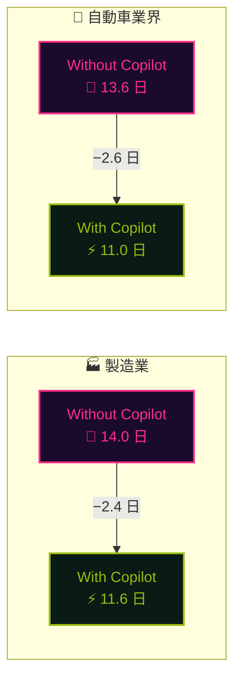
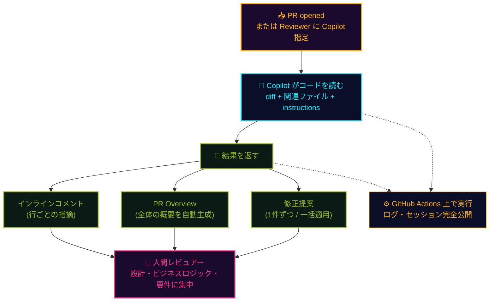

## 一言で

**PR の最初の目を Copilot が務める。** レビュアーに `Copilot` を割り当てると、コードの **意図を読み取り**、インラインコメント・PR 概要・修正提案までを返す。人間レビュー前のノイズ取りから、Org 全体の自動化までスケールする。

> 💡 **アナロジー**：**24/7 で待機している新人レビュアー**。基礎的な指摘・スタイル・null 安全性は全部任せて、人間は **設計・ビジネスロジック・メンタリング** に集中できる。

## 5 つの強み

<div class="setup-cards">
  <div class="setup-card">
    <div class="setup-card-head">
      <code>🧠 文脈理解</code>
      <span class="setup-card-tag tag-cyan">▸ Context-aware</span>
    </div>
    <p>コードの<strong>意図</strong>を把握し、ピンポイントで具体的な修正案を提示。表面的な lint ではない。</p>
  </div>
  <div class="setup-card">
    <div class="setup-card-head">
      <code>⚙️ 自動化</code>
      <span class="setup-card-tag tag-magenta">▸ Repo / Org / Enterprise</span>
    </div>
    <p>PR 作成時に<strong>自動レビュー</strong>を発火。範囲は Repo 単位 → Org 単位 → Enterprise 単位で一括設定可。</p>
  </div>
  <div class="setup-card">
    <div class="setup-card-head">
      <code>📜 カスタマイズ</code>
      <span class="setup-card-tag tag-amber">▸ instructions.md</span>
    </div>
    <p><code>copilot-instructions.md</code> にレビュー基準を書くだけ。チームの規約がそのまま AI のチェック項目に。</p>
  </div>
  <div class="setup-card">
    <div class="setup-card-head">
      <code>🔧 一括修正</code>
      <span class="setup-card-tag tag-green">▸ One-click apply</span>
    </div>
    <p>指摘を <strong>1 件ずつ</strong> または <strong>まとめて一括</strong> で適用。Copilot がコミットまで作る。</p>
  </div>
  <div class="setup-card">
    <div class="setup-card-head">
      <code>🔎 透明性</code>
      <span class="setup-card-tag tag-cyan">▸ 100% traceable</span>
    </div>
    <p>レビューと修正は GitHub Actions 上で実行。<strong>ログ・エージェントセッション</strong>で全判断を追跡可能。</p>
  </div>
</div>

## 実績データ

日本を代表する **製造業・自動車業界** の顧客（2025 年 9 月〜 2026 年 2 月、PR Open Duration の中央値）。



> 💰 **ビジネス価値**：PR 承認 → マージ、コードレビュー完了までの期間が短縮 ── **開発リードタイム短縮**で市場投入スピードが上がり、極めて高い ROI を実現。

## どう動くか



レビューも修正も **GitHub Actions のジョブ** として実行 ── 何を読み、何を判断し、どう直したかが **100% 追跡可能** なプロセス。

## 使い方

<div class="setup-cards">
  <div class="setup-card">
    <div class="setup-card-head">
      <code>VS Code</code>
      <span class="setup-card-tag tag-cyan">▸ Uncommitted</span>
    </div>
    <p>コミット前の変更に対してその場でレビュー。<strong>Source Control パネル</strong>から <code>Copilot: Review changes</code> を実行 → push 前にセルフチェック完了。</p>
  </div>
  <div class="setup-card">
    <div class="setup-card-head">
      <code>GitHub.com</code>
      <span class="setup-card-tag tag-magenta">▸ Reviewer 指定</span>
    </div>
    <p>PR の <strong>Reviewers</strong> に <code>Copilot</code> を追加するだけ。数分後にコメントと PR Overview が返ってくる。</p>
  </div>
  <div class="setup-card">
    <div class="setup-card-head">
      <code>自動レビュー</code>
      <span class="setup-card-tag tag-amber">▸ Repo / Org / Enterprise</span>
    </div>
    <p>設定で <strong>「PR 作成時に自動レビュー」</strong> を ON。3 ステップで Org・Enterprise 全体に展開できる。</p>
  </div>
</div>

## カスタマイズ

リポジトリ全体のレビュー基準は **`.github/copilot-instructions.md`** に書くだけ。

```markdown
# このリポジトリのコードレビュー基準

## セキュリティ
- 外部入力は必ずバリデーション・サニタイズ
- SQL は parameterized query のみ（文字列連結禁止）
- 秘密情報を `console.log` / コミットに含めない

## 命名規則
- 関数は動詞始まり（`fetchUser`, `calcTax`）
- boolean は `is` / `has` / `can` プレフィックス

## ライブラリ方針
- 日付は dayjs を使用（moment は禁止）
- HTTP は ky（axios は新規追加禁止）
```

ファイル種類ごとに **異なる基準** を当てたい時は **`NAME.instructions.md`** を併用：

```yaml
---
applyTo: "**/*.test.ts"
---

このファイルはテストコード。
- describe / it のネストは 2 階層まで
- mock は vi.fn() を使用、jest.fn() 禁止
- 1 テストにつき 1 アサーション原則
```

これで **テストには厳しめ、フロントエンドには別ルール、DB マイグレーションには安全規約** ── と粒度を分けられる。

## 限界と人間の役割

Copilot Code Review は **強力だが万能ではない**。次の領域は人間が引き続き担う：

- **ビジネスロジックの正しさ** ── 要件・仕様と照合する判断は AI には不可
- **深いセキュリティ分析** ── SAST / SCA は **CodeQL** など専用ツールと併用
- **設計レビュー** ── アーキテクチャ・モジュール境界・トレードオフの議論
- **メンタリング** ── なぜそう書くべきかをチームメンバーに伝える

> 🎯 **役割分担**：AI が **基礎指摘・スタイル・null 安全性・テスト不足** を全部拾ってくれる分、人間は **設計・要件・育成** という付加価値の高い仕事に時間を使える。
