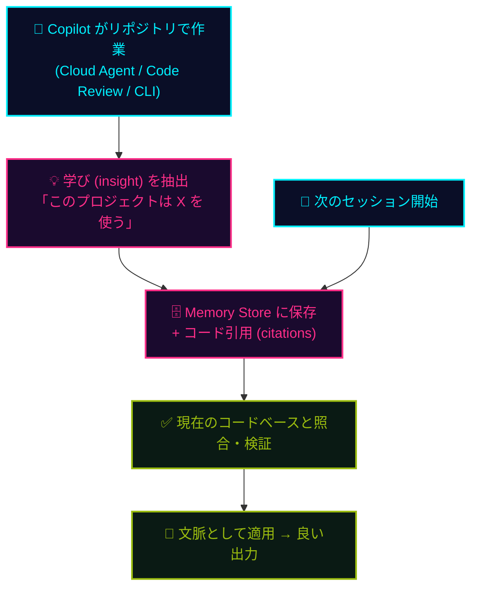

## 一言で

Copilot がリポジトリで働きながら **学んだことを覚えておく**。次に同じような作業が来た時、もう一度説明しなくていい ── **"explain again" がいらない世界**。

> 💡 **アナロジー**：新人がプロジェクトに入って数ヶ月、ようやく **"うちのチームの常識"** が体に染みた状態。あるいは RPG で経験値を積んで **Lvl up** ── スキルもステータスも、次の冒険にそのまま持ち越せる。

## なぜ重要?

毎回プロンプトの冒頭に **同じ前置き** を書いていないか？「このプロジェクトは pnpm を使う」「PR は必ず日本語で書く」「テストは vitest」── そういう **暗黙知** を Copilot が **自分で覚えてくれる**。

しかも記憶は **チーム全員に共有** される。シニアが Code Review で Copilot に教えた判断基準が、ジュニアの次の PR にも自動で効く。**知識が個人ではなくリポジトリに溜まる**。

## 3 つのスコープ

  

    

      <code>Repository</code>
      📦 リポジトリ単位
    

    
記憶は <strong>リポジトリに紐づく</strong>。別のリポジトリの常識が混ざらないので、プロジェクトごとに最適化された "脳" になる。

  

  

    

      <code>All Users</code>
      👥 全ユーザー共有
    

    
そのリポジトリにアクセスできる <strong>全員の Copilot 操作</strong> で利用可能。誰か一人が教えれば、チーム全員の Copilot が賢くなる。

  

  

    

      <code>Cross-feature</code>
      🔀 機能横断
    

    
Cloud Agent が学んだ知識を <strong>Code Review が活用</strong>（逆も然り）。CLI / Chat も含めて、Copilot 機能群が <strong>同じ記憶</strong> を共有。

  

## 仕組み

> ⏳ **28 日後に自動削除** ── 使われた記憶は更新・延長され、使われない知識は静かに消えていく。**腐った知識** が残り続けない設計。

> 🔍 **citations 付きで保存** ── 記憶は具体的なコード片への参照を持つ。使う前に「今もそのコード、本当にある？」と現状と照合してから適用される。

## 設定する場所

  

    

      <code>Repository</code>
      📦 リポジトリレベル
    

    
<strong>Settings → Copilot → Policies</strong> このリポジトリだけ Memory を ON / OFF。試したいプロジェクトから始めよう。

  

  

    

      <code>Organization</code>
      🏢 Org レベル
    

    
<strong>Org Settings → Copilot → Policies</strong> 組織全体で一括コントロール。コンプライアンス要件に合わせて全リポに適用。

  

## チームへの効果

ジュニアが書いた PR でも、過去にシニアが Code Review で示した **判断基準** を Copilot が覚えていて、自動で適用してくれる。**個人の経験値がチームの経験値になる**。

> 🎮 リポジトリ自体が **Lvl up していく** ── 使うほど Copilot がそのプロジェクトを深く理解し、レビューも実装も的確になる。「育てる AI 同僚」を、チームみんなで育てる。
