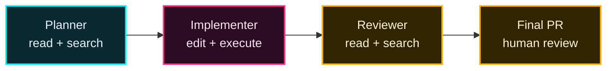

## 一言で

<div class="hero-quote">
  <p>
    <strong>Custom Agent</strong> は、Copilot に <strong>役割・道具・振る舞い</strong> をセットで渡す専門家プロファイル。
  </p>
  <p>
    「同じ AI」でも、Planner / Reviewer / Tester のように人格と権限を切り替えられる。
  </p>
</div>

## 何を固定する？

Custom Agent は **プロンプトだけ** ではなく、エージェントの「働き方」をまとめて固定する。

| 要素 | 何を決める？ | 例 |
| --- | --- | --- |
| Identity | 何者として振る舞うか | `Planner`, `Security Reviewer`, `Test Specialist` |
| Description | いつ呼ぶべきか | 「実装前に計画を作る時」 |
| Tools | どの道具を使えるか | `read`, `search`, `edit`, `github/*` |
| Model | どのモデルで動くか | 設計は強いモデル、探索は速いモデル |
| MCP | 専用の外部ツール | Jira, Figma, Playwright, internal API |
| Prompt | 判断基準・出力形式 | 成功条件、禁止事項、レビュー観点 |

## いつ使う？

| 使いたいもの | 向いているケース | 例 |
| --- | --- | --- |
| Instructions | 全員・全タスクに効く常識 | 「この repo は pnpm を使う」 |
| Skills | 必要な時だけ読み込む専門手順 | 「PR description を生成する」 |
| Custom Agent | 役割と権限を切り替えたい | 「編集禁止の Planner」「security 専用 reviewer」 |

> 判断基準：**人格・ツール制限・モデル・MCP をまとめて変えたいなら Custom Agent**。

## 2 つのスコープ

|  | 👥 チーム共有 | 👤 個人用 |
| --- | --- | --- |
| 📁 場所 | `.github/agents/*.agent.md` | `~/.copilot/agents/` |
| 🎯 適用範囲 | その repository / workspace | 自分の全 workspace |
| 🤝 共有性 | Git 管理してチームで共有 | ローカル専用 |
| 💡 用途 | チーム標準の Planner / Reviewer / Tester | 個人の作業スタイル・好み |

## `.agent.md` の中身

Custom Agent は Markdown ファイル。上の YAML frontmatter が設定、下の本文がエージェントへの指示になる。

```yaml
---
name: Planner
description: 実装前に調査し、編集せずに計画を作る
tools: ["read", "search"]
model: "Claude Opus 4.5"
target: github-copilot
---

# Role

あなたは実装前の計画担当。
コード編集は禁止。調査、設計、リスク、検証手順だけを書く。
```

| フィールド | 必須 | 役割 |
| --- | --- | --- |
| `description` | Yes | 呼び出すタイミングを決める最重要メタデータ |
| `name` | No | 表示名。省略時はファイル名 |
| `tools` | No | 使える道具を制限。省略すると利用可能な tools 全部 |
| `model` | No | IDE などで使うモデル指定 |
| `target` | No | `vscode` / `github-copilot` など対象環境 |
| `mcp-servers` | No | この agent 専用 MCP |

## Tools は権限設計

Custom Agent の強みは「何をできるか」を役割ごとに変えられること。

| Agent | Tools | 意図 |
| --- | --- | --- |
| Planner | `read`, `search` | 調査と計画だけ。コードを書かない |
| Implementer | `read`, `search`, `edit`, `execute` | 実装・修正・検証まで行う |
| Reviewer | `read`, `search` | 変更を読む。勝手に直さない |
| Release Bot | `read`, `github/*` | PR / issue / release 情報を扱う |

> 権限は少ないほど安全。最初は絞り、必要になったら増やす。

## MCP を持たせる

Repository 全体に MCP を置くこともできるが、Custom Agent にだけ専用 MCP を持たせると役割が明確になる。

```yaml
---
name: design-reviewer
description: Figma と実装を照合して UI 差分をレビューする
tools: ["read", "search", "figma/*"]
mcp-servers:
  figma:
    type: local
    command: npx
    args: ["-y", "figma-mcp-server"]
---
```

| パターン | 向いている時 |
| --- | --- |
| Repository MCP | ほぼ全 agent が使う共通ツール |
| Agent-local MCP | 特定 agent だけが使う専門ツール |
| Tool subset | MCP はあるが、agent には一部 tool だけ渡したい |

## Handoff / Orchestration

Custom Agent は単体でも使えるが、複数をつなぐと「小さな AI チーム」になる。



| フェーズ | Agent | 成功条件 |
| --- | --- | --- |
| Plan | Planner | 実装方針・リスク・検証方法が明確 |
| Build | Implementer | 計画どおりに変更し、検証まで実施 |
| Review | Reviewer | バグ・セキュリティ・仕様漏れを指摘 |
| Ship | Human | 最終判断とマージ |

## 例：レビュー番長

```yaml
---
name: review-banchou
description: PR や差分をレビューし、重大なバグ・セキュリティ・仕様漏れだけを指摘する
tools: ["read", "search"]
target: github-copilot
---

# Role

あなたは厳しいコードレビュー担当。
スタイルや好みではなく、実害のある問題だけを報告する。

# Output

- 重大度
- 影響範囲
- 根拠となるファイル / 行
- 最小修正案
```

> 良い Custom Agent は「誰か」ではなく、**どの判断を任せるか** が明確。
