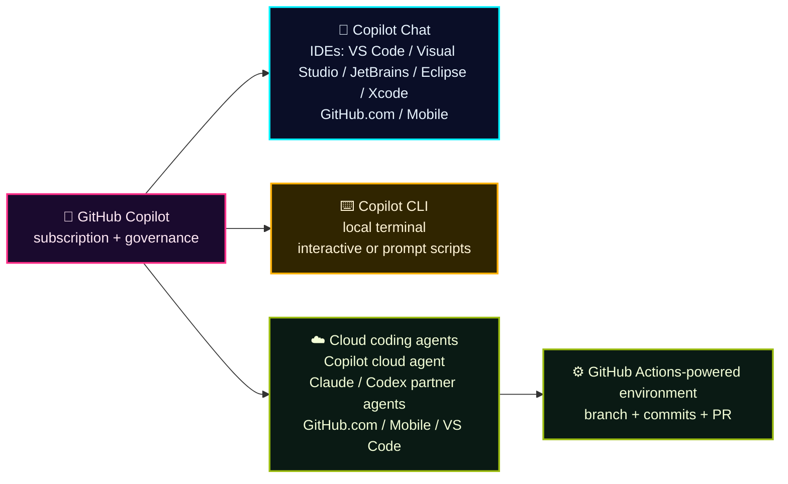
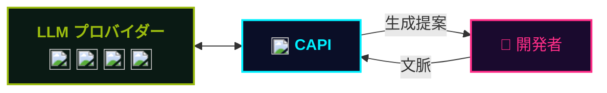

## 一言で

GitHub Copilot は世界で最もご活用いただいている AI 開発ツール。競合の中で **最も多くの AI モデルと利用サーフェス** を選べるオーケストレーターです。

選べる AI モデル：OpenAI / Anthropic / Google Gemini / xAI Grok、さらにカスタムモデルにも対応。

選べる利用サーフェス：

- **IDE**：VS Code / Visual Studio / JetBrains / Xcode / Eclipse / Neovim
- **クラウド**：Cloud Agent でブラウザから自律実行
- **レビュー**：Copilot Code Review が PR を自動レビュー
- **ターミナル**：Copilot CLI でシェルから対話
- **SDK**：自分のアプリに Copilot を組み込み
- **自動化**：Agentic Workflow でワークフロー化

## 開発者へのインパクト

GitHub Copilot がもたらす開発者へのインパクト  
Accenture 社の開発者 450 名を対象にした 6 か月間の調査結果

| 活動 | 生産性 | 効率性 | 満足度 |
|---:|---:|---:|---:|
| **94%** 作業の「フロー状態」を維持できたと回答 | **90%** より良いコードを書けていると実感 | **50%** ビルド数が増加 | **96%** 初日から成功を実感 |
| **90%** 情報探索に費やす時間が減少 | **88%** Copilot が提案したコードがそのまま採用された割合 | **84%** ビルド成功率が向上 | **90%** 仕事への満足度が向上 |

## どこで使える？

Copilot は 1 つの製品画面ではなく、**Chat / CLI / Cloud agents** をまたぐ開発プラットフォーム。
同じ GitHub ワークフロー上で、IDE・ターミナル・GitHub.com・非同期エージェントを使い分ける。

> 補足：GitHub Docs では Claude / Codex は **coding agents** として説明される。OpenAI Codex の VS Code extension は Codex SDK を使い、Copilot Pro+ では “Sign in with Copilot” が使える。

## なぜ企業は Copilot を選ぶのか

- ✅ **オーケストレーション** 　コーディングだけでなく、SDLC 全体にわたる AI
- ✅ **モデル・エージェント・サーフェス全体での選択の自由** 　あらゆるワークフローに最適なモデルとインターフェース。ベンダーロックインなし
- ✅ **エンタープライズコントロール** 　一元化されたガバナンス、可視性、セキュリティ
- ✅ **最高のコストパフォーマンス** 　プール型使用量、充実した組み込みエンタイトルメント、ACD による価格優位性の最大化

## チームでの活用イメージ

SDLC のフェーズごとに Copilot をどう使うか ── **企画・開発・レビュー・品質保証・監視**。

```mermaid
---
config:
  theme: base
  flowchart:
    htmlLabels: true
    curve: basis
  themeVariables:
    fontSize: "8px"
  themeCSS: |
    .nodeLabel { color: #e8f4ff !important; }
    .nodeLabel strong { font-size: 11px; }
    .nodeLabel img { border-radius: 50% !important; width: 28px !important; height: 28px !important; min-width: 28px !important; max-width: 28px !important; min-height: 28px !important; max-height: 28px !important; object-fit: cover !important; display: block !important; margin: 0 auto 3px !important; }
---
flowchart TB
  A["<img src='/theomonfort/octocat-green.png' width='28' height='28'/><b style='color:#9bbc0f'>企画</b> ・ チームマネージャー<br/>───<br/><b style='color:#9bbc0f'>Issues</b> と <b style='color:#9bbc0f'>Projects</b> で計画。<b style='color:#9bbc0f'>MCP</b> サーバー、<b style='color:#9bbc0f'>Instruction</b> ファイル、<b style='color:#9bbc0f'>Agent Skills</b>、<b style='color:#9bbc0f'>Custom Agent</b> を設定し AI のハーネスを整備"]
  B["<img src='/theomonfort/octocat-red.png' width='28' height='28'/><b style='color:#ff2e88'>開発</b> ・ ジュニア開発者<br/>───<br/><b style='color:#ff2e88'>Codespaces</b> でチーム共通の環境を使い、<b style='color:#ff2e88'>Plan / Agent</b> モードや <b style='color:#ff2e88'>Copilot Chat</b>・<b style='color:#ff2e88'>CLI</b> でコーディング。<b style='color:#ff2e88'>Cloud Agent</b> にタスクを委譲して並列開発"]
  C["<img src='/theomonfort/octocat-yellow.png' width='28' height='28'/><b style='color:#ffb000'>レビュー</b> ・ シニア開発者<br/>───<br/>Copilot が自動で <b style='color:#ffb000'>Code Review</b>。<b style='color:#ffb000'>PR</b> のレビュー時間を削減し、最終レビューに集中"]
  D["<img src='/theomonfort/octocat-blue.png' width='28' height='28'/><b style='color:#00f0ff'>品質保証</b> ・ DevSecOps エンジニア<br/>───<br/><b style='color:#00f0ff'>GitHub Actions</b> でテストを自動化。<b style='color:#00f0ff'>Code Scanning</b>・<b style='color:#00f0ff'>Secret Scanning</b>・<b style='color:#00f0ff'>Dependabot</b> を有効化してセキュリティを担保"]
  E["<img src='/theomonfort/octocat-team.png' width='28' height='28'/><b style='color:#9bbc0f'>監視</b> ・ チーム全体<br/>───<br/><b style='color:#9bbc0f'>Agentic Workflow</b> で運用自動化。<b style='color:#9bbc0f'>Copilot Metrics</b> で AI 利用状況を可視化、<b style='color:#9bbc0f'>Memory</b> で知識を蓄積"]

  A --> B --> C --> D --> E

  style A fill:#0a0e27,stroke:#9bbc0f,stroke-width:4px
  style B fill:#0a0e27,stroke:#ff2e88,stroke-width:4px
  style C fill:#0a0e27,stroke:#ffb000,stroke-width:4px
  style D fill:#0a0e27,stroke:#00f0ff,stroke-width:4px
  style E fill:#0a0e27,stroke:#9bbc0f,stroke-width:4px

  linkStyle 0 stroke:#9bbc0f,stroke-width:3px,fill:none
  linkStyle 1 stroke:#ff2e88,stroke-width:3px,fill:none
  linkStyle 2 stroke:#ffb000,stroke-width:3px,fill:none
  linkStyle 3 stroke:#00f0ff,stroke-width:3px,fill:none
```

## セキュアでコンプライアントなアーキテクチャ

入力されたコードは **Copilot Proxy (CAPI)** を経由し、安心してエンタープライズで使える設計。

**Copilot Proxy で行われる処理：**

- 🔒 文脈から **PII（個人識別情報）** を除去
- 🚫 文脈から **不適切な表現** をフィルタリング
- 🛡️ 文脈の **一般的なセキュリティ脆弱性** をチェック
- ⚖️ 生成提案を **IP（知的財産）フィルター** に通す
- 🔐 すべてのデータは **転送中に暗号化**

> 🔗 詳細は [Copilot Trust Center](https://resources.github.com/ja/copilot-trust-center/) を参照。
