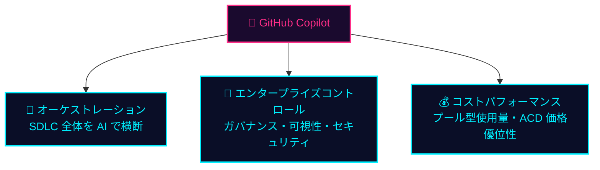
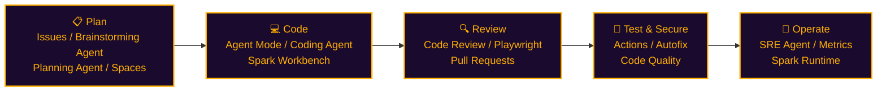
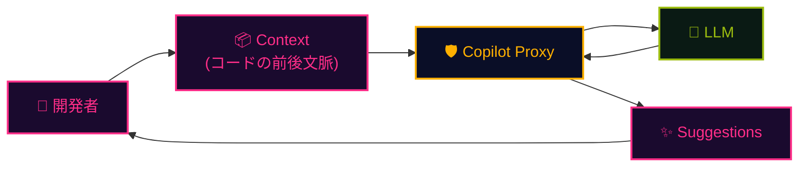

## 一言で

**GitHub Copilot は世界で最もご活用いただいている AI 開発ツール。** コード補完にとどまらず、**Productivity・Satisfaction・Activity・Efficiency** ── 開発者体験の全方位を底上げする。

> 💡 **アナロジー**：単なる "コード補完" ではなく、開発チーム全員に **専属の AI ペアプロ相手** を配るプラットフォーム。

## 開発者へのインパクト

Accenture 社の開発者 **450 名** を対象にした **6 か月間** の調査結果。Copilot がもたらす効果は数値で証明されている。

  

96%

初日から成功を実感

  

90%

仕事への満足度が向上

  

94%

フロー状態を維持

  

90%

情報探索の時間が減少

  

50%

ビルド数が増加

  

84%

ビルド成功率が向上

  

88%

提案コードの採用率

  

90%

より良いコードを書けたと実感

> ⚔️ **JRPG 風に言うと**：装備するだけでステータスが全方位に上がる **伝説のアクセサリー**。

## なぜ企業は Copilot を選ぶのか

3 つの理由 ── **オーケストレーション・エンタープライズコントロール・コストパフォーマンス**。

- 🎼 **モデル・エージェント・サーフェス全体での選択の自由** ── ベンダーロックインなし
- 🏢 **一元化されたガバナンス**で、安心してエンタープライズ展開
- 💰 **プール型使用量** + 充実した組み込みエンタイトルメント

## SDLC 全体を AI で

GitHub の AI 開発者プラットフォームは、**Plan → Code → Review → Test → Operate** ── ソフトウェア開発のすべてのフェーズに AI を組み込む。

> 🔌 **MCP & Integrations**で外部ツールとも連携、**Policy & Governance** で全体を制御。

## チームでの活用イメージ

役割ごとに Copilot をどう使うか ── **準備・開発・レビュー・委任・自動化・学習**。

  

    

    

      
<svg viewBox="0 0 14 16" class="team-pixel" xmlns="http://www.w3.org/2000/svg" shape-rendering="crispEdges" aria-hidden="true"><path fill="#9bbc0f" d="M4 1h1v1h-1zM5 1h1v1h-1zM6 1h1v1h-1zM7 1h1v1h-1zM8 1h1v1h-1zM9 1h1v1h-1zM3 2h1v1h-1zM4 2h1v1h-1zM5 2h1v1h-1zM6 2h1v1h-1zM7 2h1v1h-1zM8 2h1v1h-1zM9 2h1v1h-1zM10 2h1v1h-1zM6 8h1v1h-1zM7 8h1v1h-1zM4 9h1v1h-1zM9 9h1v1h-1z"/><path fill="#bdd84a" d="M2 3h1v1h-1zM3 3h1v1h-1zM4 3h1v1h-1zM5 3h1v1h-1zM6 3h1v1h-1zM7 3h1v1h-1zM8 3h1v1h-1zM9 3h1v1h-1zM10 3h1v1h-1zM11 3h1v1h-1z"/><path fill="#f4c2a1" d="M3 4h1v1h-1zM4 4h1v1h-1zM5 4h1v1h-1zM6 4h1v1h-1zM7 4h1v1h-1zM8 4h1v1h-1zM9 4h1v1h-1zM10 4h1v1h-1zM3 5h1v1h-1zM10 5h1v1h-1zM3 6h1v1h-1zM11 6h1v1h-1zM4 7h1v1h-1zM5 7h1v1h-1zM6 7h1v1h-1zM7 7h1v1h-1zM8 7h1v1h-1zM9 7h1v1h-1z"/><path fill="#000" d="M4 5h1v1h-1zM8 5h1v1h-1z"/><path fill="#c89171" d="M5 5h1v1h-1zM6 5h1v1h-1zM7 5h1v1h-1zM9 5h1v1h-1zM4 6h1v1h-1zM5 6h1v1h-1zM6 6h1v1h-1zM7 6h1v1h-1zM8 6h1v1h-1zM9 6h1v1h-1zM10 6h1v1h-1z"/><path fill="#7a9c0c" d="M3 8h1v1h-1zM4 8h1v1h-1zM5 8h1v1h-1zM8 8h1v1h-1zM9 8h1v1h-1zM10 8h1v1h-1zM2 9h1v1h-1zM3 9h1v1h-1zM5 9h1v1h-1zM6 9h1v1h-1zM7 9h1v1h-1zM8 9h1v1h-1zM10 9h1v1h-1zM11 9h1v1h-1zM2 10h1v1h-1zM3 10h1v1h-1zM4 10h1v1h-1zM5 10h1v1h-1zM6 10h1v1h-1zM7 10h1v1h-1zM8 10h1v1h-1zM9 10h1v1h-1zM10 10h1v1h-1zM11 10h1v1h-1zM2 11h1v1h-1zM3 11h1v1h-1zM4 11h1v1h-1zM5 11h1v1h-1zM6 11h1v1h-1zM7 11h1v1h-1zM8 11h1v1h-1zM9 11h1v1h-1zM10 11h1v1h-1zM11 11h1v1h-1zM3 12h1v1h-1zM4 12h1v1h-1zM5 12h1v1h-1zM6 12h1v1h-1zM7 12h1v1h-1zM8 12h1v1h-1zM9 12h1v1h-1zM10 12h1v1h-1z"/><path fill="#1a0b2e" d="M3 13h1v1h-1zM4 13h1v1h-1zM9 13h1v1h-1zM10 13h1v1h-1zM3 14h1v1h-1zM4 14h1v1h-1zM9 14h1v1h-1zM10 14h1v1h-1zM2 15h1v1h-1zM3 15h1v1h-1zM4 15h1v1h-1zM5 15h1v1h-1zM8 15h1v1h-1zM9 15h1v1h-1zM10 15h1v1h-1zM11 15h1v1h-1z"/></svg>

      準備
    

    <h3 class="team-name">チームマネージャー</h3>
    
リポジトリの<strong>MCP</strong>サーバー、<strong>Instruction</strong>ファイル、<strong>スキルズ</strong>、および自動<strong>CodeQL</strong>レビューを設定します。

  

  
<svg viewBox="0 0 16 10" class="team-arrow-svg" xmlns="http://www.w3.org/2000/svg" shape-rendering="crispEdges" aria-hidden="true"><path fill="#9bbc0f" d="M0 4h2v2H0zM2 4h2v2H2zM4 4h2v2H4zM6 4h2v2H6zM8 4h2v2H8zM8 2h2v2H8zM10 2h2v2H10zM10 4h2v2H10zM10 6h2v2H10zM8 6h2v2H8zM12 4h2v2H12z"/></svg>

  

    

    

      
<svg viewBox="0 0 14 16" class="team-pixel" xmlns="http://www.w3.org/2000/svg" shape-rendering="crispEdges" aria-hidden="true"><path fill="#ff2e88" d="M4 1h1v1h-1zM5 1h1v1h-1zM6 1h1v1h-1zM7 1h1v1h-1zM8 1h1v1h-1zM9 1h1v1h-1zM3 2h1v1h-1zM4 2h1v1h-1zM9 2h1v1h-1zM10 2h1v1h-1zM3 3h1v1h-1zM4 3h1v1h-1zM5 3h1v1h-1zM6 3h1v1h-1zM7 3h1v1h-1zM8 3h1v1h-1zM9 3h1v1h-1zM10 3h1v1h-1zM6 8h1v1h-1zM7 8h1v1h-1zM4 10h1v1h-1zM9 10h1v1h-1z"/><path fill="#ff6bb0" d="M5 2h1v1h-1zM6 2h1v1h-1zM7 2h1v1h-1zM8 2h1v1h-1zM11 3h1v1h-1z"/><path fill="#f4c2a1" d="M3 4h1v1h-1zM4 4h1v1h-1zM5 4h1v1h-1zM6 4h1v1h-1zM7 4h1v1h-1zM8 4h1v1h-1zM9 4h1v1h-1zM10 4h1v1h-1zM3 5h1v1h-1zM10 5h1v1h-1zM3 6h1v1h-1zM11 6h1v1h-1zM4 7h1v1h-1zM5 7h1v1h-1zM6 7h1v1h-1zM7 7h1v1h-1zM8 7h1v1h-1zM9 7h1v1h-1z"/><path fill="#000" d="M4 5h1v1h-1zM8 5h1v1h-1z"/><path fill="#c89171" d="M5 5h1v1h-1zM6 5h1v1h-1zM7 5h1v1h-1zM9 5h1v1h-1zM4 6h1v1h-1zM5 6h1v1h-1zM6 6h1v1h-1zM7 6h1v1h-1zM8 6h1v1h-1zM9 6h1v1h-1zM10 6h1v1h-1z"/><path fill="#c01968" d="M3 8h1v1h-1zM4 8h1v1h-1zM5 8h1v1h-1zM8 8h1v1h-1zM9 8h1v1h-1zM10 8h1v1h-1zM2 9h1v1h-1zM3 9h1v1h-1zM4 9h1v1h-1zM5 9h1v1h-1zM6 9h1v1h-1zM7 9h1v1h-1zM8 9h1v1h-1zM9 9h1v1h-1zM10 9h1v1h-1zM11 9h1v1h-1zM2 10h1v1h-1zM3 10h1v1h-1zM5 10h1v1h-1zM6 10h1v1h-1zM7 10h1v1h-1zM8 10h1v1h-1zM10 10h1v1h-1zM11 10h1v1h-1zM2 11h1v1h-1zM3 11h1v1h-1zM4 11h1v1h-1zM5 11h1v1h-1zM6 11h1v1h-1zM7 11h1v1h-1zM8 11h1v1h-1zM9 11h1v1h-1zM10 11h1v1h-1zM11 11h1v1h-1zM3 12h1v1h-1zM4 12h1v1h-1zM5 12h1v1h-1zM6 12h1v1h-1zM7 12h1v1h-1zM8 12h1v1h-1zM9 12h1v1h-1zM10 12h1v1h-1z"/><path fill="#1a0b2e" d="M3 13h1v1h-1zM4 13h1v1h-1zM9 13h1v1h-1zM10 13h1v1h-1zM3 14h1v1h-1zM4 14h1v1h-1zM9 14h1v1h-1zM10 14h1v1h-1zM2 15h1v1h-1zM3 15h1v1h-1zM4 15h1v1h-1zM5 15h1v1h-1zM8 15h1v1h-1zM9 15h1v1h-1zM10 15h1v1h-1zM11 15h1v1h-1z"/></svg>

      開発
    

    <h3 class="team-name">ジュニア開発者</h3>
    
<strong>Plan</strong>モードと<strong>Agent</strong>モードを使用してコーディング。プッシュ時にテストを自動実行する<strong>Actions</strong>を作成。別モデルによる<strong>Code Review</strong>を実施。

  

  
<svg viewBox="0 0 16 10" class="team-arrow-svg" xmlns="http://www.w3.org/2000/svg" shape-rendering="crispEdges" aria-hidden="true"><path fill="#ff2e88" d="M0 4h2v2H0zM2 4h2v2H2zM4 4h2v2H4zM6 4h2v2H6zM8 4h2v2H8zM8 2h2v2H8zM10 2h2v2H10zM10 4h2v2H10zM10 6h2v2H10zM8 6h2v2H8zM12 4h2v2H12z"/></svg>

  

    

    

      
<svg viewBox="0 0 14 16" class="team-pixel" xmlns="http://www.w3.org/2000/svg" shape-rendering="crispEdges" aria-hidden="true"><path fill="#a855f7" d="M4 1h1v1h-1zM5 1h1v1h-1zM6 1h1v1h-1zM7 1h1v1h-1zM8 1h1v1h-1zM9 1h1v1h-1zM3 2h1v1h-1zM4 2h1v1h-1zM5 2h1v1h-1zM6 2h1v1h-1zM7 2h1v1h-1zM8 2h1v1h-1zM9 2h1v1h-1zM10 2h1v1h-1zM3 3h1v1h-1zM10 3h1v1h-1zM6 8h1v1h-1zM7 8h1v1h-1zM4 10h1v1h-1zM9 10h1v1h-1z"/><path fill="#f4c2a1" d="M4 3h1v1h-1zM5 3h1v1h-1zM6 3h1v1h-1zM7 3h1v1h-1zM8 3h1v1h-1zM9 3h1v1h-1zM3 4h1v1h-1zM4 4h1v1h-1zM5 4h1v1h-1zM6 4h1v1h-1zM7 4h1v1h-1zM8 4h1v1h-1zM9 4h1v1h-1zM10 4h1v1h-1zM6 5h1v1h-1zM3 6h1v1h-1zM11 6h1v1h-1zM4 7h1v1h-1zM5 7h1v1h-1zM8 7h1v1h-1zM9 7h1v1h-1z"/><path fill="#d8b4fe" d="M3 5h1v1h-1zM4 5h1v1h-1zM7 5h1v1h-1zM9 5h1v1h-1zM10 5h1v1h-1z"/><path fill="#000" d="M5 5h1v1h-1zM8 5h1v1h-1z"/><path fill="#c89171" d="M4 6h1v1h-1zM5 6h1v1h-1zM6 6h1v1h-1zM7 6h1v1h-1zM8 6h1v1h-1zM9 6h1v1h-1zM10 6h1v1h-1zM6 7h1v1h-1zM7 7h1v1h-1z"/><path fill="#7e22ce" d="M3 8h1v1h-1zM4 8h1v1h-1zM5 8h1v1h-1zM8 8h1v1h-1zM9 8h1v1h-1zM10 8h1v1h-1zM2 9h1v1h-1zM3 9h1v1h-1zM4 9h1v1h-1zM5 9h1v1h-1zM6 9h1v1h-1zM7 9h1v1h-1zM8 9h1v1h-1zM9 9h1v1h-1zM10 9h1v1h-1zM11 9h1v1h-1zM2 10h1v1h-1zM3 10h1v1h-1zM5 10h1v1h-1zM6 10h1v1h-1zM7 10h1v1h-1zM8 10h1v1h-1zM10 10h1v1h-1zM11 10h1v1h-1zM2 11h1v1h-1zM3 11h1v1h-1zM4 11h1v1h-1zM5 11h1v1h-1zM6 11h1v1h-1zM7 11h1v1h-1zM8 11h1v1h-1zM9 11h1v1h-1zM10 11h1v1h-1zM11 11h1v1h-1zM3 12h1v1h-1zM4 12h1v1h-1zM5 12h1v1h-1zM6 12h1v1h-1zM7 12h1v1h-1zM8 12h1v1h-1zM9 12h1v1h-1zM10 12h1v1h-1z"/><path fill="#1a0b2e" d="M3 13h1v1h-1zM4 13h1v1h-1zM9 13h1v1h-1zM10 13h1v1h-1zM3 14h1v1h-1zM4 14h1v1h-1zM9 14h1v1h-1zM10 14h1v1h-1zM2 15h1v1h-1zM3 15h1v1h-1zM4 15h1v1h-1zM5 15h1v1h-1zM8 15h1v1h-1zM9 15h1v1h-1zM10 15h1v1h-1zM11 15h1v1h-1z"/></svg>

      レビュー
    

    <h3 class="team-name">シニア開発者</h3>
    
Copilotが自動的に<strong>Code Review</strong>を行うことで、<strong>PR</strong>のコードレビュー時間を削減。最終レビューとメンタリングに集中。

  

  
<svg viewBox="0 0 10 16" class="team-arrow-svg team-arrow-svg--v" xmlns="http://www.w3.org/2000/svg" shape-rendering="crispEdges" aria-hidden="true"><path fill="#a855f7" d="M4 0h2v2H4zM4 2h2v2H4zM4 4h2v2H4zM4 6h2v2H4zM4 8h2v2H4zM2 8h2v2H2zM2 10h2v2H2zM4 10h2v2H4zM6 10h2v2H6zM6 8h2v2H6zM4 12h2v2H4z"/></svg>

  

    

    

      
<svg viewBox="0 0 14 16" class="team-pixel" xmlns="http://www.w3.org/2000/svg" shape-rendering="crispEdges" aria-hidden="true"><path fill="#5b8def" d="M2 1h1v1h-1zM3 1h1v1h-1zM4 1h1v1h-1zM5 1h1v1h-1zM6 1h1v1h-1zM7 1h1v1h-1zM8 1h1v1h-1zM9 1h1v1h-1zM10 1h1v1h-1zM11 1h1v1h-1zM1 2h1v1h-1zM2 2h1v1h-1zM3 2h1v1h-1zM4 2h1v1h-1zM5 2h1v1h-1zM6 2h1v1h-1zM7 2h1v1h-1zM8 2h1v1h-1zM9 2h1v1h-1zM10 2h1v1h-1zM11 2h1v1h-1zM12 2h1v1h-1zM2 3h1v1h-1zM3 3h1v1h-1zM4 3h1v1h-1zM5 3h1v1h-1zM6 3h1v1h-1zM7 3h1v1h-1zM8 3h1v1h-1zM9 3h1v1h-1zM10 3h1v1h-1zM11 3h1v1h-1zM4 4h1v1h-1zM9 4h1v1h-1zM6 8h1v1h-1zM7 8h1v1h-1zM4 10h1v1h-1zM9 10h1v1h-1z"/><path fill="#a3c1ff" d="M5 4h1v1h-1zM6 4h1v1h-1zM7 4h1v1h-1zM8 4h1v1h-1z"/><path fill="#f4c2a1" d="M3 5h1v1h-1zM4 5h1v1h-1zM5 5h1v1h-1zM6 5h1v1h-1zM7 5h1v1h-1zM8 5h1v1h-1zM9 5h1v1h-1zM10 5h1v1h-1zM3 6h1v1h-1zM10 6h1v1h-1zM4 7h1v1h-1zM5 7h1v1h-1zM6 7h1v1h-1zM7 7h1v1h-1zM8 7h1v1h-1zM9 7h1v1h-1z"/><path fill="#000" d="M4 6h1v1h-1zM8 6h1v1h-1z"/><path fill="#c89171" d="M5 6h1v1h-1zM6 6h1v1h-1zM7 6h1v1h-1zM9 6h1v1h-1z"/><path fill="#2c5fc7" d="M3 8h1v1h-1zM4 8h1v1h-1zM5 8h1v1h-1zM8 8h1v1h-1zM9 8h1v1h-1zM10 8h1v1h-1zM2 9h1v1h-1zM3 9h1v1h-1zM4 9h1v1h-1zM5 9h1v1h-1zM6 9h1v1h-1zM7 9h1v1h-1zM8 9h1v1h-1zM9 9h1v1h-1zM10 9h1v1h-1zM11 9h1v1h-1zM2 10h1v1h-1zM3 10h1v1h-1zM5 10h1v1h-1zM6 10h1v1h-1zM7 10h1v1h-1zM8 10h1v1h-1zM10 10h1v1h-1zM11 10h1v1h-1zM2 11h1v1h-1zM3 11h1v1h-1zM4 11h1v1h-1zM5 11h1v1h-1zM6 11h1v1h-1zM7 11h1v1h-1zM8 11h1v1h-1zM9 11h1v1h-1zM10 11h1v1h-1zM11 11h1v1h-1zM3 12h1v1h-1zM4 12h1v1h-1zM5 12h1v1h-1zM6 12h1v1h-1zM7 12h1v1h-1zM8 12h1v1h-1zM9 12h1v1h-1zM10 12h1v1h-1z"/><path fill="#1a0b2e" d="M3 13h1v1h-1zM4 13h1v1h-1zM9 13h1v1h-1zM10 13h1v1h-1zM3 14h1v1h-1zM4 14h1v1h-1zM9 14h1v1h-1zM10 14h1v1h-1zM2 15h1v1h-1zM3 15h1v1h-1zM4 15h1v1h-1zM5 15h1v1h-1zM8 15h1v1h-1zM9 15h1v1h-1zM10 15h1v1h-1zM11 15h1v1h-1z"/></svg>

      学習
    

    <h3 class="team-name">チーム全体</h3>
    
<strong>Copilot Memory</strong>はチームメンバー間で共有され、知識が蓄積される。<strong>Copilot Metrics</strong>でAIの利用状況を可視化し、チーム全体の活用促進につなげる。

  

  
<svg viewBox="0 0 16 10" class="team-arrow-svg" xmlns="http://www.w3.org/2000/svg" shape-rendering="crispEdges" aria-hidden="true"><path fill="#a855f7" d="M14 4h2v2H14zM12 4h2v2H12zM10 4h2v2H10zM8 4h2v2H8zM6 4h2v2H6zM6 2h2v2H6zM4 2h2v2H4zM4 4h2v2H4zM4 6h2v2H4zM6 6h2v2H6zM2 4h2v2H2z"/></svg>

  

    

    

      
<svg viewBox="0 0 14 16" class="team-pixel" xmlns="http://www.w3.org/2000/svg" shape-rendering="crispEdges" aria-hidden="true"><path fill="#e8f4ff" d="M7 0h1v1h-1zM5 4h1v1h-1zM8 4h1v1h-1z"/><path fill="#00f0ff" d="M7 1h1v1h-1zM3 2h1v1h-1zM4 2h1v1h-1zM5 2h1v1h-1zM6 2h1v1h-1zM7 2h1v1h-1zM8 2h1v1h-1zM9 2h1v1h-1zM10 2h1v1h-1zM3 3h1v1h-1zM10 3h1v1h-1zM3 4h1v1h-1zM10 4h1v1h-1zM3 5h1v1h-1zM10 5h1v1h-1zM3 6h1v1h-1zM10 6h1v1h-1zM4 7h1v1h-1zM5 7h1v1h-1zM6 7h1v1h-1zM7 7h1v1h-1zM8 7h1v1h-1zM9 7h1v1h-1zM6 8h1v1h-1zM7 8h1v1h-1zM4 10h1v1h-1zM9 10h1v1h-1z"/><path fill="#7bf5ff" d="M4 3h1v1h-1zM5 3h1v1h-1zM6 3h1v1h-1zM7 3h1v1h-1zM8 3h1v1h-1zM9 3h1v1h-1zM4 4h1v1h-1zM6 4h1v1h-1zM7 4h1v1h-1zM9 4h1v1h-1zM4 5h1v1h-1zM6 5h1v1h-1zM7 5h1v1h-1zM9 5h1v1h-1zM4 6h1v1h-1zM5 6h1v1h-1zM6 6h1v1h-1zM7 6h1v1h-1zM8 6h1v1h-1zM9 6h1v1h-1z"/><path fill="#000" d="M5 5h1v1h-1zM8 5h1v1h-1z"/><path fill="#0099b8" d="M3 8h1v1h-1zM4 8h1v1h-1zM5 8h1v1h-1zM8 8h1v1h-1zM9 8h1v1h-1zM10 8h1v1h-1zM2 9h1v1h-1zM3 9h1v1h-1zM4 9h1v1h-1zM5 9h1v1h-1zM6 9h1v1h-1zM7 9h1v1h-1zM8 9h1v1h-1zM9 9h1v1h-1zM10 9h1v1h-1zM11 9h1v1h-1zM2 10h1v1h-1zM3 10h1v1h-1zM5 10h1v1h-1zM6 10h1v1h-1zM7 10h1v1h-1zM8 10h1v1h-1zM10 10h1v1h-1zM11 10h1v1h-1zM2 11h1v1h-1zM3 11h1v1h-1zM4 11h1v1h-1zM5 11h1v1h-1zM6 11h1v1h-1zM7 11h1v1h-1zM8 11h1v1h-1zM9 11h1v1h-1zM10 11h1v1h-1zM11 11h1v1h-1zM3 12h1v1h-1zM4 12h1v1h-1zM5 12h1v1h-1zM6 12h1v1h-1zM7 12h1v1h-1zM8 12h1v1h-1zM9 12h1v1h-1zM10 12h1v1h-1z"/><path fill="#1a0b2e" d="M3 13h1v1h-1zM4 13h1v1h-1zM9 13h1v1h-1zM10 13h1v1h-1zM3 14h1v1h-1zM4 14h1v1h-1zM9 14h1v1h-1zM10 14h1v1h-1zM2 15h1v1h-1zM3 15h1v1h-1zM4 15h1v1h-1zM5 15h1v1h-1zM8 15h1v1h-1zM9 15h1v1h-1zM10 15h1v1h-1zM11 15h1v1h-1z"/></svg>

      自動化
    

    <h3 class="team-name">チームマネージャー</h3>
    
<strong>Agentic Workflow</strong>を活用し、Issueの要約、パフォーマンス追跡、<strong>Wiki</strong>更新、<strong>Release Note</strong>自動生成、テストカバレッジの最大化を自動で実行。

  

  
<svg viewBox="0 0 16 10" class="team-arrow-svg" xmlns="http://www.w3.org/2000/svg" shape-rendering="crispEdges" aria-hidden="true"><path fill="#a855f7" d="M14 4h2v2H14zM12 4h2v2H12zM10 4h2v2H10zM8 4h2v2H8zM6 4h2v2H6zM6 2h2v2H6zM4 2h2v2H4zM4 4h2v2H4zM4 6h2v2H4zM6 6h2v2H6zM2 4h2v2H2z"/></svg>

  

    

    

      
<svg viewBox="0 0 14 16" class="team-pixel" xmlns="http://www.w3.org/2000/svg" shape-rendering="crispEdges" aria-hidden="true"><path fill="#ffb000" d="M7 0h1v1h-1zM6 1h1v1h-1zM7 1h1v1h-1zM8 1h1v1h-1zM5 2h1v1h-1zM6 2h1v1h-1zM7 2h1v1h-1zM8 2h1v1h-1zM9 2h1v1h-1zM4 3h1v1h-1zM5 3h1v1h-1zM9 3h1v1h-1zM10 3h1v1h-1zM3 4h1v1h-1zM4 4h1v1h-1zM5 4h1v1h-1zM6 4h1v1h-1zM7 4h1v1h-1zM8 4h1v1h-1zM9 4h1v1h-1zM10 4h1v1h-1zM11 4h1v1h-1zM6 8h1v1h-1zM7 8h1v1h-1zM4 10h1v1h-1zM9 10h1v1h-1z"/><path fill="#ffd060" d="M6 3h1v1h-1zM7 3h1v1h-1zM8 3h1v1h-1z"/><path fill="#f4c2a1" d="M3 5h1v1h-1zM4 5h1v1h-1zM5 5h1v1h-1zM6 5h1v1h-1zM7 5h1v1h-1zM8 5h1v1h-1zM9 5h1v1h-1zM10 5h1v1h-1zM3 6h1v1h-1zM10 6h1v1h-1zM4 7h1v1h-1zM5 7h1v1h-1zM6 7h1v1h-1zM7 7h1v1h-1zM8 7h1v1h-1zM9 7h1v1h-1z"/><path fill="#000" d="M4 6h1v1h-1zM8 6h1v1h-1z"/><path fill="#c89171" d="M5 6h1v1h-1zM6 6h1v1h-1zM7 6h1v1h-1zM9 6h1v1h-1z"/><path fill="#c87a00" d="M3 8h1v1h-1zM4 8h1v1h-1zM5 8h1v1h-1zM8 8h1v1h-1zM9 8h1v1h-1zM10 8h1v1h-1zM2 9h1v1h-1zM3 9h1v1h-1zM4 9h1v1h-1zM5 9h1v1h-1zM6 9h1v1h-1zM7 9h1v1h-1zM8 9h1v1h-1zM9 9h1v1h-1zM10 9h1v1h-1zM11 9h1v1h-1zM2 10h1v1h-1zM3 10h1v1h-1zM5 10h1v1h-1zM6 10h1v1h-1zM7 10h1v1h-1zM8 10h1v1h-1zM10 10h1v1h-1zM11 10h1v1h-1zM2 11h1v1h-1zM3 11h1v1h-1zM4 11h1v1h-1zM5 11h1v1h-1zM6 11h1v1h-1zM7 11h1v1h-1zM8 11h1v1h-1zM9 11h1v1h-1zM10 11h1v1h-1zM11 11h1v1h-1zM3 12h1v1h-1zM4 12h1v1h-1zM5 12h1v1h-1zM6 12h1v1h-1zM7 12h1v1h-1zM8 12h1v1h-1zM9 12h1v1h-1zM10 12h1v1h-1z"/><path fill="#1a0b2e" d="M3 13h1v1h-1zM4 13h1v1h-1zM9 13h1v1h-1zM10 13h1v1h-1zM3 14h1v1h-1zM4 14h1v1h-1zM9 14h1v1h-1zM10 14h1v1h-1zM2 15h1v1h-1zM3 15h1v1h-1zM4 15h1v1h-1zM5 15h1v1h-1zM8 15h1v1h-1zM9 15h1v1h-1zM10 15h1v1h-1zM11 15h1v1h-1z"/></svg>

      委任
    

    <h3 class="team-name">シニア開発者</h3>
    
退社前に<strong>Cloud Agent</strong>を起動し、<strong>Issue</strong>に基づいてコードの改善や修正を夜間で進めさせる。翌朝出社すると、洗練されたPRが準備されている。

  

> 💡 **ポイント**：Copilot は個人ツールではなく **チームの基盤**。役割ごとに最適化された使い方が定着すると、開発組織全体のスループットが変わる。

## セキュアでコンプライアントなアーキテクチャ

入力されたコードは **Copilot Proxy** を経由し、安心してエンタープライズで使える設計。

**Copilot Proxy で行われる処理：**

- 🔒 **PII（個人識別情報）の除去**
- 🚫 **不適切な表現のフィルタリング**
- 🛡️ **一般的なセキュリティ脆弱性のチェック**
- 🔐 **すべてのデータは転送中に暗号化**
- ⚖️ **IP（知的財産）フィルター** で生成提案をチェック

> 🔗 詳細は [Copilot Trust Center](https://resources.github.com/ja/copilot-trust-center/) を参照。
