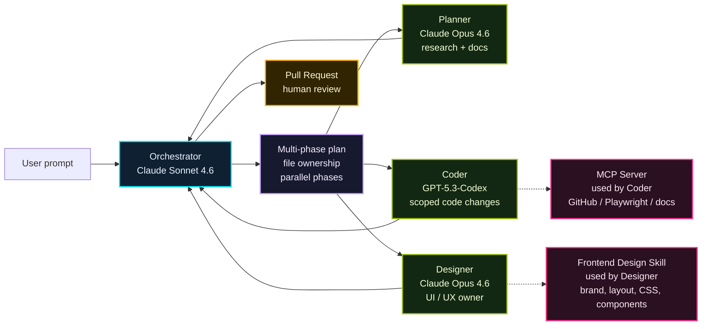

## 一言で

  

    <strong>Harness Engineering</strong> は、AI から最高の結果を引き出すための足場設計。
  

  

    ただ制限するだけではなく、目的・文脈・役割・検証方法を整えて、AI が迷わず安全に成果へ向かえる状態を作る。
  

## 何でハーネスする？

AI を強くする道具は 1 つではない。**広く効かせるもの** と **必要な時だけ使うもの** を分ける。

| 道具 | いつ使う？ | ハーネスとしての役割 |
| --- | --- | --- |
| Instructions | 全員・全タスクに効く常識を渡す | コーディング規約、禁止事項、回答スタイル |
| Path Instructions | 特定ファイルだけルールを変える | `tests/**` はテスト方針、`api/**` は認証ルール |
| Skills | 必要な時だけ専門手順を読み込む | PR description、frontend design、security questionnaire |
| Custom Agents | 役割・モデル・権限を切り替える | Planner は読むだけ、Coder は編集可、Reviewer は修正しない |
| MCP | 外部システムや社内データにつなぐ | GitHub、Figma、Playwright、Jira、Salesforce |
| Tool permissions | できる操作を制限する | `read/search` のみ、`edit` 可、GitHub API 可 |
| Verification loop | 出力を信用せず確認する | build、test、lint、preview、人間レビュー |

> 判断基準：**常に効かせるなら Instructions、専門手順なら Skills、人格と権限を変えるなら Custom Agent、外部につなぐなら MCP**。

## エコシステム対応表

同じ「AI の足場」でも、置き場所やファイル名はエコシステムごとに少し違う。

| レイヤー | GitHub / Copilot | Open ecosystem |
| --- | --- | --- |
| 全体指示 | `.github/copilot-instructions.md` | `AGENTS.md` |
| パス別ルール | `.github/instructions/*.instructions.md` | nested `AGENTS.md` |
| Skills（project） | `.github/skills/*/SKILL.md` | `.agents/skills/*/SKILL.md` |
| Skills（personal） | `~/.copilot/skills/` | `~/.agents/skills/` |
| Custom agents | Copilot custom agents | agent definitions / plugins |
| MCP / tools | `mcp.config` | `mcp.config` |

> 迷ったら、まずは利用する agent host が読む場所に合わせる。チーム共有なら repository 配下、個人用なら home 配下。

## よく使う型

良い harness はツールの寄せ集めではなく、**AI が失敗しにくい進め方** を先に決める。

| 型 | 何をする？ | 効く場面 |
| --- | --- | --- |
| Spec to Code | 仕様・非要件・成功条件を先に固定してから実装する | ゴールが曖昧な機能、品質基準が重要な変更 |
| Multi-phase Plan | 調査 → 設計 → 実装 → 検証の段階に分ける | 大きい変更、複数ファイル、レビューしながら進めたい時 |
| File Ownership | agent ごとに触るファイルを分ける | 並列実行、コンフリクト回避、責務分離 |
| Human-in-the-loop | 重要な判断点だけ人間が承認する | 破壊的変更、セキュリティ、リリース判断 |

> 先に「どう進めるか」を設計すると、AI は速くなるだけでなく、やり直しも減る。

## 例：Ultralight

[Ultralight](https://burkeholland.github.io/ultralight/) は Microsoft の Developer Advocate、Burke Holland さんの multi-agent orchestration 例。  
phased execution plan を作り、ファイルの重なりを検出し、Planner / Coder / Designer に並列で仕事を渡す harness になっている。

> AI を信頼するな。**役割・モデル・ツール・スキル・MCP・検証ループ** で囲った harness を信頼せよ。
