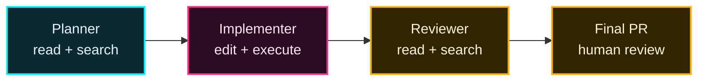

馬は素晴らしい。だが鞍と手綱がなければ乗りこなせない。エージェントも同じ——**ハーネス**がエージェントの "鞍と手綱" だ。

**ハーネスに含まれるもの:**
- ツールセット（読み・書き・実行・検索の境界）
- 制約（書き込み禁止パス、コマンド許可リスト）
- ループ（plan → act → observe → reflect）
- 検証（型・テスト・lint・人間レビュー）
- 観測（ログ、コスト、レイテンシ）
- ロールバック（git, snapshots）

## エコシステム対応表

同じ「AI の足場」でも、置き場所やファイル名はエコシステムごとに少し違う。

| レイヤー | GitHub / Copilot | Open ecosystem |
| --- | --- | --- |
| 全体指示 | `.github/copilot-instructions.md` | `AGENTS.md` |
| パス別ルール | `.github/instructions/*.instructions.md` | nested `AGENTS.md` |
| Skills（project） | `.github/skills/*/SKILL.md` | `.agents/skills/*/SKILL.md` |
| Skills（personal） | `~/.copilot/skills/` | `~/.agents/skills/` |
| Custom agents | Copilot custom agents | agent definitions / plugins |
| MCP / tools | `mcp.config` | `mcp.config` |

> 迷ったら、まずは利用する agent host が読む場所に合わせる。チーム共有なら repository 配下、個人用なら home 配下。

## いつ使う？

| 使いたいもの | 向いているケース | 例 |
| --- | --- | --- |
| Instructions | 全員・全タスクに効く常識 | 「この repo は pnpm を使う」 |
| Skills | 必要な時だけ読み込む専門手順 | 「PR description を生成する」 |
| Custom Agent | 役割と権限を切り替えたい | 「編集禁止の Planner」「security 専用 reviewer」 |

> 判断基準：**人格・ツール制限・モデル・MCP をまとめて変えたいなら Custom Agent**。

## Tools は権限設計

Custom Agent の強みは「何をできるか」を役割ごとに変えられること。

| Agent | Tools | 意図 |
| --- | --- | --- |
| Planner | `read`, `search` | 調査と計画だけ。コードを書かない |
| Implementer | `read`, `search`, `edit`, `execute` | 実装・修正・検証まで行う |
| Reviewer | `read`, `search` | 変更を読む。勝手に直さない |
| Release Bot | `read`, `github/*` | PR / issue / release 情報を扱う |

> 権限は少ないほど安全。最初は絞り、必要になったら増やす。

## Handoff / Orchestration

Custom Agent は単体でも使えるが、複数をつなぐと「小さな AI チーム」になる。

| フェーズ | Agent | 成功条件 |
| --- | --- | --- |
| Plan | Planner | 実装方針・リスク・検証方法が明確 |
| Build | Implementer | 計画どおりに変更し、検証まで実施 |
| Review | Reviewer | バグ・セキュリティ・仕様漏れを指摘 |
| Ship | Human | 最終判断とマージ |

> AI を信頼するな、harness を信頼せよ。
