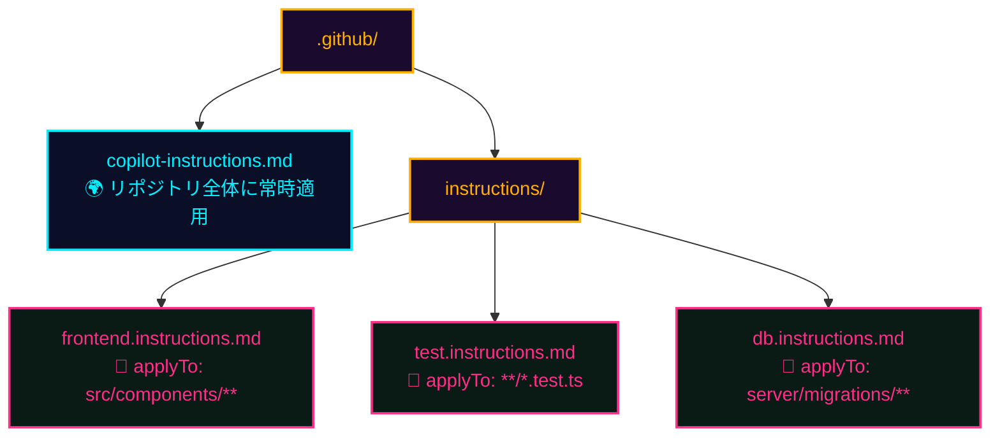

## 一言で

毎回同じ前置きを書きたくない ── そういう **"常識"** はリポジトリの **instruction ファイル** に書いておく。Copilot はコード生成・編集のたびに自動でそれを読み込む。

> 💡 **アナロジー**：instruction は **"AIに毎日言いたい一言" のスクリプト化**。チーム全員の Copilot が同じ社是で動く。

## グローバルなルール

`.github/copilot-instructions.md` は **リポジトリのルート** に置く指示ファイル。Copilot がこのリポジトリでコードを **生成・編集する全ての場面** で、常に参照される **グローバルなルールブック** になる。

**よく書く内容：**

- コーディングスタイル・命名規則・フォーマット要件
- レビュー基準・PR の粒度
- 使うライブラリ / 使わないライブラリの方針
- ドメイン用語（チーム独自の名詞）
- やってほしくないこと（無断で依存を増やさない・本番 DB を触らない…）

## ファイル単位のルール

`.github/instructions/NAME.instructions.md` は **特定のファイルやフォルダにのみ適用** されるカスタム指示ファイル。

```yaml
---
applyTo: "server/tests/test_*.py"
---

このファイルは pytest の関数型テスト。
- fixture は `conftest.py` から読む
- assert は 1 関数に 1 つまで
- LLM call は必ず mock すること
```

ファイル冒頭の **`applyTo` フロントマター** で対象パターンを指定。Copilot がそのパターンにマッチするファイルを操作する時 **だけ** 読み込まれる。

**例：** テスト専用ルール / フロントエンド専用ガイドライン / DB マイグレーション用の安全規約 ── グローバルでは細かすぎるルールはここへ。

## 構成（ファイル配置）



## 2 つの違い — まとめ

<div class="setup-cards">
  <div class="setup-card">
    <div class="setup-card-head">
      <code>copilot-instructions.md</code>
      <span class="setup-card-tag tag-cyan">🌍 グローバル</span>
    </div>
    <p><strong>適用範囲</strong>：リポジトリ全体<br /><strong>読込</strong>：常に有効<br /><strong>用途</strong>：スタイル・命名規則・レビュー基準・チーム全体の規約</p>
  </div>
  <div class="setup-card">
    <div class="setup-card-head">
      <code>NAME.instructions.md</code>
      <span class="setup-card-tag tag-magenta">🎯 ファイル単位</span>
    </div>
    <p><strong>適用範囲</strong>：<code>applyTo</code> パターンに一致するファイルのみ<br /><strong>読込</strong>：対象を操作する時だけ<br /><strong>用途</strong>：テスト・特定言語・DB など局所ルール</p>
  </div>
</div>

> 🇯🇵 **日本語で書きたい人へ**：そのまま日本語で書いて OK。Copilot は instruction を入力言語に関係なく解釈する。チームが日本語で考えているなら、日本語で書いた方が **意図が崩れない**。

## Org レベルの instruction（先取り）

GitHub Enterprise では **organization 全体** に適用する instruction を設定できる。会社全体のセキュリティ規約・コンプライアンス要件・共通の禁止事項を全リポジトリに自動適用 ── "AI への社是" を組織レベルで一元管理する未来が来ている。
