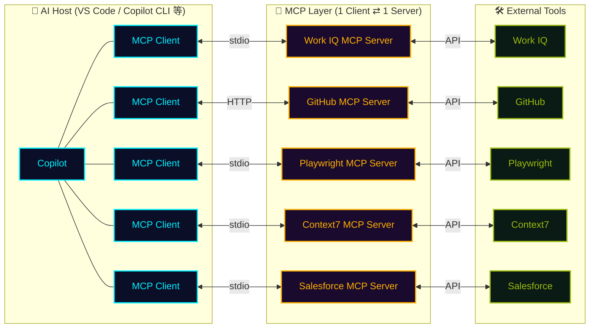

## 一言で

<div class="hero-quote">

MCP は「Model Context Protocol」の略称で、AI モデルに対して追加の文脈や機能を提供するプロトコルである。

</div>

## 仕組み



**AI Host** (VS Code、Copilot CLI など) は内部に **複数の MCP Client** を持ち、**1 Client ⇄ 1 Server** の 1:1 接続を維持する。利用したい外部ツールごとに Client / Server のペアが追加される。プロトコルが固定なので、新しい Server を追加するだけで全エディタ・全エージェントが新しい能力を獲得する。

## なぜ重要?

MCP がもたらす 3 つの価値：

- **🧩 機能拡張**：Copilot を **一つの起点** にして、あらゆる外部ツールを操作できる。
  - 要件を読み書きする (**Jira**)
  - デザインを作る (**Figma**)
  - 3D デザインを生成して印刷する (**Blender** + 3D プリンター)
  - メール・カレンダーを確認・編集する (**Work IQ**)
  - 社内データベースに接続して分析する
- **🔗 ワークフローを統合**：個別ツールを繋ぐカスタム実装が不要になり、Copilot が **複数システムを横断するハブ** として機能する。
- **🌐 広いエコシステム対応**：MCP は **オープンなプロトコル** で、すでに **事実上の標準** になりつつあります。AI アシスタント、**Visual Studio** などの開発ツール、その他多くのアプリケーションが MCP をサポートしており、**一度作れば、どこでも繋がる**。コーディング統合との相性も抜群。

## どこで動く?

<div class="split-image">
  <div class="split-text">

MCP サーバーの実行場所は **2 種類** あります。

1. **stdio 方式** では、VS Code が **ローカルマシン上で子プロセス** として MCP サーバーを起動します。
2. **HTTP 方式（SSE / streamable-http）** では、MCP サーバーが **クラウドやリモートサーバー上で稼働** し、VS Code は **クライアントとして接続するだけ** です。

用途やセキュリティ要件に応じて使い分けが可能です。

  </div>
  <div class="split-figure">
    
    <figcaption>Activity Monitor で見ると、ローカル MCP サーバーが <code>npm exec</code> の <strong>子プロセス</strong> として動いているのが分かる</figcaption>
  </div>
</div>

## VS Code での設定

VS Code の **Marketplace から MCP サーバーをインストール** する時、2 つのスコープを選べる：

- **`Install`** → **個人設定** ファイル（User Settings）に追加
- **`Install Workspace`** → **リポジトリ設定** ファイル（`.vscode/mcp.json`）に追加

<div class="setup-cards">
  <div class="setup-card">
    <div class="setup-card-head">
      <code>.vscode/mcp.json</code>
      <span class="setup-card-tag tag-cyan">▸ リポジトリ共有</span>
    </div>
    <p>Git に含まれるので、<strong>チーム全員</strong> で MCP を揃えられる。メンバーが repo を clone すると VS Code が <strong>「有効化しますか？」</strong> と確認してくる。</p>
  </div>
  <div class="setup-card">
    <div class="setup-card-head">
      <code>User Settings</code>
      <span class="setup-card-tag tag-magenta">▸ 自分の PC のみ</span>
    </div>
    <p><strong>個人用</strong> / 全プロジェクト共通で使いたい時。Git には含まれない。</p>
    <ul class="setup-card-paths">
      <li>📁 <strong>Mac</strong>：<code>~/.config/Code/User/settings.json</code></li>
      <li>🪟 <strong>Windows</strong>：<code>%APPDATA%\Code\User\settings.json</code></li>
    </ul>
  </div>
</div>

## Copilot CLI で始める

```bash
# MCP server を追加
copilot mcp add <server-name>

# 既存サーバ一覧
copilot mcp list
```

GitHub 公式 MCP server は最初から接続済み。`gh` コマンドを叩く感覚で、AI が Issues / PRs / Actions / Code search を操作できる。

`modelcontextprotocol/registry` には公式 + コミュニティ製の server が多数（filesystem / postgres / slack / puppeteer / playwright / Figma…）。
