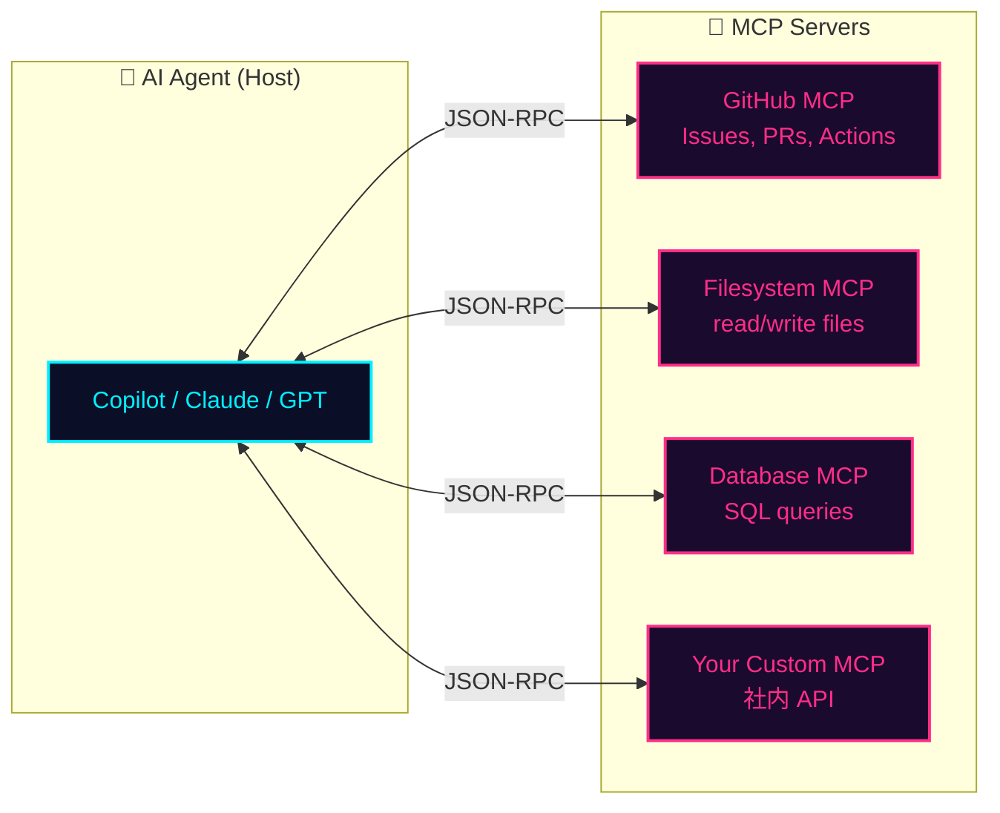

## 一言で

LLM はそのままでは **"閉じた箱"** だ。学習データの外側（君のファイル、DB、API、社内ツール）には触れない。**MCP** はその箱と外界をつなぐ **共通の口金** ── USB-C のように、どのモデルでもどのツールでも "差せば動く"。

> 💡 **アナロジー**：MCP は「AI 用の USB-C」。エージェントが host、ツールが device、プロトコルがケーブル規格。

## 仕組み



エージェントは **何のツールが使えるか** を MCP server に問い合わせ、必要なら呼び出す。プロトコルが固定なので、新しい server を足すだけで全エージェントが新しい能力を獲得する。

## なぜ重要?

- **ベンダーロックイン回避** — Claude でも Copilot でも GPT でも、同じ MCP server がそのまま刺さる
- **再利用** — 一度書いた MCP server がチームの全プロジェクト・全エージェントで使い回せる
- **安全な境界** — ツール呼び出しの入出力がプロトコルで明示され、レビュー・監査が可能
- **コンポーザブル** — 小さな server を組み合わせて複雑な能力を組み立てる（Unix 哲学）

## GitHub MCP Server

GitHub 公式の MCP server があり、AI から直接：

- Issues / PRs の検索・作成・コメント
- Actions の実行・ログ取得
- Code search（リポジトリ横断）
- Discussions / Releases / Notifications

を扱える。Copilot CLI は標準で接続済み ── `gh` コマンドが叩ける感覚で AI が GitHub を操作する。

## 始め方

```bash
# Copilot CLI に MCP server を追加
copilot mcp add <server-name>

# 既存サーバ一覧
copilot mcp list
```

`modelcontextprotocol/servers` リポジトリには公式 / コミュニティ製の server が多数 ── filesystem, postgres, slack, puppeteer, etc.
