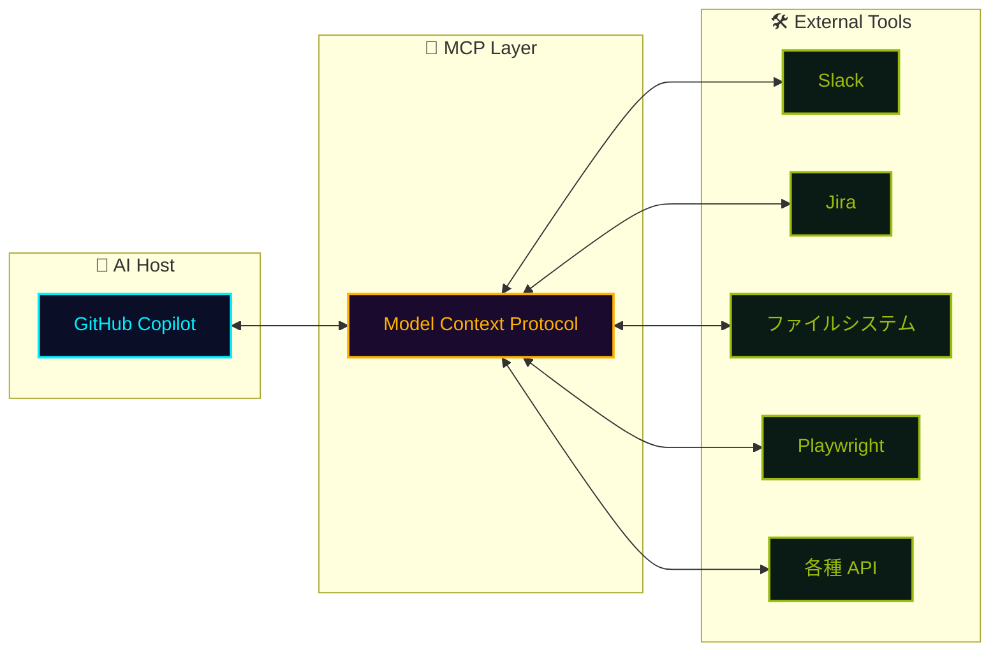
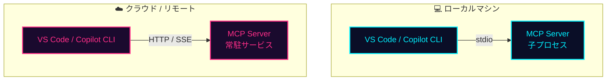

## 一言で

**MCP** は **Model Context Protocol** の略 ── AI モデルに「**現在操作している場所の外**から文脈を取りに行く」標準的な方法を与えるプロトコル。

> 💡 **アナロジー**：MCP は **「AI のための USB-C」**。サードパーティのツールと Copilot を繋ぐ共通コネクタ。

## なぜ重要?

LLM はそのままでは **"閉じた箱"**。学習データの外側 ── 君のファイル、社内 DB、Figma のデザイン、Slack の会話 ── には触れない。

MCP がもたらす 3 つの価値：

- **🧩 機能を拡張できる** ── Figma / Salesforce / Slack などを、それぞれカスタム統合せずに Copilot から直接制御
- **🔗 ワークフローを統合** ── Copilot が GitHub / Jira / テストツールを繋ぐ **ハブ** になる
- **🌐 標準プロトコル** ── MCP をサポートするあらゆるツールが、書き直しなしで動く

## 仕組み



エージェントは **「どんなツールが使えるか」** を MCP server に問い合わせ、必要なら呼び出す。プロトコルが固定なので、新しい server を足すだけで全エージェントが新しい能力を獲得する。

## どこで動く?

MCP サーバーの実行場所は **2 種類**。用途とセキュリティ要件で使い分ける。



- **stdio 方式** ── VS Code がローカルで子プロセスとして起動。**一番手軽・安全**（ネット越しに何も飛ばない）
- **HTTP 方式（SSE / streamable-http）** ── サーバーがクラウドで常駐、クライアントは接続するだけ。**チーム共通・本番運用**向け

## VS Code での設定

設定ファイルは **2 か所**。スコープで使い分ける：

<div class="setup-cards">
  <div class="setup-card">
    <div class="setup-card-head">
      <code>.vscode/mcp.json</code>
      <span class="setup-card-tag tag-cyan">▸ リポジトリ共有</span>
    </div>
    <p>プロジェクト固有の MCP を <strong>チーム全員</strong> で揃えたい時。Git に含まれる。</p>
  </div>
  <div class="setup-card">
    <div class="setup-card-head">
      <code>User Settings</code>
      <span class="setup-card-tag tag-magenta">▸ 自分の PC のみ</span>
    </div>
    <p><strong>個人用</strong> / 全プロジェクト共通で使いたい時。Git には含まれない。</p>
  </div>
</div>

> 📁 **Mac の User Settings**：`~/.config/Code/User/settings.json`

## Copilot CLI で始める

```bash
# MCP server を追加
copilot mcp add <server-name>

# 既存サーバ一覧
copilot mcp list
```

GitHub 公式 MCP server は最初から接続済 ── `gh` コマンドが叩ける感覚で、AI が Issues / PRs / Actions / Code search を操作する。

`modelcontextprotocol/registry` には公式 + コミュニティ製の server が多数（filesystem / postgres / slack / puppeteer / playwright / Figma…）。
