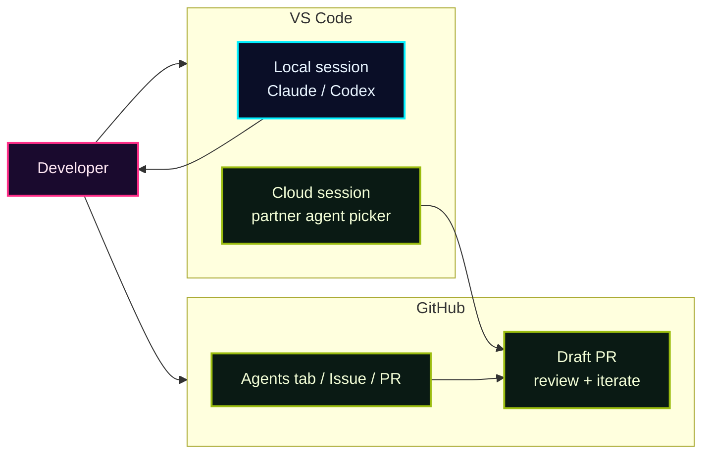

## 一言で

**Third-party agents** は、Copilot 以外の coding agent を GitHub / VS Code の workflow に並べる仕組み。

代表例は **Anthropic Claude** と **OpenAI Codex**。GitHub Docs では、Copilot cloud agent と並んで使える coding agents として扱われる。

## どこで使う？

> VS Code では local / cloud の選択肢があり、GitHub.com では Agents tab、Issue、PR comment から task を渡せる。

## Copilot との関係

| Agent | 何が違う？ | Copilot との接点 |
| --- | --- | --- |
| Copilot cloud agent | GitHub の標準 cloud agent | GitHub Actions-powered 環境で branch / PR を作る |
| Claude | Anthropic の agent harness / SDK | VS Code や GitHub cloud agent workflow で利用 |
| Codex | OpenAI の Codex SDK / coding agent | VS Code extension や GitHub cloud agent workflow で利用 |

> これは Copilot Chat のモードではない。**どの agent provider / harness に task を渡すか** の話。
