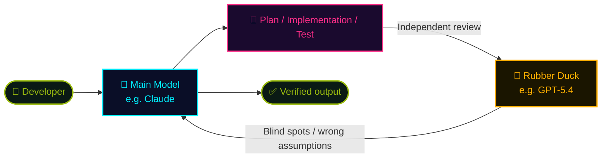

## In one sentence

<div class="hero-quote hero-quote-chat">
  <p>
    <strong>Copilot CLI</strong> is Copilot living inside the terminal.
  </p>
  <p>
    It helps you ask, plan, edit, and execute — just like Copilot in VS Code. But it has CLI-specific features and harness, so let's explore those together.
  </p>
</div>

> Not Copilot used without leaving your IDE, but Copilot that operates within the **shell's working context**.

## Key Features

A full-stack AI environment packed into a single terminal.

- **Multi-file context awareness**: Treats the entire repository as a single workspace.
- **Code generation & editing**: Make edits from the terminal, review diffs, and approve.
- **Command execution**: Run builds, tests, lint, and more — read the results and proceed.
- **IDE-agnostic**: Works anywhere there's a terminal: VS Code, Vim, over SSH, etc.
- **Skills / MCP support**: Add the capabilities and external tools you need.
- **Non-interactive execution**: Run via CI, cron, or scripts with `copilot -p "..."`.

## CLI vs VS Code Chat

| | Copilot CLI | VS Code Chat |
|---|---|---|
| **UI** | Very lightweight. Terminal-centric, so there's a learning curve for commands and a minimal editor UI. On the other hand, since the CLI opens instantly, it's easy to work with local computer resources like folders, PowerPoint, and Excel files. | Easier to handle options, settings, file navigation, inline diffs, and the debugger on screen. |
| **Speed of new features** | New experiments like `/chronicle`, `/fleet`, `/share`, and Rubber Duck tend to land here first. | More stability-oriented. Often adopts good ideas that matured in the CLI. |
| **Sub-agents** | Has many built-in agents — Explore, Task, Rubber Duck, Code Review — and can launch them natively. | Currently limited, but gradually catching up. |
| **Session management** | Fine-grained session control with `/context`, `/compact`, `/session`, etc. | Improving, but not as granular as the CLI right now. |
| **Third-party agents** | Copilot CLI runs within Copilot's harness. Codex / Claude harnesses are not available — you can use their **models**, but not their native harnesses. | Inside VS Code, it's easy to switch between Copilot, Codex, Claude, and other agents / extensions. |
| **Index** | Primarily uses terminal/search tools like `grep`, `rg`, and workspace commands. | Can use richer editor-side indexes like Blackbird. |

## Powerful Built-in Agents

Copilot CLI includes standard agents for common tasks.

| Agent | Description |
|---|---|
| **Explore** | Quickly analyzes the codebase and lets you ask questions about it, without adding it to the main context. |
| **Task** | Runs commands like tests and builds, returning a short summary on success or the full output on failure. |
| **General purpose** | Handles complex multi-step tasks that require all tools and advanced reasoning, in a separate context from the main conversation. |
| **Code review** | Reviews code changes focusing solely on issues that genuinely matter, minimizing noise. |
| **Research** | Conducts deep research across the codebase, related repositories, and the web, producing detailed reports with citations. |
| **Rubber duck** | Returns constructive critical feedback for complex tasks. Used automatically by Copilot CLI. |

## Rubber Duck — Cross-model Review

> 🦆 **Experimental**: A **different model family** from the main model provides a "second opinion" as a constructive critic, independently reviewing each phase of planning, implementation, and testing.



**Why does it work?** ── When the same model checks its own output, it gets caught by the **same assumptions and the same blind spots**. A model from a different family has different training data and different values, so it can catch **logic errors that were invisible** to the first model.

## Other Useful Commands

The CLI lets you instantly check models, sharing, experimental features, and environment info via slash commands.

| Command | When to use |
|---|---|
| `/help` | Check available commands and shortcuts. |
| `/model` | Check or switch the model in use. |
| `/ide` | Connect to an IDE such as VS Code. |
| `/share` | Share the current session. |
| `/experimental` | Check and enable experimental features. |
| `/chronicle` | Review the session history and work log. |
| `/task` | Check agents and tasks running in the background. |
| `/ask` | Consult Copilot as a question before proceeding. |
| `/env` | Check the environment information visible to the CLI. |

## Non-interactive Mode (Programmatic Execution) ★

<div class="hero-quote hero-quote-plain">
  <p>
    Copilot CLI can be run <strong>with a single command without opening an interactive session</strong>. Pass a prompt with <code>copilot -p "..."</code> and it executes one turn and exits.
  </p>
  <p>
    Since it can be called from shell scripts, cron, <strong>batch files</strong>, and <strong>GitHub Actions</strong>, you can delegate routine work — PR auto-review and similar tasks that don't need a human — to Copilot.
  </p>
</div>

> 🎯 If you find yourself asking the same thing in the interactive UI every day, that's a **signal to script it**. Put it on `cron` with `-p` and let it run while you sleep.

### Basic Usage

```bash
# Pass the prompt directly
copilot -p "Explain this file: ./complex.ts"

# Pipe it in
echo "Explain this file: ./complex.ts" | copilot
```

| Common flags | What they do |
| --- | --- |
| `-p "..."` / `--prompt "..."` | Pass a prompt and exit after one turn |
| `-s` (silent) | Suppress metadata and output **response text only** to stdout (ideal for variable assignment or piping) |
| `--no-ask-user` | Skip clarifying questions; make decisions autonomously when uncertain |
| `--allow-tool='shell(npm:*), write'` | Allow **only the necessary tools** (this is the default rule; `--allow-all` is for sandboxes only) |
| `--allow-url=...` | Restrict which URLs are allowed to be fetched |
| `--model gpt-5.5` | Pin the model to reduce variance in results |
| `--share='./report.md'` | Save the entire session as Markdown |
| `--share-gist` | Upload the session to a Gist (not available for EMU / data residency orgs) |

> 🔒 **Minimize permissions**. When running in CI, always use `--allow-tool` with a whitelist. Never use `--allow-all`.
> 💰 1 call = 1 Copilot premium request consumed. When making hundreds of batch calls, keep an eye on consumption via <a class="retro-link" href="/theomonfort/playbook/copilot-metrics">Copilot Metrics ↗</a>.

### Practical Automation Examples

| Use case | Command |
| --- | --- |
| 📝 **Commit message generation** | `copilot -p 'Write a commit message for the staged changes' -s --allow-tool='shell(git:*)'` |
| 📚 **Bulk README / JSDoc generation** | `copilot -p 'Generate JSDoc for all exported fns in src/api/' --allow-tool=write` |
| 🐛 **Bulk lint error fixes** | `copilot -p 'Fix all ESLint errors' --allow-tool='write, shell(npm:*), shell(npx:*)'` |
| 🧪 **Write tests for untested modules** | `copilot -p 'Write unit tests for src/utils/validators.ts' --allow-tool='write, shell(npm:*)'` |
| 🔍 **AI PR review** | `copilot -p '/review changes vs main. Focus on bugs & security' -s --allow-tool='shell(git:*)'` |
| 🔐 **Dependency vulnerability audit** | `copilot -p "Audit this project's deps for vulnerabilities" --allow-tool='shell(npm:*)' --share='./audit.md'` |
| 📰 **Release note generation** | `copilot -p 'Summarize commits since v1.2.0 as release notes' -s --allow-tool='shell(git:*)'` |
| 🌏 **Document translation** | `for f in docs/en/*.md; do copilot -p "Translate $f to Japanese, preserve markdown" -s > "docs/ja/$(basename $f)"; done` |

### Common Shell Script Patterns

**Capture into a variable**

```bash
node_version=$(copilot -p 'What Node.js version does this project require? Number only.' -s)
echo "Required: $node_version"
```

**Use in a conditional**

```bash
if copilot -p 'Does this project have TypeScript errors? Reply only YES or NO.' -s | grep -qi "no"; then
  echo "✅ Clean"
else
  echo "❌ Type errors detected" && exit 1
fi
```

**Process multiple files sequentially**

```bash
for file in src/api/*.ts; do
  echo "--- Reviewing $file ---" | tee -a review.md
  copilot -p "Review $file for error handling issues" -s \
    --allow-tool='shell(git:*)' | tee -a review.md
done
```

### Using with GitHub Actions

```yaml
- name: Generate test coverage report
  env:
    COPILOT_GITHUB_TOKEN: ${{ secrets.COPILOT_PAT }}
  run: |
    copilot -p "Run the test suite and produce a coverage summary" \
      -s --allow-tool='shell(npm:*), write' --no-ask-user
```

- 🔑 **Pass authentication via environment variable**. Priority order: `COPILOT_GITHUB_TOKEN` → `GH_TOKEN` → `GITHUB_TOKEN`
- 🧾 **Use fine-grained PAT (v2)** with the **"Copilot Requests" permission** (old `ghp_` format is not supported)
- 📦 Can be called from cron / Jenkins / GitLab CI the same way (just pass auth via environment variables)

### Design Tips

- 🎯 **Be specific with prompts** — Spell out file names, function names, and expected output format. Specifying the **output format** (e.g., "Number only." or "Reply YES or NO.") makes downstream parsing easier.
- 🛡️ **Allow only necessary tools** — Narrow the scope with `--allow-tool='shell(git:*), write'`
- 🔁 **Think about idempotency** — When running in Actions, limit to operations that are safe to run multiple times with the same input (have a human review commits/pushes)
- 📊 **Keep logs** — Save the entire session with `--share='./session.md'` so you can trace the reasoning behind results later
- 🧩 **Build in interactive mode, then port to `-p`** — The fastest path is to iterate in interactive mode until the prompt is solid, then script it with `-p`

📘 Details:
- <a class="retro-link" href="https://docs.github.com/en/copilot/how-tos/copilot-cli/automate-copilot-cli/run-cli-programmatically" target="_blank" rel="noopener noreferrer">Running GitHub Copilot CLI programmatically ↗</a>
- <a class="retro-link" href="https://docs.github.com/en/copilot/reference/copilot-cli-reference/cli-programmatic-reference" target="_blank" rel="noopener noreferrer">Programmatic reference (full flag list) ↗</a>
- <a class="retro-link" href="https://docs.github.com/en/copilot/how-tos/copilot-cli/automate-copilot-cli/automate-with-actions" target="_blank" rel="noopener noreferrer">Automating tasks with Copilot CLI and GitHub Actions ↗</a>
