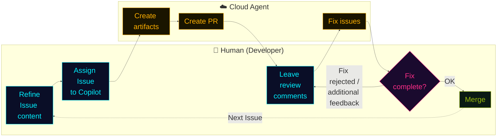

## In a nutshell

<div class="hero-quote hero-quote-chat">
  <p>
    <strong>Cloud Agent</strong> is Copilot running asynchronously on GitHub.
  </p>
  <p>
    Give it an Issue or task and it reads the code in the cloud, implements, verifies, and returns it as a PR.
  </p>
</div>

## What it can do

- **Background execution**: Processing continues in the cloud even after the IDE is closed.
- **Runs on Actions**: Sessions run on GitHub Actions runners, so execution logs are fully traceable.
- **Team visibility**: Cloud Agent sessions are visible to the entire team, making it easy to share progress.
- **Full repo context**: Can make edits with awareness of dependency and module structure.
- **Runs verification**: Executes tests, builds, static analysis, and reflects the results in the PR.
- **Multiple harness support**: The Anthropic Claude SDK and OpenAI Codex SDK are also available. (Partner agents)

## How to launch

- **From VS Code**: Switch from `Local` to `Cloud` in the Chat session type picker.
- **From GitHub.com**: Launch from the **Agents panel** on the repository page. Just specify the prompt and the starting branch.
- **From an Issue**: Simply **assign the Issue to Copilot**. The title and body become the task specification.
- **From the CLI**: Use `/delegate` to hand off work to Copilot Cloud Agent. You cannot delegate to other SDKs / harnesses this way.

## Environment Customization (`copilot-setup-steps.yml`)

Optionally place `.github/workflows/copilot-setup-steps.yml` in your repository to **fully control the Cloud Agent's GitHub Actions environment**. Without this file, the agent runs on a default Ubuntu environment and auto-infers dependencies.

```yaml
name: "Copilot Setup Steps"

on: workflow_dispatch

jobs:
  copilot-setup-steps:
    runs-on: ubuntu-latest  # ← Can also switch to a larger runner / self-hosted / windows-latest
    steps:
      - uses: actions/checkout@v4
        with:
          lfs: true                    # Enable Git LFS
      - uses: actions/setup-node@v4
        with:
          node-version: "20"
      - run: npm ci                    # Pre-install dependencies
      - run: pip install -r requirements.txt
    env:
      MY_API_BASE: https://api.example.com
```

**What you can customize:**

- 🛠️ **Pre-install** tools and dependencies (npm / pip / apt …)
- 💪 **Scale up** GitHub-hosted runner size
- 🏠 Run on a **self-hosted runner**
- 🪟 Switch to a **Windows** development environment (default is Ubuntu Linux)
- 📦 Enable **Git LFS**
- 🔑 Set **environment variables**
- 🔥 Disable or customize the agent **firewall**

## Adding External Tools with MCP Servers

Cloud Agent has a **dedicated MCP server configuration**, managed separately from local MCP settings. Just paste JSON at `Settings → Copilot → Coding agent → MCP servers` in the browser. Configured servers are automatically connected to every Cloud Agent session launched under that Org / account.

**Example: Adding Context7 as an MCP server**

```json
{
  "mcpServers": {
    "context7": {
      "type": "http",
      "url": "https://mcp.context7.com/mcp",
      "tools": ["*"]
    }
  }
}
```

- 🌐 **`type: "http"`** — Connects to a remote MCP server via HTTP / SSE (stdio is only for local child processes launched within the sandbox)
- 🛠️ **`tools: ["*"]`** — Allows all tools exposed by that server. Can be whitelisted to specific tools if needed
- 🔐 Servers requiring authentication pass API tokens via `headers` (reference GitHub Actions Secrets with `${{ secrets.* }}`)

> 💡 For details, see <a href="https://docs.github.com/en/copilot/how-tos/copilot-on-github/customize-copilot/customize-cloud-agent/extend-cloud-agent-with-mcp" target="_blank" rel="noopener noreferrer" class="retro-link">Extend Cloud Agent with MCP</a>.

## Validation Tools (ON by default)

Cloud Agent automatically runs **4 validations** on generated code before creating the PR. **If a problem is detected, it attempts to fix it on its own** before opening the PR.

| Validation tool | What it checks | Purpose |
|---|---|---|
| **CodeQL Code scanning** | Security vulnerabilities | Detects SQLi, XSS, dangerous API usage, etc. |
| **Copilot Code Review** | Code quality | Flags logic bugs, unnecessary complexity, and implementation issues. |
| **Secret Scanning** | API keys & credentials | Prevents secret leakage through generated code. |
| **Dependency Vulnerability checks** | Dependency packages | Cross-references the GitHub Advisory Database to detect vulnerable dependency additions. |

> 💰 **Free to use** — GitHub Advanced Security license is **not required**. Toggle at `Settings → Copilot → Cloud agent → Validation tools`.

## How Teams Use It

**Before leaving work** ── Assign 3 remaining Issues to Cloud Agent and head home.

**Overnight** ── Cloud Agent quietly implements and self-validates on the runner. Only code that passes both CodeQL and Code Review becomes a PR.

**Next morning** ── PRs are waiting for review. Your job is not to **write** but to **decide**. Humans focus on decisions, machines focus on iteration — this is the minimal unit of AI-driven development in a team.

## Full Workflow Diagram

Humans only **refine Issues, review, and merge**. The loop of implementation and fixes is driven by Cloud Agent.



> The human's task is **judgment and decision-making**, Copilot's task is **implementation and iteration**. By separating these responsibilities, PRs flow through the pipeline like a conveyor belt.
