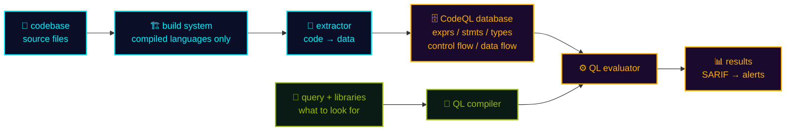

## In a nutshell

<div class="hero-quote">
  <p>
    <strong>Code Scanning</strong> finds vulnerabilities in your repository by analysing the source <strong>without running it</strong> — that is <strong>SAST</strong>.
  </p>
  <p>
    The default engine, <strong>CodeQL</strong>, turns your code into a <strong>queryable database</strong> first, so unlike regex-based SAST it can answer "does user input reach this dangerous call, through any path?" Every finding then gets a <strong>Copilot Autofix</strong> suggestion you can commit straight to the PR.
  </p>
</div>

## What is SAST?

Application security testing splits into four families. Code Scanning owns **SAST (Static Application Security Testing)**: reading the source itself, **without executing it**.

<div class="det-widget">
<p class="det-hint">▸ CLICK FOR DETAILS</p>
<div class="det-split">
<div class="det-list">
<details class="det-pick" name="cs-appsec">
<summary class="det-btn"><span class="det-icon" aria-hidden="true">🔬</span><span class="det-name">SAST (static)</span></summary>
<div class="det-pane">
<p class="det-head"><span class="det-icon" aria-hidden="true">🔬</span><span class="det-title">SAST — static analysis</span></p>
<p class="det-why">Reads source <b>without running it</b>, so it fires <b>at commit and PR time</b> where fixes are cheapest. It sees every code path, including ones testing never reaches, but is <b>blind to runtime-only problems</b> like misconfiguration. Its classic weakness is false positives — exactly what CodeQL's data-flow analysis attacks.</p>
<p class="det-doc">GitHub feature: <b>Code Scanning / CodeQL</b></p>
</div>
</details>
<details class="det-pick" name="cs-appsec">
<summary class="det-btn"><span class="det-icon" aria-hidden="true">🌐</span><span class="det-name">DAST (dynamic)</span></summary>
<div class="det-pane">
<p class="det-head"><span class="det-icon" aria-hidden="true">🌐</span><span class="det-title">DAST — dynamic analysis</span></p>
<p class="det-why">Fires <b>real attack requests at a running app</b>. It proves exploitability, but only for what is <b>already deployed and crawlable</b>, and it cannot point at the offending line.</p>
<p class="det-doc">No first-party GitHub feature. Ingest results via <b>SARIF</b></p>
</div>
</details>
<details class="det-pick" name="cs-appsec">
<summary class="det-btn"><span class="det-icon" aria-hidden="true">📦</span><span class="det-name">SCA (dependencies)</span></summary>
<div class="det-pane">
<p class="det-head"><span class="det-icon" aria-hidden="true">📦</span><span class="det-title">SCA — software composition analysis</span></p>
<p class="det-why">Finds <b>known CVEs in libraries you did not write</b>. Most of a modern app is dependencies, so by raw count this is usually the biggest source of findings.</p>
<p class="det-doc">GitHub feature: <b>Dependabot / Dependency review</b></p>
</div>
</details>
<details class="det-pick" name="cs-appsec">
<summary class="det-btn"><span class="det-icon" aria-hidden="true">🔑</span><span class="det-name">Secret scanning</span></summary>
<div class="det-pane">
<p class="det-head"><span class="det-icon" aria-hidden="true">🔑</span><span class="det-title">Secret scanning — leaked credentials</span></p>
<p class="det-why">Not vulnerabilities but <b>keys and tokens committed into the repo</b>. The cheapest way in for an attacker, so it often outranks SAST on priority.</p>
<p class="det-doc">GitHub feature: <b>Secret Protection</b></p>
</div>
</details>
</div>
<div class="det-screen" style="min-height:16.5em"><p class="det-empty">SELECT A METHOD ▸</p></div>
</div>
</div>

> 🔑 Rule of thumb — **SAST finds bugs in the code you wrote, SCA finds bugs in the code someone else wrote.** Different territory, so neither one covers the other.

## Code scanning is not CodeQL

Conflating these two makes every "we also want to run another SAST tool" conversation fall apart. **Code scanning is the surface (a GitHub feature); CodeQL is the analysis engine.** They are separable.

<div class="det-widget det-compact">
<p class="det-hint">▸ CLICK FOR DETAILS</p>
<div class="det-split">
<div class="det-list">
<details class="det-pick" name="cs-vs-codeql">
<summary class="det-btn"><span class="det-icon" aria-hidden="true">🖥️</span><span class="det-name">Code scanning (the feature)</span></summary>
<div class="det-pane">
<p class="det-head"><span class="det-icon" aria-hidden="true">🖥️</span><span class="det-title">Code scanning — GitHub's surface</span></p>
<p class="det-why">The <b>feature</b> that collects static-analysis results and surfaces them: Security tab alerts, inline PR comments, merge protection, Security overview, APIs. <b>Whatever the engine, results land here.</b></p>
</div>
</details>
<details class="det-pick" name="cs-vs-codeql">
<summary class="det-btn"><span class="det-icon" aria-hidden="true">🔬</span><span class="det-name">CodeQL (the engine)</span></summary>
<div class="det-pane">
<p class="det-head"><span class="det-icon" aria-hidden="true">🔬</span><span class="det-title">CodeQL — the analysis engine</span></p>
<p class="det-why">The semantic analysis engine GitHub <b>acquired from Semmle in 2019</b>. It is the default engine on GitHub, but it also <b>runs outside GitHub</b> — the CodeQL CLI works in any CI, or locally on your laptop.</p>
</div>
</details>
<details class="det-pick" name="cs-vs-codeql">
<summary class="det-btn"><span class="det-icon" aria-hidden="true">📄</span><span class="det-name">SARIF (the contract)</span></summary>
<div class="det-pane">
<p class="det-head"><span class="det-icon" aria-hidden="true">📄</span><span class="det-title">SARIF — the format that joins them</span></p>
<p class="det-why">The OASIS standard format for static-analysis results. Push Semgrep, Snyk or Checkmarx through <code>upload-sarif</code> and their findings sit <b>next to CodeQL's, same screen</b>.</p>
<p class="det-doc"><a class="retro-link" href="https://docs.github.com/en/code-security/code-scanning/integrating-with-code-scanning/sarif-support-for-code-scanning" target="_blank" rel="noopener noreferrer">📘 SARIF support ↗</a></p>
</div>
</details>
</div>
<div class="det-screen" style="min-height:14em"><p class="det-empty">SELECT A TOPIC ▸</p></div>
</div>
</div>

> 🔑 **You can use code scanning without CodeQL, and CodeQL without code scanning.** "Code scanning = CodeQL" is not true.

## How CodeQL works

The core idea is that CodeQL **turns your code into a database**. Instead of matching text with regular expressions, you **query the code the way you query SQL**.



- 🔧 **extractor** — for C/C++, Java, C# it **watches the build and captures only what actually compiled**; Python, JS/TS, Ruby are parsed directly
- 🗄️ **database** — an **immutable snapshot**: expressions, statements, types, control flow, data flow, all as tables
- 🧮 **compiler + evaluator** — optimizes your query against that schema, returns every match, emits **SARIF** → alerts

> 💡 Because it is a database, you can ask "**does user input (a source) reach a dangerous function (a sink), through any path?**" That is **taint tracking**, and it is why CodeQL reports vulnerabilities that actually connect rather than strings that merely look suspicious.

## Reading a CodeQL query

QL is a declarative logic-programming language. **You describe the shape of a bug and the evaluator finds every instance.** The structure mirrors SQL's `FROM / WHERE / SELECT`.

```ql
import java                                       // ① pull in the standard library

from IfStmt ifstmt, Block block                   // ② declare the elements to inspect
where
  block = ifstmt.getThen() and                    // ③ constrain them
  block.getNumStmt() = 0                          //    → a then-branch with no statements
select ifstmt, "This if-statement is redundant."  // ④ what to report, and how
```

The whole language is that shape: **`where` is the definition of "what the bug looks like"**, and the evaluator does the searching.

> 🔬 Security queries layer `DataFlow` / `TaintTracking` on top, defining **sources, sinks and sanitizers** and searching for paths between them. The packs are open source at <a class="retro-link" href="https://github.com/github/codeql" target="_blank" rel="noopener noreferrer">github/codeql ↗</a>. In practice they are enough — you write custom queries mainly to teach CodeQL the sources and sinks of your in-house framework.

📘 Details: <a class="retro-link" href="https://codeql.github.com/docs/writing-codeql-queries/about-codeql-queries/" target="_blank" rel="noopener noreferrer">About CodeQL queries ↗</a> / <a class="retro-link" href="https://codeql.github.com/docs/writing-codeql-queries/about-data-flow-analysis/" target="_blank" rel="noopener noreferrer">About data flow analysis ↗</a>

## What CodeQL finds

<div class="det-widget">
<p class="det-hint">▸ CLICK FOR DETAILS</p>
<div class="det-split">
<div class="det-list">
<details class="det-pick" name="cs-findings">
<summary class="det-btn"><span class="det-icon" aria-hidden="true">💉</span><span class="det-name">Injection</span></summary>
<div class="det-pane">
<p class="det-head"><span class="det-icon" aria-hidden="true">💉</span><span class="det-title">Injection</span></p>
<p class="det-why"><b>SQL injection, command injection, path traversal, XSS, SSRF</b>. User input reaching an interpreter (SQL, a shell, a file path, HTML, an HTTP client) without escaping. This is <b>CodeQL's home turf</b> and where data-flow analysis pays for itself.</p>
</div>
</details>
<details class="det-pick" name="cs-findings">
<summary class="det-btn"><span class="det-icon" aria-hidden="true">🔓</span><span class="det-name">Auth, authz & crypto</span></summary>
<div class="det-pane">
<p class="det-head"><span class="det-icon" aria-hidden="true">🔓</span><span class="det-title">Auth, authorization and crypto</span></p>
<p class="det-why">Broken access control, <b>weak cryptographic algorithms (MD5 / SHA-1)</b>, insecure randomness, hard-coded credentials, disabled certificate validation.</p>
</div>
</details>
<details class="det-pick" name="cs-findings">
<summary class="det-btn"><span class="det-icon" aria-hidden="true">💣</span><span class="det-name">Memory safety (C/C++)</span></summary>
<div class="det-pane">
<p class="det-head"><span class="det-icon" aria-hidden="true">💣</span><span class="det-title">Memory safety (C/C++)</span></p>
<p class="det-why"><b>Buffer overflow, use after free, null dereference, integer overflow.</b> Only reachable because types and pointer flow live in the database — regex-based tools cannot go here.</p>
</div>
</details>
<details class="det-pick" name="cs-findings">
<summary class="det-btn"><span class="det-icon" aria-hidden="true">🧩</span><span class="det-name">Data flow tracking</span></summary>
<div class="det-pane">
<p class="det-head"><span class="det-icon" aria-hidden="true">🧩</span><span class="det-title">Data flow tracking (taint tracking)</span></p>
<p class="det-why">The alert carries <b>the path itself</b>, source to sink. Anything crossing a sanitizer drops out, which is what keeps false positives down. <code>models-as-data</code> lets you register <b>your own framework's sources and sinks</b> without writing a query.</p>
<p class="det-doc"><a class="retro-link" href="https://github.blog/changelog/2026-04-21-codeql-now-supports-sanitizers-and-validators-in-models-as-data" target="_blank" rel="noopener noreferrer">📘 sanitizers in models-as-data ↗</a></p>
</div>
</details>
<details class="det-pick" name="cs-findings">
<summary class="det-btn"><span class="det-icon" aria-hidden="true">⚙️</span><span class="det-name">CI/CD (Actions)</span></summary>
<div class="det-pane">
<p class="det-head"><span class="det-icon" aria-hidden="true">⚙️</span><span class="det-title">CI/CD (GitHub Actions)</span></p>
<p class="det-why">Workflows are analysed too: <code>pull_request_target</code> combined with an untrusted checkout, <b>script injection</b>, excessive <code>permissions</code>, unpinned third-party actions — the <b>supply-chain side</b> of the repo.</p>
</div>
</details>
</div>
<div class="det-screen" style="min-height:15em"><p class="det-empty">SELECT A CATEGORY ▸</p></div>
</div>
</div>

> 🌐 **Supported languages** — C/C++, C#, Go, Java/Kotlin, JavaScript/TypeScript, Python, Ruby, Rust, Swift, GitHub Actions. A repo with no CodeQL-supported language **runs no scans and burns no Actions minutes**.

## Default setup vs Advanced setup

There are two ways to enable CodeQL. **Default setup is enough to start.**

<div class="det-widget det-compact">
<p class="det-hint">▸ CLICK TO COMPARE</p>
<div class="det-split">
<div class="det-list">
<details class="det-pick" name="cs-setup">
<summary class="det-btn"><span class="det-icon" aria-hidden="true">🟢</span><span class="det-name">Default setup</span></summary>
<div class="det-pane">
<p class="det-head"><span class="det-icon" aria-hidden="true">🟢</span><span class="det-title">Default setup — one click</span></p>
<p class="det-why"><b>No config file.</b> GitHub detects languages, picks the <code>default</code> suite, and wires push / PR / weekly triggers. Most languages need <b>no build step</b>, and one settings screen turns it on org-wide — the only realistic option at scale.</p>
<p class="det-doc">Best for: <b>99% of repos, and any rollout at scale</b></p>
</div>
</details>
<details class="det-pick" name="cs-setup">
<summary class="det-btn"><span class="det-icon" aria-hidden="true">🛠️</span><span class="det-name">Advanced setup</span></summary>
<div class="det-pane">
<p class="det-head"><span class="det-icon" aria-hidden="true">🛠️</span><span class="det-title">Advanced setup — your own workflow</span></p>
<p class="det-why">You own <code>.github/workflows/codeql.yml</code>: languages, triggers, your own build command, any query suite (<code>security-extended</code>, custom packs). The price is a workflow file per repo to maintain.</p>
<p class="det-doc">Best for: <b>monorepos, custom builds, custom queries</b></p>
</div>
</details>
<details class="det-pick" name="cs-setup">
<summary class="det-btn"><span class="det-icon" aria-hidden="true">💰</span><span class="det-name">Billing difference</span></summary>
<div class="det-pane">
<p class="det-head"><span class="det-icon" aria-hidden="true">💰</span><span class="det-title">There is none</span></p>
<p class="det-why">Both run as <b>Actions workflows</b> and burn minutes on private repos at the same rate, so neither choice saves money. What moves the bill is <b>scan frequency, repo size and runner type</b>.</p>
<p class="det-doc">See the pricing slide for the three meters</p>
</div>
</details>
</div>
<div class="det-screen" style="min-height:14em"><p class="det-empty">SELECT AN OPTION ▸</p></div>
</div>
</div>

> 🔑 Unless you have a monorepo, special build requirements, or need custom queries, **start with Default setup** — you can switch to Advanced later without losing history.

📘 Details: <a class="retro-link" href="https://docs.github.com/en/code-security/code-scanning/enabling-code-scanning/configuring-default-setup-for-code-scanning" target="_blank" rel="noopener noreferrer">Configuring default setup ↗</a>

## Copilot Autofix — AI fixes it for you ★

Code Scanning's most impactful capability. When CodeQL raises an alert, **AI generates a fix** you can commit straight to the PR.

- 🤖 **How it works** — the alert goes to Copilot, which generates a diff from the offending code, its surrounding context, CodeQL's description and the data-flow path
- 💬 **Where it shows** — on the alert page **and** inline in the PR; commit to **an existing branch** or **a new branch**
- ⚡ **Reduces MTTR** — GitHub internal data shows fix time is 3–4× faster
- 🆓 **No extra cost** — **no Copilot license required** and **it does not consume AI credits**. Included with Code Security (and unconditionally free on public repos)
- 🔌 **Enablement** — comes with code scanning via CodeQL; nothing else to turn on, default or advanced setup

> 💡 Not just "find vulnerabilities" — **"let AI fix them too"** is the new standard. Review burden drops dramatically.

📘 Details: <a class="retro-link" href="https://docs.github.com/en/code-security/concepts/code-scanning/autofix-for-code-scanning" target="_blank" rel="noopener noreferrer">Autofix for code scanning ↗</a>

## Agentic Autofix — delegate the fix to the agent (Public Preview)

**What it does** — assign a Code Scanning alert to the **Copilot cloud agent**. Copilot analyzes the vulnerability, plans the fix, and opens a **draft Pull Request** for you to review.

- 🎯 **Two ways to assign** — **bulk** (select multiple alerts in a Security Campaign → "Assign Copilot" → one consolidated PR) or **single** (assignee picker on the alert page)
- 📦 **Output** — multi-file, repository-wide changes (vs Autofix's inline single-file patch)
- 🔁 **Iterate** — comment `@copilot` on the PR to refine; CodeQL and CI run on the PR before merge
- 🛂 **Requirements** — GitHub Code Security or GHAS **+** a paid Copilot plan with cloud agent enabled; the alert must already have an Autofix suggestion
- 💸 **Billing** — billed as a cloud agent session, consuming **AI credits and Actions minutes** (unlike Autofix, this is not free)

📘 Details: <a class="retro-link" href="https://github.blog/changelog/2026-07-10-agentic-autofix-for-code-scanning-alerts-in-public-preview" target="_blank" rel="noopener noreferrer">Agentic autofix for code scanning alerts (changelog) ↗</a>

## Autofix vs Agentic Autofix

<div class="ctl-widget">
<p class="ctl-hint">▸ CLICK + TO OPEN THE COMPARISON</p>
<div class="ctl-list">
<details class="ctl-item" name="cs-fix-vs">
<summary class="ctl-btn"><span class="ctl-icon" aria-hidden="true">📤</span><span class="ctl-name">Output</span><span class="ctl-when">patch vs PR</span><span class="ctl-toggle" aria-hidden="true"></span></summary>
<div class="ctl-body">
<p class="ctl-row"><span class="ctl-k">🔧 Autofix</span><span class="ctl-v">An inline patch, committed to <b>an existing branch</b> or <b>a new branch</b></span></p>
<p class="ctl-row"><span class="ctl-k">🤖 Agentic</span><span class="ctl-v">A <b>draft Pull Request</b> opened by the Copilot bot, reviewed like any other</span></p>
</div>
</details>
<details class="ctl-item" name="cs-fix-vs">
<summary class="ctl-btn"><span class="ctl-icon" aria-hidden="true">📐</span><span class="ctl-name">Fix scope</span><span class="ctl-when">one file vs many</span><span class="ctl-toggle" aria-hidden="true"></span></summary>
<div class="ctl-body">
<p class="ctl-row"><span class="ctl-k">🔧 Autofix</span><span class="ctl-v"><b>Single file</b>, minimal local fix: insert an escape, swap in a safe API</span></p>
<p class="ctl-row"><span class="ctl-k">🤖 Agentic</span><span class="ctl-v"><b>Multiple files</b>, with repository-wide context — refactors and shared helpers included</span></p>
</div>
</details>
<details class="ctl-item" name="cs-fix-vs">
<summary class="ctl-btn"><span class="ctl-icon" aria-hidden="true">📚</span><span class="ctl-name">Granularity</span><span class="ctl-when">per-alert vs bulk</span><span class="ctl-toggle" aria-hidden="true"></span></summary>
<div class="ctl-body">
<p class="ctl-row"><span class="ctl-k">🔧 Autofix</span><span class="ctl-v"><b>One alert at a time</b> via "Generate fix", though suggestions can be batch-applied on a PR</span></p>
<p class="ctl-row"><span class="ctl-k">🤖 Agentic</span><span class="ctl-v">Select <b>many alerts in a Security Campaign</b> and get one PR per repo</span></p>
</div>
</details>
<details class="ctl-item" name="cs-fix-vs">
<summary class="ctl-btn"><span class="ctl-icon" aria-hidden="true">🔁</span><span class="ctl-name">Validation & iteration</span><span class="ctl-when">one-shot vs dialogue</span><span class="ctl-toggle" aria-hidden="true"></span></summary>
<div class="ctl-body">
<p class="ctl-row"><span class="ctl-k">🔧 Autofix</span><span class="ctl-v">No validation at suggestion time and no regenerate. Discard it, or merge and re-scan</span></p>
<p class="ctl-row"><span class="ctl-k">🤖 Agentic</span><span class="ctl-v">Sandboxed analysis; CodeQL and CI run on the PR, and <code>@copilot</code> comments drive <b>re-fixes</b></span></p>
</div>
</details>
<details class="ctl-item" name="cs-fix-vs">
<summary class="ctl-btn"><span class="ctl-icon" aria-hidden="true">⏱️</span><span class="ctl-name">Speed</span><span class="ctl-when">seconds vs minutes</span><span class="ctl-toggle" aria-hidden="true"></span></summary>
<div class="ctl-body">
<p class="ctl-row"><span class="ctl-k">🔧 Autofix</span><span class="ctl-v"><b>Seconds</b>, synchronous — you judge it while looking at the alert</span></p>
<p class="ctl-row"><span class="ctl-k">🤖 Agentic</span><span class="ctl-v"><b>Minutes</b>, async in the background; a session is capped at 59 minutes</span></p>
</div>
</details>
<details class="ctl-item" name="cs-fix-vs">
<summary class="ctl-btn"><span class="ctl-icon" aria-hidden="true">💰</span><span class="ctl-name">License & cost</span><span class="ctl-when">free vs metered</span><span class="ctl-toggle" aria-hidden="true"></span></summary>
<div class="ctl-body">
<p class="ctl-row"><span class="ctl-k">🔧 Autofix</span><span class="ctl-v"><b>Free.</b> No Copilot license, no AI credits. Included with Code Security / GHAS</span></p>
<p class="ctl-row"><span class="ctl-k">🤖 Agentic</span><span class="ctl-v">Needs a paid Copilot plan with cloud agent, and burns <b>AI credits + Actions minutes</b></span></p>
</div>
</details>
</div>
</div>

> 🔑 **Rule of thumb** — start with **Autofix** for quick local fixes (it costs nothing); escalate to **Agentic Autofix** only when the fix spans multiple files or needs a real refactor.

## Security Campaigns — drive remediation at scale

Detection is the easy half; **what happens after the alert** is the real work. At scale, don't grind the raw alert list — run a **time-boxed campaign**.

<div class="rem-widget">
<p class="rem-hint">▸ CLICK A STEP FOR DETAILS</p>
<div class="rem-flow">
<div class="rem-row">
<details class="rem-slot" name="cs-campaign">
<summary class="rem-btn"><span class="rem-icon" aria-hidden="true">🎯</span><span class="rem-name">SCOPE</span></summary>
<div class="rem-plate">
<p class="rem-title">🎯 SCOPE — not the whole org</p>
<p class="rem-why"><code>Org → Security and quality → Campaigns → New campaign</code>, then pick <b>From template</b> or <b>From code scanning filters</b>.</p>
<p class="rem-why">Filter by severity, CWE, query, language, repo, team, age. Targeting a repo custom property (<code>props.BusinessPriority:Urgent</code>) is the usual move. Hard cap: <b>1000 alerts</b>.</p>
</div>
</details>
<details class="rem-slot" name="cs-campaign">
<summary class="rem-btn"><span class="rem-icon" aria-hidden="true">⚡</span><span class="rem-name">TRIAGE</span></summary>
<div class="rem-plate">
<p class="rem-title">⚡ TRIAGE — make it finishable</p>
<p class="rem-why">Start with <b>critical and high</b>, and with findings that carry a real reachable data-flow path. Dumping the whole <code>security-extended</code> backlog in guarantees nobody starts.</p>
<p class="rem-why">Watch the count drop as you filter. Cutting it down to <b>one sprint's worth</b> is the only trick that makes campaigns work.</p>
</div>
</details>
<details class="rem-slot" name="cs-campaign">
<summary class="rem-btn"><span class="rem-icon" aria-hidden="true">👥</span><span class="rem-name">OWN</span></summary>
<div class="rem-plate">
<p class="rem-title">👥 OWN — a name and a date</p>
<p class="rem-why">Every campaign gets a <b>due date</b> and a <b>campaign manager</b>. The picker only offers <b>org owners and security managers</b>.</p>
<p class="rem-why">Alerts route to CODEOWNERS or a named team. Publishing notifies everyone who can see the alerts, and the campaign appears in each repo's Security tab.</p>
</div>
</details>
<details class="rem-slot" name="cs-campaign">
<summary class="rem-btn"><span class="rem-icon" aria-hidden="true">🤖</span><span class="rem-name">FIX</span></summary>
<div class="rem-plate">
<p class="rem-title">🤖 FIX — hand the batch to Copilot</p>
<p class="rem-why">Bulk-select Autofix-eligible alerts and hit <b>Assign Copilot</b> to get one PR per repo (Agentic Autofix — this consumes AI credits).</p>
<p class="rem-why">For the rest, <b>batch apply</b> the Autofix suggestions on the PR. The dashboard burns down open / fixed / overdue as you go.</p>
</div>
</details>
</div>
<div class="rem-screen" style="min-height:11.4em"><p class="rem-empty">SELECT A STEP ▸</p></div>
</div>
</div>

📘 Details: <a class="retro-link" href="https://docs.github.com/en/code-security/securing-your-organization/fixing-security-alerts-at-scale/about-security-campaigns" target="_blank" rel="noopener noreferrer">About security campaigns (GitHub Docs) ↗</a>

## Getting started (fastest path)

<div class="setup-cards">
  <div class="setup-card">
    <div class="setup-card-head">
      <code>Repo → Settings → Code security</code>
      <span class="setup-card-tag tag-cyan">▸ STEP 1 · DEFAULT SETUP</span>
    </div>
    <p><strong>Set up CodeQL → Default.</strong> Languages are detected for you; it runs on push and PR.</p>
  </div>
  <div class="setup-card">
    <div class="setup-card-head">
      <code>… → Copilot Autofix</code>
      <span class="setup-card-tag tag-magenta">▸ STEP 2 · AUTOFIX</span>
    </div>
    <p>A <strong>Generate fix</strong> button appears on alerts. <strong>No extra cost.</strong></p>
  </div>
  <div class="setup-card">
    <div class="setup-card-head">
      <code>Org → Settings → Code security</code>
      <span class="setup-card-tag tag-cyan">▸ STEP 3 · ROLL OUT</span>
    </div>
    <p>Build a <strong>security configuration</strong> and apply it to new and existing repos at once.</p>
  </div>
  <div class="setup-card">
    <div class="setup-card-head">
      <code>Repo → Settings → Rules</code>
      <span class="setup-card-tag tag-magenta">▸ STEP 4 · MERGE PROTECTION</span>
    </div>
    <p>Code scanning alone <strong>never blocks a merge</strong>. Make it required in a ruleset.</p>
  </div>
</div>

Results appear in the **Security tab** and as inline comments on the PR's **Files changed** tab. Enable it on one repo first, then roll out org-wide.

> ⚠️ Estimate **Actions minutes** before you roll out: repos × supported languages × (push + PR + weekly).

## Advanced setup and SARIF

When Default is not enough (monorepo, unusual build, custom queries, another SAST tool), write the workflow yourself.

```yaml
# .github/workflows/codeql.yml
name: CodeQL
on:
  push: { branches: [main] }
  pull_request: { branches: [main] }
  schedule: [{ cron: '30 5 * * 1' }]
jobs:
  analyze:
    runs-on: ubuntu-latest
    permissions: { security-events: write, contents: read }
    strategy:
      matrix: { language: [javascript, python] }
    steps:
      - uses: actions/checkout@v4
      - uses: github/codeql-action/init@v3
        with: { languages: '${{ matrix.language }}', queries: security-extended }
      - uses: github/codeql-action/analyze@v3

      # third-party SAST (Semgrep, Snyk, ESLint security) lands in the same UI:
      - uses: github/codeql-action/upload-sarif@v3
        with: { sarif_file: results.sarif }
```

> 💡 Point `runs-on` at a **self-hosted runner** and the Actions minutes are not billed — the first lever when scan cost bites at scale.

## Pricing — three meters, not one

<p class="spec-hint">▸ + UNFOLDS THE DETAIL</p>

<div class="spec-widget">
<table style="table-layout:fixed">
<colgroup><col style="width:22%" /><col style="width:40%" /><col style="width:38%" /></colgroup>
<thead>
<tr><th style="white-space:normal">Cost</th><th>How it is measured</th><th>Good to know</th></tr>
</thead>
<tbody>
<tr>
<td style="white-space:normal">💺 License</td>
<td><b>GitHub Code Security, $30 per active committer / month.</b> Active = a commit of theirs was pushed to an enabled repo in the last <b>90 days</b>.</td>
<td>
<div class="spec-list">
<details class="spec-item" name="cs-billing">
<summary class="spec-btn"><span class="spec-icon" aria-hidden="true">📦</span><span class="spec-key">What's included</span><span class="spec-toggle" aria-hidden="true"></span></summary>
<p class="spec-what">CodeQL (default and advanced), <b>Copilot Autofix</b>, SARIF upload, Security overview, Security campaigns, custom queries. <b>Autofix costs nothing extra.</b></p>
</details>
<details class="spec-item" name="cs-billing">
<summary class="spec-btn"><span class="spec-icon" aria-hidden="true">👤</span><span class="spec-key">Who counts</span><span class="spec-toggle" aria-hidden="true"></span></summary>
<p class="spec-what"><b>One license per person</b>, however many repos or orgs they touch. Bots are excluded; a leaver keeps consuming a license for <b>90 days</b>. Sold <b>standalone</b> since the 2025 split — no full GHAS needed.</p>
</details>
</div>
</td>
</tr>
<tr>
<td style="white-space:normal">⚙️ Actions minutes</td>
<td>CodeQL <b>runs as an Actions workflow</b>. On private repos every scan consumes Actions minutes, <b>billed as normal</b>.</td>
<td>
<div class="spec-list">
<details class="spec-item" name="cs-billing">
<summary class="spec-btn"><span class="spec-icon" aria-hidden="true">🔁</span><span class="spec-key">When it runs</span><span class="spec-toggle" aria-hidden="true"></span></summary>
<p class="spec-what">Push to the default or a protected branch, PRs against them, and a <b>weekly schedule</b>. <b>Repos × languages × frequency</b> is your minute count. A repo with no supported language costs zero.</p>
</details>
<details class="spec-item" name="cs-billing">
<summary class="spec-btn"><span class="spec-icon" aria-hidden="true">💳</span><span class="spec-key">Cap the spend</span><span class="spec-toggle" aria-hidden="true"></span></summary>
<p class="spec-what"><b>Self-hosted runners are not billed</b>, or set an Actions budget. Minutes are <b>not</b> included in the Code Security license. Trap: <b>larger runners are charged even on public repos</b>.</p>
</details>
</div>
</td>
</tr>
<tr>
<td style="white-space:normal">🤖 AI credits</td>
<td>Only if you ask <b>Copilot to do the fixing</b>. Autofix is free; <b>Agentic Autofix is metered</b>.</td>
<td>
<div class="spec-list">
<details class="spec-item" name="cs-billing">
<summary class="spec-btn"><span class="spec-icon" aria-hidden="true">🆓</span><span class="spec-key">Copilot Autofix</span><span class="spec-toggle" aria-hidden="true"></span></summary>
<p class="spec-what">No Copilot license needed and it <b>does not consume AI credits</b>. Included with Code Security at no additional cost.</p>
</details>
<details class="spec-item" name="cs-billing">
<summary class="spec-btn"><span class="spec-icon" aria-hidden="true">💸</span><span class="spec-key">Agentic Autofix</span><span class="spec-toggle" aria-hidden="true"></span></summary>
<p class="spec-what">Billed as a Copilot cloud agent session, drawing down <b>AI credits and Actions minutes</b>. Cost <b>varies with model and tokens</b> (1 AI credit = $0.01). User-level credit budgets hard-stop; org budgets only cap after the shared pool runs out.</p>
</details>
</div>
</td>
</tr>
</tbody>
</table>
</div>

> 🆓 **On public repos all three are effectively zero** — CodeQL and Autofix are free, and standard runner minutes are free too (larger runners excepted).

## Eligibility by repository type

| Feature | Public repo | Private repo (no Code Security) | Private repo (with Code Security) |
| --- | :---: | :---: | :---: |
| **Core code scanning**<br><span style="opacity:.72;font-size:.86em;">CodeQL (default + advanced), third-party SARIF upload, Copilot Autofix, PR inline comments, custom queries, security overview</span> | ✅ Free | ❌ | ✅ |
| **Security campaigns** | ❌ | ❌ | ✅ |
| **Actions minutes** | ✅ Free<sup>*</sup> | — | 💰 Billed separately |

<p style="font-size:0.82em;opacity:0.75;margin-top:-0.4em;">* Standard GitHub-hosted runners only. Larger runners are charged even on public repos.</p>

> ⚠️ **Flip a public repo to private and the features are disabled** unless you have bought Code Security. Worth knowing before you internalize an OSS project.

📘 Details: <a class="retro-link" href="https://github.blog/changelog/2025-03-04-introducing-github-secret-protection-and-github-code-security/" target="_blank" rel="noopener noreferrer">Introducing GitHub Secret Protection & Code Security (2025 Mar) ↗</a>

## Code Security Risk Assessment (free inventory scan)

One click, CodeQL scans the **20 most active repos** in your org and shows where the vulnerabilities are. **No GHAS / Code Security license needed, completely free** (GA April 2026).

- 🔎 **Scope** — up to 20 repos with the most recent commits, re-selectable each run
- 📊 **Output** — report by **severity, language, rule type**, plus **how many Copilot Autofix can fix**
- 🕒 **Frequency** — re-runnable **once every 90 days**; org owners / security managers only
- 🚀 **How to run** — `Org → Security → Assessments → Run code security risk assessment`
- 🆓 **Cost** — no license, no Actions minutes — ideal for evaluating Code Security before buying

> 📊 Pair this with Secret Risk Assessment (see <a class="retro-link" href="/theomonfort/en/playbook/secret-scanning">Secret Scanning ↗</a>) and you get a full posture read in a single day, then decide on **Code Security** with real numbers.

📘 Details: <a class="retro-link" href="https://docs.github.com/en/code-security/concepts/code-scanning/code-security-risk-assessment" target="_blank" rel="noopener noreferrer">Code security risk assessment ↗</a> / <a class="retro-link" href="https://github.blog/security/application-security/how-exposed-is-your-code-find-out-in-minutes-for-free/" target="_blank" rel="noopener noreferrer">How exposed is your code? ↗</a>
