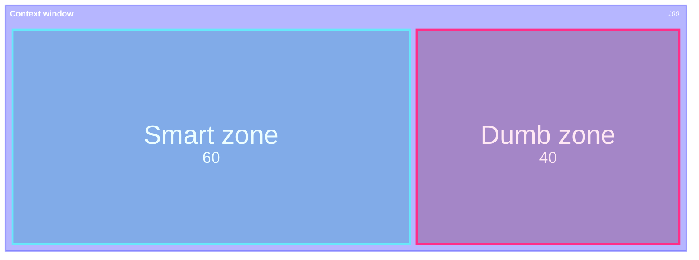
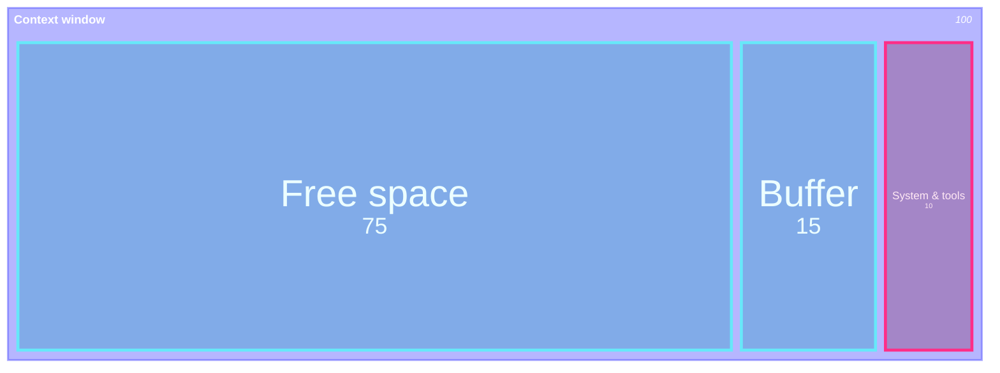
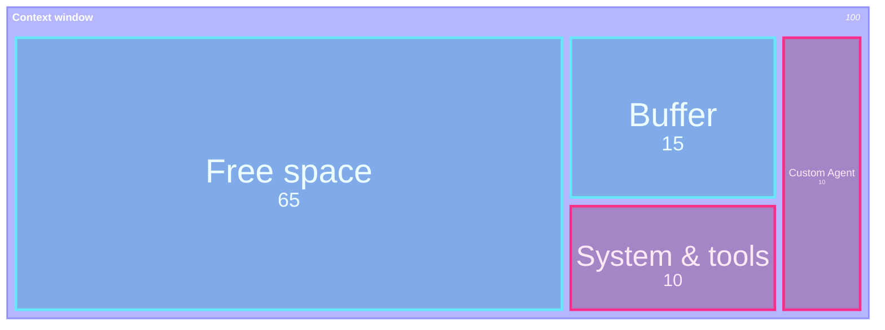
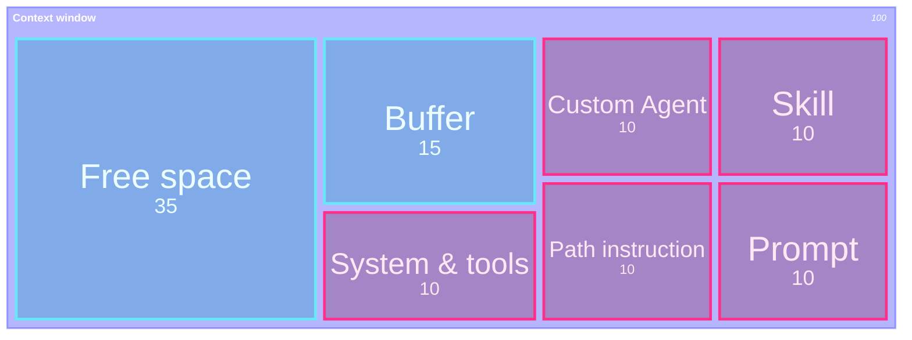
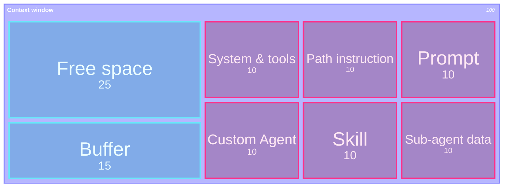
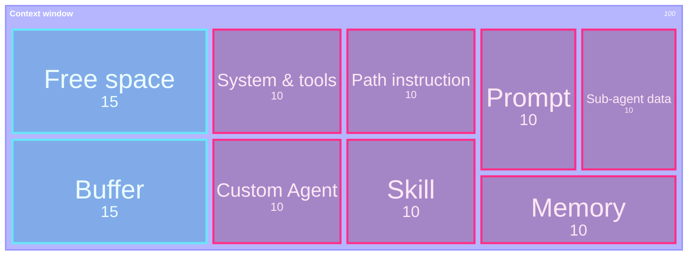
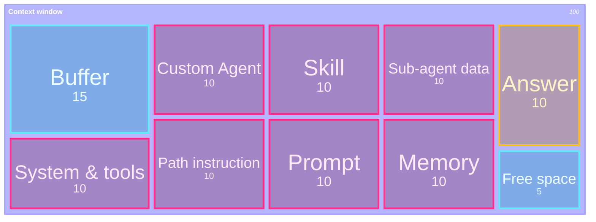
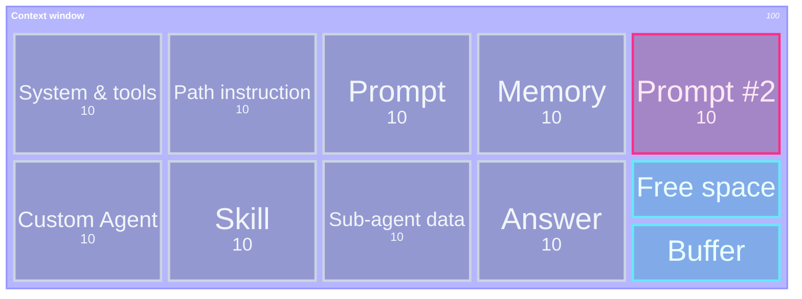

## At a Glance

  

    <strong>Context Engineering</strong> is the practice of designing the context passed to AI with "as little as possible, but as much as necessary."
  

  

    Rather than making AI read everything, you narrow down the goal, constraints, relevant files, and verification method so AI can pick its next move without hesitation.
  

> Good context is not about quantity — it's about **selection**. Reduce what's unnecessary; never omit what's needed.

## Context Rot

A larger context window does not make an LLM smarter. Cramming in too much information causes **Lost in the Middle** — important details get buried in the center — or **Recency Bias** — recent information gets overweighted — blunting the model's judgment.

This is called **context rot**.

> The goal of Context Engineering is not to fill the context window, but to **keep the necessary information visible**.

## Context Window: Start (turn 1)

Start is nearly ideal. Only the always-on **System & tools** are loaded — skill descriptions, copilot-instructions, MCP server tool schemas, default tool definitions — leaving plenty of working space. On the very first turn, those are sent fresh, so they count as **input tokens**.

<strong>Input tokens</strong> (sent this turn) &nbsp;·&nbsp; Free space / buffer

## Context Window: Custom Agent (turn 1)

Switching to a custom agent adds that agent's instruction to the context. Both system & tools and the custom agent are sent fresh — all **input tokens** on this turn.

<strong>Input tokens</strong> (sent this turn) &nbsp;·&nbsp; Free space / buffer

## Context Window: Prompt (turn 1)

You write a prompt. For example, asking to "add a test" may cause a relevant skill and the path instruction for tests to be loaded. Everything in the window is fresh **input tokens** on this turn.

<strong>Input tokens</strong> (sent this turn) &nbsp;·&nbsp; Free space / buffer

## Context Window: Sub-agent (turn 1)

The agent might call **sub-agents** — for example to explore the codebase, query a database, or run a review — and merge their summary back into the main context. Everything in the window is fresh **input tokens** on this turn.

<strong>Input tokens</strong> (sent this turn) &nbsp;·&nbsp; Free space / buffer

## Context Window: Memory (turn 1)

As you keep working in the repo, memories are generated and may be dynamically loaded when needed. Everything in the window is still fresh **input tokens** on this turn.

<strong>Input tokens</strong> (sent this turn) &nbsp;·&nbsp; Free space / buffer

## Context Window: Output (turn 1)

The LLM responds. Its **Answer** is appended to the context — those are **output tokens**, charged at a different (typically higher) rate than input tokens.

<strong>Input tokens</strong> (sent this turn) &nbsp;·&nbsp; <strong>Output tokens</strong> (LLM response) &nbsp;·&nbsp; Free space / buffer

## Context Window: Cache input (turn 2)

The user sends a new prompt to start the next turn. Everything from turn 1 — system, tools, custom agent, prompt, sub-agent data, memory, **even the LLM's answer** — is now reused from the **prompt cache** as cheaper **cache input tokens**. Only **Prompt #2** is fresh **input tokens** this turn.

<strong>Cache input tokens</strong> (not guaranteed) &nbsp;·&nbsp; <strong>Input tokens</strong> (new this turn) &nbsp;·&nbsp; Free space / buffer

