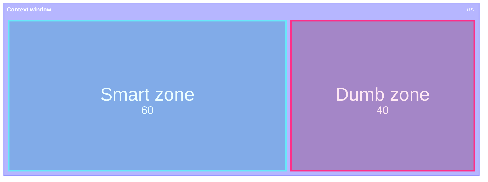
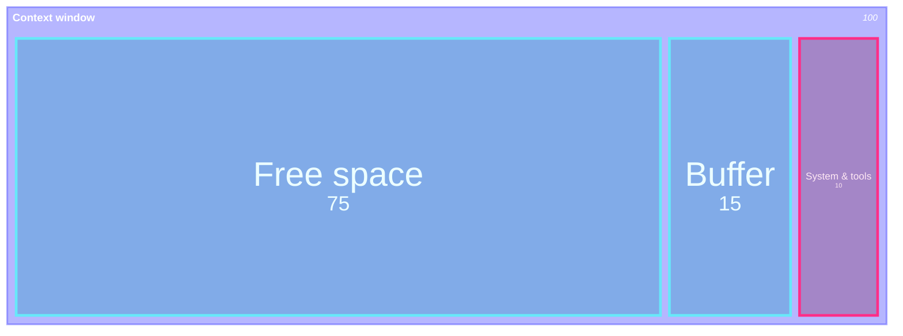
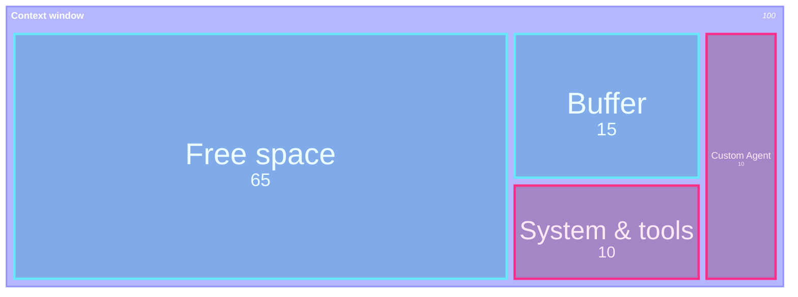
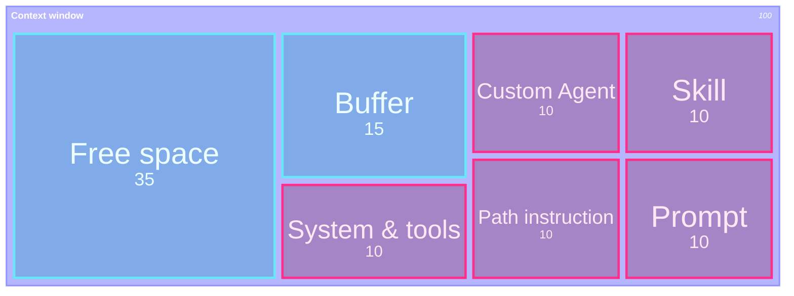
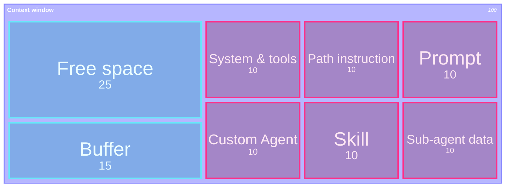
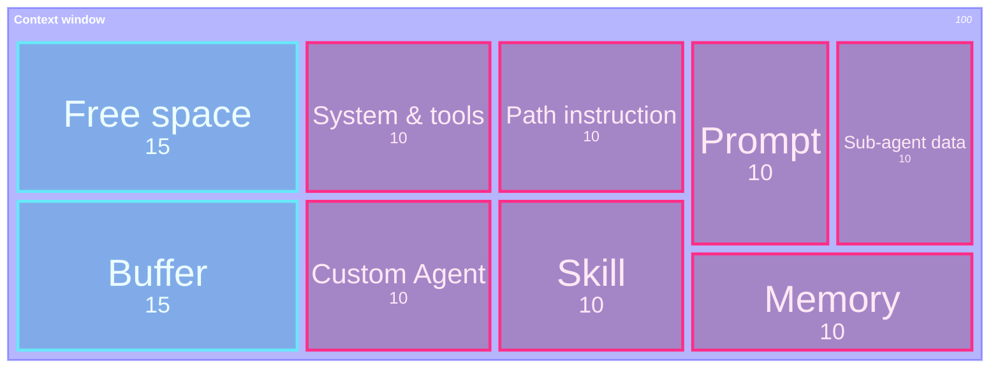

## At a Glance

  

    <strong>Context Engineering</strong> is the practice of designing the context passed to AI with "as little as possible, but as much as necessary."
  

  

    Rather than making AI read everything, you narrow down the goal, constraints, relevant files, and verification method so AI can pick its next move without hesitation.
  

> Good context is not about quantity — it's about **selection**. Reduce what's unnecessary; never omit what's needed.

## Context Rot

A larger context window does not make an LLM smarter. Cramming in too much information causes **Lost in the Middle** — important details get buried in the center — or **Recency Bias** — recent information gets overweighted — blunting the model's judgment.

This is called **context rot**.

> The goal of Context Engineering is not to fill the context window, but to **keep the necessary information visible**.

## Context Window: Start

Start is nearly ideal. Only the always-needed system/tools are loaded, leaving plenty of working space.

## Context Window: Custom Agent

Switching to a custom agent adds that agent's instruction to the context.

## Context Window: Prompt

You write a prompt. For example, asking to "add a test" may cause a relevant skill and the path instruction for tests to be loaded.

## Context Window: Sub-agent

Sub-agents for exploration, database, review, etc. can return a summary of their findings to the main agent.

## Context Window: Memory

As you keep working in the repo, memories are generated and may be dynamically loaded when needed.

