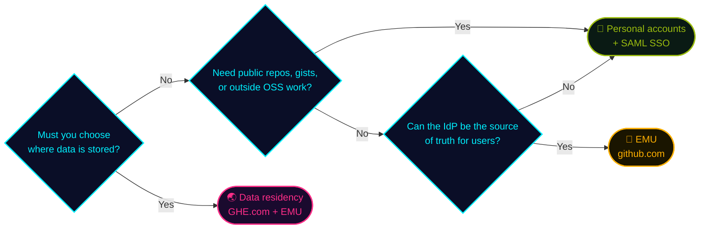

## In a nutshell

  

    GitHub Enterprise Cloud comes in three setups, depending on <strong>who manages the accounts</strong> and <strong>where the data lives</strong>.
  

  

    <strong>EMU</strong> issues accounts from your company IdP. <strong>Data residency</strong> builds on EMU and hosts your enterprise on a dedicated <strong>GHE.com</strong> subdomain, storing code and data in <strong>a region of your choice, such as Japan</strong>.
  

## Three GHEC setups <a class="h2-doc" href="https://docs.github.com/en/enterprise-cloud@latest/admin/concepts/enterprise-fundamentals/choose-an-enterprise-type" target="_blank" rel="noopener noreferrer">📖 Docs</a>

At creation you pick the **account type** and the **data hosting region**.

| | Personal accounts | **EMU** | **Data residency** |
| --- | --- | --- | --- |
| 🌐 URL | github.com | github.com | `<subdomain>.ghe.com` |
| 👤 Accounts | Self-created | From the IdP | From the IdP (**EMU**) |
| 🔑 IdP | Optional (SAML) | SSO + SCIM | SSO + SCIM |
| 📢 Public repos, gists | ✅ | ❌ | ❌ |
| 🤝 Outside collaboration | ✅ | ❌ Read-only | ❌ GHE.com only |
| 🗾 Data stored in | US | US | EU, AU, US, **Japan** |

## EMU vs SAML-only <a class="h2-doc" href="https://docs.github.com/en/enterprise-cloud@latest/admin/concepts/identity-and-access-management/enterprise-managed-users" target="_blank" rel="noopener noreferrer">📖 Docs</a>

Personal accounts can still use SAML SSO. The difference is **who owns the account** and **how people sign in**.

| | Personal accounts + SAML | **EMU** |
| --- | --- | --- |
| 👤 Accounts | Created by the user | Created, updated, suspended by the IdP |
| 🔗 Integration level | Enterprise or org | **Enterprise only** |
| 🔑 SCIM | Optional (per org) | **Auth and SCIM both required** |
| 🚪 Sign-in | GitHub password, then IdP | IdP from the start |
| 🏷️ Username | Managed by the user | Managed by the IdP (`mona_octocorp`) |

## Admin reach

Personal accounts also exist **outside** the enterprise, so some areas are beyond the admin's policies. With EMU, the account itself lives **inside** the enterprise.

| What | Personal accounts | **EMU** |
| --- | --- | --- |
| 🏢 Public repos in the enterprise | ✅ By policy | 🚫 Blocked |
| 🌍 Outside orgs and their policies | ⚠️ Out of reach | 🚫 Can't join |
| 👤 Personal public repos | ⚠️ Out of reach | 🚫 Blocked |
| 🔒 Personal private repos | ⚠️ Out of reach | ✅ Allow or block |
| 📝 Gists, PRs or stars outside | ⚠️ Out of reach | 🚫 Blocked |

✅ Admin can control ⚠️ Outside admin reach 🚫 Blocked by design

## EMU restrictions <a class="h2-doc" href="https://docs.github.com/en/enterprise-cloud@latest/admin/managing-iam/understanding-iam-for-enterprises/abilities-and-restrictions-of-managed-user-accounts" target="_blank" rel="noopener noreferrer">📖 Docs</a>

Tighter control comes with trade-offs. Check these four points before adopting.

▸ Click + for details

👥Everyone is a managed userExternals live in the IdP too<a class="ctl-doc" href="https://docs.github.com/en/enterprise-cloud@latest/admin/managing-accounts-and-repositories/managing-users-in-your-enterprise/enabling-guest-collaborators" target="_blank" rel="noopener noreferrer">Docs</a>

ScopeContractors and outside developers also need an account in Entra ID or Okta

FixProvision them from the IdP and use the <b>guest collaborator</b> role to limit internal repo access

🔑One IdP onlySame IdP for auth and SCIM<a class="ctl-doc" href="https://docs.github.com/en/enterprise-cloud@latest/admin/concepts/identity-and-access-management/enterprise-managed-users" target="_blank" rel="noopener noreferrer">Docs</a>

PartnersEntra ID (SAML / OIDC), Okta (SAML), PingFederate (SAML)

NoteMixing <b>Okta and Entra ID</b> (one for auth, the other for SCIM) is not supported

🚫No public contentPublic repos, gists, public Pages<a class="ctl-doc" href="https://docs.github.com/en/enterprise-cloud@latest/admin/managing-iam/understanding-iam-for-enterprises/abilities-and-restrictions-of-managed-user-accounts" target="_blank" rel="noopener noreferrer">Docs</a>

VisibilityOnly <b>private and internal</b> repos. Use internal repos for InnerSource

OtherCannot create or comment on gists, no GitHub Pages visible outside the enterprise

🤝No outside collaborationOSS needs a second account<a class="ctl-doc" href="https://docs.github.com/en/enterprise-cloud@latest/admin/managing-iam/understanding-iam-for-enterprises/getting-started-with-enterprise-managed-users" target="_blank" rel="noopener noreferrer">Docs</a>

ScopeCannot push, open PRs or issues, star, or fork outside the enterprise (public repos are read-only)

ImpactOSS contributors keep a personal account too. Watch for leaks when switching accounts

## What is data residency (GHE.com)? <a class="h2-doc" href="https://docs.github.com/en/enterprise-cloud@latest/admin/data-residency/about-github-enterprise-cloud-with-data-residency" target="_blank" rel="noopener noreferrer">📖 Docs</a>

GitHub.com stores data in the **US** by default. With data residency, your enterprise lives on a **dedicated GHE.com subdomain** (e.g. `octocorp.ghe.com`) in the region you choose.

- 🗺️ **Regions**: EU, Australia, US, **Japan** (GA Dec 2025)
- 🔐 **Identity**: **EMU only**, isolated from the GitHub.com community
- ☁️ **vs GHES**: Latest features like Copilot, no upgrade downtime

| 📍 Stored in region | 🌐 May leave the region |
| --- | --- |
| Repos, code, PRs, comments | Telemetry with pseudonymous IDs |
| Actions data and logs, BCDR | Billing, license, support data |
| Email, username, name, IP | Copilot data (default), secret validity checks |

## Differences from GitHub.com <a class="h2-doc" href="https://docs.github.com/en/enterprise-cloud@latest/admin/data-residency/feature-overview-for-github-enterprise-cloud-with-data-residency" target="_blank" rel="noopener noreferrer">📖 Docs</a>

Features are close to EMU on GitHub.com. A few are unavailable, and **URLs change**.

- 🛒 **No GitHub Marketplace**: install actions and apps from source
- 🍎 No **macOS runners** or **Maven / Gradle** packages yet
- 📊 No org or enterprise **dependency insights** yet

| Use | GitHub.com | GHE.com |
| --- | --- | --- |
| API | `api.github.com` | `api.SUBDOMAIN.ghe.com` |
| Container registry | `ghcr.io` | `containers.SUBDOMAIN.ghe.com` |
| SSH clone | `git@github.com:` | `SUBDOMAIN@SUBDOMAIN.ghe.com:` |

> ⚠️ IP ranges and SSH fingerprints also differ from GitHub.com. Update firewall, IdP, and storage allowlists for GHE.com.

## Copilot with data residency <a class="h2-doc" href="https://docs.github.com/en/enterprise-cloud@latest/admin/data-residency/github-copilot-with-data-residency" target="_blank" rel="noopener noreferrer">📖 Docs</a>

Assign **Copilot Business or Enterprise** to use Copilot on GHE.com (no Pro or Free). Copilot data is processed **outside your region by default**. To keep it in region, enable the **Restrict Copilot to data residency compliant models** policy (off by default).

| | Default | **Policy enabled** |
| --- | --- | --- |
| 🧠 Inference, prompts, logs | May leave the region | **Stays in region** |
| 🤖 Available models | All models | Region-certified models only |
| 💰 AI credit consumption | Standard | **+10%** |
| 🗺️ Supported regions | All regions | **US and EU only** |

> ⚠️ The Japan region does not yet support in-region Copilot inference. Japanese enterprises still have Copilot data processed outside the region.

## ★ Which one to choose? <a class="h2-doc" href="https://docs.github.com/en/enterprise-cloud@latest/admin/concepts/enterprise-fundamentals/choose-an-enterprise-type" target="_blank" rel="noopener noreferrer">📖 Docs</a>

Decide **before you create the enterprise**. Three questions get you there.

> ⚠️ You cannot switch types after creation. Moving from a personal-account enterprise to EMU or GHE.com means creating a new enterprise and migrating (for example with GitHub Enterprise Importer).
