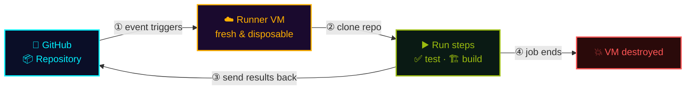

## In a nutshell

<div class="hero-quote">
  <p>
    <strong>GitHub Actions</strong> is a continuous integration and continuous delivery (CI/CD) platform.
  </p>
  <p>
    But it <strong>goes beyond just DevOps</strong>: run workflows when <strong>any event happens in your repository</strong> — push, PR, issue, label, schedule, and more. It's automation for <strong>almost anything</strong>.
  </p>
</div>

## What workflow does it automate?

Beyond CI/CD, GitHub Actions can automate **every stage of the SDLC**, all triggered by events.


## The metrics it improves (DORA)

The point of automation (CI/CD, tests, reviews) is to raise both **speed and stability**. The yardstick is the four <a class="retro-link" href="https://dora.dev/" target="_blank" rel="noopener noreferrer">DORA metrics ↗</a> — push them toward Elite.

| DORA metric | 🟢 Elite | 🟣 High | 🟠 Medium | 🔴 Low |
| --- | --- | --- | --- | --- |
| 🚀 Deployment frequency | Multiple times/day | Once/day–once/week | Once/week–once/month | Once/month–once/6 months |
| ⏱️ Lead time for changes | < 1 day | 1 day–1 week | 1 week–1 month | 1 month–6 months |
| ❌ Change failure rate | 0–15% | 0–15% | 0–15% | 46–60% |
| 🔧 Mean time to recovery | < 1 hour | < 1 day | < 1 day | 1 week–1 month |

> 🎯 Automation's value: raise speed (frequency, lead time) and stability (failure rate, recovery) **at the same time**.

## Architecture: clone → run → destroy

Your GitHub repo is cloned onto a **disposable cloud VM**; steps (like tests) run there, results are sent back, and the **VM is destroyed**.



> 🔁 Results return as checks, logs, and artifacts; the VM is discarded every run.

## How it works (core concepts)

It's very simple: **when an event fires, borrow a clean VM, clone the repo, and run the steps you wrote — in order**.

- 📁 **Location** — `.github/workflows/*.yml` (multiple files supported)
- ⚡ **Triggers** — `push` / `pull_request` / `schedule` (cron) / `workflow_dispatch` (manual) / `issues` / `release` and 35+ other events
- 🖥️ **Execution environment** — a fresh **GitHub-hosted runner** (Linux / Windows / macOS VM) starts up per job
- 📦 **Repo cloned every time** — `actions/checkout` full-clones into `$GITHUB_WORKSPACE` (no state carried over from previous jobs)
- ⏱️ **Time limits** — 6 hours max per job, 35 days max per workflow (matrix parallelism is supported)
- �� **Secrets** — stored in `Settings → Secrets` → referenced as `${{ secrets.NAME }}` (masked in logs)

> 🧠 "Start from scratch every time" is the golden rule of GitHub Actions. To persist state, use `actions/cache`, artifacts, or rely on already-deployed infrastructure.

## GitHub-hosted runners vs Self-hosted runners

| Aspect | 🟢 GitHub-hosted runner | 🛠️ Self-hosted runner |
| --- | --- | --- |
| Management | GitHub provides, updates, and discards | You run it on your own server / VM / k8s |
| OS | Linux / Windows / macOS | Anything (Raspberry Pi, on-prem LAN, GPU machines) |
| Network | Public internet | Direct access to internal networks / VPN resources |
| Scale | Auto-starts on demand, unlimited parallelism (within plan limits) | You manage capacity |
| Cost | **Time-based billing** (see table below) | **Runner itself is free** (just your own infra costs) |
| Use case | General CI/CD, OSS, lightweight jobs | Dedicated hardware, internal resource access, sensitive workloads, huge builds |

> 🌐 As a middle ground, consider **larger runners** (high-spec GitHub-hosted) or **Actions Runner Controller** to run auto-scaling self-hosted runners on k8s.

## Reuse components from the Marketplace

You don't have to write everything from scratch. **GitHub Marketplace** has **20,000+** reusable actions.

```yaml
steps:
  - uses: actions/checkout@v4              # GitHub official: clone repo
  - uses: actions/setup-node@v4            # Set up Node.js environment
    with: { node-version: 20 }
  - uses: docker/build-push-action@v5      # Build & push Docker image
  - uses: aws-actions/configure-aws-credentials@v4
```

- 🏷️ **Official verified actions** — GitHub, AWS, Azure, GCP, Docker, HashiCorp, and other major vendors
- 🔓 **OSS actions** — anyone can publish (`uses: owner/repo@sha` to reference)
- 📌 **Always pin versions** — **commit SHA pins** are safer than tags (`@v4`) against supply chain attacks
- 🛡️ **Org allowlist** — restrict available actions via `Settings → Actions → Allowed actions`

## Getting started (fastest path)

Just drop a `.github/workflows/ci.yml`:

```yaml
name: CI
on:
  push:        { branches: [main] }
  pull_request:
jobs:
  test:
    runs-on: ubuntu-latest
    steps:
      - uses: actions/checkout@v4
      - uses: actions/setup-node@v4
        with: { node-version: 20 }
      - run: npm ci
      - run: npm test
```

The moment you push, execution logs appear in the **Actions tab**. Failures show as ❌ on the PR.

> 🚀 Start with `runs-on: ubuntu-latest` for everything, then scale out to Windows / macOS / larger runners / self-hosted as needed.

## Eligibility and pricing

**Public repos get GitHub-hosted runners completely free — only concurrency limits apply.** Private repos get a monthly free tier per plan; overages are pay-as-you-go.

### Free tier per plan (private repos / month)

| Plan | Actions minutes / month | Storage |
| --- | :---: | :---: |
| Free | 2,000 min | 500 MB |
| Pro | 3,000 min | 1 GB |
| Team | 3,000 min | 2 GB |
| Enterprise | 50,000 min | 50 GB |

> 💡 Free tier counts **Linux as 1× multiplier**. Windows consumes **2×** and macOS consumes **10×** — watch out.

### Per-OS / per-size unit pricing (overages · 2-core standard)

| OS / Runner | Multiplier | Unit price (USD/min) | Notes |
| --- | :---: | :---: | --- |
| Linux 2-core | 1× | $0.008 | Standard, cheapest |
| Windows 2-core | 2× | $0.016 | 2× Linux |
| macOS 3-core | 10× | $0.08 | iOS / Mac builds |
| Linux 4-core (larger) | — | $0.016 | Team / Enterprise |
| Linux 8-core (larger) | — | $0.032 | |
| Linux 16-core (larger) | — | $0.064 | |
| Linux 64-core (larger) | — | $0.256 | Huge builds |
| GPU runner | — | $0.07+ | ML / inference |

> 💰 Storage overages are **$0.25 / GB** (artifacts + Actions cache + Packages combined).  
> 🛠️ **Self-hosted runners incur no GitHub billing** (as of now). Running on your own server / k8s means execution time is free — you just pay for your own infrastructure and electricity.  
> 🌍 Billing is **usage-time-based, not per active committer**. Even a solo developer who runs CI heavily will see charges.

## Cloud Agent / Copilot Code Review also run here

> 🤖 When **Copilot Cloud Agent** implements a task, or when **Copilot Code Review** reads a PR — both run as **GitHub Actions workflows** under the hood. They consume Actions free-tier minutes and appear as Actions logs. See <a class="retro-link" href="/theomonfort/en/playbook/cloud-agent/">Cloud Agent</a> and <a class="retro-link" href="/theomonfort/en/playbook/copilot-code-review/">Copilot Code Review</a> for details.
