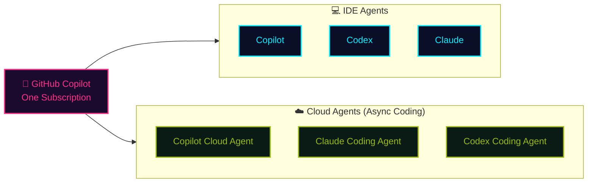

## At a Glance

  
GitHub Copilot is the world's most widely adopted <strong>AI developer tool</strong>.

  
It accelerates your <strong>flow</strong> across every surface — <strong>IDE, terminal, and GitHub.com</strong>.

## AI Models & Surfaces

Available AI models: OpenAI / Anthropic / Google Gemini / xAI Grok, plus support for **custom models** and **BYOK (Bring Your Own Key)**.

Available surfaces:

- **IDE**: VS Code / Visual Studio / JetBrains / Xcode / Eclipse / Neovim
- **Terminal**: Interact from the shell with Copilot CLI
- **SDK**: Embed Copilot directly into your own applications
- **Cloud**: Autonomous execution from the browser via Cloud Agent · Automatic PR review with Copilot Code Review
- **Automation**: Codify workflows with Agentic Workflow
- **Web / Mobile**: Chat from GitHub.com and GitHub Mobile · Remote CLI control · Launch Cloud Agents

## Developer Impact

The impact GitHub Copilot has on developers  
Results from a 6-month study of 450 Accenture developers (2025)

| Activity | Productivity | Efficiency | Satisfaction |
|---:|---:|---:|---:|
| 94% reported maintaining a "flow state" at work | 90% feel they write better code | 50% increase in number of builds | 96% felt successful from day one |
| 90% spend less time searching for information | 88% of Copilot-suggested code was accepted as-is | 84% improvement in build success rate | 90% improvement in job satisfaction |

## Use Codex & Claude with a Single Subscription

With a GitHub Copilot subscription, you can use the **Codex** and **Claude** **agents (harness)** — both in the **IDE** and as a **Cloud Agent**. Usage is paid directly through **Copilot AI credits**, so no extra contract is needed.

## Why Enterprises Choose Copilot

-  **Orchestration** 　AI that spans the entire SDLC, not just coding
-  **Freedom of choice across models, agents, and surfaces** 　The best model and interface for every workflow. No vendor lock-in
-  **Enterprise controls** 　Centralized governance, visibility, and security
-  **Compliance** 　Copilot Proxy, policy controls, public-code filtering, and Microsoft IP protection for eligible use
-  **Best cost-performance** 　Pooled usage, rich built-in entitlements, and maximum price advantage via ACD

## Secure & Compliant Architecture

```mermaid
---
config:
  flowchart:
    htmlLabels: true
  themeCSS: |
    .nodeLabel { text-align: center !important; }
    .nodeLabel .llm-row { display: flex !important; flex-direction: row !important; justify-content: center !important; align-items: center !important; gap: 6px !important; margin-top: 4px !important; }
    .nodeLabel .llm-row img { width: 22px !important; height: 22px !important; object-fit: contain !important; }
    .nodeLabel img.proxy-ico { width: 18px !important; height: 18px !important; display: inline-block !important; margin: 0 6px 0 0 !important; vertical-align: middle !important; }
---
flowchart LR
  Dev["👤 Developer"]
  Proxy["<img class='proxy-ico' src='/theomonfort/github-copilot-white-icon.png'/><b>Copilot Proxy</b>"]
  LLM["<b>LLM Providers</b><div class='llm-row'><img src='/theomonfort/llm-openai.png'/><img src='/theomonfort/llm-anthropic.svg'/><img src='/theomonfort/llm-gemini.png'/><img src='/theomonfort/llm-grok.png'/></div>"]

  Dev -->|"Context"| Proxy
  Proxy -->|"Suggestions"| Dev
  Proxy <-->|" "| LLM

  classDef llm fill:#0a1a14,stroke:#9bbc0f,color:#9bbc0f,stroke-width:2px
  classDef proxy fill:#0a0e27,stroke:#00f0ff,color:#00f0ff,stroke-width:2px
  classDef dev fill:#1a0a2e,stroke:#ff2e88,color:#ff2e88,stroke-width:2px
  class LLM llm
  class Proxy proxy
  class Dev dev
```

**Prompts and generated code** pass through **Copilot Proxy** — designed for safe enterprise use. 
🔗 See the <a href="https://resources.github.com/en/copilot-trust-center/" target="_blank" rel="noopener noreferrer" class="retro-link">Copilot Trust Center</a> for full details.

What Copilot Proxy does:

- 🔒 Removes **PII (Personally Identifiable Information)** from context
- 🚫 Filters **inappropriate content** from context
- 🛡️ Checks context for **common security vulnerabilities**
- ⚖️ Passes suggestions through an **IP (Intellectual Property) filter**
- 🔐 All data is **encrypted in transit**
