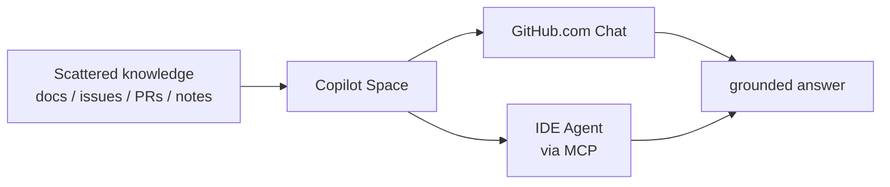

## In a nutshell

<div class="hero-quote hero-quote-chat">
  <p>
    <strong>Spaces</strong> gives Copilot a <strong>curated context room</strong> for a task, system, or team.
  </p>
  <p>
    Collect repos, files, issues, pull requests, notes, images, uploaded documents, and instructions, then ask Copilot questions grounded in that context.
  </p>
</div>

> 🎯 A Space is not a new IDE. It is a **shareable context artifact** that prevents the same background explanation from being repeated over and over.

## What can you add?

| Source | Examples | Best use |
| --- | --- | --- |
| **Instructions** | Role, expected answers, what to avoid | Shape how Copilot behaves inside the Space |
| **GitHub content** | Repos / folders / files / issues / PRs | Reference current code and discussions |
| **Uploads** | Images, documents, spreadsheets | Bring in background outside GitHub |
| **Text content** | Meeting notes, design notes, FAQs | Turn tribal knowledge into searchable context |

> 💡 GitHub-based sources stay in sync as the project changes, making a Space an evergreen expert for that topic.

## Repo vs File

| Source type | How Copilot treats it | Use when |
| --- | --- | --- |
| **Repository** | Copilot does not load the whole repo into the context window. It searches and retrieves relevant content for the question. | Large codebases, architecture questions, cross-cutting discovery |
| **File / Folder** | Important files are prioritized; individual file contents are considered more consistently. | Specs, API contracts, design decisions, key implementations |
| **Uploaded file** | Copilot uses the uploaded snapshot. | External docs, images, transcripts, spreadsheets |

> ⚠️ Do not dump everything. Choose sources that answer the task. This is Context Engineering in practice.

## Sharing and permissions

Spaces can belong to a **personal account** or an **organization**. Sharing options depend on ownership.

| Owner | Sharing model | Roles |
| --- | --- | --- |
| **Organization** | Share with org members, teams, or users | Admin / Editor / Viewer / No access |
| **Individual** | Private, specific users, or anyone with the link | Public Spaces are view-only by default |

> 🔐 Viewers only see sources they already have access to. Sharing a Space does not bypass GitHub permissions.

## Use it from your IDE

Spaces also work from IDE Agent mode through the **GitHub MCP Server**. Enable the `copilot_spaces` toolset.

```json
{
  "servers": {
    "github": {
      "type": "http",
      "url": "https://api.githubcopilot.com/mcp/",
      "headers": {
        "X-MCP-Toolsets": "default,copilot_spaces"
      }
    }
  }
}
```

> 🔌 In the IDE, Copilot uses `list_copilot_spaces` and `get_copilot_space` to access Space context. This requires **Agent mode**.

## ★ Killer use cases



- 🚀 **Feature kickoff** — collect the spec, related code, mockups, and design notes in one place
- 🧭 **Onboarding** — make auth, billing, CI, and other high-question areas self-service
- 🔁 **Repeated tasks** — standardize telemetry, review checklists, and release flows
- 👥 **Fewer handoffs** — capture SME context once and let everyone reuse it

## Failure modes

| ❌ Common mistake | ✅ Better move |
| --- | --- |
| Add everything | Scope sources to the task, system, or team |
| Leave instructions empty | Define the Space's role, expected answers, and boundaries |
| Rely only on uploads | Use GitHub sources so context stays current |
| Share publicly by default | Choose personal vs org ownership and permissions first |
| Expect the Space to implement | A Space is context. Ask Chat / Agent / Cloud Agent to do the work |

> 🎯 A strong Space is not a file dump. It is a **context product** that helps Copilot answer without guessing.
