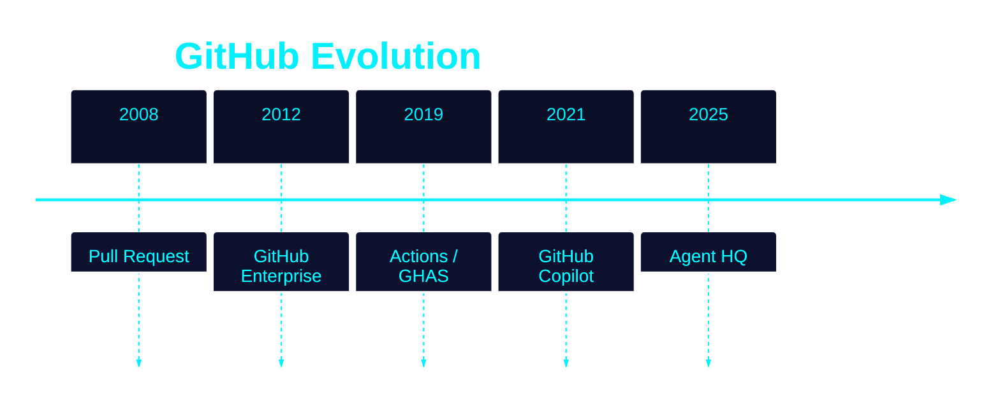
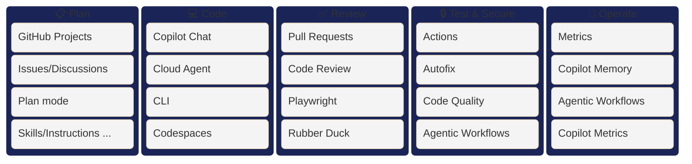
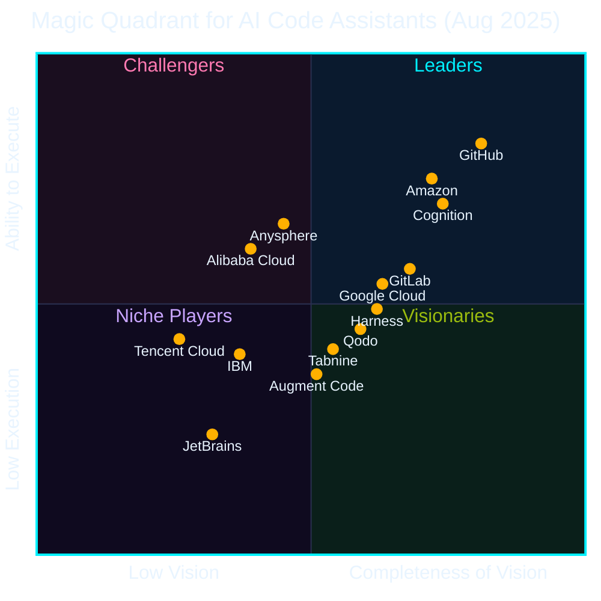

## At a Glance

  
Hi, I'm <strong>Mona</strong> — full name <strong>Mona Lisa Octocat</strong>. I was originally drawn by British illustrator <a href="https://en.wikipedia.org/wiki/Octocat" target="_blank" rel="noopener noreferrer">Simon Oxley</a> as a character called "Octopuss" sold on iStockphoto. In <strong>2008</strong>, GitHub bought the exclusive rights, renamed me Octocat, and I've been the face of GitHub ever since.

  
Today's topic, <strong>GitHub</strong>, is the world's largest AI-native developer platform — home to <strong>180 million+</strong> developers.

## GitHub by the Numbers

  <ul>
    <li>GitHub developers: <strong>180 million+</strong> worldwide (<a href="https://github.blog/news-insights/octoverse/octoverse-a-new-developer-joins-github-every-second-as-ai-leads-typescript-to-1/">2025</a>)</li>
    <li>GitHub Copilot registered users: <strong>20 million+</strong> (<a href="https://www.microsoft.com/en-us/investor/events/fy-2025/earnings-fy-2025-q4.aspx">2025</a>)</li>
    <li>GitHub Copilot paid subscriptions: <strong>4.7 million+</strong> (<a href="https://www.getpanto.ai/blog/github-copilot-statistics">2026</a>)</li>
    <li>Enterprise customers: <strong>77,000+</strong> (<a href="https://www.microsoft.com/investor/reports/ar24/">2024</a>)</li>
    <li><strong>~90%</strong> of the Fortune 100 have adopted Copilot (<a href="https://www.microsoft.com/en-us/investor/events/fy-2025/earnings-fy-2025-q4.aspx">2025</a>)</li>
    <li><strong>~42%</strong> market share in paid AI coding tools (<a href="https://www.secondtalent.com/resources/github-copilot-statistics/">2025</a>)</li>
  </ul>

## The Evolution of GitHub

Looking back at GitHub's journey reveals where we are today ──

- **2008 · Pull Request** established the industry standard for sharing and collaboration
- **2012 · GitHub Enterprise** addressed management and security for large enterprises
- **2019 · Actions / GHAS** integrated CI/CD and DevSecOps directly into workflows
- **2021 · GitHub Copilot** delivered the world's first AI coding assistant
- **2025 · Agent HQ** ushers in an era where AI autonomously supports development ── this is our main focus today

## AI Developer Platform

From **Plan → Code → Review → Test & Security → Operate**, AI on GitHub supports the entire SDLC end-to-end.

## Industry Recognition

Third-party analysts also recognize GitHub as **the leader in AI coding**.

- **IDC**: Named a **Leader** in AI Coding and Software Engineering Technologies
- **Gartner**: Named a **Leader** in the Magic Quadrant for **AI Code Assistants**

