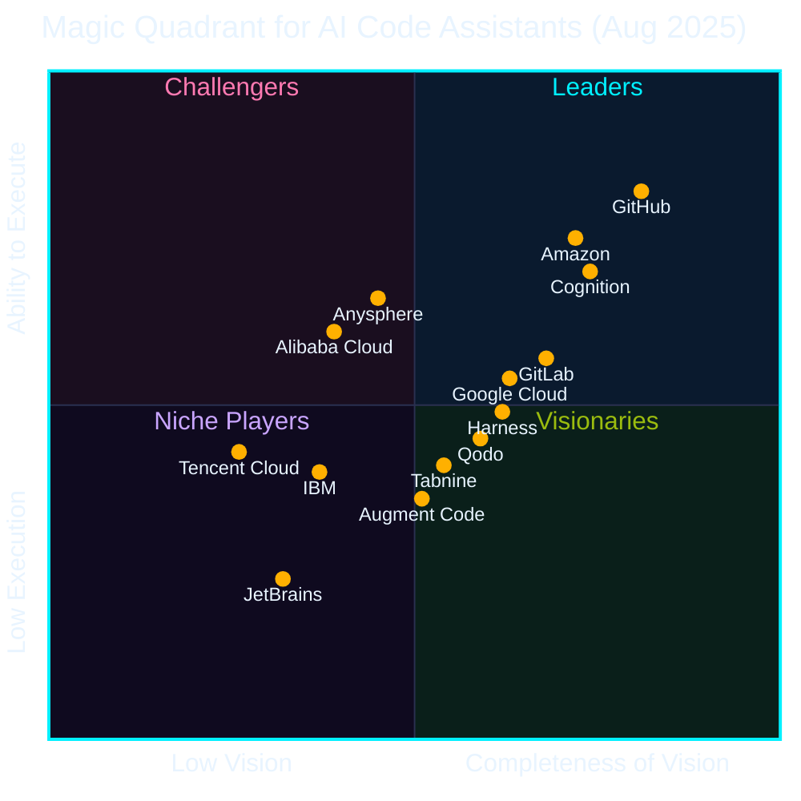

## At a Glance

  
Hi, I'm <strong>Mona</strong> — the face of <strong>GitHub</strong>, watching over developers worldwide.

  
Today's topic, <strong>GitHub</strong>, is the world's largest AI-native developer platform — home to <strong>180 million+</strong> developers.

## GitHub by the Numbers

- GitHub developers: **180 million+** worldwide ([2025](https://github.blog/news-insights/octoverse/octoverse-a-new-developer-joins-github-every-second-as-ai-leads-typescript-to-1/))
- GitHub Copilot registered users: **20 million+** ([2025](https://www.microsoft.com/en-us/investor/events/fy-2025/earnings-fy-2025-q4.aspx))
- GitHub Copilot paid subscriptions: **4.7 million+** ([2026](https://www.getpanto.ai/blog/github-copilot-statistics))
- Enterprise customers: **77,000+** ([2024](https://www.microsoft.com/investor/reports/ar24/))
- **~90%** of the Fortune 100 have adopted Copilot ([2025](https://www.microsoft.com/en-us/investor/events/fy-2025/earnings-fy-2025-q4.aspx))
- **~42%** market share in paid AI coding tools ([2025](https://www.secondtalent.com/resources/github-copilot-statistics/))

## The Evolution of GitHub

Looking back at GitHub's journey reveals where we are today ──

<figure class="rpi-pipeline" style="margin:2em 0;">
<svg viewBox="0 0 1100 480" xmlns="http://www.w3.org/2000/svg" style="width:100%;height:auto;display:block;font-family:'DotGothic16','Courier New',monospace;">
  <defs>
    <marker id="ghTimelineArrow" viewBox="0 0 10 10" refX="9" refY="5" markerWidth="9" markerHeight="9" orient="auto">
      <path d="M 0 0 L 10 5 L 0 10 Z" fill="#00f0ff"/>
    </marker>
    <filter id="ghTimelineGlow" x="-60%" y="-60%" width="220%" height="220%">
      <feGaussianBlur stdDeviation="4.5" result="blur"/>
      <feMerge>
        <feMergeNode in="blur"/>
        <feMergeNode in="SourceGraphic"/>
      </feMerge>
    </filter>
  </defs>
  <rect x="0" y="0" width="1100" height="480" fill="none"/>
  <path d="M 80 430 C 260 440, 380 410, 530 330 C 680 250, 820 160, 1050 30" stroke="#0a0e27" stroke-width="14" fill="none" stroke-linecap="round"/>
  <path d="M 80 430 C 260 440, 380 410, 530 330 C 680 250, 820 160, 1050 30" stroke="#00f0ff" stroke-width="2.5" fill="none" stroke-linecap="round" marker-end="url(#ghTimelineArrow)"/>
  <g>
    <line x1="80" y1="422" x2="80" y2="404" stroke="#00f0ff" stroke-width="1" stroke-dasharray="3 3" opacity="0.55"/>
    <circle cx="80" cy="430" r="7" fill="#0a0e27" stroke="#00f0ff" stroke-width="2.5"/>
    <rect x="40" y="372" width="80" height="32" rx="16" fill="#0a0e27" stroke="#00f0ff" stroke-width="1.5"/>
    <text x="80" y="394" text-anchor="middle" fill="#00f0ff" font-size="16" font-weight="bold">2008</text>
    <text x="80" y="340" text-anchor="middle" fill="#e8f4ff" font-size="18" font-weight="bold">Pull Request</text>
    <text x="80" y="358" text-anchor="middle" fill="#e8f4ff" font-size="11">Industry standard for collab</text>
  </g>
  <g>
    <line x1="316" y1="406" x2="316" y2="390" stroke="#00f0ff" stroke-width="1" stroke-dasharray="3 3" opacity="0.55"/>
    <circle cx="316" cy="414" r="7" fill="#0a0e27" stroke="#00f0ff" stroke-width="2.5"/>
    <rect x="244" y="358" width="144" height="32" rx="16" fill="#0a0e27" stroke="#00f0ff" stroke-width="1.5"/>
    <text x="316" y="380" text-anchor="middle" fill="#00f0ff" font-size="16" font-weight="bold">2012</text>
    <text x="316" y="325" text-anchor="middle" fill="#e8f4ff" font-size="18" font-weight="bold">GitHub Enterprise</text>
    <text x="316" y="345" text-anchor="middle" fill="#e8f4ff" font-size="11">Management &amp; security at scale</text>
  </g>
  <g>
    <line x1="530" y1="322" x2="530" y2="302" stroke="#00f0ff" stroke-width="1" stroke-dasharray="3 3" opacity="0.55"/>
    <circle cx="530" cy="330" r="7" fill="#0a0e27" stroke="#00f0ff" stroke-width="2.5"/>
    <rect x="450" y="270" width="160" height="32" rx="16" fill="#0a0e27" stroke="#00f0ff" stroke-width="1.5"/>
    <text x="530" y="292" text-anchor="middle" fill="#00f0ff" font-size="16" font-weight="bold">2019</text>
    <text x="530" y="237" text-anchor="middle" fill="#e8f4ff" font-size="18" font-weight="bold">Actions / GHAS</text>
    <text x="530" y="257" text-anchor="middle" fill="#e8f4ff" font-size="11">CI/CD &amp; DevSecOps in your workflow</text>
  </g>
  <g>
    <line x1="760" y1="207" x2="760" y2="240" stroke="#00f0ff" stroke-width="1" stroke-dasharray="3 3" opacity="0.55"/>
    <circle cx="760" cy="199" r="7" fill="#0a0e27" stroke="#00f0ff" stroke-width="2.5"/>
    <rect x="688" y="240" width="144" height="32" rx="16" fill="#0a0e27" stroke="#00f0ff" stroke-width="1.5"/>
    <text x="760" y="262" text-anchor="middle" fill="#00f0ff" font-size="16" font-weight="bold">2021</text>
    <text x="760" y="290" text-anchor="middle" fill="#e8f4ff" font-size="18" font-weight="bold">GitHub Copilot</text>
    <text x="760" y="308" text-anchor="middle" fill="#e8f4ff" font-size="11">World's first AI coding assistant</text>
  </g>
  <g>
    <line x1="984" y1="80" x2="984" y2="118" stroke="#00f0ff" stroke-width="1.5" stroke-dasharray="3 3" opacity="0.85"/>
    <g filter="url(#ghTimelineGlow)">
      <circle cx="984" cy="68" r="11" fill="#00f0ff"/>
      <circle cx="984" cy="68" r="4" fill="#05060f"/>
    </g>
    <rect x="924" y="118" width="120" height="38" rx="19" fill="#00f0ff" stroke="#00f0ff" stroke-width="2"/>
    <text x="984" y="144" text-anchor="middle" fill="#05060f" font-size="18" font-weight="bold">2025</text>
    <text x="984" y="176" text-anchor="middle" fill="#00f0ff" font-size="20" font-weight="bold">Agent HQ</text>
    <text x="984" y="196" text-anchor="middle" fill="#e8f4ff" font-size="11">AI autonomously powers dev</text>
    <text x="984" y="216" text-anchor="middle" fill="#e8f4ff" font-size="11">★ Today's main focus</text>
  </g>
</svg>
</figure>

## AI Developer Platform

From **Plan → Code → Review → Test & Security → Operate**, AI on GitHub supports the entire SDLC end-to-end.

<figure class="rpi-pipeline" style="margin:2em 0;">
<svg viewBox="0 0 1080 510" xmlns="http://www.w3.org/2000/svg"
     shape-rendering="crispEdges"
     style="width:100%;height:auto;display:block;font-family:'DotGothic16','Courier New',monospace;">
  <rect x="0" y="0" width="1080" height="510" fill="none"/>

  <!-- ── Card 1: PLAN ── magenta ─────────────────────────────────── -->
  <g>
    <rect x="16" y="64" width="200" height="400" fill="#1a0610"/>
    <rect x="12" y="60" width="200" height="400" fill="#0a0e27" stroke="#ff2e88" stroke-width="3"/>
    <path d="M 18 66 h 12 M 18 66 v 12 M 206 66 h -12 M 206 66 v 12 M 18 454 h 12 M 18 454 v -12 M 206 454 h -12 M 206 454 v -12" stroke="#ff2e88" stroke-width="2" fill="none"/>
    <rect x="32" y="38" width="160" height="44" fill="#05060f" stroke="#ff2e88" stroke-width="3"/>
    <text x="112" y="67" text-anchor="middle" fill="#ff2e88" font-size="18" font-weight="bold">▮ PLAN</text>
    <line x1="22" y1="100" x2="202" y2="100" stroke="#ff2e88" stroke-width="1" stroke-dasharray="4 4" opacity="0.55"/>
    <g>
      <rect x="22" y="118" width="180" height="44" fill="#0e1430" stroke="#ff2e88" stroke-width="2"/>
      <text x="112" y="146" text-anchor="middle" fill="#e8f4ff" font-size="14">▶ GitHub Projects</text>
      <rect x="22" y="178" width="180" height="44" fill="#0e1430" stroke="#ff2e88" stroke-width="2"/>
      <text x="112" y="206" text-anchor="middle" fill="#e8f4ff" font-size="13">▶ Issues/Discussions</text>
      <rect x="22" y="238" width="180" height="44" fill="#0e1430" stroke="#ff2e88" stroke-width="2"/>
      <text x="112" y="266" text-anchor="middle" fill="#e8f4ff" font-size="14">▶ Plan mode</text>
      <rect x="22" y="298" width="180" height="44" fill="#0e1430" stroke="#ff2e88" stroke-width="2"/>
      <text x="112" y="326" text-anchor="middle" fill="#e8f4ff" font-size="12">▶ Skills/Instructions ...</text>
    </g>
  </g>

  <!-- ── Card 2: CODE ── cyan ────────────────────────────────────── -->
  <g>
    <rect x="230" y="64" width="200" height="400" fill="#02181c"/>
    <rect x="226" y="60" width="200" height="400" fill="#0a0e27" stroke="#00f0ff" stroke-width="3"/>
    <path d="M 232 66 h 12 M 232 66 v 12 M 420 66 h -12 M 420 66 v 12 M 232 454 h 12 M 232 454 v -12 M 420 454 h -12 M 420 454 v -12" stroke="#00f0ff" stroke-width="2" fill="none"/>
    <rect x="246" y="38" width="160" height="44" fill="#05060f" stroke="#00f0ff" stroke-width="3"/>
    <text x="326" y="67" text-anchor="middle" fill="#00f0ff" font-size="18" font-weight="bold">▮ CODE</text>
    <line x1="236" y1="100" x2="416" y2="100" stroke="#00f0ff" stroke-width="1" stroke-dasharray="4 4" opacity="0.55"/>
    <g>
      <rect x="236" y="118" width="180" height="44" fill="#0e1430" stroke="#00f0ff" stroke-width="2"/>
      <text x="326" y="146" text-anchor="middle" fill="#e8f4ff" font-size="14">▶ Copilot Chat</text>
      <rect x="236" y="178" width="180" height="44" fill="#0e1430" stroke="#00f0ff" stroke-width="2"/>
      <text x="326" y="206" text-anchor="middle" fill="#e8f4ff" font-size="14">▶ Cloud Agent</text>
      <rect x="236" y="238" width="180" height="44" fill="#0e1430" stroke="#00f0ff" stroke-width="2"/>
      <text x="326" y="266" text-anchor="middle" fill="#e8f4ff" font-size="14">▶ CLI</text>
      <rect x="236" y="298" width="180" height="44" fill="#0e1430" stroke="#00f0ff" stroke-width="2"/>
      <text x="326" y="326" text-anchor="middle" fill="#e8f4ff" font-size="14">▶ Codespaces</text>
    </g>
  </g>

  <!-- ── Card 3: REVIEW ── amber ─────────────────────────────────── -->
  <g>
    <rect x="444" y="64" width="200" height="400" fill="#1f1404"/>
    <rect x="440" y="60" width="200" height="400" fill="#0a0e27" stroke="#ffb000" stroke-width="3"/>
    <path d="M 446 66 h 12 M 446 66 v 12 M 634 66 h -12 M 634 66 v 12 M 446 454 h 12 M 446 454 v -12 M 634 454 h -12 M 634 454 v -12" stroke="#ffb000" stroke-width="2" fill="none"/>
    <rect x="460" y="38" width="160" height="44" fill="#05060f" stroke="#ffb000" stroke-width="3"/>
    <text x="540" y="67" text-anchor="middle" fill="#ffb000" font-size="18" font-weight="bold">▮ REVIEW</text>
    <line x1="450" y1="100" x2="630" y2="100" stroke="#ffb000" stroke-width="1" stroke-dasharray="4 4" opacity="0.55"/>
    <g>
      <rect x="450" y="118" width="180" height="44" fill="#0e1430" stroke="#ffb000" stroke-width="2"/>
      <text x="540" y="146" text-anchor="middle" fill="#e8f4ff" font-size="14">▶ Pull Requests</text>
      <rect x="450" y="178" width="180" height="44" fill="#0e1430" stroke="#ffb000" stroke-width="2"/>
      <text x="540" y="206" text-anchor="middle" fill="#e8f4ff" font-size="14">▶ Code Review</text>
      <rect x="450" y="238" width="180" height="44" fill="#0e1430" stroke="#ffb000" stroke-width="2"/>
      <text x="540" y="266" text-anchor="middle" fill="#e8f4ff" font-size="14">▶ Playwright</text>
      <rect x="450" y="298" width="180" height="44" fill="#0e1430" stroke="#ffb000" stroke-width="2"/>
      <text x="540" y="326" text-anchor="middle" fill="#e8f4ff" font-size="14">▶ Rubber Duck</text>
    </g>
  </g>

  <!-- ── Card 4: TEST &amp; SECURE ── green ──────────────────────── -->
  <g>
    <rect x="658" y="64" width="200" height="400" fill="#0f1604"/>
    <rect x="654" y="60" width="200" height="400" fill="#0a0e27" stroke="#9bbc0f" stroke-width="3"/>
    <path d="M 660 66 h 12 M 660 66 v 12 M 848 66 h -12 M 848 66 v 12 M 660 454 h 12 M 660 454 v -12 M 848 454 h -12 M 848 454 v -12" stroke="#9bbc0f" stroke-width="2" fill="none"/>
    <rect x="668" y="38" width="172" height="44" fill="#05060f" stroke="#9bbc0f" stroke-width="3"/>
    <text x="754" y="67" text-anchor="middle" fill="#9bbc0f" font-size="15" font-weight="bold">▮ TEST &amp; SECURE</text>
    <line x1="664" y1="100" x2="844" y2="100" stroke="#9bbc0f" stroke-width="1" stroke-dasharray="4 4" opacity="0.55"/>
    <g>
      <rect x="664" y="118" width="180" height="44" fill="#0e1430" stroke="#9bbc0f" stroke-width="2"/>
      <text x="754" y="146" text-anchor="middle" fill="#e8f4ff" font-size="14">▶ Actions</text>
      <rect x="664" y="178" width="180" height="44" fill="#0e1430" stroke="#9bbc0f" stroke-width="2"/>
      <text x="754" y="206" text-anchor="middle" fill="#e8f4ff" font-size="14">▶ Autofix</text>
      <rect x="664" y="238" width="180" height="44" fill="#0e1430" stroke="#9bbc0f" stroke-width="2"/>
      <text x="754" y="266" text-anchor="middle" fill="#e8f4ff" font-size="14">▶ Code Quality</text>
      <rect x="664" y="298" width="180" height="44" fill="#0e1430" stroke="#9bbc0f" stroke-width="2"/>
      <text x="754" y="326" text-anchor="middle" fill="#e8f4ff" font-size="13">▶ Agentic Workflows</text>
    </g>
  </g>

  <!-- ── Card 5: OPERATE ── magenta ──────────────────────────────── -->
  <g>
    <rect x="872" y="64" width="200" height="400" fill="#1a0610"/>
    <rect x="868" y="60" width="200" height="400" fill="#0a0e27" stroke="#ff2e88" stroke-width="3"/>
    <path d="M 874 66 h 12 M 874 66 v 12 M 1062 66 h -12 M 1062 66 v 12 M 874 454 h 12 M 874 454 v -12 M 1062 454 h -12 M 1062 454 v -12" stroke="#ff2e88" stroke-width="2" fill="none"/>
    <rect x="888" y="38" width="160" height="44" fill="#05060f" stroke="#ff2e88" stroke-width="3"/>
    <text x="968" y="67" text-anchor="middle" fill="#ff2e88" font-size="18" font-weight="bold">▮ OPERATE</text>
    <line x1="878" y1="100" x2="1058" y2="100" stroke="#ff2e88" stroke-width="1" stroke-dasharray="4 4" opacity="0.55"/>
    <g>
      <rect x="878" y="118" width="180" height="44" fill="#0e1430" stroke="#ff2e88" stroke-width="2"/>
      <text x="968" y="146" text-anchor="middle" fill="#e8f4ff" font-size="14">▶ Metrics</text>
      <rect x="878" y="178" width="180" height="44" fill="#0e1430" stroke="#ff2e88" stroke-width="2"/>
      <text x="968" y="206" text-anchor="middle" fill="#e8f4ff" font-size="14">▶ Copilot Memory</text>
      <rect x="878" y="238" width="180" height="44" fill="#0e1430" stroke="#ff2e88" stroke-width="2"/>
      <text x="968" y="266" text-anchor="middle" fill="#e8f4ff" font-size="13">▶ Agentic Workflows</text>
      <rect x="878" y="298" width="180" height="44" fill="#0e1430" stroke="#ff2e88" stroke-width="2"/>
      <text x="968" y="326" text-anchor="middle" fill="#e8f4ff" font-size="14">▶ Copilot Metrics</text>
    </g>
  </g>

  <!-- ── scanline overlay (subtle CRT vibe) ──────────────────────── -->
  <g opacity="0.08">
    <line x1="0" y1="80"  x2="1080" y2="80"  stroke="#e8f4ff" stroke-width="1"/>
    <line x1="0" y1="140" x2="1080" y2="140" stroke="#e8f4ff" stroke-width="1"/>
    <line x1="0" y1="200" x2="1080" y2="200" stroke="#e8f4ff" stroke-width="1"/>
    <line x1="0" y1="260" x2="1080" y2="260" stroke="#e8f4ff" stroke-width="1"/>
    <line x1="0" y1="320" x2="1080" y2="320" stroke="#e8f4ff" stroke-width="1"/>
    <line x1="0" y1="380" x2="1080" y2="380" stroke="#e8f4ff" stroke-width="1"/>
    <line x1="0" y1="440" x2="1080" y2="440" stroke="#e8f4ff" stroke-width="1"/>
  </g>
</svg>
</figure>

## Industry Recognition

Third-party analysts also recognize GitHub as **the leader in AI coding**.

- **IDC**: Named a **Leader** in AI Coding and Software Engineering Technologies
- **Gartner**: Named a **Leader** in the Magic Quadrant for **AI Code Assistants**

