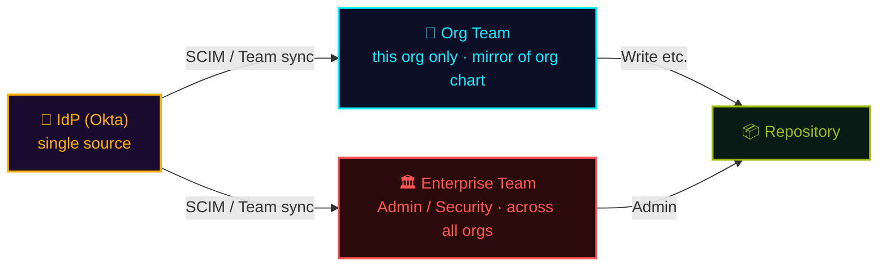

## In one line

  

    Governance is about controlling <strong>"who can do what"</strong> in layers.
  

  

    Cover repository <strong>permission roles</strong>, the repo → org → enterprise <strong>policy</strong> hierarchy, and <strong>managed settings</strong> that centrally govern Copilot.
  

## Permissions

Assign roles per repository to control who can do what. Roles are **cumulative**: each higher role includes everything below it, plus more. Not sure of your own role in a repo? Run `gh api repos/OWNER/REPO --jq .permissions`.

| Role | What you can do (lower role + extra) |
| --- | --- |
| 👀 Read | View, clone, open issues |
| 🔺 Triage | **Read +** manage Issues/PRs (label, assign, close/reopen) |
| ✍️ Write | **Triage +** push, merge |
| 🛠️ Maintain | **Write +** manage some repo settings (non-destructive) |
| 👑 Admin | **Maintain +** full control (access mgmt, deletion, visibility) |

> 🧩 If the 5 built-in roles don't fit, create a **custom repository role at the organization level**: pick any base role (Read–Maintain) and **add or remove** just the fine-grained permissions you need. <a class="retro-link" href="https://docs.github.com/en/organizations/managing-peoples-access-to-your-organization-with-roles/managing-custom-repository-roles-for-an-organization" target="_blank" rel="noopener noreferrer">Custom repository roles ↗</a>

## Recommended access flow

Don't grant to individuals. Make **your IdP (Okta) the single source**, provision both Enterprise and Org teams, and assign teams to repos.

- 🏛️ **Enterprise Team** — Admin / Security roles that span **all orgs**; defined once at the enterprise
- 🏢 **Org Team** — specific to this org; mirrors the org chart and is assigned to repos
- 🪪 Both **provisioned from Okta** (<a class="retro-link" href="/theomonfort/playbook/enterprise-setup">Enterprise Setup ↗</a>)

> 🎯 **Keep it minimal:** ① single source = IdP　② grant repo access **via teams**　③ elevate via an **extra team**　④ **least privilege**

## Policies

Policies live at the **organization** and **enterprise** levels, not the repository. A repo only **inherits** what's allowed above: feature access (Codespaces machines, Copilot, Actions, runners) is granted from org / enterprise, and the repo has **no policy control** of its own.

- 🏛️ **Enterprise**: guardrails across all orgs, SSO/SCIM, allowed features, base policies
- 🏢 **Org**: member privileges, repo creation & visibility, 2FA, Copilot / Codespaces / Actions access
- 📦 **Repo**: inherits only, consumes the features enabled above, sets no policy
- 🔁 Enterprise → Org → Repo: settings flow down (an org can tighten, not loosen, enterprise rules)

> 🎯 Don't tweak repos one by one. Set guardrails top-down at org / enterprise. <a class="retro-link" href="https://docs.github.com/en/organizations/managing-organization-settings" target="_blank" rel="noopener noreferrer">Organization policies ↗</a> · <a class="retro-link" href="https://docs.github.com/en/enterprise-cloud@latest/admin/enforcing-policies" target="_blank" rel="noopener noreferrer">Enterprise policies ↗</a>

## Copilot managed settings (NEW)

How an enterprise **centrally controls** Copilot clients (CLI / VS Code). A `copilot/managed-settings.json` file in the source organization's `.github-private` repository is distributed automatically to every user on the enterprise's Copilot plan.

**What you can enforce:**

- 🧠 **Default model** — start new conversations with a chosen default (e.g. Auto model selection); users can still switch per-conversation
- 🚫 **Block bypass mode** — turn off YOLO / auto-approve so a human reviews each agent action
- 🏪 **Plugin marketplaces** — add extra marketplaces, or restrict users to only enterprise-approved ones
- 🧩 **Default plugins** — auto-install a set of plugins for everyone

> ⚙️ Resolution: there is **one source organization per enterprise** (set under AI controls › Agents). Whichever org grants your license, you get this single source's settings. managed-settings **overrides users' own client config** and clients pull it **once per hour**. <a class="retro-link" href="https://docs.github.com/en/enterprise-cloud@latest/copilot/how-tos/administer-copilot/manage-for-enterprise/manage-agents/configure-enterprise-managed-settings" target="_blank" rel="noopener noreferrer">Configuring enterprise managed settings ↗</a>

## ★ Where it fits

Governance is about controlling "who does what" **in layers**.

| Layer | Scope | Examples |
| --- | --- | --- |
| 👤 Permission roles | Repository | Read / Write / Admin |
| 🏢 Policies | org → enterprise | Mandatory 2FA, visibility, feature access |
| 🤖 Managed settings | Copilot clients | Default model, bypass lock, plugins |

> 🎯 Don't wear yourself out per-repo. Enforcing top-down is the winning play.
