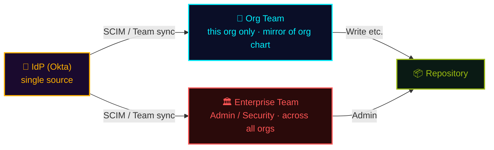

## In one line

<div class="hero-quote">
  <p>
    Governance is about controlling <strong>"who can do what"</strong> in layers.
  </p>
  <p>
    Cover repository <strong>permission roles</strong>, the repo → org → enterprise <strong>policy</strong> hierarchy, and <strong>managed settings</strong> that centrally govern Copilot.
  </p>
</div>

## Permissions

Assign roles per repository to control who can do what. Roles are **cumulative**: each higher role includes everything below it, plus more. Not sure of your own role in a repo? Run `gh api repos/OWNER/REPO --jq .permissions`.

| Role | What you can do (lower role + extra) |
| --- | --- |
| 👀 Read | View, clone, open issues |
| 🔺 Triage | **Read +** manage Issues/PRs (label, assign, close/reopen) |
| ✍️ Write | **Triage +** push, merge |
| 🛠️ Maintain | **Write +** manage some repo settings (non-destructive) |
| 👑 Admin | **Maintain +** full control (access mgmt, deletion, visibility) |

> 🧩 If the 5 built-in roles don't fit, create a **custom repository role at the organization level**: pick any base role (Read–Maintain) and **add or remove** just the fine-grained permissions you need. <a class="retro-link" href="https://docs.github.com/en/organizations/managing-peoples-access-to-your-organization-with-roles/managing-custom-repository-roles-for-an-organization" target="_blank" rel="noopener noreferrer">Custom repository roles ↗</a>

## Recommended access flow

Don't grant to individuals. Make **your IdP (Okta) the single source**, provision both Enterprise and Org teams, and assign teams to repos.


```mermaid
flowchart LR
  IDP["🪪 IdP (Okta)<br/>single source"]
  ENT["🏛️ Enterprise Team<br/>Admin / Security · across all orgs"]
  ORG["🏢 Org Team<br/>this org only · mirror of org chart"]
  REPO["📦 Repository"]
  IDP -->|SCIM / Team sync| ENT
  IDP -->|SCIM / Team sync| ORG
  ORG -->|Write etc.| REPO
  ENT -->|Admin| REPO

  classDef idp fill:#1a0a2e,stroke:#ffb000,color:#ffb000,stroke-width:2px
  classDef ent fill:#2a0a0a,stroke:#ff5555,color:#ff5555,stroke-width:2px
  classDef org fill:#0a0e27,stroke:#00f0ff,color:#00f0ff,stroke-width:2px
  classDef repo fill:#0a1a14,stroke:#9bbc0f,color:#9bbc0f,stroke-width:2px
  class IDP idp
  class ENT ent
  class ORG org
  class REPO repo
```

- 🏛️ **Enterprise Team** — Admin / Security roles that span **all orgs**; defined once at the enterprise
- 🏢 **Org Team** — specific to this org; mirrors the org chart and is assigned to repos
- 🪪 Both **provisioned from Okta** (<a class="retro-link" href="/theomonfort/playbook/enterprise-setup">Enterprise Setup ↗</a>)

> 🎯 **Keep it minimal:** ① single source = IdP　② grant repo access **via teams**　③ elevate via an **extra team**　④ **least privilege**

## Policies

Policies live at the **organization** and **enterprise** levels, not the repository. A repo only **inherits** what's allowed above: feature access (Codespaces machines, Copilot, Actions, runners) is granted from org / enterprise, and the repo has **no policy control** of its own.

- 🏛️ **Enterprise**: guardrails across all orgs, SSO/SCIM, allowed features, base policies
- 🏢 **Org**: member privileges, repo creation & visibility, 2FA, Copilot / Codespaces / Actions access
- 📦 **Repo**: inherits only, consumes the features enabled above, sets no policy
- 🔁 Enterprise → Org → Repo: settings flow down (an org can tighten, not loosen, enterprise rules)

> 🎯 Don't tweak repos one by one. Set guardrails top-down at org / enterprise. <a class="retro-link" href="https://docs.github.com/en/organizations/managing-organization-settings" target="_blank" rel="noopener noreferrer">Organization policies ↗</a> · <a class="retro-link" href="https://docs.github.com/en/enterprise-cloud@latest/admin/enforcing-policies" target="_blank" rel="noopener noreferrer">Enterprise policies ↗</a>

## Copilot managed settings (NEW)

`copilot/managed-settings.json` defines one set of guardrails that supported clients enforce automatically, and a managed value **overrides** whatever a developer sets locally. Coverage spans **Copilot CLI, VS Code, JetBrains, the Copilot app, and Copilot cloud agent** — support varies per key.

<div class="spec-widget">
<p class="spec-hint">▸ + reveals what the key controls · the date opens its changelog</p>
<div class="spec-list">
<details class="spec-item" name="managed-settings">
<summary class="spec-btn"><span class="spec-icon" aria-hidden="true">🧠</span><span class="spec-key"><code>model</code></span><a class="spec-since" href="https://github.blog/changelog/2026-07-01-enterprises-can-default-to-auto-model-selection/" target="_blank" rel="noopener noreferrer">2026-07-01</a><span class="spec-toggle" aria-hidden="true"></span></summary>
<p class="spec-what">Make <b>auto model selection</b> the default, so everyone starts on the routed model instead of picking one by hand.</p>
</details>
<details class="spec-item" name="managed-settings">
<summary class="spec-btn"><span class="spec-icon" aria-hidden="true">🚧</span><span class="spec-key"><code>permissions.*</code></span><a class="spec-since" href="https://github.blog/changelog/2026-06-17-enterprise-managed-settings-now-support-bypass-permission-controls" target="_blank" rel="noopener noreferrer">2026-06-17</a><span class="spec-toggle" aria-hidden="true"></span></summary>
<p class="spec-what">Block <b>bypass / YOLO mode</b>, and deny or gate sensitive operations behind an explicit approval.</p>
</details>
<details class="spec-item" name="managed-settings">
<summary class="spec-btn"><span class="spec-icon" aria-hidden="true">🧩</span><span class="spec-key"><code>enabledPlugins</code> · marketplaces</span><a class="spec-since" href="https://github.blog/changelog/2026-08-26-enterprise-managed-settings-now-support-autoupdate-for-plugin-marketplaces" target="_blank" rel="noopener noreferrer">2026-08-26</a><span class="spec-toggle" aria-hidden="true"></span></summary>
<p class="spec-what">Approve which plugins run and which marketplaces they come from, and keep them current with <b>autoUpdate</b>.</p>
</details>
<details class="spec-item" name="managed-settings">
<summary class="spec-btn"><span class="spec-icon" aria-hidden="true">🔌</span><span class="spec-key"><code>allowedMcpServers</code> · <code>deniedMcpServers</code></span><a class="spec-since" href="https://github.blog/changelog/2026-08-06-mcp-allowlists-in-enterprise-managed-settings/" target="_blank" rel="noopener noreferrer">2026-08-06</a><span class="spec-toggle" aria-hidden="true"></span></summary>
<p class="spec-what">MCP allowlist matched by URL or command. <b>Fail-closed</b>: anything that isn't on the list doesn't run.</p>
</details>
<details class="spec-item" name="managed-settings">
<summary class="spec-btn"><span class="spec-icon" aria-hidden="true">📡</span><span class="spec-key"><code>telemetry</code></span><a class="spec-since" href="https://github.blog/changelog/2026-07-08-enterprise-managed-opentelemetry-export-for-vs-code-and-cli/" target="_blank" rel="noopener noreferrer">2026-07-08</a><span class="spec-toggle" aria-hidden="true"></span></summary>
<p class="spec-what"><b>OpenTelemetry</b> export to your own collector, so usage lands in the observability stack you already run.</p>
</details>
<details class="spec-item" name="managed-settings">
<summary class="spec-btn"><span class="spec-icon" aria-hidden="true">👥</span><span class="spec-key"><code>teams/</code> + <code>team-mappings.json</code></span><a class="spec-since" href="https://github.blog/changelog/2026-08-03-enterprise-team-specialization-for-managed-settings/" target="_blank" rel="noopener noreferrer">2026-08-03</a><span class="spec-toggle" aria-hidden="true"></span></summary>
<p class="spec-what">Per-team specialization of the keys you marked <b>overridable</b>: one baseline, plus a variation per enterprise team.</p>
</details>
</div>
</div>

> 🎯 Deploy it server-managed (from `.github-private`, next), via **<a class="retro-link" href="https://github.blog/changelog/2026-07-08-deploy-managed-copilot-settings-via-mdm-in-vs-code-and-cli/" target="_blank" rel="noopener noreferrer">MDM ↗</a>** (Intune, Jamf, Group Policy), or as a device file. Precedence: **MDM → server-managed → file → user settings**. <a class="retro-link" href="https://docs.github.com/en/enterprise-cloud@latest/copilot/reference/enterprise-administrators/enterprise-managed-settings" target="_blank" rel="noopener noreferrer">All keys ↗</a>

## `.github-private` & source org

GitHub centralizes Copilot governance in **one repository you own and review**, so guardrails stay **versioned, reviewable, and auditable**. You designate a **source organization** in **Enterprise → AI controls → Agents → Configuration source**. Its `.github-private` repository becomes the single source of truth for agents *and* client policy.

```text
.github-private/
├── agents/                     # custom agents published enterprise-wide
├── .github/agents/             # staging — test before you publish
└── copilot/
    ├── managed-settings.json   # enterprise baseline
    ├── team-mappings.json      # settings file → enterprise team slugs
    └── teams/*.json            # per-team specialization
```

- 🏢 **You pick the org, not the repo** — the name `.github-private` and the path `copilot/managed-settings.json` are fixed
- 🔒 **Applies to everyone** on the enterprise's Copilot plan, whether or not they can access the repo
- 🚀 **Publish an agent** by moving its file from `.github/agents/` to `agents/`
- 🛡️ **Protect it** with CODEOWNERS and a ruleset targeting `copilot/**` and `agents/**`

> 🎯 Set the repo to **internal** so any member can propose a change by PR — governance stays open to contribution while merge stays controlled.

## ★ Where it fits

Governance is about controlling "who does what" **in layers**.

| Layer | Scope | Examples |
| --- | --- | --- |
| 👤 Permission roles | Repository | Read / Write / Admin |
| 🏢 Policies | org → enterprise | Mandatory 2FA, visibility, feature access |
| 🤖 Managed settings | Copilot clients | Default model, bypass lock, plugins |

> 🎯 Don't wear yourself out per-repo. Enforcing top-down is the winning play.
