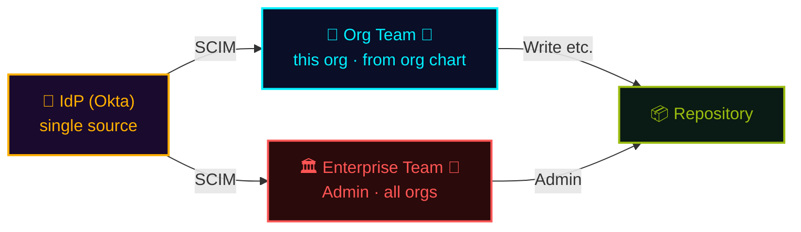

## In one line

<div class="hero-quote">
  <p>
    Governance is deciding <strong>who can do what</strong>.
  </p>
  <p>
    Start with your <strong>orgs</strong>. Then shape them with <strong>teams</strong>, <strong>policies</strong> and <strong>rulesets</strong>.
  </p>
  <p>
    Rules flow <strong>downward</strong>, to repos and to Copilot.
  </p>
</div>

## Three org models <a class="h2-doc" href="https://learn.github.com/well-architected/governance/recommendations/governance-administration-essentials" target="_blank" rel="noopener noreferrer">📖 Docs</a> <a class="h2-doc" href="https://octonihon.github.io/events/2026-03-24-GitHub-OctoNihon-Forum/20260324_OctoNihon_Ricoh.pdf" target="_blank" rel="noopener noreferrer">🏢 Ricoh case</a>

First decision: how many orgs? Each model changes what everyone can see by default.

<div class="det-widget det-compact">
<p class="det-hint">▸ Click a model</p>
<div class="det-split">
<div class="det-list">
<details class="det-pick" name="gov-org-model">
<summary class="det-btn"><span class="det-icon" aria-hidden="true">🏛️</span><span class="det-name">1 · Single org</span></summary>
<div class="det-pane">
<p class="det-head"><span class="det-icon" aria-hidden="true">🏛️</span><span class="det-title">Single organization</span></p>
<p class="det-why">Everything in one org; teams and repo permissions do the rest. By default <b>you only see the repos you're added to</b> (<b>Org base permission = None</b>). Left there it silos people, so add an <b>all-members team to shared repos by default</b>.</p>
</div>
</details>
<details class="det-pick" name="gov-org-model">
<summary class="det-btn"><span class="det-icon" aria-hidden="true">🚦</span><span class="det-name">2 · Red / Green / SB</span></summary><div class="det-pane">
<p class="det-head"><span class="det-icon" aria-hidden="true">🚦</span><span class="det-title">Red-green-sandbox</span></p>
<p class="det-why">You run <b>three orgs</b>. <b>🟢 Green</b> is the default home, ~90% of repos: <b>everyone reads and pushes from day one</b>, so InnerSource happens (<b>base permission = Write</b>). <b>🔴 Red</b> is confidential, <b>invite-only</b> (<b>base permission = None</b>). <b>🟡 Sandbox</b> is for experiments, and takes personal repos if you block them (<b>base permission = Write</b>).</p>
</div>
</details>
<details class="det-pick" name="gov-org-model">
<summary class="det-btn"><span class="det-icon" aria-hidden="true">🧩</span><span class="det-name">3 · Portfolio</span></summary>
<div class="det-pane">
<p class="det-head"><span class="det-icon" aria-hidden="true">🧩</span><span class="det-title">Portfolio company</span></p>
<p class="det-why">One org per <b>top-level division</b> (one below the CEO). Reorgs happen inside a division, so those survive. Orgs move between enterprises, which helps with M&amp;A.</p>
</div>
</details>
</div>
<div class="det-screen det-has-case"><div class="det-case">
<p class="det-case-k">🏢 FIELD CASE — RICOH</p>
<p class="det-case-v">One org per department meant <b>100+ orgs</b> and no way to find code. Now <b>one shared org</b> everyone can join hosts InnerSource and <b>publishes the enterprise settings as Markdown</b>.</p>
</div></div>
</div>
</div>

## Granting access <a class="h2-doc" href="https://learn.github.com/product-guides/github-enterprise/get-started/decide-on-your-organization-team-structure" target="_blank" rel="noopener noreferrer">📖 Docs</a>

Now let people in: **IdP → teams → repos**. Never individuals.


```mermaid
flowchart LR
  IDP["🪪 IdP (Okta)<br/>single source"]
  ENT["🏛️ Enterprise Team 📖<br/>Admin · all orgs"]
  ORG["🏢 Org Team 📖<br/>this org · from org chart"]
  REPO["📦 Repository"]
  IDP -->|SCIM| ENT
  IDP -->|SCIM| ORG
  ORG -->|Write etc.| REPO
  ENT -->|Admin| REPO

  classDef idp fill:#1a0a2e,stroke:#ffb000,color:#ffb000,stroke-width:2px
  classDef ent fill:#2a0a0a,stroke:#ff5555,color:#ff5555,stroke-width:2px
  classDef org fill:#0a0e27,stroke:#00f0ff,color:#00f0ff,stroke-width:2px
  classDef repo fill:#0a1a14,stroke:#9bbc0f,color:#9bbc0f,stroke-width:2px
  class IDP idp
  class ENT ent
  class ORG org
  class REPO repo

  click ENT href "https://docs.github.com/en/enterprise-cloud@latest/admin/managing-accounts-and-repositories/managing-users-in-your-enterprise/create-enterprise-teams" "Enterprise teams docs" _blank
  click ORG href "https://docs.github.com/en/organizations/organizing-members-into-teams/about-teams" "Organization teams docs" _blank
```

## Policies

People are in. Policies decide what they may do — set at org and enterprise, never at the repo.

- 🏛️ **Enterprise** — SSO / SCIM, allowed features, base policy for every org
- 🏢 **Org** — member privileges, repo creation, 2FA, Copilot and Actions access
- 📦 **Repo** — holds no policy, only inherits. The one thing a repo adds is a ruleset.
- 🔁 Rules flow **down**. An org can tighten enterprise rules, never loosen them.

> 🎯 Set guardrails top-down. Never repo by repo. <a class="retro-link" href="https://docs.github.com/en/organizations/managing-organization-settings" target="_blank" rel="noopener noreferrer">Org policies ↗</a> · <a class="retro-link" href="https://docs.github.com/en/enterprise-cloud@latest/admin/enforcing-policies" target="_blank" rel="noopener noreferrer">Enterprise policies ↗</a>

## Admin roles <a class="h2-doc" href="https://docs.github.com/en/enterprise-cloud@latest/admin/managing-accounts-and-repositories/managing-roles-in-your-enterprise/abilities-of-roles" target="_blank" rel="noopener noreferrer">📖 Docs</a>

Policies are set. Now, who may change them? That is not a repo role.

- 🏛️ **Enterprise owner** — every setting and policy, yet **no org settings or content by default**
- 🏢 **Org owner** — full control of one org. **Keep it small, never below two.**
- 🛡️ **Security manager** — read on every repo plus alert management. Security teams need no Owner
- 🧩 **Custom org roles** — bundle only what is needed, e.g. "view the audit log" (GHEC)

> 🎯 Owner is a key, not a job title. Look for a smaller role first. <a class="retro-link" href="https://docs.github.com/en/organizations/managing-peoples-access-to-your-organization-with-roles/roles-in-an-organization" target="_blank" rel="noopener noreferrer">Org roles ↗</a> · <a class="retro-link" href="https://docs.github.com/en/organizations/managing-peoples-access-to-your-organization-with-roles/about-custom-organization-roles" target="_blank" rel="noopener noreferrer">Custom org roles ↗</a>

## Repository roles

Now inside the repo: who does what. Roles are cumulative.

<div class="tbl-compact">

| Role | Adds to the role below |
| --- | --- |
| 👀 Read | View, clone, open issues |
| 🔺 Triage | Manage issues and PRs — label, assign, close |
| ✍️ Write | Push and merge |
| 🛠️ Maintain | Non-destructive repo settings |
| 👑 Admin | Full control — access, visibility, deletion |

</div>

> 🧩 If none fit, build a **custom repository role** at org level from any base role. <a class="retro-link" href="https://docs.github.com/en/organizations/managing-peoples-access-to-your-organization-with-roles/managing-custom-repository-roles-for-an-organization" target="_blank" rel="noopener noreferrer">Custom roles ↗</a>

## Rulesets <a class="h2-doc" href="https://docs.github.com/en/repositories/configuring-branches-and-merges-in-your-repository/managing-rulesets/about-rulesets" target="_blank" rel="noopener noreferrer">📖 Docs</a>

Policies say what is allowed, roles say who acts. Rulesets say **what the code must pass**.

- 🛡️ **Branch protection's successor** — reviews, checks, signing, force-push bans, in one object
- 🏛️ **Defined at ENT / ORG / REPO** — set it high and every repo below inherits it
- 🔁 **They stack** — when several apply, **the strictest wins**. No loosening below
- 🧪 **Evaluate mode** — measure impact without enforcing. Start here on existing repos

> 🎯 Don't grant bypass. A ruleset with bypass is a request, not a rule. <a class="retro-link" href="https://docs.github.com/en/organizations/managing-organization-settings/creating-rulesets-for-repositories-in-your-organization" target="_blank" rel="noopener noreferrer">Org rulesets ↗</a>

## 12 anti-patterns

That is the structure. Here is what breaks it. **01, 02 and 11 are the hard ones to undo.**

<div class="grd-widget grd-compact">
<p class="grd-hint">▸ Click a number — the damage, then the fix</p>
<div class="grd-split">
<div class="grd-board">
<details class="grd-pick" name="gov-anti">
<summary class="grd-btn"><span class="grd-num">01</span><span class="grd-name">Org per team</span></summary>
<div class="grd-pane">
<p class="grd-head"><span class="grd-num">01</span><span class="grd-title">One org per team or project</span></p>
<p class="grd-row"><span class="grd-k">❌ Result</span><span class="grd-v">Collaboration fragments, admin work multiplies, innersource stops working.</span></p>
<p class="grd-row"><span class="grd-k">✅ Instead</span><span class="grd-v">Draw the boundary with <b>teams and repo permissions</b> inside one org.</span></p>
</div>
</details>
<details class="grd-pick" name="gov-anti">
<summary class="grd-btn"><span class="grd-num">02</span><span class="grd-name">Orgs = org chart</span></summary>
<div class="grd-pane">
<p class="grd-head"><span class="grd-num">02</span><span class="grd-title">Orgs mapped to the management hierarchy</span></p>
<p class="grd-row"><span class="grd-k">❌ Result</span><span class="grd-v">Every reorg forces a matching GitHub restructure.</span></p>
<p class="grd-row"><span class="grd-k">✅ Instead</span><span class="grd-v">Map only to the <b>highest, static divisions</b> — or not at all.</span></p>
</div>
</details>
<details class="grd-pick" name="gov-anti">
<summary class="grd-btn"><span class="grd-num">03</span><span class="grd-name">Admin as base</span></summary>
<div class="grd-pane">
<p class="grd-head"><span class="grd-num">03</span><span class="grd-title">Admin granted as the base permission</span></p>
<p class="grd-row"><span class="grd-k">❌ Result</span><span class="grd-v">Every member gets destructive rights on every repo.</span></p>
<p class="grd-row"><span class="grd-k">✅ Instead</span><span class="grd-v">Base <b>Read or Write</b>, then elevate through teams.</span></p>
</div>
</details>
<details class="grd-pick" name="gov-anti">
<summary class="grd-btn"><span class="grd-num">04</span><span class="grd-name">Allow all Actions</span></summary>
<div class="grd-pane">
<p class="grd-head"><span class="grd-num">04</span><span class="grd-title">"Allow all actions" with no review</span></p>
<p class="grd-row"><span class="grd-k">❌ Result</span><span class="grd-v">Unvetted third-party actions become a supply-chain path into your builds.</span></p>
<p class="grd-row"><span class="grd-k">✅ Instead</span><span class="grd-v">Keep an <b>allow list</b> and pin actions by <b>commit SHA</b>.</span></p>
</div>
</details>
<details class="grd-pick" name="gov-anti">
<summary class="grd-btn"><span class="grd-num">05</span><span class="grd-name">Unlimited spending</span></summary>
<div class="grd-pane">
<p class="grd-head"><span class="grd-num">05</span><span class="grd-title">Spending limits left unlimited</span></p>
<p class="grd-row"><span class="grd-k">❌ Result</span><span class="grd-v">Invoiced accounts default to unlimited, so overspend is silent.</span></p>
<p class="grd-row"><span class="grd-k">✅ Instead</span><span class="grd-v">Set explicit limits and track them with <b>cost centers</b>.</span></p>
</div>
</details>
<details class="grd-pick" name="gov-anti">
<summary class="grd-btn"><span class="grd-num">06</span><span class="grd-name">Manual provisioning</span></summary>
<div class="grd-pane">
<p class="grd-head"><span class="grd-num">06</span><span class="grd-title">Manual user provisioning only</span></p>
<p class="grd-row"><span class="grd-k">❌ Result</span><span class="grd-v">Leavers keep their access, because nothing revokes it.</span></p>
<p class="grd-row"><span class="grd-k">✅ Instead</span><span class="grd-v"><b>SCIM</b> provisioning and deprovisioning from the IdP.</span></p>
</div>
</details>
<details class="grd-pick" name="gov-anti">
<summary class="grd-btn"><span class="grd-num">07</span><span class="grd-name">API polling</span></summary>
<div class="grd-pane">
<p class="grd-head"><span class="grd-num">07</span><span class="grd-title">Polling the API instead of using webhooks</span></p>
<p class="grd-row"><span class="grd-k">❌ Result</span><span class="grd-v">Burns the rate limit and adds load for no new information.</span></p>
<p class="grd-row"><span class="grd-k">✅ Instead</span><span class="grd-v">Event-driven <b>webhooks</b>.</span></p>
</div>
</details>
<details class="grd-pick" name="gov-anti">
<summary class="grd-btn"><span class="grd-num">08</span><span class="grd-name">Log retention</span></summary>
<div class="grd-pane">
<p class="grd-head"><span class="grd-num">08</span><span class="grd-title">Ignoring audit log retention</span></p>
<p class="grd-row"><span class="grd-k">❌ Result</span><span class="grd-v">Default retention is short, so evidence is gone when you need it.</span></p>
<p class="grd-row"><span class="grd-k">✅ Instead</span><span class="grd-v">Configure <b>audit log streaming</b> or export.</span></p>
</div>
</details>
<details class="grd-pick" name="gov-anti">
<summary class="grd-btn"><span class="grd-num">09</span><span class="grd-name">App per org</span></summary>
<div class="grd-pane">
<p class="grd-head"><span class="grd-num">09</span><span class="grd-title">Enterprise-wide apps installed org by org</span></p>
<p class="grd-row"><span class="grd-k">❌ Result</span><span class="grd-v">Admin work multiplies, approvals scatter, configuration drifts.</span></p>
<p class="grd-row"><span class="grd-k">✅ Instead</span><span class="grd-v"><b>Enterprise-level</b> GitHub App installation.</span></p>
</div>
</details>
<details class="grd-pick" name="gov-anti">
<summary class="grd-btn"><span class="grd-num">10</span><span class="grd-name">Owner for everything</span></summary>
<div class="grd-pane">
<p class="grd-head"><span class="grd-num">10</span><span class="grd-title">Owner where a custom role would do</span></p>
<p class="grd-row"><span class="grd-k">❌ Result</span><span class="grd-v">Enterprise and Org Owner are far broader than the actual need.</span></p>
<p class="grd-row"><span class="grd-k">✅ Instead</span><span class="grd-v"><b>Custom roles</b> scoped to one capability.</span></p>
</div>
</details>
<details class="grd-pick" name="gov-anti">
<summary class="grd-btn"><span class="grd-num">11</span><span class="grd-name">Late model switch</span></summary>
<div class="grd-pane">
<p class="grd-head"><span class="grd-num">11</span><span class="grd-title">Changing the user access model after rollout</span></p>
<p class="grd-row"><span class="grd-k">❌ Result</span><span class="grd-v">Standard ↔ EMU is a migration, not a setting you flip.</span></p>
<p class="grd-row"><span class="grd-k">✅ Instead</span><span class="grd-v">Choose it <b>when the enterprise is created</b>.</span></p>
</div>
</details>
<details class="grd-pick" name="gov-anti">
<summary class="grd-btn"><span class="grd-num">12</span><span class="grd-name">No offboarding</span></summary>
<div class="grd-pane">
<p class="grd-head"><span class="grd-num">12</span><span class="grd-title">No offboarding path</span></p>
<p class="grd-row"><span class="grd-k">❌ Result</span><span class="grd-v">Dormant accounts keep access and keep consuming licences.</span></p>
<p class="grd-row"><span class="grd-k">✅ Instead</span><span class="grd-v"><b>Unaffiliated users policy</b> plus SCIM deprovisioning.</span></p>
</div>
</details>
</div>
<div class="grd-screen"><p class="grd-empty">SELECT A NUMBER ▸</p></div>
</div>
</div>

## The 18 guardrails <a class="h2-doc" href="https://learn.github.com/well-architected/governance/recommendations/governance-policies-best-practices" target="_blank" rel="noopener noreferrer">📖 Docs</a>

Now the values to set, and who sets them. **Short on time? 03, 15, 18.**

<div class="grd-widget grd-compact">
<p class="grd-hint">▸ Click a number · ENT / ORG / REPO = where you set it</p>
<div class="grd-split">
<div class="grd-board">
<details class="grd-pick" name="gov-guard">
<summary class="grd-btn"><span class="grd-num">01</span><span class="grd-name">Actions scope</span></summary>
<div class="grd-pane">
<p class="grd-head"><span class="grd-num">01</span><span class="grd-title">Actions execution scope</span><span class="grd-lvl">ORG</span></p>
<p class="grd-row"><span class="grd-k">⚙️ Set to</span><span class="grd-v">Restrict Actions to <b>specific repositories</b>, not all of them.</span></p>
</div>
</details>
<details class="grd-pick" name="gov-guard">
<summary class="grd-btn"><span class="grd-num">02</span><span class="grd-name">Allowed actions</span></summary>
<div class="grd-pane">
<p class="grd-head"><span class="grd-num">02</span><span class="grd-title">Which actions may run</span><span class="grd-lvl">ENT</span></p>
<p class="grd-row"><span class="grd-k">⚙️ Set to</span><span class="grd-v"><b>GitHub-created and Verified Creator</b> only.</span></p>
</div>
</details>
<details class="grd-pick" name="gov-guard">
<summary class="grd-btn"><span class="grd-num">03</span><span class="grd-name">Workflow token</span></summary>
<div class="grd-pane">
<p class="grd-head"><span class="grd-num">03</span><span class="grd-title">Default workflow token permission</span><span class="grd-lvl">ENT / ORG</span></p>
<p class="grd-row"><span class="grd-k">⚙️ Set to</span><span class="grd-v"><b>read-only</b>. It ships as read/write.</span></p>
<p class="grd-row"><span class="grd-k">💡 Why</span><span class="grd-v">A stolen token can otherwise write through Actions.</span></p>
</div>
</details>
<details class="grd-pick" name="gov-guard">
<summary class="grd-btn"><span class="grd-num">04</span><span class="grd-name">PR auto-approval</span></summary>
<div class="grd-pane">
<p class="grd-head"><span class="grd-num">04</span><span class="grd-title">Automatic approval of pull requests</span><span class="grd-lvl">ENT / ORG</span></p>
<p class="grd-row"><span class="grd-k">⚙️ Set to</span><span class="grd-v"><b>Disabled</b>. It is on by default.</span></p>
<p class="grd-row"><span class="grd-k">💡 Why</span><span class="grd-v">Otherwise a PR can be merged around code review.</span></p>
</div>
</details>
<details class="grd-pick" name="gov-guard">
<summary class="grd-btn"><span class="grd-num">05</span><span class="grd-name">Forking</span></summary>
<div class="grd-pane">
<p class="grd-head"><span class="grd-num">05</span><span class="grd-title">Repository forking</span><span class="grd-lvl">ENT / ORG</span></p>
<p class="grd-row"><span class="grd-k">⚙️ Set to</span><span class="grd-v"><b>Off</b> unless a repo clearly needs it.</span></p>
</div>
</details>
<details class="grd-pick" name="gov-guard">
<summary class="grd-btn"><span class="grd-num">06</span><span class="grd-name">Visibility change</span></summary>
<div class="grd-pane">
<p class="grd-head"><span class="grd-num">06</span><span class="grd-title">Changing repository visibility</span><span class="grd-lvl">ENT / ORG</span></p>
<p class="grd-row"><span class="grd-k">⚙️ Set to</span><span class="grd-v">Restrict <b>who</b> can flip a repo's visibility.</span></p>
</div>
</details>
<details class="grd-pick" name="gov-guard">
<summary class="grd-btn"><span class="grd-num">07</span><span class="grd-name">Fine-grained PATs</span></summary>
<div class="grd-pane">
<p class="grd-head"><span class="grd-num">07</span><span class="grd-title">Fine-grained personal access tokens</span><span class="grd-lvl">ENT / ORG</span></p>
<p class="grd-row"><span class="grd-k">⚙️ Set to</span><span class="grd-v">Require an <b>approval flow</b>.</span></p>
<p class="grd-row"><span class="grd-k">💡 Why</span><span class="grd-v">You get a review of who reaches what, with which permission.</span></p>
</div>
</details>
<details class="grd-pick" name="gov-guard">
<summary class="grd-btn"><span class="grd-num">08</span><span class="grd-name">Outside collabs</span></summary>
<div class="grd-pane">
<p class="grd-head"><span class="grd-num">08</span><span class="grd-title">Inviting outside collaborators</span><span class="grd-lvl">ENT</span></p>
<p class="grd-row"><span class="grd-k">⚙️ Set to</span><span class="grd-v"><b>Owners only</b>. It ships as "No policy", so any member can invite.</span></p>
</div>
</details>
<details class="grd-pick" name="gov-guard">
<summary class="grd-btn"><span class="grd-num">09</span><span class="grd-name">Public repos</span></summary>
<div class="grd-pane">
<p class="grd-head"><span class="grd-num">09</span><span class="grd-title">Creating public repositories</span><span class="grd-lvl">ENT</span></p>
<p class="grd-row"><span class="grd-k">⚙️ Set to</span><span class="grd-v"><b>Blocked</b>, unless open source is governed separately.</span></p>
</div>
</details>
<details class="grd-pick" name="gov-guard">
<summary class="grd-btn"><span class="grd-num">10</span><span class="grd-name">Webhook secret</span></summary>
<div class="grd-pane">
<p class="grd-head"><span class="grd-num">10</span><span class="grd-title">Webhook secret</span><span class="grd-lvl">ORG / REPO</span></p>
<p class="grd-row"><span class="grd-k">⚙️ Set to</span><span class="grd-v"><b>Always set</b>, so the receiver can verify the signature.</span></p>
</div>
</details>
<details class="grd-pick" name="gov-guard">
<summary class="grd-btn"><span class="grd-num">11</span><span class="grd-name">Webhook SSL</span></summary>
<div class="grd-pane">
<p class="grd-head"><span class="grd-num">11</span><span class="grd-title">Webhook transport</span><span class="grd-lvl">ORG / REPO</span></p>
<p class="grd-row"><span class="grd-k">⚙️ Set to</span><span class="grd-v"><b>SSL</b> on every endpoint.</span></p>
</div>
</details>
<details class="grd-pick" name="gov-guard">
<summary class="grd-btn"><span class="grd-num">12</span><span class="grd-name">Rulesets</span></summary>
<div class="grd-pane">
<p class="grd-head"><span class="grd-num">12</span><span class="grd-title">Repository rulesets</span><span class="grd-lvl">ENT / ORG / REPO</span></p>
<p class="grd-row"><span class="grd-k">⚙️ Set to</span><span class="grd-v">Use rulesets for reviews, checks and protected branches.</span></p>
</div>
</details>
<details class="grd-pick" name="gov-guard">
<summary class="grd-btn"><span class="grd-num">13</span><span class="grd-name">CODEOWNERS</span></summary>
<div class="grd-pane">
<p class="grd-head"><span class="grd-num">13</span><span class="grd-title">CODEOWNERS</span><span class="grd-lvl">REPO</span></p>
<p class="grd-row"><span class="grd-k">⚙️ Set to</span><span class="grd-v">Define it under <code>.github/</code>, with an explicit owner per path.</span></p>
</div>
</details>
<details class="grd-pick" name="gov-guard">
<summary class="grd-btn"><span class="grd-num">14</span><span class="grd-name">Commit signing</span></summary>
<div class="grd-pane">
<p class="grd-head"><span class="grd-num">14</span><span class="grd-title">Commit signing</span><span class="grd-lvl">REPO</span></p>
<p class="grd-row"><span class="grd-k">⚙️ Set to</span><span class="grd-v"><b>Required</b> wherever possible.</span></p>
<p class="grd-row"><span class="grd-k">💡 Why</span><span class="grd-v">Blocks commit injection. Copilot cloud agent commits are already signed.</span></p>
</div>
</details>
<details class="grd-pick" name="gov-guard">
<summary class="grd-btn"><span class="grd-num">15</span><span class="grd-name">Ruleset bypass</span></summary>
<div class="grd-pane">
<p class="grd-head"><span class="grd-num">15</span><span class="grd-title">Bypassing rulesets</span><span class="grd-lvl">REPO</span></p>
<p class="grd-row"><span class="grd-k">⚙️ Set to</span><span class="grd-v"><b>Not allowed</b>. A ruleset with a bypass list is a suggestion.</span></p>
</div>
</details>
<details class="grd-pick" name="gov-guard">
<summary class="grd-btn"><span class="grd-num">16</span><span class="grd-name">Runner groups</span></summary>
<div class="grd-pane">
<p class="grd-head"><span class="grd-num">16</span><span class="grd-title">Runner groups</span><span class="grd-lvl">ENT / ORG</span></p>
<p class="grd-row"><span class="grd-k">⚙️ Set to</span><span class="grd-v">Assign each group to a <b>limited set of repos</b>.</span></p>
<p class="grd-row"><span class="grd-k">💡 Why</span><span class="grd-v">A group open to every repo exposes self-hosted runners.</span></p>
</div>
</details>
<details class="grd-pick" name="gov-guard">
<summary class="grd-btn"><span class="grd-num">17</span><span class="grd-name">Push protection</span></summary>
<div class="grd-pane">
<p class="grd-head"><span class="grd-num">17</span><span class="grd-title">Bypassing push protection</span><span class="grd-lvl">ORG</span></p>
<p class="grd-row"><span class="grd-k">⚙️ Set to</span><span class="grd-v">Limit to <b>named roles and teams</b>. By default anyone with write can bypass.</span></p>
</div>
</details>
<details class="grd-pick" name="gov-guard">
<summary class="grd-btn"><span class="grd-num">18</span><span class="grd-name">Audit log stream</span></summary>
<div class="grd-pane">
<p class="grd-head"><span class="grd-num">18</span><span class="grd-title">Audit log streaming</span><span class="grd-lvl">ENT</span></p>
<p class="grd-row"><span class="grd-k">⚙️ Set to</span><span class="grd-v"><b>Configured</b>, to your SIEM or object store.</span></p>
<p class="grd-row"><span class="grd-k">💡 Why</span><span class="grd-v">The most forgotten item, and the best source for spotting abuse.</span></p>
</div>
</details>
</div>
<div class="grd-screen"><p class="grd-empty">SELECT A NUMBER ▸</p></div>
</div>
</div>

## Copilot managed settings (NEW)

Same idea for Copilot clients: `copilot/managed-settings.json` overrides local settings. Order: **MDM → server-managed → file → user**. <a class="retro-link" href="https://docs.github.com/en/enterprise-cloud@latest/copilot/reference/enterprise-administrators/enterprise-managed-settings" target="_blank" rel="noopener noreferrer">All keys ↗</a>

<div class="spec-widget spec-compact">
<p class="spec-hint">▸ + reveals what the key controls · the date opens its changelog</p>
<div class="spec-list">
<details class="spec-item" name="managed-settings">
<summary class="spec-btn"><span class="spec-icon" aria-hidden="true">🧠</span><span class="spec-key"><code>model</code></span><a class="spec-since" href="https://github.blog/changelog/2026-07-01-enterprises-can-default-to-auto-model-selection/" target="_blank" rel="noopener noreferrer">2026-07-01</a><span class="spec-toggle" aria-hidden="true"></span></summary>
<p class="spec-what">Make <b>auto model selection</b> the default, so nobody picks a model by hand.</p>
</details>
<details class="spec-item" name="managed-settings">
<summary class="spec-btn"><span class="spec-icon" aria-hidden="true">🚧</span><span class="spec-key"><code>permissions.*</code></span><a class="spec-since" href="https://github.blog/changelog/2026-06-17-enterprise-managed-settings-now-support-bypass-permission-controls" target="_blank" rel="noopener noreferrer">2026-06-17</a><span class="spec-toggle" aria-hidden="true"></span></summary>
<p class="spec-what">Block <b>bypass / YOLO mode</b>, and gate sensitive operations behind approval.</p>
</details>
<details class="spec-item" name="managed-settings">
<summary class="spec-btn"><span class="spec-icon" aria-hidden="true">🧩</span><span class="spec-key"><code>enabledPlugins</code> · marketplaces</span><a class="spec-since" href="https://github.blog/changelog/2026-08-26-enterprise-managed-settings-now-support-autoupdate-for-plugin-marketplaces" target="_blank" rel="noopener noreferrer">2026-08-26</a><span class="spec-toggle" aria-hidden="true"></span></summary>
<p class="spec-what">Approve which plugins run and where they come from, with <b>autoUpdate</b>.</p>
</details>
<details class="spec-item" name="managed-settings">
<summary class="spec-btn"><span class="spec-icon" aria-hidden="true">🔌</span><span class="spec-key"><code>allowedMcpServers</code> · <code>deniedMcpServers</code></span><a class="spec-since" href="https://github.blog/changelog/2026-08-06-mcp-allowlists-in-enterprise-managed-settings/" target="_blank" rel="noopener noreferrer">2026-08-06</a><span class="spec-toggle" aria-hidden="true"></span></summary>
<p class="spec-what">MCP allowlist by URL or command. <b>Fail-closed</b>: off the list, it does not run.</p>
</details>
<details class="spec-item" name="managed-settings">
<summary class="spec-btn"><span class="spec-icon" aria-hidden="true">📡</span><span class="spec-key"><code>telemetry</code></span><a class="spec-since" href="https://github.blog/changelog/2026-07-08-enterprise-managed-opentelemetry-export-for-vs-code-and-cli/" target="_blank" rel="noopener noreferrer">2026-07-08</a><span class="spec-toggle" aria-hidden="true"></span></summary>
<p class="spec-what"><b>OpenTelemetry</b> export to your own collector.</p>
</details>
<details class="spec-item" name="managed-settings">
<summary class="spec-btn"><span class="spec-icon" aria-hidden="true">👥</span><span class="spec-key"><code>teams/</code> + <code>team-mappings.json</code></span><a class="spec-since" href="https://github.blog/changelog/2026-08-03-enterprise-team-specialization-for-managed-settings/" target="_blank" rel="noopener noreferrer">2026-08-03</a><span class="spec-toggle" aria-hidden="true"></span></summary>
<p class="spec-what">One baseline, plus a variation per enterprise team on <b>overridable</b> keys.</p>
</details>
</div>
</div>

## `.github-private` & source org

They live in one repo you own, set in **Enterprise → AI controls → Agents**.

<div class="pre-compact">

```text
.github-private/
├── agents/                    # published enterprise-wide
├── .github/agents/            # staging, test before publishing
└── copilot/
    ├── managed-settings.json  # the baseline
    ├── team-mappings.json     # file → enterprise team
    └── teams/*.json           # per-team override
```

</div>

- 🏢 You pick the **org**. The repo name and `copilot/` paths are fixed.
- 🔒 Applies to **everyone** on the plan, repo access or not. Keep it **internal** and guard `copilot/**` with CODEOWNERS.

## ★ Where it fits

Five layers, one rule: set them from the top.

<div class="tbl-compact">

| Layer | Scope | Examples |
| --- | --- | --- |
| 🏢 Policies | org → enterprise | 2FA, visibility, feature access |
| 🔑 Admin roles | org → enterprise | Owner, Security manager, custom |
| 👤 Permission roles | Repository | Read / Write / Admin |
| 🛡️ Rulesets | Branches and tags | Required reviews, required checks, signing |
| 🤖 Managed settings | Copilot clients | Default model, bypass lock, plugins |

</div>

> 🎯 Top-down wins. Per-repo does not scale.
