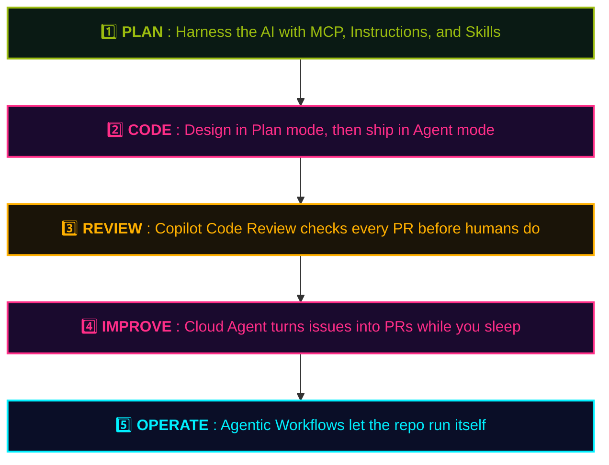

## At a Glance

  

    The project you'll build is <strong>a simplified version of this very playbook site</strong>. You'll rebuild the site you're reading — <strong>from scratch, together with Copilot</strong>.
  

  

    Open the repo in <strong>Codespaces</strong> and you're coding in the browser, no local setup.
  

## What You'll Build

The goal isn't a contrived demo app — it's **this very site** (a simplified version of it).

Once you've learned the **why** in the Playbook, the hands-on workshop lets you **apply that knowledge** — by rebuilding this Playbook itself, using the very features you just read about.

## Workshop Flow

## Getting Started

Fastest route — browser only:

1. 🌐 Open the repo: <a class="retro-link" href="https://github.com/theomonfort/Github-copilot-workshop" target="_blank" rel="noopener noreferrer">theomonfort/Github-copilot-workshop ↗</a>
2. 🟢 Click the green **Code** button → **Codespaces** tab → **Create codespace on main**
3. 📖 Open the hands-on: <a class="retro-link" href="/theomonfort/en/handson/">Open the hands-on →</a>
4. ⌨️ Step through one task at a time, talking to Copilot as you go

> 💡 No local setup needed — Codespaces ships with all extensions and dependencies preinstalled.
> 🤖 If you get stuck, ask Copilot Chat right there in the IDE — that's part of the learning.
