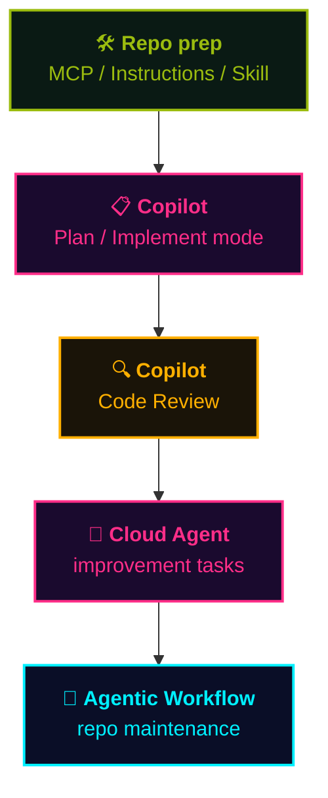

## At a Glance

  

    The project you'll build is <strong>a simplified version of this very playbook site</strong>. You'll rebuild the site you're reading right now — <strong>from scratch, together with Copilot</strong>.
  

  

    Open the repo in <strong>Codespaces</strong> and you're coding in the browser, no local setup.
  

> 🪞 **What you build = this site (simplified)**. The end-goal is concrete, so you immediately see *which feature shines at which moment*.
> 🎮 **Features you'll use** — MCP / Instructions / Agent Skills / Plan mode / Cloud Agent / Code Review / Agentic Workflow, all in one flow.
> 🚀 Built for next week's special workshop. Codelabs format — one step at a time.

📘 Repo & hands-on:
- <a class="retro-link" href="https://github.com/theomonfort/Github-copilot-workshop" target="_blank" rel="noopener noreferrer">theomonfort/Github-copilot-workshop ↗</a>
- <a class="retro-link" href="/theomonfort/en/handson/">Open the hands-on →</a>

## Workshop Flow

You build a **simplified version of this playbook site** through 5 phases that exercise the core features end-to-end.

> 📝 This is a **simplified workshop flow** — real SDLC phases overlap and loop. The goal is to build intuition for *which feature fits which moment*.

## Getting Started

Fastest route — browser only:

1. 🌐 Open the repo: <a class="retro-link" href="https://github.com/theomonfort/Github-copilot-workshop" target="_blank" rel="noopener noreferrer">theomonfort/Github-copilot-workshop ↗</a>
2. 🟢 Click the green **Code** button → **Codespaces** tab → **Create codespace on main**
3. 📖 Open the hands-on: <a class="retro-link" href="/theomonfort/en/handson/">Open the hands-on →</a>
4. ⌨️ Step through one task at a time, talking to Copilot as you go

> 💡 No local setup needed — Codespaces ships with all extensions and dependencies preinstalled.
> 🤖 If you get stuck, ask Copilot Chat right there in the IDE — that's part of the learning.
