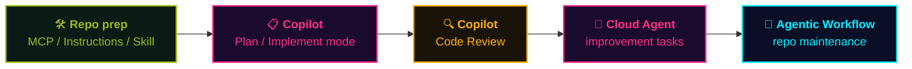

## At a Glance

  

    Get hands-on with the concepts in this playbook through a <strong>workshop repo</strong> you can open in <strong>Codespaces</strong>.
  

  

    No local setup — just click and start coding through the Codelabs flow.
  

> 🎮 **2026 GitHub Copilot Workshop** — a single simplified project that walks through MCP / Instructions / Agent Skills / Plan mode / Cloud Agent / Code Review / Agentic Workflow end-to-end.
> 🚀 Built for next week's special workshop. Codelabs format — one step at a time.

📘 Repo & Codelabs:
- <a class="retro-link" href="https://github.com/theomonfort/Github-copilot-workshop" target="_blank" rel="noopener noreferrer">theomonfort/Github-copilot-workshop ↗</a>
- <a class="retro-link" href="https://theomonfort.github.io/2026-Github-Copilot-Workshop/github-copilot-workshop/custom/handson/" target="_blank" rel="noopener noreferrer">Open the workshop Codelabs ↗</a>

## Workshop Flow

A **simplified end-to-end scenario** built around the core of this playbook, covered in 5 phases.

| Phase | What you do | Related entry |
| --- | --- | --- |
| 🛠️ **Prep** | Add MCP servers, write instructions files, define agent skills | <a class="retro-link" href="/theomonfort/playbook/mcp">MCP ↗</a> · <a class="retro-link" href="/theomonfort/playbook/instructions">Instructions ↗</a> · <a class="retro-link" href="/theomonfort/playbook/agent-skills">Agent Skills ↗</a> |
| 📋 **Plan → Implement** | Design with Plan mode, then ship with Implement mode | <a class="retro-link" href="/theomonfort/playbook/copilot-chat">Copilot Chat ↗</a> |
| 🔍 **Review** | Auto-review the PR with Copilot Code Review | <a class="retro-link" href="/theomonfort/playbook/copilot-code-review">Code Review ↗</a> |
| 🤖 **Improve** | Delegate improvement tasks to Cloud Agent in parallel | <a class="retro-link" href="/theomonfort/playbook/cloud-agent">Cloud Agent ↗</a> |
| 🔁 **Operate** | Automate daily / weekly maintenance with Agentic Workflow | <a class="retro-link" href="/theomonfort/playbook/agentic-workflow">Agentic Workflow ↗</a> |

> 📝 This is a **simplified workshop flow** — real SDLC phases overlap and loop. The goal is to build intuition for *which feature fits which moment*.

## Getting Started

Fastest route — browser only:

1. 🌐 Open the repo: <a class="retro-link" href="https://github.com/theomonfort/Github-copilot-workshop" target="_blank" rel="noopener noreferrer">theomonfort/Github-copilot-workshop ↗</a>
2. 🟢 Click the green **Code** button → **Codespaces** tab → **Create codespace on main**
3. 📖 Open the Codelabs: <a class="retro-link" href="https://theomonfort.github.io/2026-Github-Copilot-Workshop/github-copilot-workshop/custom/handson/" target="_blank" rel="noopener noreferrer">Open the workshop ↗</a>
4. ⌨️ Step through one task at a time, talking to Copilot as you go

> 💡 No local setup needed — Codespaces ships with all extensions and dependencies preinstalled.
> 🤖 If you get stuck, ask Copilot Chat right there in the IDE — that's part of the learning.
