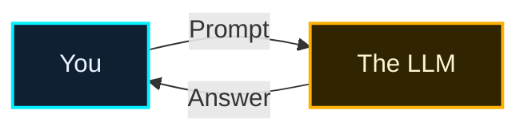
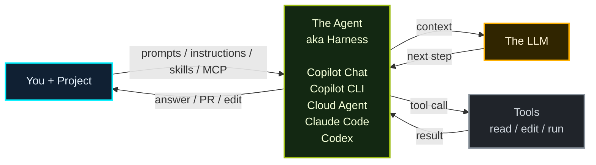
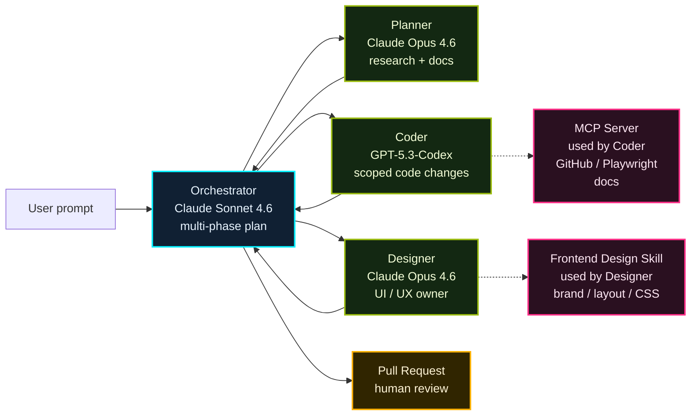

## At a Glance

<div class="hero-quote">
  <p>
    <strong>Harness Engineering</strong> is the discipline of designing the scaffold that gets the best results from AI.
  </p>
  <p>
    It's not just about imposing restrictions — it's about defining the goal, context, roles, and verification methods so AI can move toward outcomes safely and without hesitation.
  </p>
</div>

## The Good Old Days

Old-school LLM chat was simple. You threw a prompt at the LLM, and the LLM returned an answer.



> In that world, context was almost entirely **assembled by hand inside the prompt**.

## Current

Today, an **agent / harness** with project context and tools stands in front of the LLM.



> No magic. The agent is a layer that manages **what to read, which tools to use, and how to return the result** — instead of calling the LLM directly.

## Under the Hood: Agent / Harness (Simplified)

- **Execution Loop**: The LLM decides the next move, executes a tool → returns the result to context, and repeats until `done`.
- **Context Management**: Organizes the system prompt, available tools, user task, and tool results, passing them as context with each LLM call.

```python
# --- Setup ---
system_prompt = "You are a helpful coding assistant..."
available_tools = [search_web, read_file, edit_file, run_terminal]

# --- Agent Loop ---
user_task = input("How can I help you?")
context = [system_prompt, available_tools, user_task]

while True:
    next_step = await llm.determine_next_step(context)
    context.append(next_step)

    if next_step.intent == "done":
        return next_step.final_answer

    result = await execute_tool(next_step.tool, next_step.args)
    context.append(result)
```

## What to Harness With?

There is no single technology tool that makes AI powerful. Separate **what to always load** from **what to call only when needed**.

| Technology Tool | Location / Config | When to Use |
| --- | --- | --- |
| Repository-wide custom instructions | `.github/copilot-instructions.md` | Repo-wide conventions, prohibitions, and verification commands |
| Path-specific custom instructions | `.github/instructions/*.instructions.md` + `applyTo` | Area-specific rules for `tests/**`, `api/**`, etc. |
| Agent skills | `.github/skills/*/SKILL.md` / `~/.copilot/skills/` | Specialized procedures like PR descriptions, frontend design |
| Custom agents | `.github/agents/*.agent.md` / `~/.copilot/agents/` | Switch roles, models, and available tools |
| Hooks | `.github/hooks/*.json` | Inject scripts before/after tool execution to deny, log, or notify |
| MCP servers | MCP config file | Connect to GitHub, Figma, Playwright, Jira, Salesforce |
| Tool permissions | Agent host permission settings | Control read/search only, allow edits, allow command execution, etc. |

> The GitHub Docs names are **Repository-wide custom instructions** and **Path-specific custom instructions**. On the VS Code side, the latter is also called **file-based instructions**.

## Ecosystem Comparison

The same "AI scaffold" concept exists across ecosystems, but file locations and names differ slightly.

| Layer | GitHub / Copilot | Open Ecosystem |
| --- | --- | --- |
| Global instructions | `.github/copilot-instructions.md` | `AGENTS.md` |
| Path-specific rules | `.github/instructions/*.instructions.md` | nested `AGENTS.md` |
| Skills (project) | `.github/skills/*/SKILL.md` | `.agents/skills/*/SKILL.md` |
| Skills (personal) | `~/.copilot/skills/` | `~/.agents/skills/` |
| Custom agents | Copilot custom agents | agent definitions / plugins |
| MCP / tools | `mcp.config` | `mcp.config` |

> Copilot's strength is native support for the formats of major vendors. In the CLI, type `/help` to see available formats and commands.

## Common Concepts

A good harness is not just a collection of tools — it defines **how AI should proceed without getting lost**.

| Pattern | What does it do? | What improves? |
| --- | --- | --- |
| Spec-to-code / Spec-driven | Write the **what / why** as a spec first, then break it into plan → tasks → implement | The spec becomes the source of truth — predictable implementation instead of vibe coding |
| Multi-phase coding plan | The orchestrator decomposes implementation into multiple phases, each with a clear purpose, order, and completion criteria | Even large changes proceed step by step, without AI rushing ahead all at once |
| File assignment | The Planner explicitly lists files to touch; the orchestrator checks for file overlap before parallelizing | Multiple agents don't overwrite each other; Coder / Designer can run in parallel safely |
| Prompt engineering | When writing a Skill / Agent, clearly specify **role · objective · deliverable** | Keeps the agent consistent on who it is, what to achieve, and what to output |
| Context engineering | Deliver only the context needed for the task, structured appropriately | Avoids distraction from noise; answers stay aligned with the codebase, spec, and constraints |
| Approval gates | Humans review at key checkpoints — spec / plan / PR / release | Preserves automation speed while letting humans stop only the dangerous decisions |

> Designing **spec · phase · file ownership · role/objective/deliverable · context · approval** upfront makes AI not just faster, but produces fewer reworks too.

## Example: Ultralight

[Ultralight](https://burkeholland.github.io/ultralight/) is a multi-agent orchestration example by Burke Holland, Developer Advocate at Microsoft.  
It creates a multi-phase execution plan, detects file overlaps, and acts as a harness that distributes work in parallel to Planner / Coder / Designer.



> 🚀 I made a Codespace-ready template repo so you can try it in a few clicks: [theomonfort/ultralight-template](https://github.com/theomonfort/ultralight-template)

## Harness for coding this website

This playbook site is built with the same kind of harness. The Orchestrator (Theo) ties everything together with instruction files and prompts, then switches between CLI built-in agents, custom agents, skills, and MCP per phase.

<div class="harness-map">
  <svg viewBox="0 0 940 566" role="img" aria-label="Diagram of the harness that builds this site" xmlns="http://www.w3.org/2000/svg">
    <defs>
      <marker id="hm-arrow" viewBox="0 0 10 10" refX="9" refY="5" markerWidth="7" markerHeight="7" orient="auto-start-reverse">
        <path d="M0,0 L10,5 L0,10 z" fill="#9bbc0f"/>
      </marker>
    </defs>
    <path d="M310,290 H340 V175 H374" fill="none" stroke="#9bbc0f" stroke-width="2.5" marker-end="url(#hm-arrow)"/>
    <path d="M310,290 H374" fill="none" stroke="#9bbc0f" stroke-width="2.5" marker-end="url(#hm-arrow)"/>
    <path d="M499,140 V98" fill="none" stroke="#9bbc0f" stroke-width="2.5" marker-end="url(#hm-arrow)"/>
    <path d="M499,325 V367" fill="none" stroke="#9bbc0f" stroke-width="2.5" marker-end="url(#hm-arrow)"/>
    <path d="M374,303 H356 V520 H374" fill="none" stroke="#9bbc0f" stroke-width="2.5" marker-end="url(#hm-arrow)"/>
    <path d="M624,175 H652 V80 H688" fill="none" stroke="#9bbc0f" stroke-width="2.5" marker-end="url(#hm-arrow)"/>
    <path d="M624,290 H652 V195 H688" fill="none" stroke="#9bbc0f" stroke-width="2.5" marker-end="url(#hm-arrow)"/>
    <path d="M624,290 H688" fill="none" stroke="#9bbc0f" stroke-width="2.5" marker-end="url(#hm-arrow)"/>
    <path d="M624,290 H678 V390 H688" fill="none" stroke="#9bbc0f" stroke-width="2.5" marker-end="url(#hm-arrow)"/>
    <path d="M624,405 H668 V505 H688" fill="none" stroke="#9bbc0f" stroke-width="2.5" marker-end="url(#hm-arrow)"/>
    <rect x="24" y="249" width="290" height="90" rx="2" fill="#05060f"/>
    <rect x="20" y="245" width="290" height="90" rx="2" fill="#0a0e1f" stroke="#00f0ff" stroke-width="2"/>
    <text x="165" y="284" text-anchor="middle" font-family="'DotGothic16', monospace" font-size="19" font-weight="700" fill="#00f0ff">Orchestrator：Theo</text>
    <text x="165" y="306" text-anchor="middle" font-family="'DotGothic16', monospace" font-size="13" fill="#aeb6c2">+ instructions / prompts</text>
    <rect x="378" y="29" width="250" height="70" rx="2" fill="#05060f"/>
    <rect x="374" y="25" width="250" height="70" rx="2" fill="#0a0e1f" stroke="#8b949e" stroke-width="2"/>
    <text x="499" y="54" text-anchor="middle" font-family="'DotGothic16', monospace" font-size="19" font-weight="700" fill="#d0d7de">Explore / Research</text>
    <text x="499" y="76" text-anchor="middle" font-family="'DotGothic16', monospace" font-size="13" fill="#aeb6c2">CLI Built-in Agents</text>
    <rect x="378" y="144" width="250" height="70" rx="2" fill="#05060f"/>
    <rect x="374" y="140" width="250" height="70" rx="2" fill="#0a0e1f" stroke="#00f0ff" stroke-width="2"/>
    <text x="499" y="169" text-anchor="middle" font-family="'DotGothic16', monospace" font-size="19" font-weight="700" fill="#00f0ff">planner</text>
    <text x="499" y="191" text-anchor="middle" font-family="'DotGothic16', monospace" font-size="13" fill="#aeb6c2">Custom agent</text>
    <text x="616" y="201" text-anchor="end" font-family="'DotGothic16', monospace" font-size="11.5" letter-spacing="1" fill="#9bbc0f">LOCAL</text>
    <rect x="378" y="259" width="250" height="70" rx="2" fill="#05060f"/>
    <rect x="374" y="255" width="250" height="70" rx="2" fill="#0a0e1f" stroke="#8b949e" stroke-width="2"/>
    <text x="499" y="284" text-anchor="middle" font-family="'DotGothic16', monospace" font-size="19" font-weight="700" fill="#d0d7de">Coding</text>
    <text x="499" y="306" text-anchor="middle" font-family="'DotGothic16', monospace" font-size="13" fill="#aeb6c2">CLI Built-in Agents</text>
    <rect x="378" y="374" width="250" height="70" rx="2" fill="#05060f"/>
    <rect x="374" y="370" width="250" height="70" rx="2" fill="#0a0e1f" stroke="#00f0ff" stroke-width="2"/>
    <text x="499" y="399" text-anchor="middle" font-family="'DotGothic16', monospace" font-size="19" font-weight="700" fill="#00f0ff">Tester</text>
    <text x="499" y="421" text-anchor="middle" font-family="'DotGothic16', monospace" font-size="13" fill="#aeb6c2">Custom agent</text>
    <text x="616" y="431" text-anchor="end" font-family="'DotGothic16', monospace" font-size="11.5" letter-spacing="1" fill="#9bbc0f">LOCAL</text>
    <rect x="378" y="489" width="250" height="70" rx="2" fill="#05060f"/>
    <rect x="374" y="485" width="250" height="70" rx="2" fill="#0a0e1f" stroke="#8b949e" stroke-width="2"/>
    <text x="499" y="514" text-anchor="middle" font-family="'DotGothic16', monospace" font-size="19" font-weight="700" fill="#d0d7de">Review</text>
    <text x="499" y="536" text-anchor="middle" font-family="'DotGothic16', monospace" font-size="13" fill="#aeb6c2">CLI Built-in · Rubber Duck</text>
    <rect x="692" y="51" width="240" height="66" rx="2" fill="#05060f"/>
    <rect x="688" y="47" width="240" height="66" rx="2" fill="#0a0e1f" stroke="#ff2e88" stroke-width="2"/>
    <text x="808" y="74" text-anchor="middle" font-family="'DotGothic16', monospace" font-size="19" font-weight="700" fill="#ff2e88">Grill-me</text>
    <text x="808" y="96" text-anchor="middle" font-family="'DotGothic16', monospace" font-size="13" fill="#aeb6c2">Skill</text>
    <text x="920" y="104" text-anchor="end" font-family="'DotGothic16', monospace" font-size="11.5" letter-spacing="1" fill="#9bbc0f">LOCAL</text>
    <rect x="692" y="166" width="240" height="66" rx="2" fill="#05060f"/>
    <rect x="688" y="162" width="240" height="66" rx="2" fill="#0a0e1f" stroke="#9bbc0f" stroke-width="2"/>
    <text x="808" y="201" text-anchor="middle" font-family="'DotGothic16', monospace" font-size="19" font-weight="700" fill="#9bbc0f">MCP Context7</text>
    <text x="920" y="219" text-anchor="end" font-family="'DotGothic16', monospace" font-size="11.5" letter-spacing="1" fill="#9bbc0f">LOCAL</text>
    <rect x="692" y="261" width="240" height="66" rx="2" fill="#05060f"/>
    <rect x="688" y="257" width="240" height="66" rx="2" fill="#0a0e1f" stroke="#ff2e88" stroke-width="2"/>
    <text x="808" y="284" text-anchor="middle" font-family="'DotGothic16', monospace" font-size="19" font-weight="700" fill="#ff2e88">Slide Creator</text>
    <text x="808" y="306" text-anchor="middle" font-family="'DotGothic16', monospace" font-size="13" fill="#aeb6c2">Skill</text>
    <text x="920" y="314" text-anchor="end" font-family="'DotGothic16', monospace" font-size="11.5" letter-spacing="1" fill="#ffb000">REPO</text>
    <rect x="692" y="361" width="240" height="66" rx="2" fill="#05060f"/>
    <rect x="688" y="357" width="240" height="66" rx="2" fill="#0a0e1f" stroke="#ff2e88" stroke-width="2"/>
    <text x="808" y="384" text-anchor="middle" font-family="'DotGothic16', monospace" font-size="19" font-weight="700" fill="#ff2e88">Prototyper</text>
    <text x="808" y="406" text-anchor="middle" font-family="'DotGothic16', monospace" font-size="13" fill="#aeb6c2">Skill</text>
    <text x="920" y="414" text-anchor="end" font-family="'DotGothic16', monospace" font-size="11.5" letter-spacing="1" fill="#ffb000">REPO</text>
    <rect x="692" y="476" width="240" height="66" rx="2" fill="#05060f"/>
    <rect x="688" y="472" width="240" height="66" rx="2" fill="#0a0e1f" stroke="#ff2e88" stroke-width="2"/>
    <text x="808" y="499" text-anchor="middle" font-family="'DotGothic16', monospace" font-size="19" font-weight="700" fill="#ff2e88">Playwright</text>
    <text x="808" y="521" text-anchor="middle" font-family="'DotGothic16', monospace" font-size="13" fill="#aeb6c2">Tool</text>
    <text x="920" y="529" text-anchor="end" font-family="'DotGothic16', monospace" font-size="11.5" letter-spacing="1" fill="#9bbc0f">LOCAL</text>
  </svg>
</div>

> 🟦 Orchestrator / Custom agent · ⬜ CLI Built-in · 🟩 MCP · 🟥 Skill / Tool. `Local` = configured on my machine, `Repo` = checked into this repository.
