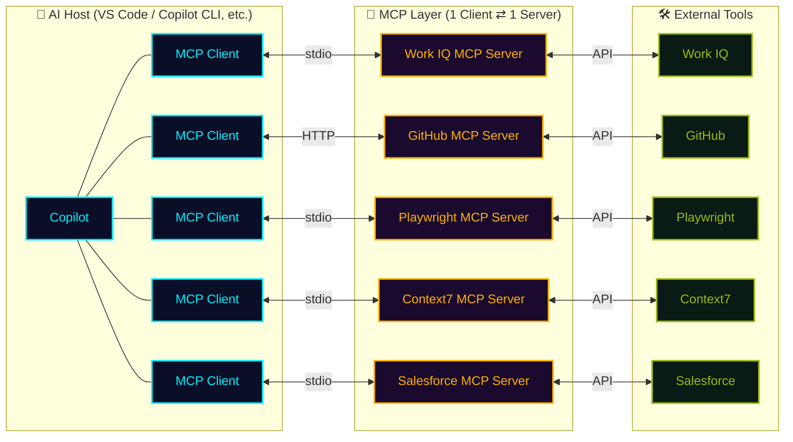

## In a nutshell

<div class="hero-quote">

MCP stands for "Model Context Protocol" — a protocol for providing additional context and capabilities to AI models.

</div>

## How it works



## Why does it matter?

Three values MCP brings:

- **🧩 Extensibility**: Make Copilot a **single entry point** for operating any external tool.
  - Read and write requirements (**Jira**)
  - Create designs (**Figma**)
  - Generate and print 3D designs (**Blender** + 3D printer)
  - Check and edit email and calendar (**Work IQ**)
  - Connect to internal databases for analysis
- **🔗 Workflow integration**: No more custom glue code between individual tools — Copilot acts as a **hub spanning multiple systems**.
- **🌐 Broad ecosystem support**: MCP is an **open protocol** that is rapidly becoming the **de facto standard**. AI assistants, development tools like **Visual Studio**, and many other applications already support MCP — **build once, connect anywhere**. Perfectly suited for coding integrations.

## Where does it run?

<div class="split-image">
  <div class="split-text">

There are **two ways** to run an MCP server.

1. With the **stdio method**, VS Code launches the MCP server as a **child process on your local machine**.
2. With the **HTTP method (SSE / streamable-http)**, the MCP server runs **in the cloud or on a remote server**, and VS Code simply **connects as a client**.

Choose based on your use case and security requirements.

  </div>
  <div class="split-figure">
    
    <figcaption>In Activity Monitor, you can see local MCP servers running as <strong>child processes</strong> of <code>npm exec</code></figcaption>
  </div>
</div>

## Configuration in VS Code

When **installing an MCP server from the Marketplace** in VS Code, you can choose between two scopes:

- **`Install`** → Added to your **personal settings** file (User Settings)
- **`Install Workspace`** → Added to the **repository settings** file (`.vscode/mcp.json`)

<div class="setup-cards">
  <div class="setup-card">
    <div class="setup-card-head">
      <code>.vscode/mcp.json</code>
      <span class="setup-card-tag tag-cyan">▸ Shared with repo</span>
    </div>
    <p>Included in Git, so <strong>the whole team</strong> shares the same MCP setup. When a member clones the repo, VS Code asks <strong>"Would you like to enable it?"</strong>.</p>
  </div>
  <div class="setup-card">
    <div class="setup-card-head">
      <code>User Settings</code>
      <span class="setup-card-tag tag-magenta">▸ Your machine only</span>
    </div>
    <p>For <strong>personal</strong> use or when you want the same setup across all projects. Not included in Git.</p>
    <ul class="setup-card-paths">
      <li>📁 <strong>Mac</strong>：<code>~/.config/Code/User/settings.json</code></li>
      <li>🪟 <strong>Windows</strong>：<code>%APPDATA%\Code\User\settings.json</code></li>
    </ul>
  </div>
</div>

## Getting started with Copilot CLI

```bash
# Add an MCP server
copilot mcp add <server-name>

# List existing servers
copilot mcp list
```

The GitHub official MCP server is connected out of the box. AI can operate Issues, PRs, Actions, and Code search just like running `gh` commands.

`modelcontextprotocol/registry` hosts many official and community-built servers (filesystem / postgres / slack / puppeteer / playwright / Figma…).

## What is the MCP Registry

The **MCP Registry** is an **open registry** that lists MCP servers from across the ecosystem — and you can stand up **your own** registry too.

| Aspect | 🌐 MCP Registry | 🐙 GitHub MCP Registry |
| --- | --- | --- |
| Maintainer | **MCP Working Group** | **GitHub** |
| Contents | **All** official + community servers (~13,238 as of 2026-06-23) | A **curated list** (~100) |
| Default in | — | <a class="retro-link" href="https://code.visualstudio.com/docs/enterprise/ai-settings#_configure-a-custom-mcp-registry" target="_blank" rel="noopener noreferrer">VS Code ↗</a> & more |
| URL | <a class="retro-link" href="https://registry.modelcontextprotocol.io/" target="_blank" rel="noopener noreferrer">registry.modelcontextprotocol.io ↗</a> | <a class="retro-link" href="https://github.com/mcp" target="_blank" rel="noopener noreferrer">github.com/mcp ↗</a> |

> 🛠️ Build **your own registry** to **extend** or **narrow** the list of allowed servers.
> 🛡️ Enforce it at the **organization / enterprise** level (allowlist enforcement).

## Build your own MCP Registry

Two hosting options — both can be consumed and enforced from VS Code / Org / Enterprise (⚠️ note: enforcement applies only to the user's **active (currently used) license**).

<div class="setup-cards">
  <div class="setup-card">
    <div class="setup-card-head">
      <code>Self-hosted</code>
      <span class="setup-card-tag tag-cyan">▸ Full control</span>
    </div>
    <p>Deploy the OSS <a class="retro-link" href="https://github.com/modelcontextprotocol/registry" target="_blank" rel="noopener noreferrer">modelcontextprotocol/registry ↗</a> (a Go service) on your own infra. Officially maintained by the MCP Working Group.</p>
  </div>
  <div class="setup-card">
    <div class="setup-card-head">
      <code>Azure API Center</code>
      <span class="setup-card-tag tag-magenta">▸ Managed</span>
    </div>
    <p>Register & publish MCP servers in Azure <a class="retro-link" href="https://learn.microsoft.com/en-us/azure/api-center/register-discover-mcp-server" target="_blank" rel="noopener noreferrer">API Center ↗</a> — no infra to manage.</p>
  </div>
</div>

### Point clients at it

- **GitHub Org / Enterprise**: <a class="retro-link" href="https://docs.github.com/en/copilot/how-tos/administer-copilot/manage-mcp-usage/configure-mcp-registry" target="_blank" rel="noopener noreferrer">configure the registry ↗</a> and <a class="retro-link" href="https://docs.github.com/en/copilot/reference/mcp-allowlist-enforcement" target="_blank" rel="noopener noreferrer">enforce via allowlist ↗</a>

> 🔒 **Visibility ≠ access:** anything listed in Azure API Center is **visible to anyone** who can reach the catalog — but the catalog only exposes **metadata**. The actual **download / connection is gated separately**: for an internal server, publish a stdio server to a **private package registry** (GitHub Packages, GHCR, Azure Artifacts…) or keep an HTTP server **inside your network / VPN**, so only authenticated employees can pull or connect.

## Trying an MCP Registry locally

> 🧪 **These are personal notes, not a manual.** An AI summary of the flow that actually worked for me — just to give a rough idea. Your mileage will vary.

The flow to stand up a registry locally, expose it over HTTPS, connect it to my Org, and seed it from the GitHub MCP Registry.

1. **Fork & clone** — `gh repo fork modelcontextprotocol/registry --clone`
2. **Run in Docker** — `docker compose up` → API on `localhost:8080` (initial DB has only the demo seed)
3. **HTTPS tunnel** — `cloudflared tunnel --url http://localhost:8080` → `https://<random>.trycloudflare.com`
4. **Connect** — set the tunnel URL as **MCP Registry URL** (no `/v0.1/servers` suffix — Copilot appends it). **Org**: Settings → Copilot → **Policies** → MCP; **Enterprise**: **AI controls** → MCP
5. **Reload VS Code & verify** — Developer: Reload Window → `@mcp` shows only the servers from my registry. Open `Cmd + ,` (Settings) and confirm the MCP settings carry a **“managed by your organization”** badge (= the Org policy is applied)
6. **Seed from the GitHub Registry** — `go run scripts/mirror_data/fetch_production_data.go` + `load_production_data.go` (source: `https://api.mcp.github.com/v0.1/servers`)

> ⚠️ Make sure VS Code uses **this Org's Copilot license** (a different account / personal plan won't get the Org policy). The `mirror_data` scripts are as-is — filter them down to the servers you actually want to allow.
