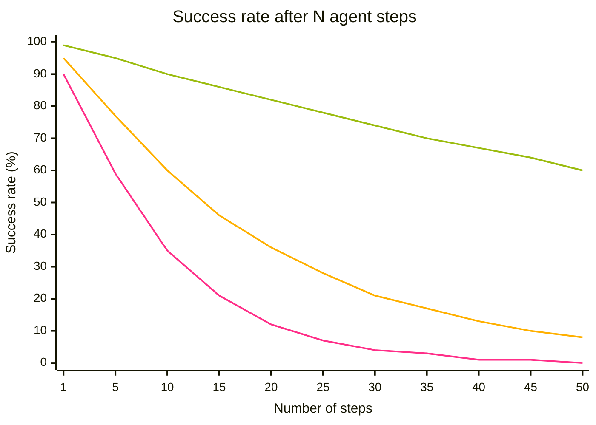

## In a nutshell

  

    AI costs keep climbing — not because tokens got pricier, but because agents take <strong>more steps</strong>. The two main levers: <strong>higher-quality agents</strong> and <strong>the right agent for the right job</strong>.
  

## Agent ROI

<figure class="agent-roi-formula" style="margin: 2.5em 0;">
<svg viewBox="0 0 1720 460" width="100%" xmlns="http://www.w3.org/2000/svg" role="img" aria-label="Agent ROI equals open paren Value of Agent Output minus Token Cost close paren divided by Token Cost times 100 percent. Increasing the value often means decreasing the cost." style="display:block;max-width:1100px;margin:0 auto;">
<defs>
<linearGradient id="roi-funnel" x1="0" y1="0" x2="0" y2="1">
<stop offset="0%" stop-color="#9bbc0f" stop-opacity="0.55"/>
<stop offset="100%" stop-color="#9bbc0f" stop-opacity="0"/>
</linearGradient>
</defs>
<text x="20" y="340" font-size="60" font-weight="bold" fill="#9bbc0f" font-family="'JetBrains Mono','Courier New',monospace" letter-spacing="3">AGENT ROI</text>
<circle cx="475" cy="320" r="34" fill="none" stroke="#9bbc0f" stroke-width="2"/>
<text x="475" y="338" text-anchor="middle" font-size="44" fill="#ffffff" font-family="serif">=</text>
<rect x="585" y="20" width="290" height="80" fill="rgba(5,6,15,0.85)" stroke="#9bbc0f" stroke-width="2"/>
<text x="730" y="50" text-anchor="middle" font-size="22" fill="#9bbc0f" font-family="'JetBrains Mono','Courier New',monospace" font-weight="bold">INCREASING</text>
<text x="730" y="82" text-anchor="middle" font-size="22" fill="#9bbc0f" font-family="'JetBrains Mono','Courier New',monospace" font-weight="bold">THIS…</text>
<polygon points="585,100 875,100 810,225 650,225" fill="url(#roi-funnel)"/>
<text x="730" y="265" text-anchor="middle" font-size="46" fill="#ffffff" font-family="'Noto Sans JP',sans-serif">Value of Agent Output</text>
<circle cx="1080" cy="248" r="30" fill="none" stroke="#9bbc0f" stroke-width="2"/>
<text x="1080" y="265" text-anchor="middle" font-size="40" fill="#ffffff" font-family="serif">−</text>
<rect x="1080" y="20" width="380" height="80" fill="rgba(5,6,15,0.85)" stroke="#9bbc0f" stroke-width="2"/>
<text x="1270" y="50" text-anchor="middle" font-size="20" fill="#9bbc0f" font-family="'JetBrains Mono','Courier New',monospace" font-weight="bold">…OFTEN MEANS</text>
<text x="1270" y="82" text-anchor="middle" font-size="20" fill="#9bbc0f" font-family="'JetBrains Mono','Courier New',monospace" font-weight="bold">DECREASING THIS.</text>
<polygon points="1080,100 1460,100 1370,225 1200,225" fill="url(#roi-funnel)"/>
<text x="1270" y="265" text-anchor="middle" font-size="46" fill="#ffffff" font-family="'Noto Sans JP',sans-serif">Token Cost</text>
<line x1="585" y1="320" x2="1460" y2="320" stroke="#ffffff" stroke-width="3"/>
<text x="1022" y="395" text-anchor="middle" font-size="46" fill="#ffffff" font-family="'Noto Sans JP',sans-serif">Token Cost</text>
<circle cx="1510" cy="320" r="30" fill="none" stroke="#9bbc0f" stroke-width="2"/>
<text x="1510" y="340" text-anchor="middle" font-size="40" fill="#ffffff" font-family="serif">*</text>
<text x="1555" y="338" font-size="46" fill="#ffffff" font-family="'Noto Sans JP',sans-serif">100%</text>
</svg>
</figure>

> 🚀 *Imagine NASA aiming 20 rockets roughly at the moon and hoping one lands. That's how a lot of agent usage looks today. When tokens were cheap, gambling was fine. Now it isn't.*

## The compound-error problem

LLMs are non-deterministic. Small per-step error rates **compound** if you don't catch them. The fastest way to save tokens is to **spot small mistakes early and stop retries before they start**.

<strong>99%</strong> per-step accuracy &nbsp;·&nbsp; <strong>95%</strong> per-step accuracy &nbsp;·&nbsp; <strong>90%</strong> per-step accuracy

> 🔢 **Anchors**: at **10 steps** → 90% / 60% / 35%. At **50 steps** → **60% / 8% / 0.5%**. The 90% line is effectively dead by step 30.

## Advice 1 — Provide as little context as possible…

In <a class="retro-link" href="/theomonfort/en/playbook/context-engineering">Context Engineering ↗</a> we saw how the window fills up turn after turn, and how an over-stuffed window leads to **context rot** — the agent gets dumber, not smarter.

- **Short `copilot-instructions`** — keep only the rules that truly apply *every* turn
- **Don't add a skill for everything** — the model already knows React, TypeScript, Tailwind, etc.
- **Short skills** — a "caveman" skill can be replaced with one line (`Be concise`)
- **Don't spray path-instructions across every folder** — they silently load on every call inside that folder
- **Skip the "just in case" file preload** — let the agent pull files when the task actually needs them

## Advice 2 — …but as much as required

The other side of the lever. When context is **missing**, the agent fills the gap with **assumptions** — and those assumptions become the failed loops on the chart above.

- **State the goal, the constraints, and the "done" criteria** — vague requests cost more than verbose ones because the agent retries until it guesses what you meant
- **Point at the right files** instead of letting the agent grep blindly across the repo
- **Surface non-obvious conventions** — naming, error types, public-API rules, security boundaries
- **Mention what NOT to touch** — saves a wrong-file edit and a rollback retry later
- **Paste the exact error or log line** when debugging — saves a tool call (or three)

## Advice 3 — Prompt engineering

✓ Rule 01

Be precise

State the goal, constraints, and "done" criteria.

✓ Rule 02

Add stop signals

"Stop if X." Cuts off runaway exploration loops.

✓ Rule 03

Add known context

Files, folders, URLs, error logs — anything the agent shouldn't have to search for.

> 💡 **Your prompt is always-on** — once sent, it stays in the window for the rest of the session, billed alongside system + tools on every turn. Make it count.

## Advice 4 — Research → Plan → Implement

**Divide and conquer your work.** Don't run research, planning, and implementation in **one** session — the window pollutes itself and the agent drifts. Split them into three sequential agents, each with the minimum context it needs.

<figure class="rpi-pipeline" style="margin:2em 0;">
<svg viewBox="0 130 1100 475" xmlns="http://www.w3.org/2000/svg" style="width:100%;height:auto;display:block;font-family:'DotGothic16','Courier New',monospace;">
<rect x="155" y="150" width="320" height="68" rx="10" fill="#0a0e27" stroke="#ff2e88" stroke-width="2"/>
<text x="175" y="180" fill="#e8f4ff" font-size="13" font-weight="bold">“I WANT TO CHANGE X.</text>
<text x="175" y="202" fill="#e8f4ff" font-size="13" font-weight="bold">WHAT FILES ARE RELEVANT?”</text>
<line x1="315" y1="218" x2="315" y2="263" stroke="#ff2e88" stroke-width="2"/>
<circle cx="315" cy="263" r="5" fill="#ff2e88"/>
<text x="20" y="292" fill="#e8f4ff" font-size="14" font-weight="bold">/RESEARCH</text>
<text x="20" y="310" fill="#9bbc0f" font-size="11" letter-spacing="1">GEMINI 2.5 PRO</text>
<rect x="155" y="265" width="110" height="55" rx="12" fill="#9bbc0f"/>
<text x="210" y="290" fill="#05060f" font-size="11" font-weight="bold" text-anchor="middle">SYSTEM</text>
<text x="210" y="306" fill="#05060f" font-size="11" font-weight="bold" text-anchor="middle">PROMPT</text>
<rect x="270" y="265" width="90" height="55" rx="12" fill="#ff2e88"/>
<text x="315" y="298" fill="#e8f4ff" font-size="11" font-weight="bold" text-anchor="middle">PROMPT</text>
<rect x="365" y="265" width="78" height="55" rx="12" fill="#ffb000"/>
<text x="404" y="298" fill="#05060f" font-size="11" font-weight="bold" text-anchor="middle">FILE</text>
<circle cx="435" cy="270" r="10" fill="#05060f" stroke="#ff2e88" stroke-width="2"/>
<text x="435" y="274" fill="#ff2e88" font-size="12" font-weight="bold" text-anchor="middle">✗</text>
<rect x="448" y="265" width="78" height="55" rx="12" fill="#ffb000"/>
<text x="487" y="298" fill="#05060f" font-size="11" font-weight="bold" text-anchor="middle">FILE</text>
<circle cx="518" cy="270" r="10" fill="#05060f" stroke="#ff2e88" stroke-width="2"/>
<text x="518" y="274" fill="#ff2e88" font-size="12" font-weight="bold" text-anchor="middle">✗</text>
<rect x="531" y="265" width="78" height="55" rx="12" fill="#ffb000"/>
<text x="570" y="298" fill="#05060f" font-size="11" font-weight="bold" text-anchor="middle">FILE</text>
<circle cx="601" cy="270" r="10" fill="#05060f" stroke="#9bbc0f" stroke-width="2"/>
<text x="601" y="274" fill="#9bbc0f" font-size="12" font-weight="bold" text-anchor="middle">✓</text>
<rect x="614" y="265" width="78" height="55" rx="12" fill="#ffb000"/>
<text x="653" y="298" fill="#05060f" font-size="11" font-weight="bold" text-anchor="middle">FILE</text>
<circle cx="684" cy="270" r="10" fill="#05060f" stroke="#ff2e88" stroke-width="2"/>
<text x="684" y="274" fill="#ff2e88" font-size="12" font-weight="bold" text-anchor="middle">✗</text>
<rect x="697" y="265" width="78" height="55" rx="12" fill="#ffb000"/>
<text x="736" y="298" fill="#05060f" font-size="11" font-weight="bold" text-anchor="middle">FILE</text>
<circle cx="767" cy="270" r="10" fill="#05060f" stroke="#ff2e88" stroke-width="2"/>
<text x="767" y="274" fill="#ff2e88" font-size="12" font-weight="bold" text-anchor="middle">✗</text>
<rect x="780" y="265" width="78" height="55" rx="12" fill="#ffb000"/>
<text x="819" y="298" fill="#05060f" font-size="11" font-weight="bold" text-anchor="middle">FILE</text>
<circle cx="850" cy="270" r="10" fill="#05060f" stroke="#9bbc0f" stroke-width="2"/>
<text x="850" y="274" fill="#9bbc0f" font-size="12" font-weight="bold" text-anchor="middle">✓</text>
<rect x="863" y="265" width="110" height="55" rx="12" fill="#00f0ff"/>
<text x="918" y="290" fill="#05060f" font-size="11" font-weight="bold" text-anchor="middle">PLAN</text>
<text x="918" y="306" fill="#05060f" font-size="11" font-weight="bold" text-anchor="middle">INPUT</text>
<path d="M 945 320 L 945 365 L 425 365 L 425 393" fill="none" stroke="#00f0ff" stroke-width="2"/>
<circle cx="425" cy="394" r="5" fill="#00f0ff"/>
<text x="20" y="422" fill="#e8f4ff" font-size="14" font-weight="bold">/PLAN</text>
<text x="20" y="440" fill="#9bbc0f" font-size="11" letter-spacing="1">OPUS 4.7</text>
<rect x="155" y="395" width="110" height="55" rx="12" fill="#9bbc0f"/>
<text x="210" y="420" fill="#05060f" font-size="11" font-weight="bold" text-anchor="middle">SYSTEM</text>
<text x="210" y="436" fill="#05060f" font-size="11" font-weight="bold" text-anchor="middle">PROMPT</text>
<rect x="270" y="395" width="90" height="55" rx="12" fill="#ff2e88"/>
<text x="315" y="428" fill="#e8f4ff" font-size="11" font-weight="bold" text-anchor="middle">PROMPT</text>
<rect x="370" y="395" width="110" height="55" rx="12" fill="#00f0ff"/>
<text x="425" y="420" fill="#05060f" font-size="11" font-weight="bold" text-anchor="middle">PLAN</text>
<text x="425" y="436" fill="#05060f" font-size="11" font-weight="bold" text-anchor="middle">INPUT</text>
<rect x="485" y="395" width="78" height="55" rx="12" fill="#ffb000"/>
<text x="524" y="428" fill="#05060f" font-size="11" font-weight="bold" text-anchor="middle">FILE</text>
<rect x="568" y="395" width="78" height="55" rx="12" fill="#ffb000"/>
<text x="607" y="428" fill="#05060f" font-size="11" font-weight="bold" text-anchor="middle">FILE</text>
<rect x="651" y="395" width="130" height="55" rx="12" fill="rgba(232,244,255,0.08)" stroke="rgba(232,244,255,0.35)" stroke-width="1"/>
<text x="716" y="428" fill="#e8f4ff" font-size="11" font-weight="bold" text-anchor="middle">REASONING</text>
<rect x="786" y="395" width="120" height="55" rx="12" fill="#00f0ff"/>
<text x="846" y="420" fill="#05060f" font-size="11" font-weight="bold" text-anchor="middle">PRECISE</text>
<text x="846" y="436" fill="#05060f" font-size="11" font-weight="bold" text-anchor="middle">SPEC</text>
<path d="M 875 450 L 875 495 L 430 495 L 430 523" fill="none" stroke="#00f0ff" stroke-width="2"/>
<circle cx="430" cy="524" r="5" fill="#00f0ff"/>
<text x="20" y="552" fill="#e8f4ff" font-size="14" font-weight="bold">/FLEET</text>
<text x="20" y="570" fill="#9bbc0f" font-size="11" letter-spacing="1">GPT 5.4</text>
<rect x="155" y="525" width="110" height="55" rx="12" fill="#9bbc0f"/>
<text x="210" y="550" fill="#05060f" font-size="11" font-weight="bold" text-anchor="middle">SYSTEM</text>
<text x="210" y="566" fill="#05060f" font-size="11" font-weight="bold" text-anchor="middle">PROMPT</text>
<rect x="270" y="525" width="90" height="55" rx="12" fill="#ff2e88"/>
<text x="315" y="558" fill="#e8f4ff" font-size="11" font-weight="bold" text-anchor="middle">PROMPT</text>
<rect x="370" y="525" width="120" height="55" rx="12" fill="#00f0ff"/>
<text x="430" y="550" fill="#05060f" font-size="11" font-weight="bold" text-anchor="middle">PRECISE</text>
<text x="430" y="566" fill="#05060f" font-size="11" font-weight="bold" text-anchor="middle">SPEC</text>
<rect x="495" y="525" width="78" height="55" rx="12" fill="#ffb000"/>
<text x="534" y="558" fill="#05060f" font-size="11" font-weight="bold" text-anchor="middle">FILE</text>
<rect x="578" y="525" width="78" height="55" rx="12" fill="#ffb000"/>
<text x="617" y="558" fill="#05060f" font-size="11" font-weight="bold" text-anchor="middle">FILE</text>
<rect x="661" y="525" width="200" height="55" rx="12" fill="#00f0ff"/>
<text x="761" y="558" fill="#05060f" font-size="11" font-weight="bold" text-anchor="middle">CHANGE CALLS</text>
</svg>
</figure>

> 💡 In <a class="retro-link" href="/theomonfort/en/playbook/cli">Copilot CLI ↗</a>, `/research`, `/plan`, and `/fleet` map directly onto these phases. Each phase runs in its own context window, so the bloated research session never reaches the implementer.

## Advice 5 — Deterministic controls

Tests, linters, type checkers, and security scans aren't just for humans — they're the **token-saving guardrails** that stop one buggy change from snowballing into a four-step compounding spiral. With them, errors are caught **on the same loop they were introduced**. Without them, you pay in CI minutes, Copilot review cycles, and human triage.

<figure class="rpi-pipeline" style="margin:2em 0;">
<svg viewBox="0 140 1000 370" xmlns="http://www.w3.org/2000/svg" style="width:100%;height:auto;display:block;font-family:'DotGothic16','Courier New',monospace;">
<text x="20" y="183" fill="#e8f4ff" font-size="13" font-weight="bold">WITH</text>
<text x="20" y="200" fill="#e8f4ff" font-size="13" font-weight="bold">UNIT TESTS</text>
<rect x="160" y="160" width="95" height="55" rx="12" fill="#9bbc0f"/>
<text x="207" y="185" fill="#05060f" font-size="11" font-weight="bold" text-anchor="middle">SYSTEM</text>
<text x="207" y="201" fill="#05060f" font-size="11" font-weight="bold" text-anchor="middle">&amp; TOOLS</text>
<rect x="263" y="160" width="95" height="55" rx="12" fill="#ff2e88"/>
<text x="310" y="193" fill="#e8f4ff" font-size="11" font-weight="bold" text-anchor="middle">PROMPT</text>
<rect x="366" y="160" width="95" height="55" rx="12" fill="#dc2626"/>
<text x="413" y="185" fill="#e8f4ff" font-size="11" font-weight="bold" text-anchor="middle">BUGGY</text>
<text x="413" y="201" fill="#e8f4ff" font-size="11" font-weight="bold" text-anchor="middle">CHANGE</text>
<rect x="469" y="160" width="95" height="55" rx="12" fill="#dc2626"/>
<text x="516" y="185" fill="#e8f4ff" font-size="11" font-weight="bold" text-anchor="middle">FAILING</text>
<text x="516" y="201" fill="#e8f4ff" font-size="11" font-weight="bold" text-anchor="middle">TESTS</text>
<rect x="572" y="160" width="120" height="55" rx="12" fill="#9bbc0f"/>
<text x="632" y="185" fill="#05060f" font-size="11" font-weight="bold" text-anchor="middle">CORRECTION</text>
<text x="632" y="201" fill="#05060f" font-size="11" font-weight="bold" text-anchor="middle">CHANGE</text>
<rect x="700" y="160" width="95" height="55" rx="12" fill="#9bbc0f"/>
<text x="747" y="185" fill="#05060f" font-size="11" font-weight="bold" text-anchor="middle">CHANGE</text>
<text x="747" y="201" fill="#05060f" font-size="11" font-weight="bold" text-anchor="middle">2</text>
<rect x="803" y="160" width="130" height="55" rx="12" fill="#9bbc0f"/>
<text x="868" y="185" fill="#05060f" font-size="11" font-weight="bold" text-anchor="middle">SUCCEEDING</text>
<text x="868" y="201" fill="#05060f" font-size="11" font-weight="bold" text-anchor="middle">TESTS</text>
<text x="20" y="298" fill="#e8f4ff" font-size="13" font-weight="bold">WITHOUT</text>
<text x="20" y="315" fill="#e8f4ff" font-size="13" font-weight="bold">UNIT TESTS</text>
<rect x="160" y="275" width="95" height="55" rx="12" fill="#9bbc0f"/>
<text x="207" y="300" fill="#05060f" font-size="11" font-weight="bold" text-anchor="middle">SYSTEM</text>
<text x="207" y="316" fill="#05060f" font-size="11" font-weight="bold" text-anchor="middle">&amp; TOOLS</text>
<rect x="263" y="275" width="95" height="55" rx="12" fill="#ff2e88"/>
<text x="310" y="308" fill="#e8f4ff" font-size="11" font-weight="bold" text-anchor="middle">PROMPT</text>
<rect x="366" y="275" width="95" height="55" rx="12" fill="#dc2626"/>
<text x="413" y="300" fill="#e8f4ff" font-size="11" font-weight="bold" text-anchor="middle">BUGGY</text>
<text x="413" y="316" fill="#e8f4ff" font-size="11" font-weight="bold" text-anchor="middle">CHANGE</text>
<rect x="469" y="275" width="110" height="55" rx="12" fill="#dc2626"/>
<text x="524" y="300" fill="#e8f4ff" font-size="11" font-weight="bold" text-anchor="middle">BUGGY</text>
<text x="524" y="316" fill="#e8f4ff" font-size="11" font-weight="bold" text-anchor="middle">CHANGE 2</text>
<rect x="587" y="275" width="110" height="55" rx="12" fill="#dc2626"/>
<text x="642" y="300" fill="#e8f4ff" font-size="11" font-weight="bold" text-anchor="middle">BUGGY</text>
<text x="642" y="316" fill="#e8f4ff" font-size="11" font-weight="bold" text-anchor="middle">CHANGE 3</text>
<rect x="705" y="275" width="110" height="55" rx="12" fill="#dc2626"/>
<text x="760" y="300" fill="#e8f4ff" font-size="11" font-weight="bold" text-anchor="middle">BUGGY</text>
<text x="760" y="316" fill="#e8f4ff" font-size="11" font-weight="bold" text-anchor="middle">CHANGE 4</text>
<line x1="10" y1="335" x2="10" y2="365" stroke="#9bbc0f" stroke-width="2"/>
<polygon points="6,360 14,360 10,370" fill="#9bbc0f"/>
<text x="20" y="370" fill="#e8f4ff" font-size="13" font-weight="bold">INCIDENT</text>
<circle cx="160" cy="365" r="5" fill="#ff2e88"/>
<line x1="165" y1="365" x2="220" y2="365" stroke="#ff2e88" stroke-width="2"/>
<text x="228" y="354" fill="#e8f4ff" font-size="11" font-weight="bold">WASTED CI/CD MINUTES,</text>
<text x="228" y="370" fill="#e8f4ff" font-size="11" font-weight="bold">COPILOT REVIEW CYCLES,</text>
<text x="228" y="386" fill="#e8f4ff" font-size="11" font-weight="bold">HUMAN TIME ETC.</text>
<line x1="10" y1="395" x2="10" y2="415" stroke="#9bbc0f" stroke-width="2"/>
<polygon points="6,410 14,410 10,420" fill="#9bbc0f"/>
<text x="20" y="438" fill="#e8f4ff" font-size="13" font-weight="bold">DEBUGGING</text>
<text x="20" y="455" fill="#e8f4ff" font-size="13" font-weight="bold">SESSION</text>
<rect x="160" y="420" width="95" height="55" rx="12" fill="#9bbc0f"/>
<text x="207" y="445" fill="#05060f" font-size="11" font-weight="bold" text-anchor="middle">SYSTEM</text>
<text x="207" y="461" fill="#05060f" font-size="11" font-weight="bold" text-anchor="middle">&amp; TOOLS</text>
<rect x="263" y="420" width="95" height="55" rx="12" fill="#ff2e88"/>
<text x="310" y="453" fill="#e8f4ff" font-size="11" font-weight="bold" text-anchor="middle">PROMPT</text>
<rect x="366" y="420" width="180" height="55" rx="12" fill="#dc2626"/>
<text x="456" y="453" fill="#e8f4ff" font-size="11" font-weight="bold" text-anchor="middle">BUGGY RESEARCH</text>
<rect x="554" y="420" width="110" height="55" rx="12" fill="#9bbc0f"/>
<text x="609" y="453" fill="#05060f" font-size="11" font-weight="bold" text-anchor="middle">BUG FIX</text>
</svg>
</figure>

> 📊 **Evidence:** the Copilot CLI team's own codebase is **over half tests**.

## Advice 6 — Model choice & Auto mode

Wrong tier = up to **~24× cost difference** for the same task. Defaulting to a reasoning model for typo fixes is the most common waste. Pick deliberately — or let Auto pick for you.

| Tier | Models | Use for |
| --- | --- | --- |
| 🤖 **Auto Mode** | _The lazy default_ | Picks the model based on **task intent** — **10% discount** on the premium-request multiplier (<a class="retro-link" href="https://github.blog/changelog/2026-05-20-auto-model-selection-now-routes-based-on-your-task-in-vs-code/" target="_blank" rel="noopener">May 2026 changelog ↗</a>) |
| 🧠 **Reasoning** | `Opus 4.7` · `GPT-5.5` | Sync planning, architecture, debugging, hard reviews. ⚠️ Avoid for implementation — they second-guess the spec |
| ⚡ **Mid-tier** | `Sonnet` · `GPT-5.4` | Async implementation — most Cloud Agent tasks land here |
| 🪶 **Low-tier** | `Haiku` · `GPT-mini` | Small refactors, repetitive edits, doc updates |

## Advice 7 — Tokenization is not language-neutral

The same sentence costs roughly **2~3× more tokens** in Japanese than in English. For **always-on text** — `copilot-instructions.md`, skill descriptions, MCP tool descriptions, code comments — that gap is a tax billed on **every single loop**.

🇬🇧 ENGLISH

Always run tests before committing changes

Always·run·tests·before·committing·changes

= 6 tokens

🇯🇵 JAPANESE

変更をコミットする前に必ずテストを実行して

変更をコミットする前に必ずテストを実行して

= 15 tokens (~2.5×)

Counts measured with OpenAI's <code>o200k_base</code> tokenizer — the one used by <strong>GPT-5.x · GPT-4o · o1 · o3</strong>. With the older <code>cl100k_base</code> (GPT-4 / GPT-3.5), the Japanese version was 22 tokens (~3.7×).

> 🔬 **Verify it yourself:** <a class="retro-link" href="https://tiktokenizer.vercel.app/" target="_blank" rel="noopener">tiktokenizer.vercel.app ↗</a> or <a class="retro-link" href="https://platform.openai.com/tokenizer" target="_blank" rel="noopener">platform.openai.com/tokenizer ↗</a>. Paste the same instruction in both languages and compare.

## Advice 8 — Store knowledge in an agent-friendly format

Every `.xlsx` / `.docx` / `.pdf` you hand the agent triggers a **3-step detour**: write a parser → run it → load the noisy output back into context. The parsed text typically runs **3–10× longer** than the equivalent Markdown because layout metadata leaks through as noise.

Keep specs, knowledge bases, and reference tables in **Markdown / CSV / plain text**.

| Source format | Agent-friendly target |
| --- | --- |
| 📊 `.xlsx` / Google Sheets | **CSV** or Markdown table |
| 📝 `.docx` / `.pptx` | **`.md`** |
| 📄 `.pdf` | **`.md` / `.txt`** (`pandoc`, `pdftotext`) |
| 🌐 Web pages | **Markdown extraction** (e.g. `r.jina.ai/<url>`) |
| 🖼️ Images of text | **OCR → Markdown** |

## Advanced — power-user tips

These are conditional and come with trade-offs. Reach for them once the basics above are in place.

- 🧮 **Think in code** — for big API responses or long files, write a script that filters first, then hand the result to the agent.
- 🖥️ **CLI vs MCP** — leaning on `gh`, `kubectl`, `npm` etc. is often leaner than the equivalent MCP because the model already knows these tools.
- ✂️ **Trim shell output** — tools like <a href="https://github.com/rtk-ai/rtk" target="_blank" rel="noopener noreferrer" class="retro-link">rtk-ai/rtk</a> reduce LLM token consumption by **60–90%** on common dev commands.
- 📊 **Run `/chronicle tip` regularly** — analyze your Copilot CLI sessions to surface concrete improvement areas.
- 🔁 **Collapse tool calls** — <a href="https://github.com/jsturtevant/copilot-codeact-plugin" target="_blank" rel="noopener noreferrer" class="retro-link">copilot-codeact-plugin</a> batches multiple tool calls into one round-trip.
- 🎚️ **Model-specific tuning** — possible, but models change fast; only worthwhile at very high scale.

## The long-term mindset

- 🧭 **Build analytical skills.** Coding was never the true value of developers — analytical skills and domain fluency were. Telling an agent precisely what to do, in the speak of the domain, becomes the most valuable craft.
- 🏛️ **Apply good architecture.** Domain-Driven Design, Hexagonal, CQRS, Event-Driven — clean boundaries give agents stronger guard rails and prevent them from putting code in the wrong place. Debates about 5-line functions matter less than ever; architecture matters more.
- 🔧 **Iterate on prompts & configs.** You're a context engineer now. Treat agent misses like incidents, keep configs fresh, and use `/chronicle` to spot patterns.

## 8 things to start doing today

1. ✅ **Provide as little context as possible.** Trim your instruction files, skills, and custom agents — and write them manually.
2. ✅ **But provide as much as required.** Give it the spec, examples, and constraints it needs to one-shot the task.
3. ✅ **Engineer your prompts.** Be explicit about goal, output format, and constraints.
4. ✅ **Research → Plan → Implement.** Split the three phases into separate sessions or subagents, each with its own context window and the right model.
5. ✅ **Provide deterministic controls.** Tests, linters, type checkers, and security scans catch errors **on the same loop they were introduced**.
6. ✅ **Pick the right model — or let Auto pick.** Reasoning for planning, Mid for implementation, Low for chores.
7. ✅ **Write your harness in English when the team can read it.** Tokenizers still cost **~2–3× more on Japanese**.
8. ✅ **Store data in Markdown for agents.** Binary formats (xlsx, docx, pdf) waste 3–10× the tokens on parsing-tool calls every time the agent reads them.
