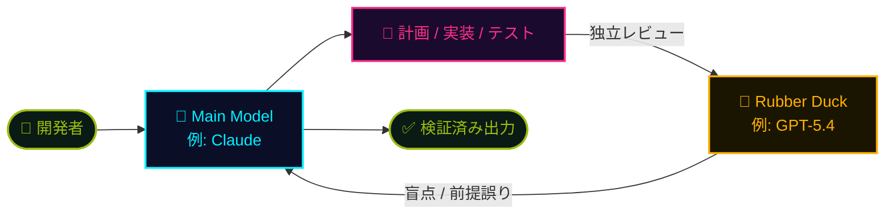

## 一言で

  

    <strong>Copilot CLI</strong> は、ターミナルの中にいる Copilot。
  

  

    基本は VS Code の Copilot と同じように、質問・計画・編集・実行を手伝う。ただし CLI ならではの機能と Harness があるので、ここから一緒に見ていく。
  

## 主要機能

ターミナル一枚に、フルスタックの AI 環境が乗る。

- **複数ファイルの文脈把握**：リポジトリ全体を一つのワークスペースとして扱う。
- **コード生成・編集**：ターミナルから修正し、差分を確認して承認できる。
- **コマンド実行**：ビルド・テスト・lint などを実行し、結果を読んで次に進む。
- **IDE を選ばない**：VS Code、Vim、SSH 先など、ターミナルがあれば使える。
- **Skills / MCP 対応**：必要な能力や外部ツールを追加できる。
- **非対話実行**：CI、cron、script から `copilot -p "..."` で実行できる。

## CLI と VS Code Chat の違い

| | Copilot CLI | VS Code Chat |
|---|---|---|
| **UI** | とても軽い。ターミナル中心なので、コマンドを覚える必要があり、エディタ UI は最小限。一方で CLI をすぐ開けるので、folder、PowerPoint、Excel など手元の computer resource に対して作業しやすい。 | 画面上で選択肢・設定・ファイル移動・inline diff・debugger を扱いやすい。 |
| **新機能の速さ** | `/chronicle`、`/fleet`、`/share`、Rubber Duck など、新しい実験が入りやすい。 | より安定志向。CLI で育った良いアイデアを取り込んでいくことが多い。 |
| **Sub-agent** | Explore、Task、Rubber Duck、Code Review など、built-in agent を多く持ち、native に起動できる。 | 現時点では限定的だが、少しずつ追いついている。 |
| **Session management** | `/context`、`/compact`、`/session` などで、session を細かく制御しやすい。 | 改善中だが、今は CLI ほど細かくはない。 |
| **Partner agent** | Copilot CLI は Copilot の Harness 内で動く。Codex / Claude の Harness は使えず、使えるのはそれらの **model**。 | VS Code 内では、Copilot、Codex、Claude などの agent / extension を切り替えやすい。 |
| **Index** | 主に `grep`、`rg`、workspace command などの terminal/search tool を使う。 | Blackbird など、エディタ側の richer index を使える。 |

## 強力なビルトインエージェント

Copilot CLI には、よくあるタスク向けの標準エージェントが用意されている。

| エージェント | 説明 |
|---|---|
| **Explore** | コードをメインの文脈に追加せず、素早くコードベースを分析し、コードについて質問できるようにする。 |
| **Task** | テストやビルドなどのコマンドを実行し、成功時は短い要約、失敗時は完全な出力を返す。 |
| **General purpose** | すべてのツールと高度な推論が必要な複雑な複数ステップのタスクを、メイン会話とは別の文脈で処理する。 |
| **Code review** | 本当に重要な問題だけを見つけることに集中してコード変更をレビューし、ノイズを最小化する。 |
| **Research** | コードベース、関連リポジトリ、Web を横断して深く調査し、引用付きの詳細レポートを作成する。 |
| **Rubber duck** | 複雑なタスクに対して建設的な批評役としてフィードバックを返す。Copilot CLI が自動的に使う。 |

## Rubber Duck — クロスモデルレビュー

> 🦆 **Experimental**：メインモデルとは **異なるモデルファミリー** が「セカンドオピニオン」として、計画・実装・テストの各段階で独立レビュー。

**なぜ効く？** ── 同じモデルが自分の出力をチェックすると、**同じ前提・同じ盲点** に引っかかる。別ファミリーのモデルなら、訓練データも価値観も違うので **見えていなかったロジックエラー** を拾える。

## その他の便利コマンド

CLI は slash command で、モデル・共有・実験機能・環境情報などをすぐ確認できる。

| コマンド | 使いどころ |
|---|---|
| `/help` | 利用できるコマンドやショートカットを確認する。 |
| `/model` | 使用するモデルを確認・切り替える。 |
| `/ide` | VS Code などの IDE と接続する。 |
| `/share` | 現在のセッションを共有する。 |
| `/experimental` | 実験的な機能を確認・有効化する。 |
| `/chronicle` | セッションの流れや作業履歴を確認する。 |
| `/task` | background で動いている agent や task を確認する。 |
| `/ask` | 作業を進める前に、質問として Copilot に相談する。 |
| `/env` | CLI が見ている環境情報を確認する。 |

## 非対話モード(プログラマティック実行)★

Copilot CLI は `copilot -p "..."` で **1 コマンド実行** できる。対話セッションを開かず、1 ターンで完了して exit するので、シェルスクリプト・cron・**バッチファイル**・**GitHub Actions** から呼び出せる。定型業務の自動化や PR の自動レビューなど「人がやらなくていい作業」を Copilot に任せられる。

### 主要フラグ

- `-p "..."` / `--prompt "..."` — プロンプトを渡して 1 ターンで終了
- `-s` (silent) — メタデータを抑制し応答テキストのみを stdout に出力(変数代入・パイプ向け)
- `--no-ask-user` — clarifying question を出さず自律的に判断
- `--allow-tool='shell(npm:*), write'` — 必要なツールだけ許可(`--allow-all` はサンドボックスのみ)
- `--model gpt-5.5` — モデルを固定して結果のブレを抑える
- `--share='./session.md'` — セッション全体を Markdown で保存

### よくあるユースケース

- 📝 コミットメッセージの自動生成 / 📰 リリースノート作成
- 🐛 ESLint エラーの一括修正 / 🧪 テスト未整備モジュールにテスト追加
- 🔍 PR の AI レビュー(`/review` をスクリプト化) / 🔐 依存ライブラリの脆弱性監査
- 📚 README・JSDoc の一括生成 / 🌏 ドキュメントの自動翻訳

### 運用のコツ

- 🔑 認証は環境変数で渡す:`COPILOT_GITHUB_TOKEN` → `GH_TOKEN` → `GITHUB_TOKEN`
- 🧾 PAT は **fine-grained (v2)** で「Copilot Requests」権限を付ける(古い `ghp_` 形式は不可)
- 🛡️ `--allow-tool` でホワイトリスト指定が鉄則。`--allow-all` は使わない
- 🎯 プロンプトは具体的に — 出力フォーマット(「Number only.」「YES/NO」)も指定するとパースしやすい
- 📊 `--share` でセッションログを残しておくと、結果の根拠を後で追える
- 🧩 まず interactive で動かしてプロンプトを煮詰め、固まったら `-p` でスクリプト化が一番早い

📘 詳細:
- <a class="retro-link" href="https://docs.github.com/en/copilot/how-tos/copilot-cli/automate-copilot-cli/run-cli-programmatically" target="_blank" rel="noopener noreferrer">Running GitHub Copilot CLI programmatically ↗</a>
- <a class="retro-link" href="https://docs.github.com/en/copilot/reference/copilot-cli-reference/cli-programmatic-reference" target="_blank" rel="noopener noreferrer">Programmatic reference (full flag list) ↗</a>
- <a class="retro-link" href="https://docs.github.com/en/copilot/how-tos/copilot-cli/automate-copilot-cli/automate-with-actions" target="_blank" rel="noopener noreferrer">Automating tasks with Copilot CLI and GitHub Actions ↗</a>
