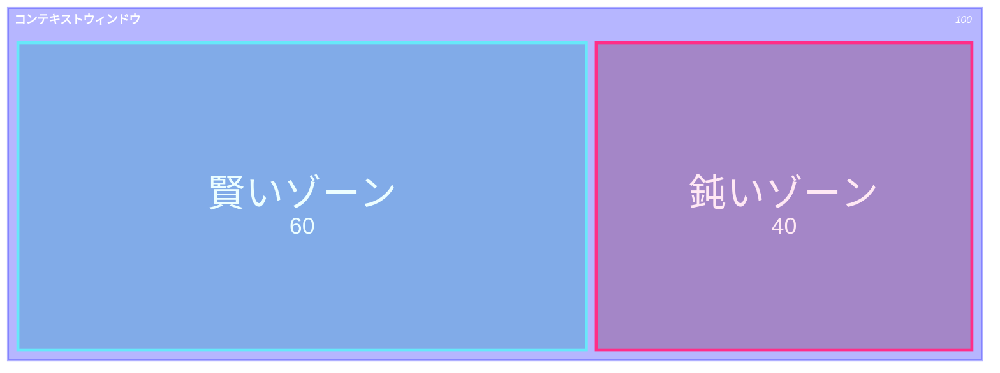
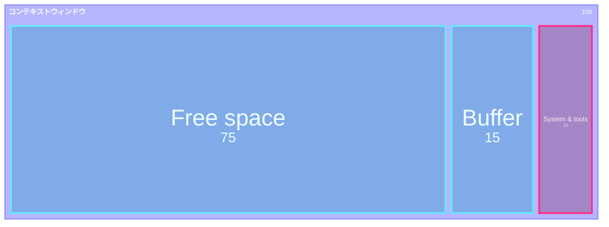
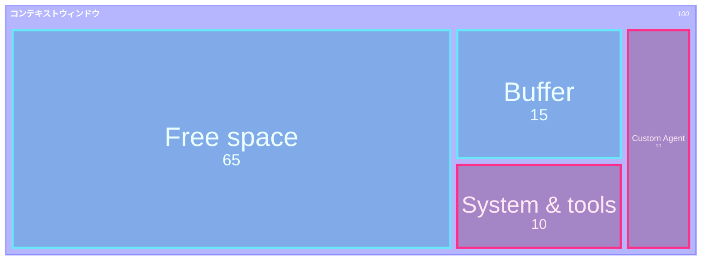
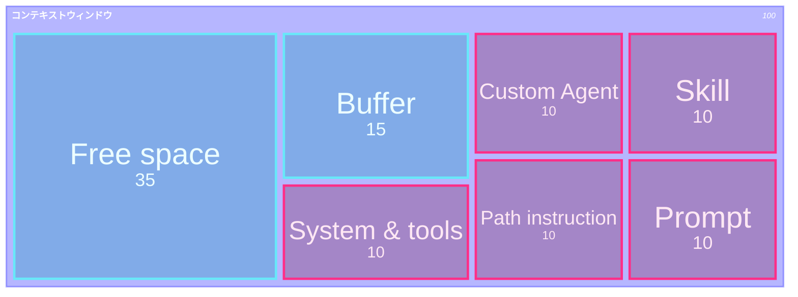
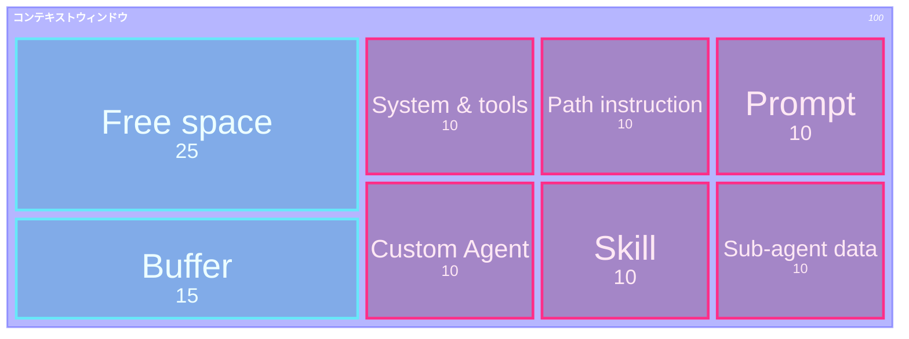
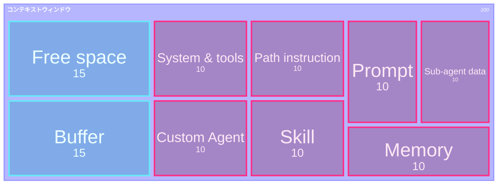
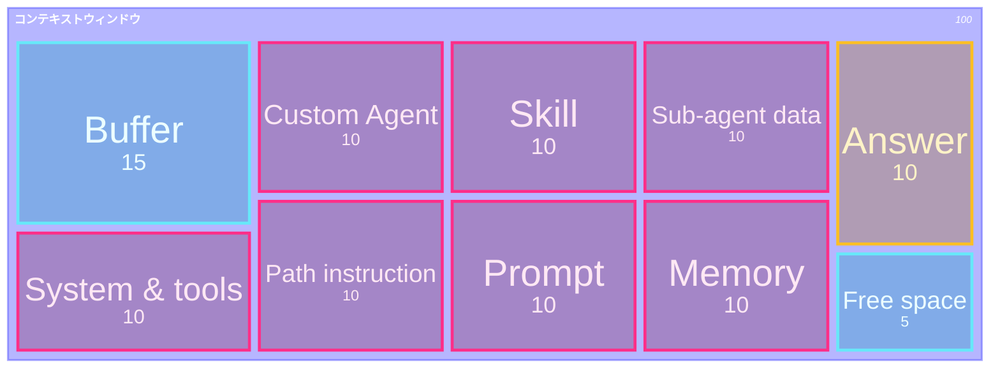
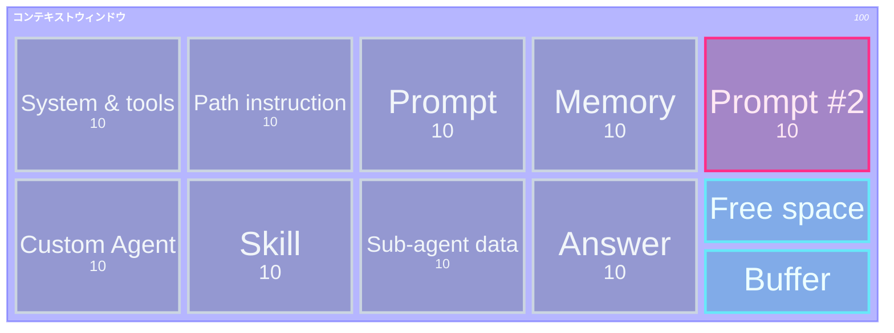

## 一言で

  

    <strong>Context Engineering</strong> は、AI に渡す文脈を「できるだけ少なく、でも必要なだけ多く」設計する技術。
  

  

    何でも全部読ませるのではなく、目的・制約・関連ファイル・検証方法を絞って、AI が迷わず次の一手を選べる状態を作る。
  

> 良い context は量ではなく **選び方**。不要な情報を減らし、必要な情報を欠かさない。

## Context rot（コンテキスト劣化）

LLM は context window（コンテキストウィンドウ）が大きいほど賢くなるわけではない。情報を詰め込みすぎると、**Lost in the middle（中央埋没）** で重要情報が中央に埋もれたり、**Recency bias（直近性バイアス）** で直近の情報を過大評価したりして、判断が鈍る。

これを **context rot（コンテキスト劣化）** と呼ぶ。

> Context Engineering の目的は、context window を埋めることではなく、**必要な情報が目立つ状態を保つこと**。

## コンテキストウィンドウ：Start（turn 1）

Start はほぼ理想状態。常時必要な **System/tools**（skills descriptions / copilot-instructions / MCP servers）だけが入り、作業用の余白が大きい。最初のターンでは初めて送られるので、これらは **Input トークン** として課金される。

<strong>Input トークン</strong>（このターンで新規送信） &nbsp;·&nbsp; Free space / Buffer

## コンテキストウィンドウ：Custom agent（turn 1）

Custom agent に切り替えると、その agent instruction が context に追加される。System & tools も Custom Agent もこのターンで初めて送られるので、すべて **Input トークン** として課金される。

<strong>Input トークン</strong>（このターンで新規送信） &nbsp;·&nbsp; Free space / Buffer

## コンテキストウィンドウ：Prompt（turn 1）

Prompt を書く。たとえば「test を追加して」と頼むと、関連 skill と test 用の path instruction が読み込まれることがある。コンテキスト内の要素すべてが、このターンで初めて送られる **Input トークン**。

<strong>Input トークン</strong>（このターンで新規送信） &nbsp;·&nbsp; Free space / Buffer

## コンテキストウィンドウ：Sub-agent（turn 1）

agent が **sub-agent** を呼ぶことがある。たとえば codebase の explore、database 検索、review など。sub-agent の summary が main context に返ってくる。コンテキスト内の要素すべてが、このターンで初めて送られる **Input トークン**。

<strong>Input トークン</strong>（このターンで新規送信） &nbsp;·&nbsp; Free space / Buffer

## コンテキストウィンドウ：Memory（turn 1）

Repo で作業を続けると、memory が生成され、必要な時に動的に読み込まれることがある。コンテキスト内の要素すべてが、依然としてこのターンの新規 **Input トークン**。

<strong>Input トークン</strong>（このターンで新規送信） &nbsp;·&nbsp; Free space / Buffer

## コンテキストウィンドウ：Output（turn 1）

LLM が応答する。返ってきた **Answer** は context に追加される。これは **Output トークン** で、Input トークンとは別の（通常は高めの）レートで課金される。

<strong>Input トークン</strong>（このターンで新規送信） &nbsp;·&nbsp; <strong>Output トークン</strong>（LLM の応答） &nbsp;·&nbsp; Free space / Buffer

## コンテキストウィンドウ：Cache input（turn 2）

ユーザーが次のターンを始めるために新しい prompt を送る。turn 1 の全要素 ── system、tools、custom agent、prompt、sub-agent data、memory、**さらに LLM の answer も** ── は **プロンプトキャッシュ** から安価な **Cache input トークン** として再利用される。新規 **Input トークン** はこのターンの **Prompt #2** だけ。

<strong>Cache input トークン</strong>（保証されない） &nbsp;·&nbsp; <strong>Input トークン</strong>（このターンで新規） &nbsp;·&nbsp; Free space / Buffer

