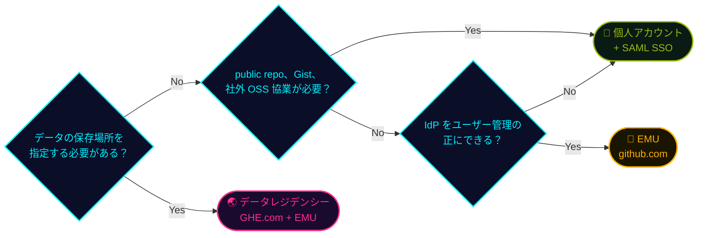

## 一言で

  

    GitHub Enterprise Cloud は <strong>誰がアカウントを管理するか</strong> と <strong>データをどこに置くか</strong> で 3 つの形態に分かれる。
  

  

    <strong>EMU</strong> は会社の IdP からアカウントを払い出す方式。<strong>データレジデンシー</strong> は EMU を前提に、<strong>GHE.com</strong> の専用サブドメインで <strong>日本などの指定リージョン</strong> にコードとデータを保存する方式。
  

## GHEC の 3 つの形態 <a class="h2-doc" href="https://docs.github.com/ja/enterprise-cloud@latest/admin/concepts/enterprise-fundamentals/choose-an-enterprise-type" target="_blank" rel="noopener noreferrer">📖 Docs</a>

Enterprise の作成時に **ユーザーアカウントの種類** と **Data hosting（保存リージョン）** を選びます。

| | 個人アカウント | **EMU** | **データレジデンシー** |
| --- | --- | --- | --- |
| 🌐 URL | github.com | github.com | `<subdomain>.ghe.com` |
| 👤 アカウント | 利用者が自分で作成 | IdP が **SCIM** で作成 | IdP が **SCIM** で作成 |
| 🔐 認証 | GitHub のパスワード、任意で **SAML** SSO | **SAML** または **OIDC** の SSO（必須） | **SAML** または **OIDC** の SSO（必須） |
| 📢 Public repo、Gist | ✅ | ❌ | ❌ |
| 🤝 社外との協業 | ✅ | ❌（public は閲覧のみ） | ❌（GHE.com 内で完結） |
| 🗾 データ保存先 | 米国 | 米国 | EU、豪州、米国、**日本** |

## EMU の全体像 <a class="h2-doc" href="https://docs.github.com/ja/enterprise-cloud@latest/admin/managing-iam/understanding-iam-for-enterprises/abilities-and-restrictions-of-managed-user-accounts" target="_blank" rel="noopener noreferrer">📖 Docs</a>

EMU のユーザーは Enterprise の **内側** に作られます。

<svg viewBox="0 0 1000 392" role="img" aria-label="EMU の構成図。github.com の中に Enterprise があり、マネージドユーザーは Enterprise 内の Organization には所属できるが、Enterprise 外の Organization には所属できない。" style="width:100%;height:auto;display:block;font-family:inherit;">
<defs>
<marker id="emu-ok" viewBox="0 0 10 10" refX="8" refY="5" markerWidth="7" markerHeight="7" orient="auto-start-reverse"><path d="M0,0 L10,5 L0,10 z" fill="#00f0ff"/></marker>
<marker id="emu-ng" viewBox="0 0 10 10" refX="8" refY="5" markerWidth="7" markerHeight="7" orient="auto-start-reverse"><path d="M0,0 L10,5 L0,10 z" fill="#ff2e88"/></marker>
</defs>
<rect x="6" y="26" width="988" height="358" rx="14" fill="rgba(5,6,15,0.55)" stroke="#e8f4ff" stroke-width="2.5"/>
<rect x="400" y="8" width="200" height="38" rx="6" fill="#05060f" stroke="#e8f4ff" stroke-width="2"/>
<text x="500" y="35" text-anchor="middle" font-size="24" fill="#e8f4ff">github.com</text>
<rect x="30" y="78" width="704" height="284" rx="12" fill="rgba(155,188,15,0.07)" stroke="#9bbc0f" stroke-width="3"/>
<rect x="48" y="62" width="150" height="32" rx="6" fill="#05060f" stroke="#9bbc0f" stroke-width="2"/>
<text x="123" y="85" text-anchor="middle" font-size="20" fill="#9bbc0f">Enterprise</text>
<path d="M572 158 V122 H366 V156" stroke="#00f0ff" stroke-width="3" fill="none" marker-end="url(#emu-ok)"/>
<path d="M366 122 H142 V156" stroke="#00f0ff" stroke-width="3" fill="none" marker-end="url(#emu-ok)"/>
<text x="466" y="112" text-anchor="middle" font-size="20" fill="#00f0ff">✅ 所属可能</text>
<text x="62" y="182" font-size="21" fill="#e8f4ff">📁 Organization</text>
<path d="M82 196 V322 M82 236 H104 M82 322 H104" stroke="#7a8aa8" stroke-width="2" fill="none"/>
<text x="110" y="243" font-size="19" fill="#c9d6ea">🗄️ リポジトリ</text>
<text x="162" y="290" font-size="20" fill="#7a8aa8">⋮</text>
<text x="110" y="329" font-size="19" fill="#c9d6ea">🗄️ リポジトリ</text>
<text x="286" y="182" font-size="21" fill="#e8f4ff">📁 Organization</text>
<path d="M306 196 V322 M306 236 H328 M306 322 H328" stroke="#7a8aa8" stroke-width="2" fill="none"/>
<text x="334" y="243" font-size="19" fill="#c9d6ea">🗄️ リポジトリ</text>
<text x="386" y="290" font-size="20" fill="#7a8aa8">⋮</text>
<text x="334" y="329" font-size="19" fill="#c9d6ea">🗄️ リポジトリ</text>
<text x="522" y="182" font-size="21" fill="#ffb000">👤 ユーザー</text>
<path d="M542 196 V236 H562" stroke="#7a8aa8" stroke-width="2" fill="none"/>
<text x="568" y="243" font-size="18" fill="#c9d6ea">🔒 private repo</text>
<path d="M640 176 H762" stroke="#ff2e88" stroke-width="3" stroke-dasharray="7 6" fill="none" marker-end="url(#emu-ng)"/>
<circle cx="734" cy="176" r="15" fill="#05060f" stroke="#ff2e88" stroke-width="2"/>
<text x="734" y="183" text-anchor="middle" font-size="18" fill="#ff2e88">✕</text>
<text x="866" y="120" text-anchor="middle" font-size="19" fill="#ff2e88">❌ Enterprise 外は所属不可</text>
<text x="768" y="182" font-size="21" fill="#e8f4ff">📁 Organization</text>
<path d="M788 196 V322 M788 236 H810 M788 322 H810" stroke="#7a8aa8" stroke-width="2" fill="none"/>
<text x="816" y="243" font-size="19" fill="#c9d6ea">🗄️ リポジトリ</text>
<text x="868" y="290" font-size="20" fill="#7a8aa8">⋮</text>
<text x="816" y="329" font-size="19" fill="#c9d6ea">🗄️ リポジトリ</text>
</svg>

- ✅ Enterprise 内の Organization には所属可能。個人 repo は **private のみ**（ポリシーで許可した場合）
- ❌ Enterprise 外の Organization や他の Enterprise には所属不可。github.com の public repo は **閲覧のみ**

## EMU と SAML 連携の違い <a class="h2-doc" href="https://docs.github.com/ja/enterprise-cloud@latest/admin/concepts/identity-and-access-management/enterprise-managed-users" target="_blank" rel="noopener noreferrer">📖 Docs</a>

個人アカウントでも SAML SSO は使えます。違いは **アカウントの持ち主** と **ログインの流れ** です。

| | 個人アカウント + SAML | **EMU** |
| --- | --- | --- |
| 🔐 SSO プロトコル | **SAML** のみ | **SAML**、または **OIDC**（Entra ID のみ） |
| 🔗 SSO の設定単位 | Enterprise または Org | **Enterprise のみ** |
| 🔄 SCIM | 任意。Org へのアクセス管理のみ | **必須**。アカウントを作成、停止 |
| 🚪 ログイン | GitHub の ID とパスワード + IdP | 最初から IdP でログイン |
| 🏷️ ユーザー名 | 利用者が管理 | IdP が管理（`mona_octocorp`） |

## 管理者の影響範囲

個人アカウントは Enterprise の **外側** にも存在するため、管理者のポリシーが届かない領域が残ります。EMU ではアカウントごと Enterprise の **内側** に入ります。

| 管理項目 | 個人アカウント | **EMU** |
| --- | --- | --- |
| 🏢 Enterprise 内の public repo | ✅ ポリシーで制御 | 🚫 作成不可 |
| 🌍 社外 Org への参加とそのポリシー | ⚠️ 制御できない | 🚫 参加不可 |
| 👤 個人の public repo | ⚠️ 制御できない | 🚫 作成不可 |
| 🔒 個人の private repo | ⚠️ 制御できない | ✅ ポリシーで許可または禁止 |
| 📝 Gist、社外 repo への PR や Star | ⚠️ 制御できない | 🚫 不可 |

✅ 管理者が制御できる ⚠️ 管理者の影響範囲外 🚫 仕組みとして不可

## EMU の制約事項 <a class="h2-doc" href="https://docs.github.com/ja/enterprise-cloud@latest/admin/managing-iam/understanding-iam-for-enterprises/abilities-and-restrictions-of-managed-user-accounts" target="_blank" rel="noopener noreferrer">📖 Docs</a>

管理しやすさの裏返しとして、導入前に次の 4 点を確認します。

▸ + をクリックして詳細を表示

👥全員が EMU アカウント社外メンバーも IdP に登録<a class="ctl-doc" href="https://docs.github.com/ja/enterprise-cloud@latest/admin/managing-accounts-and-repositories/managing-users-in-your-enterprise/enabling-guest-collaborators" target="_blank" rel="noopener noreferrer">Docs</a>

対象協力会社や社外の開発者も、Entra ID や Okta 上にアカウントが必要

対策IdP からプロビジョニングし、<b>Guest collaborator</b> ロールで internal repo へのアクセスを絞る

🔑連携できる IdP は 1 つ認証と SCIM は同じ IdP で<a class="ctl-doc" href="https://docs.github.com/ja/enterprise-cloud@latest/admin/concepts/identity-and-access-management/enterprise-managed-users" target="_blank" rel="noopener noreferrer">Docs</a>

パートナーEntra ID（SAML / OIDC）、Okta（SAML）、PingFederate（SAML）

注意<b>Okta と Entra ID の組み合わせ</b>（認証と SCIM で別々）はサポート対象外

🚫公開コンテンツは作れないpublic repo、Gist、公開 Pages<a class="ctl-doc" href="https://docs.github.com/ja/enterprise-cloud@latest/admin/managing-iam/understanding-iam-for-enterprises/abilities-and-restrictions-of-managed-user-accounts" target="_blank" rel="noopener noreferrer">Docs</a>

可視性作れるのは <b>private と internal</b> のみ。InnerSource は internal repo で実現

その他Gist の作成やコメント不可、Enterprise 外に公開する GitHub Pages 不可

🤝社外との協業は不可OSS 貢献は別アカウント<a class="ctl-doc" href="https://docs.github.com/ja/enterprise-cloud@latest/admin/managing-iam/understanding-iam-for-enterprises/getting-started-with-enterprise-managed-users" target="_blank" rel="noopener noreferrer">Docs</a>

範囲Enterprise 外の repo には push、PR、Issue、Star、Fork ができない（public repo は閲覧のみ）

影響OSS に貢献する開発者は個人アカウントも併用。切り替えミスによる誤公開リスクに注意

## データレジデンシー（GHE.com）とは <a class="h2-doc" href="https://docs.github.com/ja/enterprise-cloud@latest/admin/data-residency/about-github-enterprise-cloud-with-data-residency" target="_blank" rel="noopener noreferrer">📖 Docs</a>

GitHub.com のデータは既定で **米国** に保存されます。データレジデンシーを選ぶと、Enterprise は **GHE.com の専用サブドメイン**（例: `octocorp.ghe.com`）に作られ、コードとデータを指定リージョンに保存できます。

- 🗺️ **リージョン**: EU、オーストラリア、米国、**日本**（2025 年 12 月 GA）
- 🔐 **ID**: **EMU のみ**。GitHub.com のコミュニティからは分離
- ☁️ **GHES との比較**: Copilot などの最新機能をすぐ使え、アップグレードの停止も不要

| 📍 リージョン内に保存 | 🌐 リージョン外に置かれ得るもの |
| --- | --- |
| リポジトリ、コード、PR、コメント | 個人を直接特定しない ID 入りテレメトリ |
| Actions のデータとログ、BCDR | 請求、ライセンス、サポートの情報 |
| メール、ユーザー名、氏名、IP | Copilot のデータ（既定）、Secret の有効性チェック |

## GitHub.com との違い <a class="h2-doc" href="https://docs.github.com/ja/enterprise-cloud@latest/admin/data-residency/feature-overview-for-github-enterprise-cloud-with-data-residency" target="_blank" rel="noopener noreferrer">📖 Docs</a>

使える機能は GitHub.com 上の EMU とほぼ同じです。ただし一部は未提供で、**URL も変わります**。

- 🛒 **GitHub Marketplace** なし。Action や App はソースから導入
- 🍎 **macOS ランナー** と Packages の **Maven / Gradle** は未提供
- 📊 Org / Enterprise の **dependency insights** は未提供

| 用途 | GitHub.com | GHE.com |
| --- | --- | --- |
| API | `api.github.com` | `api.SUBDOMAIN.ghe.com` |
| Container registry | `ghcr.io` | `containers.SUBDOMAIN.ghe.com` |
| SSH clone | `git@github.com:` | `SUBDOMAIN@SUBDOMAIN.ghe.com:` |

> ⚠️ IP 範囲と SSH フィンガープリントも GitHub.com とは別。ファイアウォールや IdP、ストレージの許可リストを GHE.com 用に更新する。

## Copilot × データレジデンシー <a class="h2-doc" href="https://docs.github.com/ja/enterprise-cloud@latest/admin/data-residency/github-copilot-with-data-residency" target="_blank" rel="noopener noreferrer">📖 Docs</a>

GHE.com でも **Copilot Business / Enterprise** を割り当てれば利用できます（Copilot Pro と Free は不可）。ただし Copilot のデータは **既定ではリージョン外** で処理されます。リージョン内に閉じるには Enterprise の Copilot ポリシーで **Restrict Copilot to data residency compliant models** を有効化します（既定は OFF）。

| | 既定 | **ポリシー有効時** |
| --- | --- | --- |
| 🧠 推論、プロンプト、ログ | リージョン外の場合あり | **リージョン内** |
| 🤖 利用できるモデル | すべてのモデル | リージョンで認定されたモデルのみ |
| 💰 AI クレジット消費 | 通常 | **+10%** |
| 🗺️ 対応リージョン | 全リージョン | **米国と EU のみ** |

> ⚠️ 日本リージョンは現時点で Copilot のリージョン内推論に未対応。日本の Enterprise でも Copilot のデータはリージョン外で処理される。

## ★ どれを選ぶ？ <a class="h2-doc" href="https://docs.github.com/ja/enterprise-cloud@latest/admin/concepts/enterprise-fundamentals/choose-an-enterprise-type" target="_blank" rel="noopener noreferrer">📖 Docs</a>

形態は **Enterprise を作る前に** 決めます。次の 3 つの質問で判断します。

> ⚠️ 作成後に形態は切り替えられない。既存の個人アカウント Enterprise から EMU や GHE.com へ移るには、新しい Enterprise を作って移行（GitHub Enterprise Importer など）する。
