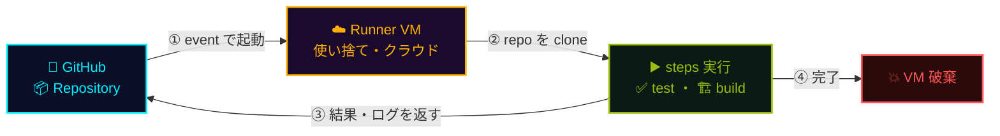

## 一言で

<div class="hero-quote">
  <p>
    <strong>GitHub Actions</strong> は「継続的インテグレーション / 継続的デリバリー(CI/CD)」のプラットフォーム。
  </p>
  <p>
    でも <strong>DevOps だけじゃない</strong>。push・PR・issue・label・schedule など <strong>リポジトリで起きるあらゆるイベント</strong> で workflow を走らせられる = <strong>ほぼ何でも自動化</strong> できる基盤。
  </p>
</div>

## どんな workflow を自動化できる?

CI/CD だけでなく、**SDLC のあらゆる工程** をイベント起点で自動化できる。


## 改善する指標(DORA メトリクス)

自動化(CI/CD・テスト・レビュー)の狙いは、開発の **スピードと安定性** を両立させること。ものさしは <a class="retro-link" href="https://dora.dev/" target="_blank" rel="noopener noreferrer">DORA の 4 指標 ↗</a>、これを Elite に近づける。

| DORA 指標 | 🟢 Elite | 🟣 High | 🟠 Medium | 🔴 Low |
| --- | --- | --- | --- | --- |
| 🚀 デプロイ頻度 | 1 日に複数回 | 1 日〜1 週に 1 回 | 1 週〜1 月に 1 回 | 1 月〜6 月に 1 回 |
| ⏱️ リードタイム | < 1 日 | 1 日〜1 週 | 1 週〜1 月 | 1 月〜6 月 |
| ❌ 変更失敗率 | 0–15% | 0–15% | 0–15% | 46–60% |
| 🔧 平均復旧時間(MTTR) | < 1 時間 | < 1 日 | < 1 日 | 1 週〜1 月 |

> 🎯 スピード(頻度・リードタイム)と安定性(失敗率・復旧時間)を **同時に** 上げるのが自動化の価値。

## アーキテクチャ:clone → 実行 → 破棄

GitHub 上の repo が **クラウドの使い捨て VM** に clone され、そこで test 等を実行 → 結果を返して **VM は破棄** される。



> 🔁 結果は checks・ログ・artifact として GitHub に戻り、VM は毎回破棄される。

## 仕組み(コアコンセプト)

すごくシンプル: **イベントが起きたら、まっさらな VM を借りて、リポを clone して、書いた手順を順に走らせる**。

- 📁 **配置場所** — `.github/workflows/*.yml`(複数ファイル可)
- ⚡ **トリガー** — `push` / `pull_request` / `schedule`(cron) / `workflow_dispatch`(手動) / `issues` / `release` ほか 35+ イベント
- 🖥️ **実行環境** — ジョブごとに新品の **GitHub-hosted runner**(Linux / Windows / macOS の VM)が起動
- 📦 **リポは毎回 clone** — `actions/checkout` で `$GITHUB_WORKSPACE` に full clone(状態は前回のジョブから引き継がない)
- ⏱️ **時間制限** — 1 ジョブ最大 6 時間、1 workflow 最大 35 日(matrix で並列もできる)
- 🔐 **シークレット** — `Settings → Secrets` に保存 → `${{ secrets.NAME }}` で参照(ログにマスク)

> 🧠 「毎回ゼロから」が GitHub Actions の鉄則。状態を保ちたいなら `actions/cache` か artifact、デプロイ済みのものに頼る。

## GitHub-hosted runner と Self-hosted runner

| 観点 | 🟢 GitHub-hosted runner | 🛠️ Self-hosted runner |
| --- | --- | --- |
| 管理 | GitHub が提供・更新・破棄 | 自分のサーバー / VM / k8s に常駐させる |
| OS | Linux / Windows / macOS | 何でも(Raspberry Pi、社内 LAN、GPU マシンも可) |
| ネットワーク | 公開インターネット | 社内ネットワーク・VPN 内のリソースに直接アクセス可 |
| スケール | 必要な時に自動起動、並列無制限(プラン枠内) | 自分でキャパシティ管理 |
| 料金 | **時間課金**(下表) | **runner 自体は無料**(自前のインフラ代だけ) |
| 用途 | 一般的な CI/CD、OSS、軽量ジョブ | 専用 HW、社内資産アクセス、機密案件、巨大ビルド |

> 🌐 中間として **larger runners**(GitHub-hosted の高スペック)や **Actions Runner Controller** で k8s 上に自動スケールする self-hosted runner を建てる手もある。

## Marketplace で部品を再利用

ゼロから書く必要はない。**GitHub Marketplace** に **20,000+** の再利用可能な action が公開されている。

```yaml
steps:
  - uses: actions/checkout@v4              # GitHub 公式: リポを clone
  - uses: actions/setup-node@v4            # Node.js 環境セットアップ
    with: { node-version: 20 }
  - uses: docker/build-push-action@v5      # Docker イメージビルド & push
  - uses: aws-actions/configure-aws-credentials@v4
```

- 🏷️ **公式 verified actions** — GitHub・AWS・Azure・GCP・Docker・HashiCorp ほか主要ベンダー
- 🔓 **OSS の action** — 誰でも公開可能(`uses: owner/repo@sha` で参照)
- 📌 **必ずバージョン固定** — タグ(`@v4`)よりも **コミット SHA で pin** が安全(supply chain 攻撃対策)
- 🛡️ **Org で許可リスト** — `Settings → Actions → Allowed actions` で利用可能な action を絞れる

## 始め方(最短ルート)

`.github/workflows/ci.yml` を 1 つ置くだけ:

```yaml
name: CI
on:
  push:        { branches: [main] }
  pull_request:
jobs:
  test:
    runs-on: ubuntu-latest
    steps:
      - uses: actions/checkout@v4
      - uses: actions/setup-node@v4
        with: { node-version: 20 }
      - run: npm ci
      - run: npm test
```

push した瞬間から **Actions タブ** で実行ログが見える。失敗すれば PR にも ❌ が付く。

> 🚀 まず `runs-on: ubuntu-latest` で全部書いて、必要に応じて Windows / macOS / larger runner / self-hosted へスケールアウトすれば良い。

## 利用条件と料金

**Public repo は GitHub-hosted runner も完全無料・並列上限のみ**。Private repo はプランごとに無料枠 → 超過分は従量課金。

### プランごとの無料枠(private repo / 月)

| プラン | Actions 分 / 月 | ストレージ |
| --- | :---: | :---: |
| Free | 2,000 分 | 500 MB |
| Pro | 3,000 分 | 1 GB |
| Team | 3,000 分 | 2 GB |
| Enterprise | 50,000 分 | 50 GB |

> 💡 無料枠は **Linux 1 分 = 1 分** カウント。Windows は **2 倍**、macOS は **10 倍** 消費するので注意。

### OS / サイズ別の単価(超過時 · 2-core 標準)

| OS / Runner | 倍率 | 単価(USD/分) | 備考 |
| --- | :---: | :---: | --- |
| Linux 2-core | 1× | $0.008 | 標準・最安 |
| Windows 2-core | 2× | $0.016 | Linux の 2 倍 |
| macOS 3-core | 10× | $0.08 | iOS / mac ビルド用 |
| Linux 4-core(larger) | — | $0.016 | Team / Enterprise |
| Linux 8-core(larger) | — | $0.032 | |
| Linux 16-core(larger) | — | $0.064 | |
| Linux 64-core(larger) | — | $0.256 | 巨大ビルド用 |
| GPU runner | — | $0.07〜 | ML / 推論 |

> 💰 ストレージ超過は **$0.25 / GB**(artifacts + Actions cache + Packages 合算)。  
> 🛠️ **Self-hosted runner は GitHub 課金なし**(現時点)。自前サーバー / k8s に建てれば実行時間は無料、ただしメンテと電気代は自分持ち。  
> 🌍 課金は **active committer ベースではなく実行時間ベース**。1 人開発でも CI を回しまくれば請求が来る。

## Cloud Agent / Copilot Code Review もここで動く

> 🤖 **Copilot Cloud Agent** がタスクを実装する時、**Copilot Code Review** が PR を読みに行く時 — どちらも裏側では **GitHub Actions の workflow** として動いている。Actions の無料枠を消費し、Actions のログとして表示される。詳細は <a class="retro-link" href="/theomonfort/playbook/cloud-agent/">Cloud Agent</a> ・ <a class="retro-link" href="/theomonfort/playbook/copilot-code-review/">Copilot Code Review</a> 参照。

