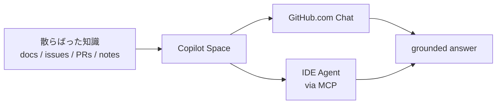

## 一言で

<div class="hero-quote hero-quote-chat">
  <p>
    <strong>Spaces</strong> は、Copilot に見てほしい文脈を <strong>1 つの部屋</strong> にまとめる仕組み。
  </p>
  <p>
    repo、file、Issue、PR、メモ、画像、アップロード資料、instructions を集めて、Copilot Chat の回答をその文脈に grounding する。
  </p>
</div>

> 🎯 Space は「新しい IDE」ではなく、**共有できる context artifact**。一度作ると、同じ説明をチームで何度も繰り返さなくてよくなる。

## 何を入れられる？

| Source | 例 | 使いどころ |
| --- | --- | --- |
| **Instructions** | 役割、期待する回答、避けること | Space のふるまいを方向づける |
| **GitHub content** | repo / folder / file / Issue / PR | 最新のコード・議論を参照する |
| **Uploads** | 画像、文書、スプレッドシート | GitHub 外の背景情報を渡す |
| **Text content** | 会議メモ、設計メモ、FAQ | 暗黙知を検索可能にする |

> 💡 GitHub 上の source は変化に追従する。プロジェクトが進んでも、Space は “evergreen expert” として更新され続ける。

## Repo と File の違い

| 追加方法 | Copilot の扱い | 向いている場面 |
| --- | --- | --- |
| **Repository** | repo 全体を丸ごと context window に入れるのではなく、質問に応じて関連箇所を検索・取得 | 大きなコードベース、全体像の質問、横断調査 |
| **File / Folder** | 重要な file はより強く参照される。個別 file は内容が毎回考慮されやすい | 仕様書、API contract、設計判断、重要な実装 |
| **Uploaded file** | アップロード時点の内容を参照 | 外部資料、画像、議事録、表計算 |

> ⚠️ 「全部入れる」より、**質問に効く source を選ぶ**。これは Context Engineering の実践。

## 共有と権限

Spaces は **個人所有** または **Organization 所有** にできる。共有範囲は所有者によって変わる。

| 所有者 | 共有方法 | 権限 |
| --- | --- | --- |
| **Organization** | org member / team / user に共有 | Admin / Editor / Viewer / No access |
| **Individual** | private / specific users / anyone with link | 公開 Space は基本 view-only |

> 🔐 Viewer は、自分がアクセス権を持つ source だけ見える。Space を共有しても、GitHub の権限境界はバイパスされない。

## IDE でも使える

GitHub.com の Copilot Chat だけでなく、IDE の Agent mode からも Spaces を参照できる。鍵は **GitHub MCP Server** の `copilot_spaces` toolset。

```json
{
  "servers": {
    "github": {
      "type": "http",
      "url": "https://api.githubcopilot.com/mcp/",
      "headers": {
        "X-MCP-Toolsets": "default,copilot_spaces"
      }
    }
  }
}
```

> 🔌 IDE では `list_copilot_spaces` / `get_copilot_space` を使って Space の context を取得する。利用は **Agent mode** が前提。

## ★ 使いどころ



- 🚀 **Feature kickoff** — spec、関連 code、mock、設計メモを 1 か所に集める
- 🧭 **Onboarding** — auth / billing / CI など、質問が集中する領域を self-service 化
- 🔁 **繰り返しタスク** — telemetry、review checklist、release 手順を標準化
- 👥 **handoff 削減** — SME の説明を Space に固定し、チーム全員が参照できるようにする

## 失敗パターン

| ❌ やりがち | ✅ 代わりに |
| --- | --- |
| 何でも全部入れる | task / system / team に合わせて source を絞る |
| instructions を空にする | Space の役割・期待値・避けることを書く |
| upload だけに頼る | GitHub source を使い、最新状態に追従させる |
| public 共有を雑に使う | 個人 Space / org Space / 権限を先に決める |
| Space に実装を任せる | Space は context。実装は Chat / Agent / Cloud Agent に依頼する |

> 🎯 良い Space は「資料置き場」ではなく、**Copilot が迷わず答えるための context product**。
