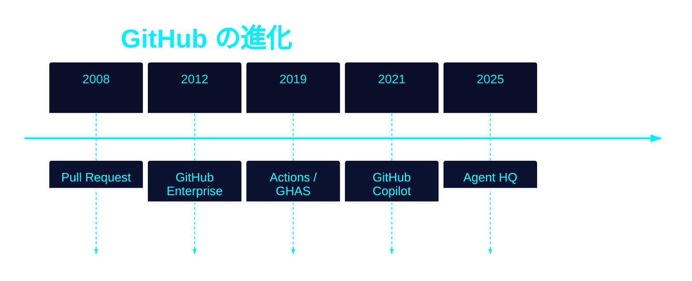
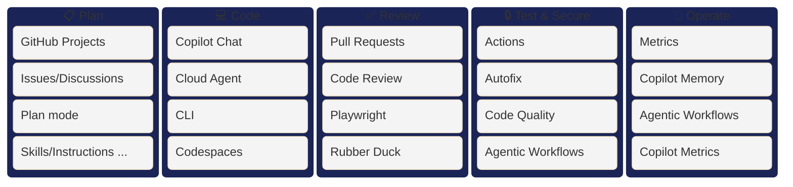
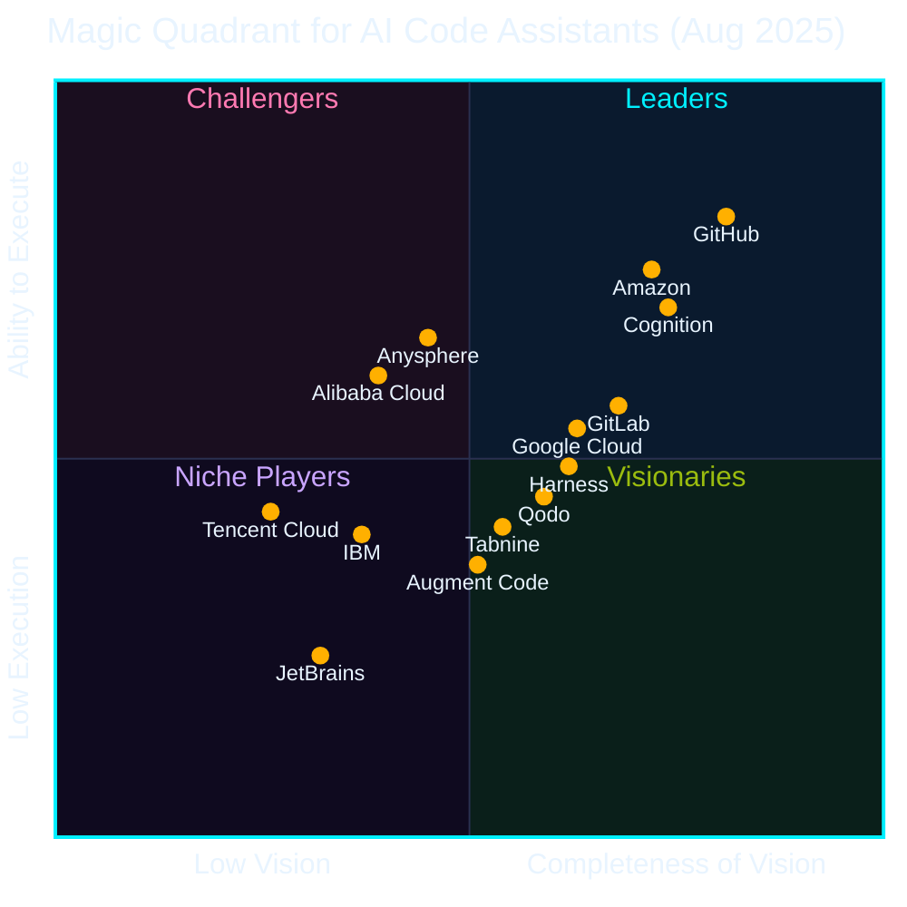

## 一言で

  
こんにちは、<strong>Mona</strong> です！<strong>GitHub</strong> の顔として世界中の開発者を見守っています。

  
今日お話しする <strong>GitHub</strong> は、<strong>1.8 億人以上</strong>の開発者が集う世界最大の AI ネイティブ開発者プラットフォームです。

## 数字で見る GitHub

- GitHub 開発者：世界で **1.8 億人以上**（[2025](https://github.blog/news-insights/octoverse/octoverse-a-new-developer-joins-github-every-second-as-ai-leads-typescript-to-1/)）
- GitHub Copilot 登録ユーザー：**2,000 万人以上**（[2025](https://www.microsoft.com/en-us/investor/events/fy-2025/earnings-fy-2025-q4.aspx)）
- GitHub Copilot 有料サブスクリプション：**470 万人以上**（[2026](https://www.getpanto.ai/blog/github-copilot-statistics)）
- エンタープライズ顧客：**77,000 社以上**（[2024](https://www.microsoft.com/investor/reports/ar24/)）
- Fortune 100 の **約 90%** が Copilot を採用（[2025](https://www.microsoft.com/en-us/investor/events/fy-2025/earnings-fy-2025-q4.aspx)）
- 有料 AI コーディングツール市場シェア **約 42%**（[2025](https://www.secondtalent.com/resources/github-copilot-statistics/)）

## 進化の歴史

GitHub の歩みを振り返れば、現在地が見えてくる ──

- **2008・Pull Request** で共有とコラボの業界標準を確立
- **2012・GitHub Enterprise** で大企業の管理・セキュリティに対応
- **2019・Actions / GHAS** で CI/CD と DevSecOps をワークフローに統合
- **2021・GitHub Copilot** で世界初の AI コーディングアシスタントを提供
- **2025・Agent HQ** で AI が自律的に開発を支える時代へ ── 本日はここを中心にお話しします

## AI 開発者プラットフォーム

SDLC の **計画 → 実装 → レビュー → テスト・セキュリティ → 運用** を、すべて GitHub 上の AI が一気通貫で支える。

## 業界からの評価

第三者機関からの評価でも、GitHub は **AI コーディング領域のリーダー** として認められている。

- **IDC**：AI コーディングとソフトウェアエンジニアリングテクノロジーで **リーダー** に選出
- **Gartner**：マジック・クアドラント、**AI コーディングアシスタント** で **リーダー** に選出

