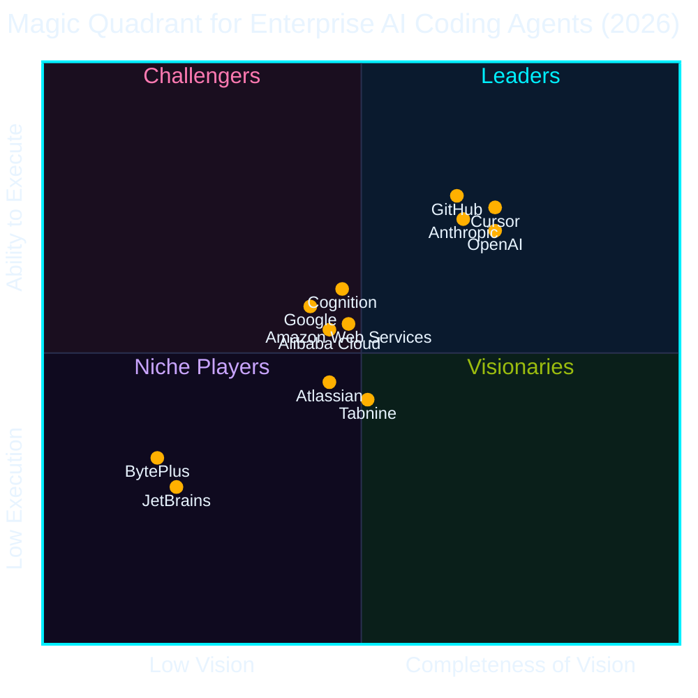

## 一言で

  
こんにちは、<strong>Mona</strong> です！<strong>GitHub</strong> の顔として世界中の開発者を見守っています。

  
今日お話しする <strong>GitHub</strong> は、<strong>1.8 億人以上</strong>の開発者が集う世界最大の AI ネイティブ開発者プラットフォームです。

## 進化の歴史

GitHub の歩みを振り返れば、現在地が見えてくる ──

<figure class="rpi-pipeline" style="margin:2em 0;">
<svg viewBox="0 0 1100 480" xmlns="http://www.w3.org/2000/svg" style="width:100%;height:auto;display:block;font-family:'DotGothic16','Courier New',monospace;">
  <defs>
    <marker id="ghTimelineArrow" viewBox="0 0 10 10" refX="9" refY="5" markerWidth="9" markerHeight="9" orient="auto">
      <path d="M 0 0 L 10 5 L 0 10 Z" fill="#00f0ff"/>
    </marker>
    <filter id="ghTimelineGlow" x="-60%" y="-60%" width="220%" height="220%">
      <feGaussianBlur stdDeviation="4.5" result="blur"/>
      <feMerge>
        <feMergeNode in="blur"/>
        <feMergeNode in="SourceGraphic"/>
      </feMerge>
    </filter>
  </defs>
  <rect x="0" y="0" width="1100" height="480" fill="none"/>
  <path d="M 80 430 C 260 440, 380 410, 530 330 C 680 250, 820 160, 1050 30" stroke="#0a0e27" stroke-width="14" fill="none" stroke-linecap="round"/>
  <path d="M 80 430 C 260 440, 380 410, 530 330 C 680 250, 820 160, 1050 30" stroke="#00f0ff" stroke-width="2.5" fill="none" stroke-linecap="round" marker-end="url(#ghTimelineArrow)"/>
  <g>
    <line x1="80" y1="422" x2="80" y2="404" stroke="#00f0ff" stroke-width="1" stroke-dasharray="3 3" opacity="0.55"/>
    <circle cx="80" cy="430" r="7" fill="#0a0e27" stroke="#00f0ff" stroke-width="2.5"/>
    <rect x="40" y="372" width="80" height="32" rx="16" fill="#0a0e27" stroke="#00f0ff" stroke-width="1.5"/>
    <text x="80" y="394" text-anchor="middle" fill="#00f0ff" font-size="16" font-weight="bold">2008</text>
    <text x="80" y="340" text-anchor="middle" fill="#e8f4ff" font-size="18" font-weight="bold">Pull Request</text>
    <text x="80" y="358" text-anchor="middle" fill="#e8f4ff" font-size="11">共有とコラボの業界標準</text>
  </g>
  <g>
    <line x1="316" y1="406" x2="316" y2="390" stroke="#00f0ff" stroke-width="1" stroke-dasharray="3 3" opacity="0.55"/>
    <circle cx="316" cy="414" r="7" fill="#0a0e27" stroke="#00f0ff" stroke-width="2.5"/>
    <rect x="244" y="358" width="144" height="32" rx="16" fill="#0a0e27" stroke="#00f0ff" stroke-width="1.5"/>
    <text x="316" y="380" text-anchor="middle" fill="#00f0ff" font-size="16" font-weight="bold">2012</text>
    <text x="316" y="325" text-anchor="middle" fill="#e8f4ff" font-size="18" font-weight="bold">GitHub Enterprise</text>
    <text x="316" y="345" text-anchor="middle" fill="#e8f4ff" font-size="11">大企業の管理・セキュリティ</text>
  </g>
  <g>
    <line x1="530" y1="322" x2="530" y2="302" stroke="#00f0ff" stroke-width="1" stroke-dasharray="3 3" opacity="0.55"/>
    <circle cx="530" cy="330" r="7" fill="#0a0e27" stroke="#00f0ff" stroke-width="2.5"/>
    <rect x="450" y="270" width="160" height="32" rx="16" fill="#0a0e27" stroke="#00f0ff" stroke-width="1.5"/>
    <text x="530" y="292" text-anchor="middle" fill="#00f0ff" font-size="16" font-weight="bold">2019</text>
    <text x="530" y="237" text-anchor="middle" fill="#e8f4ff" font-size="18" font-weight="bold">Actions / GHAS</text>
    <text x="530" y="257" text-anchor="middle" fill="#e8f4ff" font-size="11">CI/CD と DevSecOps をワークフローに統合</text>
  </g>
  <g>
    <line x1="760" y1="207" x2="760" y2="240" stroke="#00f0ff" stroke-width="1" stroke-dasharray="3 3" opacity="0.55"/>
    <circle cx="760" cy="199" r="7" fill="#0a0e27" stroke="#00f0ff" stroke-width="2.5"/>
    <rect x="688" y="240" width="144" height="32" rx="16" fill="#0a0e27" stroke="#00f0ff" stroke-width="1.5"/>
    <text x="760" y="262" text-anchor="middle" fill="#00f0ff" font-size="16" font-weight="bold">2021</text>
    <text x="760" y="290" text-anchor="middle" fill="#e8f4ff" font-size="18" font-weight="bold">GitHub Copilot</text>
    <text x="760" y="308" text-anchor="middle" fill="#e8f4ff" font-size="11">世界初の AI コーディングアシスタント</text>
  </g>
  <g>
    <line x1="984" y1="80" x2="984" y2="118" stroke="#00f0ff" stroke-width="1.5" stroke-dasharray="3 3" opacity="0.85"/>
    <g filter="url(#ghTimelineGlow)">
      <circle cx="984" cy="68" r="11" fill="#00f0ff"/>
      <circle cx="984" cy="68" r="4" fill="#05060f"/>
    </g>
    <rect x="924" y="118" width="120" height="38" rx="19" fill="#00f0ff" stroke="#00f0ff" stroke-width="2"/>
    <text x="984" y="144" text-anchor="middle" fill="#05060f" font-size="18" font-weight="bold">2025</text>
    <text x="984" y="176" text-anchor="middle" fill="#00f0ff" font-size="20" font-weight="bold">Agent HQ</text>
    <text x="984" y="196" text-anchor="middle" fill="#e8f4ff" font-size="11">AI が自律的に開発を支える時代へ</text>
    <text x="984" y="216" text-anchor="middle" fill="#e8f4ff" font-size="11">★ 本日はここを中心に</text>
  </g>
</svg>
</figure>

## 数字で見る GitHub

- GitHub 開発者：世界で **2.4 億人以上**（社内指標 / 2026）
- GitHub Copilot 有料ユーザー：**4,900 万人以上**（社内指標 / 2026）
- エンタープライズ顧客：**77,000 社以上**（[2024](https://www.microsoft.com/investor/reports/ar24/)）
- Fortune 100 の **約 90%** が Copilot を採用（[2025](https://www.microsoft.com/en-us/investor/events/fy-2025/earnings-fy-2025-q4.aspx)）
- 有料 AI コーディングツール市場シェア **約 42%**（[2025](https://www.secondtalent.com/resources/github-copilot-statistics/)）

## プラットフォームの活動が急増中

▮ CURRENT SCENARIO ── GitHub 上の開発活動は、いまかつてないペースで加速している。

<figure class="rpi-pipeline" style="margin:2em 0;">
<svg viewBox="0 0 1080 470" xmlns="http://www.w3.org/2000/svg" style="width:100%;height:auto;display:block;font-family:'DotGothic16','Courier New',monospace;">
  <defs>
    <linearGradient id="paCommitBar" x1="0" y1="0" x2="0" y2="1">
      <stop offset="0%" stop-color="#9bbc0f"/>
      <stop offset="100%" stop-color="#0a0e27"/>
    </linearGradient>
    <marker id="paArrow" viewBox="0 0 10 10" refX="9" refY="5" markerWidth="8" markerHeight="8" orient="auto">
      <path d="M 0 0 L 10 5 L 0 10 Z" fill="#9bbc0f"/>
    </marker>
    <filter id="paGlow" x="-80%" y="-80%" width="260%" height="260%">
      <feGaussianBlur stdDeviation="5" result="b"/>
      <feMerge><feMergeNode in="b"/><feMergeNode in="SourceGraphic"/></feMerge>
    </filter>
  </defs>
  <!-- ── Panel A: COMMITS ────────────────────────────────────────── -->
  <g>
    <rect x="10" y="20" width="512" height="430" fill="#0a0e27" stroke="#9bbc0f" stroke-width="3"/>
    <path d="M 16 26 h 12 M 16 26 v 12 M 516 26 h -12 M 516 26 v 12 M 16 444 h 12 M 16 444 v -12 M 516 444 h -12 M 516 444 v -12" stroke="#9bbc0f" stroke-width="2" fill="none"/>
    <rect x="34" y="2" width="180" height="40" fill="#05060f" stroke="#9bbc0f" stroke-width="3"/>
    <text x="124" y="29" text-anchor="middle" fill="#9bbc0f" font-size="17" font-weight="bold">▮ コミット数</text>
    <line x1="60" y1="370" x2="500" y2="370" stroke="#2a3050" stroke-width="2"/>
    <!-- 2025 bar (1B) -->
    <rect x="92" y="332" width="96" height="38" fill="#0e1430" stroke="#9bbc0f" stroke-width="2"/>
    <text x="140" y="320" text-anchor="middle" fill="#e8f4ff" font-size="20" font-weight="bold">10 億</text>
    <text x="140" y="392" text-anchor="middle" fill="#9bbc0f" font-size="13">2025 実績</text>
    <!-- projected bar (14B) -->
    <rect x="332" y="96" width="96" height="274" fill="url(#paCommitBar)" stroke="#9bbc0f" stroke-width="2"/>
    <text x="380" y="84" text-anchor="middle" fill="#9bbc0f" font-size="26" font-weight="bold" filter="url(#paGlow)">140 億</text>
    <text x="380" y="392" text-anchor="middle" fill="#9bbc0f" font-size="13">2026 予測ペース</text>
    <text x="265" y="424" text-anchor="middle" fill="#e8f4ff" font-size="13">現在 <tspan fill="#9bbc0f" font-weight="bold">週 2.75 億コミット</tspan> ── 線形成長ならの話</text>
    <text x="265" y="442" text-anchor="middle" fill="#ff2e88" font-size="12" font-weight="bold">※ SPOILER: そうはならない（さらに上振れ）</text>
  </g>
  <!-- ── Panel B: ACTIONS minutes ───────────────────────────────── -->
  <g>
    <rect x="558" y="20" width="512" height="430" fill="#0a0e27" stroke="#00f0ff" stroke-width="3"/>
    <path d="M 564 26 h 12 M 564 26 v 12 M 1064 26 h -12 M 1064 26 v 12 M 564 444 h 12 M 564 444 v -12 M 1064 444 h -12 M 1064 444 v -12" stroke="#00f0ff" stroke-width="2" fill="none"/>
    <rect x="582" y="2" width="320" height="40" fill="#05060f" stroke="#00f0ff" stroke-width="3"/>
    <text x="742" y="29" text-anchor="middle" fill="#00f0ff" font-size="16" font-weight="bold">▮ Actions 実行時間 / 週</text>
    <line x1="600" y1="380" x2="1040" y2="380" stroke="#2a3050" stroke-width="2"/>
    <!-- growth curve 500M -> 1B -> 2.1B -->
    <path d="M 620 360 C 720 352, 760 332, 820 312 C 900 286, 960 200, 1018 110" fill="none" stroke="#00f0ff" stroke-width="3" marker-end="url(#paArrow)"/>
    <!-- point 2023 -->
    <circle cx="620" cy="360" r="6" fill="#0a0e27" stroke="#00f0ff" stroke-width="2.5"/>
    <text x="620" y="404" text-anchor="middle" fill="#e8f4ff" font-size="14" font-weight="bold">5 億</text>
    <text x="620" y="422" text-anchor="middle" fill="#00f0ff" font-size="12">2023</text>
    <!-- point 2025 -->
    <circle cx="820" cy="312" r="6" fill="#0a0e27" stroke="#00f0ff" stroke-width="2.5"/>
    <text x="820" y="356" text-anchor="middle" fill="#e8f4ff" font-size="14" font-weight="bold">10 億</text>
    <text x="820" y="422" text-anchor="middle" fill="#00f0ff" font-size="12">2025</text>
    <!-- point now 2.1B -->
    <g filter="url(#paGlow)">
      <circle cx="1018" cy="110" r="10" fill="#00f0ff"/>
      <circle cx="1018" cy="110" r="4" fill="#05060f"/>
    </g>
    <text x="1018" y="84" text-anchor="middle" fill="#00f0ff" font-size="26" font-weight="bold">21 億</text>
    <text x="1018" y="422" text-anchor="middle" fill="#00f0ff" font-size="12" font-weight="bold">★ 2026/06/24</text>
    <text x="816" y="442" text-anchor="middle" fill="#e8f4ff" font-size="12.5">2 年で <tspan fill="#00f0ff" font-weight="bold">4 倍以上</tspan> ── 加速はまだ止まらない</text>
  </g>
</svg>
</figure>

## 開発アウトプットも倍増中

▮ MORE NUMBERS ── PR マージとリポジトリ作成も、AI 時代に入って一気に伸びている。

データ出典: [GitHub Octoverse 2025](https://octoverse.github.com)（月間平均、2026 はペース換算）

<figure class="rpi-pipeline" style="margin:2em 0;">
<svg viewBox="0 0 1080 470" xmlns="http://www.w3.org/2000/svg" style="width:100%;height:auto;display:block;font-family:'DotGothic16','Courier New',monospace;">
  <defs>
    <marker id="poArrowG" viewBox="0 0 10 10" refX="9" refY="5" markerWidth="8" markerHeight="8" orient="auto">
      <path d="M 0 0 L 10 5 L 0 10 Z" fill="#9bbc0f"/>
    </marker>
    <marker id="poArrowA" viewBox="0 0 10 10" refX="9" refY="5" markerWidth="8" markerHeight="8" orient="auto">
      <path d="M 0 0 L 10 5 L 0 10 Z" fill="#ffb000"/>
    </marker>
    <filter id="poGlow" x="-80%" y="-80%" width="260%" height="260%">
      <feGaussianBlur stdDeviation="5" result="b"/>
      <feMerge><feMergeNode in="b"/><feMergeNode in="SourceGraphic"/></feMerge>
    </filter>
  </defs>
  <!-- ── Panel A: PULL REQUESTS MERGED ───────────────────────────── -->
  <g>
    <rect x="10" y="20" width="512" height="430" fill="#0a0e27" stroke="#9bbc0f" stroke-width="3"/>
    <path d="M 16 26 h 12 M 16 26 v 12 M 516 26 h -12 M 516 26 v 12 M 16 444 h 12 M 16 444 v -12 M 516 444 h -12 M 516 444 v -12" stroke="#9bbc0f" stroke-width="2" fill="none"/>
    <rect x="34" y="2" width="320" height="40" fill="#05060f" stroke="#9bbc0f" stroke-width="3"/>
    <text x="194" y="29" text-anchor="middle" fill="#9bbc0f" font-size="16" font-weight="bold">▮ マージされた PR / 月</text>
    <line x1="60" y1="380" x2="500" y2="380" stroke="#2a3050" stroke-width="2"/>
    <!-- growth curve 2800万 -> 4300万 -> 9000万 -->
    <path d="M 90 360 C 180 352, 240 334, 300 300 C 378 262, 436 184, 478 116" fill="none" stroke="#9bbc0f" stroke-width="3" marker-end="url(#poArrowG)"/>
    <!-- point 2023 -->
    <circle cx="90" cy="360" r="6" fill="#0a0e27" stroke="#9bbc0f" stroke-width="2.5"/>
    <text x="90" y="404" text-anchor="middle" fill="#e8f4ff" font-size="14" font-weight="bold">2,800万</text>
    <text x="90" y="422" text-anchor="middle" fill="#9bbc0f" font-size="12">2023</text>
    <!-- point 2025 -->
    <circle cx="300" cy="300" r="6" fill="#0a0e27" stroke="#9bbc0f" stroke-width="2.5"/>
    <text x="300" y="344" text-anchor="middle" fill="#e8f4ff" font-size="14" font-weight="bold">4,300万</text>
    <text x="300" y="422" text-anchor="middle" fill="#9bbc0f" font-size="12">2025</text>
    <!-- peak 2026 pace -->
    <g filter="url(#poGlow)">
      <circle cx="478" cy="110" r="10" fill="#9bbc0f"/>
      <circle cx="478" cy="110" r="4" fill="#05060f"/>
    </g>
    <text x="478" y="84" text-anchor="middle" fill="#9bbc0f" font-size="26" font-weight="bold">9,000万</text>
    <text x="478" y="422" text-anchor="middle" fill="#9bbc0f" font-size="12" font-weight="bold">2026 ペース</text>
    <text x="280" y="442" text-anchor="middle" fill="#e8f4ff" font-size="12.5">2025→2026 で <tspan fill="#9bbc0f" font-weight="bold">約 2 倍</tspan> ── AI が PR を量産</text>
  </g>
  <!-- ── Panel B: NEW REPOS / MONTH ──────────────────────────────── -->
  <g>
    <rect x="558" y="20" width="512" height="430" fill="#0a0e27" stroke="#ffb000" stroke-width="3"/>
    <path d="M 564 26 h 12 M 564 26 v 12 M 1064 26 h -12 M 1064 26 v 12 M 564 444 h 12 M 564 444 v -12 M 1064 444 h -12 M 1064 444 v -12" stroke="#ffb000" stroke-width="2" fill="none"/>
    <rect x="582" y="2" width="330" height="40" fill="#05060f" stroke="#ffb000" stroke-width="3"/>
    <text x="747" y="29" text-anchor="middle" fill="#ffb000" font-size="16" font-weight="bold">▮ 新規リポジトリ / 月</text>
    <line x1="600" y1="380" x2="1040" y2="380" stroke="#2a3050" stroke-width="2"/>
    <!-- growth curve 700万 -> 1000万 -> 2000万 -->
    <path d="M 620 360 C 720 352, 760 332, 820 312 C 900 286, 960 200, 1018 116" fill="none" stroke="#ffb000" stroke-width="3" marker-end="url(#poArrowA)"/>
    <!-- point 2023 -->
    <circle cx="620" cy="360" r="6" fill="#0a0e27" stroke="#ffb000" stroke-width="2.5"/>
    <text x="620" y="404" text-anchor="middle" fill="#e8f4ff" font-size="14" font-weight="bold">700万</text>
    <text x="620" y="422" text-anchor="middle" fill="#ffb000" font-size="12">2023</text>
    <!-- point 2025 -->
    <circle cx="820" cy="312" r="6" fill="#0a0e27" stroke="#ffb000" stroke-width="2.5"/>
    <text x="820" y="356" text-anchor="middle" fill="#e8f4ff" font-size="14" font-weight="bold">1,000万</text>
    <text x="820" y="422" text-anchor="middle" fill="#ffb000" font-size="12">2025</text>
    <!-- peak 2026 pace -->
    <g filter="url(#poGlow)">
      <circle cx="1018" cy="110" r="10" fill="#ffb000"/>
      <circle cx="1018" cy="110" r="4" fill="#05060f"/>
    </g>
    <text x="1018" y="84" text-anchor="middle" fill="#ffb000" font-size="26" font-weight="bold">2,000万</text>
    <text x="1018" y="422" text-anchor="middle" fill="#ffb000" font-size="12" font-weight="bold">2026 ペース</text>
    <text x="816" y="442" text-anchor="middle" fill="#e8f4ff" font-size="12.5">2025→2026 で <tspan fill="#ffb000" font-weight="bold">約 2 倍</tspan> ── 新規作成が加速</text>
  </g>
</svg>
</figure>

## AI 開発者プラットフォーム

SDLC の **計画 → 実装 → レビュー → テスト・セキュリティ → 運用** を、すべて GitHub 上の AI が一気通貫で支える。

<figure class="rpi-pipeline" style="margin:2em 0;">
<svg viewBox="0 0 1080 510" xmlns="http://www.w3.org/2000/svg"
     shape-rendering="crispEdges"
     style="width:100%;height:auto;display:block;font-family:'DotGothic16','Courier New',monospace;">
  <rect x="0" y="0" width="1080" height="510" fill="none"/>
  <!-- ── Card 1: PLAN ── green ─────────────────────────────────── -->
  <g>
    <rect x="16" y="64" width="200" height="400" fill="#0f1604"/>
    <rect x="12" y="60" width="200" height="400" fill="#0a0e27" stroke="#9bbc0f" stroke-width="3"/>
    <path d="M 18 66 h 12 M 18 66 v 12 M 206 66 h -12 M 206 66 v 12 M 18 454 h 12 M 18 454 v -12 M 206 454 h -12 M 206 454 v -12" stroke="#9bbc0f" stroke-width="2" fill="none"/>
    <rect x="32" y="38" width="160" height="44" fill="#05060f" stroke="#9bbc0f" stroke-width="3"/>
    <text x="112" y="67" text-anchor="middle" fill="#9bbc0f" font-size="18" font-weight="bold">▮ PLAN</text>
    <line x1="22" y1="100" x2="202" y2="100" stroke="#9bbc0f" stroke-width="1" stroke-dasharray="4 4" opacity="0.55"/>
    <g>
      <rect x="22" y="118" width="180" height="44" fill="#0e1430" stroke="#9bbc0f" stroke-width="2"/>
      <text x="112" y="146" text-anchor="middle" fill="#e8f4ff" font-size="14">▶ GitHub Projects</text>
      <rect x="22" y="178" width="180" height="44" fill="#0e1430" stroke="#9bbc0f" stroke-width="2"/>
      <text x="112" y="206" text-anchor="middle" fill="#e8f4ff" font-size="13">▶ Issues/Discussions</text>
      <rect x="22" y="238" width="180" height="44" fill="#0e1430" stroke="#9bbc0f" stroke-width="2"/>
      <text x="112" y="266" text-anchor="middle" fill="#e8f4ff" font-size="14">▶ Plan mode</text>
      <rect x="22" y="298" width="180" height="44" fill="#0e1430" stroke="#9bbc0f" stroke-width="2"/>
      <text x="112" y="326" text-anchor="middle" fill="#e8f4ff" font-size="12">▶ Skills/Instructions ...</text>
    </g>
  </g>
  <!-- ── Card 2: CODE ── magenta ────────────────────────────────────── -->
  <g>
    <rect x="230" y="64" width="200" height="400" fill="#1a0610"/>
    <rect x="226" y="60" width="200" height="400" fill="#0a0e27" stroke="#ff2e88" stroke-width="3"/>
    <path d="M 232 66 h 12 M 232 66 v 12 M 420 66 h -12 M 420 66 v 12 M 232 454 h 12 M 232 454 v -12 M 420 454 h -12 M 420 454 v -12" stroke="#ff2e88" stroke-width="2" fill="none"/>
    <rect x="246" y="38" width="160" height="44" fill="#05060f" stroke="#ff2e88" stroke-width="3"/>
    <text x="326" y="67" text-anchor="middle" fill="#ff2e88" font-size="18" font-weight="bold">▮ CODE</text>
    <line x1="236" y1="100" x2="416" y2="100" stroke="#ff2e88" stroke-width="1" stroke-dasharray="4 4" opacity="0.55"/>
    <g>
      <rect x="236" y="118" width="180" height="44" fill="#0e1430" stroke="#ff2e88" stroke-width="2"/>
      <text x="326" y="146" text-anchor="middle" fill="#e8f4ff" font-size="14">▶ Copilot Chat</text>
      <rect x="236" y="178" width="180" height="44" fill="#0e1430" stroke="#ff2e88" stroke-width="2"/>
      <text x="326" y="206" text-anchor="middle" fill="#e8f4ff" font-size="14">▶ Cloud Agent</text>
      <rect x="236" y="238" width="180" height="44" fill="#0e1430" stroke="#ff2e88" stroke-width="2"/>
      <text x="326" y="266" text-anchor="middle" fill="#e8f4ff" font-size="14">▶ CLI</text>
      <rect x="236" y="298" width="180" height="44" fill="#0e1430" stroke="#ff2e88" stroke-width="2"/>
      <text x="326" y="326" text-anchor="middle" fill="#e8f4ff" font-size="14">▶ Codespaces</text>
    </g>
  </g>
  <!-- ── Card 3: REVIEW ── amber ─────────────────────────────────── -->
  <g>
    <rect x="444" y="64" width="200" height="400" fill="#1f1404"/>
    <rect x="440" y="60" width="200" height="400" fill="#0a0e27" stroke="#ffb000" stroke-width="3"/>
    <path d="M 446 66 h 12 M 446 66 v 12 M 634 66 h -12 M 634 66 v 12 M 446 454 h 12 M 446 454 v -12 M 634 454 h -12 M 634 454 v -12" stroke="#ffb000" stroke-width="2" fill="none"/>
    <rect x="460" y="38" width="160" height="44" fill="#05060f" stroke="#ffb000" stroke-width="3"/>
    <text x="540" y="67" text-anchor="middle" fill="#ffb000" font-size="18" font-weight="bold">▮ REVIEW</text>
    <line x1="450" y1="100" x2="630" y2="100" stroke="#ffb000" stroke-width="1" stroke-dasharray="4 4" opacity="0.55"/>
    <g>
      <rect x="450" y="118" width="180" height="44" fill="#0e1430" stroke="#ffb000" stroke-width="2"/>
      <text x="540" y="146" text-anchor="middle" fill="#e8f4ff" font-size="14">▶ Pull Requests</text>
      <rect x="450" y="178" width="180" height="44" fill="#0e1430" stroke="#ffb000" stroke-width="2"/>
      <text x="540" y="206" text-anchor="middle" fill="#e8f4ff" font-size="14">▶ Code Review</text>
      <rect x="450" y="238" width="180" height="44" fill="#0e1430" stroke="#ffb000" stroke-width="2"/>
      <text x="540" y="266" text-anchor="middle" fill="#e8f4ff" font-size="14">▶ Playwright</text>
      <rect x="450" y="298" width="180" height="44" fill="#0e1430" stroke="#ffb000" stroke-width="2"/>
      <text x="540" y="326" text-anchor="middle" fill="#e8f4ff" font-size="14">▶ Rubber Duck</text>
    </g>
  </g>
  <!-- ── Card 4: TEST &amp; SECURE ── cyan ──────────────────────── -->
  <g>
    <rect x="658" y="64" width="200" height="400" fill="#02181c"/>
    <rect x="654" y="60" width="200" height="400" fill="#0a0e27" stroke="#00f0ff" stroke-width="3"/>
    <path d="M 660 66 h 12 M 660 66 v 12 M 848 66 h -12 M 848 66 v 12 M 660 454 h 12 M 660 454 v -12 M 848 454 h -12 M 848 454 v -12" stroke="#00f0ff" stroke-width="2" fill="none"/>
    <rect x="668" y="38" width="172" height="44" fill="#05060f" stroke="#00f0ff" stroke-width="3"/>
    <text x="754" y="67" text-anchor="middle" fill="#00f0ff" font-size="15" font-weight="bold">▮ TEST &amp; SECURE</text>
    <line x1="664" y1="100" x2="844" y2="100" stroke="#00f0ff" stroke-width="1" stroke-dasharray="4 4" opacity="0.55"/>
    <g>
      <rect x="664" y="118" width="180" height="44" fill="#0e1430" stroke="#00f0ff" stroke-width="2"/>
      <text x="754" y="146" text-anchor="middle" fill="#e8f4ff" font-size="14">▶ Actions</text>
      <rect x="664" y="178" width="180" height="44" fill="#0e1430" stroke="#00f0ff" stroke-width="2"/>
      <text x="754" y="206" text-anchor="middle" fill="#e8f4ff" font-size="14">▶ Autofix</text>
      <rect x="664" y="238" width="180" height="44" fill="#0e1430" stroke="#00f0ff" stroke-width="2"/>
      <text x="754" y="266" text-anchor="middle" fill="#e8f4ff" font-size="14">▶ Code Quality</text>
      <rect x="664" y="298" width="180" height="44" fill="#0e1430" stroke="#00f0ff" stroke-width="2"/>
      <text x="754" y="326" text-anchor="middle" fill="#e8f4ff" font-size="13">▶ Agentic Workflows</text>
    </g>
  </g>
  <!-- ── Card 5: OPERATE ── green ──────────────────────────────── -->
  <g>
    <rect x="872" y="64" width="200" height="400" fill="#0f1604"/>
    <rect x="868" y="60" width="200" height="400" fill="#0a0e27" stroke="#9bbc0f" stroke-width="3"/>
    <path d="M 874 66 h 12 M 874 66 v 12 M 1062 66 h -12 M 1062 66 v 12 M 874 454 h 12 M 874 454 v -12 M 1062 454 h -12 M 1062 454 v -12" stroke="#9bbc0f" stroke-width="2" fill="none"/>
    <rect x="888" y="38" width="160" height="44" fill="#05060f" stroke="#9bbc0f" stroke-width="3"/>
    <text x="968" y="67" text-anchor="middle" fill="#9bbc0f" font-size="18" font-weight="bold">▮ OPERATE</text>
    <line x1="878" y1="100" x2="1058" y2="100" stroke="#9bbc0f" stroke-width="1" stroke-dasharray="4 4" opacity="0.55"/>
    <g>
      <rect x="878" y="118" width="180" height="44" fill="#0e1430" stroke="#9bbc0f" stroke-width="2"/>
      <text x="968" y="146" text-anchor="middle" fill="#e8f4ff" font-size="14">▶ Metrics</text>
      <rect x="878" y="178" width="180" height="44" fill="#0e1430" stroke="#9bbc0f" stroke-width="2"/>
      <text x="968" y="206" text-anchor="middle" fill="#e8f4ff" font-size="14">▶ Copilot Memory</text>
      <rect x="878" y="238" width="180" height="44" fill="#0e1430" stroke="#9bbc0f" stroke-width="2"/>
      <text x="968" y="266" text-anchor="middle" fill="#e8f4ff" font-size="13">▶ Agentic Workflows</text>
      <rect x="878" y="298" width="180" height="44" fill="#0e1430" stroke="#9bbc0f" stroke-width="2"/>
      <text x="968" y="326" text-anchor="middle" fill="#e8f4ff" font-size="14">▶ Copilot Metrics</text>
    </g>
  </g>
  <!-- ── scanline overlay (subtle CRT vibe) ──────────────────────── -->
  <g opacity="0.08">
    <line x1="0" y1="80"  x2="1080" y2="80"  stroke="#e8f4ff" stroke-width="1"/>
    <line x1="0" y1="140" x2="1080" y2="140" stroke="#e8f4ff" stroke-width="1"/>
    <line x1="0" y1="200" x2="1080" y2="200" stroke="#e8f4ff" stroke-width="1"/>
    <line x1="0" y1="260" x2="1080" y2="260" stroke="#e8f4ff" stroke-width="1"/>
    <line x1="0" y1="320" x2="1080" y2="320" stroke="#e8f4ff" stroke-width="1"/>
    <line x1="0" y1="380" x2="1080" y2="380" stroke="#e8f4ff" stroke-width="1"/>
    <line x1="0" y1="440" x2="1080" y2="440" stroke="#e8f4ff" stroke-width="1"/>
  </g>
</svg>
</figure>

## 業界からの評価

第三者機関からの評価でも、GitHub は **AI コーディング領域のリーダー** として認められている。

- **IDC**：AI コーディングとソフトウェアエンジニアリングテクノロジーで **リーダー** に選出
- **Gartner**：[2026 マジック・クアドラント](https://github.com/resources/whitepapers/gartner-magic-quadrant-for-enterprise-ai-coding-agents?locale=ja)、**エンタープライズ AI コーディングエージェント** 部門で **3 年連続リーダー**に選出。実行能力（Ability to Execute）で **最高位**（[Gartner レポート](https://www.gartner.com/doc/reprints?id=1-2NEACZCW&ct=260520&st=sb)）

